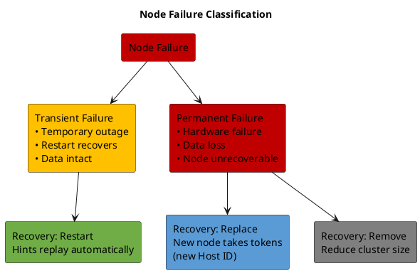
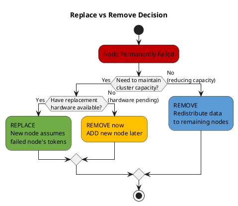
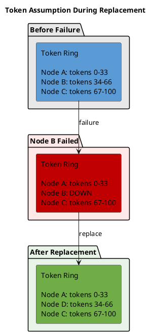
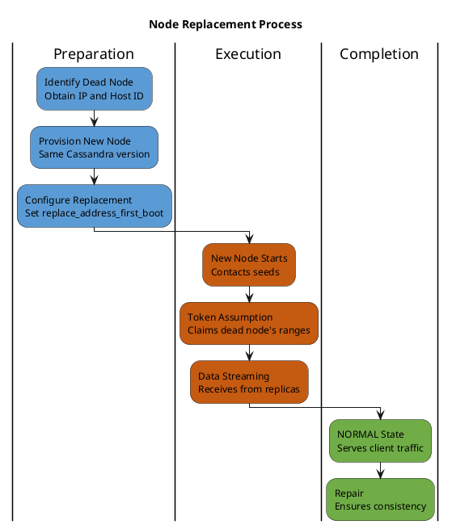
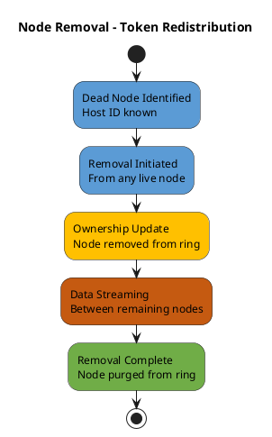
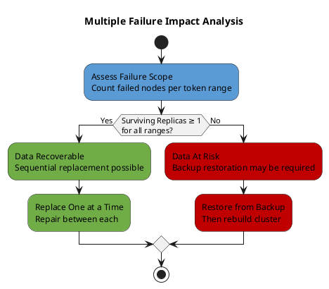

# Node Replacement

This section examines the architectural considerations for handling failed nodes in a Cassandra cluster. Understanding failure classification, recovery strategies, and the mechanics of node replacement is essential for designing resilient cluster topologies.

For operational procedures and step-by-step instructions, see **[Operations: Cluster Management](../../operations/cluster-management/index.md)**.

---

## Failure Classification

### Types of Node Failures

Node failures fall into distinct categories, each requiring different recovery approaches:

| Failure Type | Characteristics | Recovery Approach |
|--------------|-----------------|-------------------|
| **Transient** | Node temporarily unavailable, data intact | Wait for restart, hints replay |
| **Recoverable** | Node can restart, possible data issues | Restart + repair |
| **Permanent** | Hardware failed, node cannot return | Replace or remove |

### Failure Detection

Cassandra detects node failures through the gossip protocol's Phi Accrual Failure Detector. When a node stops responding to gossip messages, other nodes independently calculate a suspicion level (φ). Once φ exceeds the configured threshold (default: 8), the node is marked DOWN locally.

Key characteristics:
- **Local determination**: Each node independently decides if a peer is DOWN
- **Not gossiped**: DOWN status is not propagated; each node must observe failure directly
- **Adaptive**: Phi Accrual adjusts to network latency variations

See **[Gossip Protocol](gossip.md)** for failure detection mechanics.

---

## Decision Framework

### Replace vs Remove

When a node permanently fails, the architectural decision between replacement and removal affects cluster capacity, data distribution, and recovery time:

### Comparison of Approaches

| Factor | Replace | Remove |
|--------|---------|--------|
| **Cluster capacity** | Maintained | Reduced |
| **Data movement** | Stream to new node only | Redistribute across all remaining nodes |
| **Token ownership** | New node assumes dead node's tokens | Tokens redistributed to existing nodes |
| **Disk usage impact** | Isolated to new node | Increased on all remaining nodes |
| **Time to complete** | Longer (full data stream to one node) | Shorter (parallel redistribution) |
| **Network impact** | Concentrated streaming | Distributed streaming |

### Capacity Constraints

Before choosing an approach, verify capacity constraints:

| Constraint | Replace | Remove |
|------------|---------|--------|
| **Minimum nodes** | N ≥ RF after operation | N - 1 ≥ RF after operation |
| **Disk headroom** | New node needs capacity for its share | Remaining nodes need capacity for redistributed data |
| **Network bandwidth** | Streaming to single node | Parallel streaming between remaining nodes |

---

## Replacement Architecture

### Token Assumption Model

Node replacement operates on the principle of **token assumption**—the new node takes ownership of the failed node's token ranges without redistributing tokens across the cluster:

**Advantages of token assumption:**
- No token recalculation required
- Other nodes unaffected
- Predictable data movement
- Faster recovery than full rebalance

### Replacement Process Flow

### Replace Address Mechanism

The `replace_address_first_boot` JVM option instructs a new node to assume a dead node's identity:

| Option | Behavior | Recommendation |
|--------|----------|----------------|
| `replace_address_first_boot` | Cleared after successful first boot | Preferred—prevents accidental re-replacement |
| `replace_address` | Persists across restarts | Legacy—can cause issues on restart |

**Architectural behavior:**
1. New node contacts seeds with replacement intent
2. Cluster validates dead node is actually DOWN
3. New node receives dead node's token assignments
4. Streaming begins from surviving replicas
5. Upon completion, new node announces NORMAL status
6. Dead node's gossip state is eventually purged

### Same-IP vs Different-IP Replacement

| Scenario | Token Handling | Host ID | Configuration |
|----------|---------------|---------|---------------|
| **Same IP** | Assumed from dead node | New ID generated | `replace_address_first_boot` with same IP |
| **Different IP** | Assumed from dead node | New ID generated | `replace_address_first_boot` with dead node's IP |

Both scenarios require the `replace_address_first_boot` option—the IP in the option always refers to the **dead node's address**, regardless of the new node's IP.

---

## Removal Architecture

### Token Redistribution Model

Node removal triggers token redistribution—the dead node's token ranges are reassigned to remaining nodes:

### Removal vs Decommission

| Aspect | removenode | decommission |
|--------|------------|--------------|
| **Precondition** | Node is DOWN | Node is UP and operational |
| **Initiated from** | Any live node | The departing node itself |
| **Data source** | Remaining replicas stream to each other | Departing node streams its data out |
| **Coordination** | Distributed among remaining nodes | Centralized on departing node |
| **Use case** | Unplanned failure | Planned capacity reduction |

### Assassinate Operation

The `assassinate` operation forcibly removes a node from gossip state without data redistribution:

| Characteristic | Description |
|----------------|-------------|
| **Purpose** | Emergency removal of stuck nodes |
| **Data handling** | None—no streaming occurs |
| **Risk** | Potential data loss if replicas insufficient |
| **Post-action** | Full repair required on all nodes |

**Use only when:**
- Node is unresponsive but not fully DOWN
- `removenode` fails or hangs indefinitely
- Emergency cluster recovery is required

---

## Multiple Failure Scenarios

### Concurrent Failure Analysis

When multiple nodes fail, data availability depends on the relationship between failures and replication:

### Quorum Impact Matrix

| Failed Nodes | RF=3 Availability | Recovery Strategy |
|--------------|-------------------|-------------------|
| 1 | QUORUM available (2 of 3) | Standard replacement |
| 2 | ONE available only | Urgent replacement, sequential |
| 3 (same range) | Data unavailable | Backup restoration required |

### Recovery Ordering

When multiple nodes require replacement:

1. **Assess scope**: Identify which token ranges are affected
2. **Prioritize**: Replace nodes affecting most-critical ranges first
3. **Sequential execution**: Complete one replacement before starting next
4. **Repair between**: Run repair after each replacement to ensure consistency
5. **Verify coverage**: Confirm all ranges have sufficient replicas before proceeding

---

## Data Consistency Considerations

### Streaming During Replacement

During replacement, the new node receives data from surviving replicas:

| Source Selection | Criteria |
|------------------|----------|
| **Prefer local DC** | Minimize cross-datacenter traffic |
| **Replica availability** | Select from nodes holding required data |
| **Avoid concurrent streamers** | Prevent resource contention |

### Post-Replacement Consistency

After replacement completes, data consistency may require repair:

| Scenario | Repair Recommendation |
|----------|----------------------|
| Short downtime (< hint window) | Hints cover gap; repair optional |
| Extended downtime (> hint window) | Repair required for missed writes |
| Multiple failures | Full repair recommended |
| Consistency-critical data | Always run repair |

The hint window (default: 3 hours) determines whether hinted handoff can cover writes during downtime. Beyond this window, hints expire and repair becomes necessary.

---

## Related Documentation

- **[Node Lifecycle](node-lifecycle.md)** - Bootstrap, decommission, and state transitions
- **[Gossip Protocol](gossip.md)** - Failure detection mechanics
- **[Data Streaming](../distributed-data/streaming.md)** - Streaming architecture during replacement
- **[Scaling Operations](scaling.md)** - Capacity planning after node removal
- **[Fault Tolerance](../fault-tolerance/index.md)** - Failure scenarios and recovery patterns
- **[Operations: Cluster Management](../../operations/cluster-management/index.md)** - Step-by-step procedures
