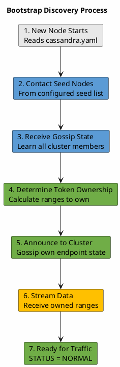
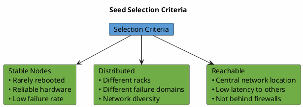
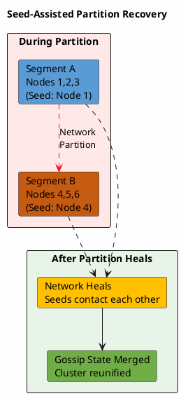

# Seeds and Cluster Discovery

Seed nodes are designated contact points that facilitate cluster discovery and gossip protocol initialization. While operationally identical to other nodes, seeds play a critical role in cluster formation, node bootstrapping, and partition recovery scenarios.

---

## Seed Node Functions

### Primary Responsibilities

| Function | Description | When Used |
|----------|-------------|-----------|
| **Bootstrap discovery** | Provide initial cluster topology to joining nodes | New node startup |
| **Gossip initialization** | First peers for gossip protocol establishment | Node startup |
| **Gossip fallback** | Contacted opportunistically during gossip rounds | Steady-state gossip |
| **Cluster formation** | Enable initial cluster creation | First nodes starting |

### What Seeds Are NOT

Seeds are often misunderstood. They do **not**:

- Have special data responsibilities
- Act as coordinators or masters
- Store additional metadata
- Require more resources than other nodes
- Need to be online for cluster operation (after initial formation)

!!! note "Operational Equivalence"
    After cluster formation, seeds function identically to non-seed nodes. The "seed" designation only affects gossip peer selection and bootstrap discovery—not data storage, query coordination, or any other operational aspect.

---

## Cluster Discovery Process

### Initial Bootstrap Discovery

When a new node starts, it must discover the existing cluster:



**Discovery sequence details:**

1. **Read configuration**: Parse `seed_provider` from cassandra.yaml
2. **Attempt seed contact**: Contact seeds (order may vary) until one responds
3. **Receive cluster state**: Seed sends complete gossip state (all known endpoints)
4. **Integrate into gossip**: Begin participating in gossip protocol
5. **Determine ownership**: Calculate token ranges (automatic with vnodes)
6. **Announce presence**: Gossip own state to cluster
7. **Bootstrap streaming**: Receive data for owned token ranges

### Seed Selection in Gossip

During normal gossip operation, seeds receive preferential treatment:

```
Gossip round (per second per node):

1. Select random live peer → send GossipDigestSyn
2. Maybe contact unreachable node:
   - Probability = unreachable_count / (live_count + 1)
3. If step 1 didn't contact a seed:
   - Maybe contact a random seed
   - Probability based on cluster state
```

This preferential treatment ensures:

- Seeds maintain current cluster state
- Partitioned segments can reconnect via seeds
- New nodes can always discover the cluster

---

## Seed Configuration

### Basic Configuration

```yaml
# cassandra.yaml

seed_provider:
  - class_name: org.apache.cassandra.locator.SimpleSeedProvider
    parameters:
      - seeds: "10.0.1.1,10.0.1.2,10.0.1.3"
```

### Configuration Parameters

| Parameter | Description | Example |
|-----------|-------------|---------|
| `class_name` | Seed provider implementation | `SimpleSeedProvider` |
| `seeds` | Comma-separated list of seed IP addresses | `"10.0.1.1,10.0.1.2"` |

### Multi-Datacenter Configuration

For multi-datacenter deployments, include seeds from each datacenter:

```yaml
# cassandra.yaml - Multi-DC seed configuration

seed_provider:
  - class_name: org.apache.cassandra.locator.SimpleSeedProvider
    parameters:
      # Include 2-3 seeds per datacenter
      - seeds: "10.0.1.1,10.0.1.2,10.1.1.1,10.1.1.2"
      #         └── DC1 seeds ──┘  └── DC2 seeds ──┘
```

---

## Seed Selection Guidelines

### Recommended Practices

| Guideline | Rationale |
|-----------|-----------|
| **2-3 seeds per datacenter** | Redundancy without excessive gossip traffic |
| **Distribute across racks** | Survive rack-level failures |
| **Use stable, reliable nodes** | Seeds should rarely be replaced |
| **Same list on all nodes** | Consistent cluster discovery |
| **Ensure reachability** | At least one seed should be reachable from starting nodes |

### Seed Count Recommendations

| Cluster Size | Seeds per DC | Total Seeds | Notes |
|--------------|--------------|-------------|-------|
| 3-5 nodes | 2 | 2 | Minimum viable |
| 6-20 nodes | 2-3 | 2-3 | Standard deployment |
| 20-100 nodes | 3 | 3-6 | Large cluster |
| 100+ nodes | 3 | 6-9 | Very large cluster |

### Selection Criteria

When choosing which nodes to designate as seeds:



---

## Common Mistakes and Solutions

### Mistake 1: Single Seed Node

**Problem:** Only one seed configured
```yaml
# BAD: Single point of failure
seeds: "10.0.1.1"
```

**Impact:**
- If seed is down, new nodes cannot join
- Cluster formation requires seed availability

**Solution:**
```yaml
# GOOD: Multiple seeds
seeds: "10.0.1.1,10.0.1.2,10.0.1.3"
```

### Mistake 2: Too Many Seeds

**Problem:** All or most nodes designated as seeds
```yaml
# BAD: Excessive seeds
seeds: "10.0.1.1,10.0.1.2,10.0.1.3,10.0.1.4,10.0.1.5,10.0.1.6,..."
```

**Impact:**
- Increased gossip traffic to seeds
- No operational benefit
- Harder to maintain consistency

**Solution:** Limit to 2-3 per datacenter.

### Mistake 3: Inconsistent Seed Lists

**Problem:** Different nodes have different seed configurations
```yaml
# Node A: seeds: "10.0.1.1,10.0.1.2"
# Node B: seeds: "10.0.1.3,10.0.1.4"
```

**Impact:**
- Cluster may fragment
- Inconsistent discovery behavior
- Potential for split-brain scenarios

**Solution:** Identical seed list on all nodes.

### Mistake 4: Seeds in Same Failure Domain

**Problem:** All seeds on same rack or availability zone
```yaml
# BAD: All seeds in rack1
seeds: "10.0.1.1,10.0.1.2,10.0.1.3"  # All rack1
```

**Impact:**
- Rack failure makes cluster unreachable for new nodes
- Reduced partition recovery capability

**Solution:** Distribute seeds across failure domains.

### Mistake 5: Unreachable Seeds

**Problem:** Seeds behind firewalls or unreachable from other nodes

**Impact:**
- Bootstrap failures
- Gossip initialization failures

**Solution:**
- Ensure port 7000 (or `storage_port`) open between all nodes
- Verify network connectivity before adding seeds

---

## Seed Operations

### Adding a New Seed

To designate an existing node as a seed:

1. **Update configuration on all nodes:**
   ```yaml
   seeds: "10.0.1.1,10.0.1.2,10.0.1.3,10.0.1.4"  # Added 10.0.1.4
   ```

2. **Rolling restart** (optional but recommended):
   - Restart nodes one at a time
   - New seed designation takes effect

!!! note "No Restart Required"
    Adding a seed to the configuration doesn't require immediate restart. The change takes effect when nodes restart for other reasons. However, a rolling restart ensures consistent behavior sooner.

### Removing a Seed

To remove a node from seed designation:

1. **Ensure other seeds are available:**
   - Verify remaining seeds are operational
   - Minimum 2 seeds should remain per datacenter

2. **Update configuration on all nodes:**
   ```yaml
   seeds: "10.0.1.1,10.0.1.2"  # Removed 10.0.1.3
   ```

3. **Rolling restart** (optional but recommended)

### Replacing a Failed Seed

If a seed node fails permanently:

1. **Remove from seed list** (all nodes' configuration)
2. **Add replacement seed** (different node)
3. **Handle the failed node:**
   - If recoverable: repair and restart
   - If not recoverable: use `removenode` or `assassinate`

---

## Partition Recovery

### How Seeds Aid Partition Recovery

During network partitions, seeds help reconnect isolated cluster segments:



**Recovery mechanism:**

1. Network partition isolates cluster segments
2. Each segment continues operating independently
3. Gossip within segments maintains local consistency
4. Seeds in each segment attempt cross-segment communication
5. When partition heals, seeds gossip across segments
6. State merges using version numbers (higher wins)
7. Cluster reunifies with consistent state

### Requirements for Partition Recovery

| Requirement | Reason |
|-------------|--------|
| Seeds in each segment | At least one seed per potential partition |
| Gossip to seeds continues | Seeds receive state updates from local segment |
| Version ordering | Generation/version numbers resolve conflicts |

---

## Monitoring Seeds

### Health Checks

```bash
# Verify seed connectivity
nodetool gossipinfo | grep -A1 "generation"

# Check if seeds are live
nodetool status | grep -E "UN|DN"

# Verify gossip state includes seeds
nodetool gossipinfo | grep "<seed_ip>"
```

### Metrics

| Metric | Source | Concern Threshold |
|--------|--------|-------------------|
| Gossip messages to seeds | JMX | Abnormally high or zero |
| Seed node status | `nodetool status` | DN (Down) state |
| Bootstrap success rate | Logs | Failures mentioning seeds |

---

## Custom Seed Providers

### Built-in Provider

```yaml
# SimpleSeedProvider - reads from configuration
seed_provider:
  - class_name: org.apache.cassandra.locator.SimpleSeedProvider
    parameters:
      - seeds: "10.0.1.1,10.0.1.2"
```

### Cloud Provider Integration

For dynamic cloud environments, custom seed providers can integrate with cloud APIs:

| Cloud Provider | Approach |
|----------------|----------|
| AWS | EC2 tags, Auto Scaling groups, ECS service discovery |
| GCP | Instance groups, GCE metadata |
| Kubernetes | Headless services, StatefulSet endpoints |
| Azure | VMSS, Azure DNS |

Custom seed providers implement `org.apache.cassandra.locator.SeedProvider` interface.

---

## Related Documentation

- **[Gossip Protocol](gossip.md)** - How seeds participate in gossip
- **[Node Lifecycle](node-lifecycle.md)** - Bootstrap process using seeds
- **[Scaling Operations](scaling.md)** - Seed considerations when scaling
