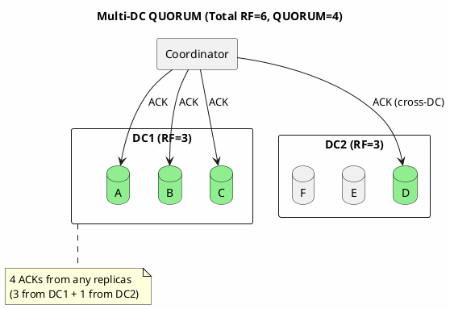

# Consistency

Consistency in Cassandra is tunable—the number of replicas that must acknowledge reads and writes is configurable per operation. This flexibility allows trading consistency for availability and latency.

!!! tip "Quick Reference"
    For a quick lookup of all consistency levels, quorum calculations, and decision tables, see [Consistency Levels Reference](consistency-levels.md).

---

## Consistency Is Per-Request

Unlike traditional databases where consistency is a system property, Cassandra allows specifying consistency per statement:

```sql
-- Strong consistency for this critical write
CONSISTENCY QUORUM;
INSERT INTO orders (id, amount) VALUES (uuid(), 100.00);

-- Weaker consistency for this non-critical read
CONSISTENCY ONE;
SELECT * FROM page_views WHERE page_id = 'homepage';
```

Different operations can be optimized differently within the same application.

---

## The Coordinator's Role

Every client request goes to a coordinator node, which manages the consistency guarantee:


### What Acknowledgment Means

**For writes**, a replica acknowledges after:

1. Writing to commit log (durability)
2. Writing to memtable (memory)

The data is not necessarily flushed to SSTable yet, but it is durable because of the commit log.

**For reads**, a replica acknowledges by returning its data.

---

## Write Consistency Levels

### ANY: Maximum Availability


!!! danger "Data Loss Risk"
    If the coordinator crashes before delivering the hint, the data is **permanently lost**. Use ANY only for truly non-critical data.

**When to use**: Almost never. Only for truly non-critical data where losing some writes is acceptable.

### ONE: Single Replica


RF = 3, ONE requires 1 ACK. Other replicas receive the write asynchronously.

**When to use**:

- High-throughput writes where some inconsistency is acceptable
- Time-series data with many writes per second
- When combined with ALL reads (R + W > N)

### QUORUM: Majority of All Replicas

| RF | QUORUM | Formula |
|----|--------|---------|
| 3 | 2 | floor(3/2) + 1 |
| 5 | 3 | floor(5/2) + 1 |
| 7 | 4 | floor(7/2) + 1 |

**Majority significance**:


With RF=3, QUORUM=2: Write to {A, B}, Read from {B, C}. The overlap (B) guarantees the read sees the write.

**Multi-datacenter QUORUM**:

QUORUM is calculated across the **total replication factor** of all datacenters combined. This has significant implications for multi-DC deployments.



With 2 DCs and RF=3 per DC: Total RF = 6, QUORUM = 4. Unlike EACH_QUORUM, QUORUM can be satisfied with any 4 replicas regardless of DC distribution (e.g., 3 from DC1 + 1 from DC2).

**When to use**:

- Global strong consistency is a hard requirement
- Can tolerate cross-DC latency on every operation
- Regulatory or compliance requirements for synchronous cross-DC writes

### LOCAL_QUORUM: Majority in Local Datacenter


2 ACKs from DC1 = SUCCESS. Data is still sent to DC2, but coordinator does not wait.

!!! tip "Latency Advantage"
    | Consistency | Path | Typical Latency |
    |-------------|------|-----------------|
    | QUORUM (multi-DC) | Client → DC1 → DC2 → DC1 → Client | 50-200ms |
    | LOCAL_QUORUM | Client → DC1 → Client | 1-5ms |

    LOCAL_QUORUM is **10-100x faster** for multi-DC deployments.

**When to use**: Multi-DC deployments (almost always the right choice).

### EACH_QUORUM: Quorum in Every Datacenter


Must wait for the **slowest DC** to achieve quorum.

**When to use**:

- Regulatory requirements for cross-DC consistency
- Financial transactions that must be in all regions before acknowledgment
- Rare—most applications do not need this

### ALL: Every Replica


!!! warning "Availability Risk"
    If **any** replica is down, the write **fails**. Single node failure causes complete write unavailability.

**When to use**: Almost never for writes. Single node failure causes all writes to fail.

---

## Read Consistency Levels

### ONE: Fastest Reads


If N1 has stale data, stale data is returned. Background read repair may fix inconsistency later.

### QUORUM: Strong Consistency Reads


Coordinator returns the **newest** data based on timestamp. If replicas disagree, coordinator triggers read repair.

### LOCAL_QUORUM: Fast Strong Reads

Same logic as QUORUM, but only contacts local DC replicas. Provides strong consistency within the datacenter with lower latency.

### EACH_QUORUM: Not Supported for Reads

!!! note
    EACH_QUORUM is **write-only**. For reads, use QUORUM (for cross-DC consistency) or LOCAL_QUORUM (for local consistency).

### ALL: Read From Every Replica


!!! warning
    If **any** replica is down or slow, the read **times out**.

**When ALL reads make sense**:

- Combined with ONE writes (R + W > N)
- Read-heavy workload where fast writes are desired
- Single node failure causes all reads to fail

---

## The Strong Consistency Formula

### R + W > N

The fundamental rule for strong consistency:

```
R = Number of replicas read
W = Number of replicas written
N = Replication factor

If R + W > N, reads will see the latest writes.
```

**Why it works**:

```
N = 3 (three replicas total)
W = 2 (write to two replicas)
R = 2 (read from two replicas)

R + W = 4 > 3 = N

The sets of written replicas and read replicas MUST overlap.

Write went to: {A, B}
Read contacts: {B, C}
Overlap: B ← Has the write
```

### Common Combinations

| Combination | R + W | Strong? | Use Case |
|-------------|-------|---------|----------|
| W=QUORUM, R=QUORUM | 4 > 3 | Yes | Standard strong consistency |
| W=ONE, R=ALL | 4 > 3 | Yes | Write-heavy, few reads |
| W=ALL, R=ONE | 4 > 3 | Yes | Read-heavy, few writes |
| W=LOCAL_QUORUM, R=LOCAL_QUORUM | 4 > 3 per DC | Yes (per DC) | Multi-DC standard |
| W=ONE, R=ONE | 2 < 3 | No | High throughput, eventual |
| W=ONE, R=QUORUM | 3 = 3 | No* | Sometimes inconsistent |

*R + W = N is not sufficient; must be strictly greater than.

### Multi-DC Complexity

| Configuration | QUORUM | LOCAL_QUORUM |
|---------------|--------|--------------|
| DC1: RF=3, DC2: RF=3 | 4 (global) | 2 (per DC) |
| **Write behavior** | 4 replicas (any DC) | 2 replicas (local DC only) |
| **Read behavior** | 4 replicas (any DC) | 2 replicas (local DC only) |
| **Consistency** | Global | Per-DC (cross-DC eventual) |

For most applications, LOCAL_QUORUM is sufficient because cross-DC replication happens in milliseconds.

---

## Failure Scenarios

### Single Node Failure (RF=3)


| CL | Works? | Reason |
|----|--------|--------|
| ONE | ✓ | 2 replicas available |
| QUORUM (2) | ✓ | 2 of 3 available |
| ALL | ✗ | C is down |

### Two Node Failure (RF=3)


| CL | Works? | Reason |
|----|--------|--------|
| ONE | ✓ | 1 replica available |
| QUORUM (2) | ✗ | Only 1 of 3 available |
| ALL | ✗ | B and C down |

### Entire Datacenter Failure


| CL | Works? | Reason |
|----|--------|--------|
| LOCAL_ONE | ✓ | Only needs local DC |
| LOCAL_QUORUM | ✓ | Only needs local DC |
| QUORUM (4/6) | ✗ | Only 3 of 6 available |
| EACH_QUORUM | ✗ | DC2 has no quorum |

!!! tip "Key Insight"
    LOCAL_QUORUM survives **entire DC failure** while maintaining strong local consistency. This is why it is recommended for multi-DC deployments.

---

## Lightweight Transactions (LWT)

For operations requiring linearizable consistency (compare-and-set semantics), Cassandra provides **Lightweight Transactions** using the Paxos consensus algorithm.

```sql
-- Compare-and-set with IF clause triggers LWT
UPDATE account SET balance = 50 WHERE id = 1 IF balance = 100;

-- Returns [applied] = true if balance was 100
-- Returns [applied] = false if balance was different
```

| Serial CL | Scope | Use Case |
|-----------|-------|----------|
| SERIAL | All DCs | Global uniqueness |
| LOCAL_SERIAL | Local DC | DC-local uniqueness |

!!! warning "Performance Impact"
    LWTs require 4 round trips (vs 1 for regular writes), resulting in 4-10x higher latency. Use only when compare-and-set semantics are required.

→ **[Consensus and Paxos](paxos.md)** for detailed coverage of LWT internals, Paxos v1 vs v2, best practices, and the upcoming Accord protocol.

---

## Speculative Execution

Speculative execution sends duplicate requests to reduce tail latency when one replica is slow.

### Without Speculative Execution

When one replica is slow (e.g., due to GC pause), the client must wait for it:


### With Speculative Execution

When a replica exceeds the expected latency threshold, the coordinator sends a speculative request to another replica:


| Scenario | Latency |
|----------|---------|
| Without speculative execution | 500ms (waiting for slow N2) |
| With speculative execution | 15ms (N3 responds instead) |

### Configuration

```sql
-- Per-table speculative retry setting
ALTER TABLE users WITH speculative_retry = '99percentile';

-- Options:
-- 'Xpercentile': Retry after X percentile latency
-- 'Yms': Retry after Y milliseconds
-- 'ALWAYS': Always send to extra replica immediately
-- 'NONE': Disable speculative retry
```

**Trade-off**: Speculative execution increases replica load but reduces tail latency.

---

## Debugging Consistency Issues

### "I wrote data but cannot read it"

**Diagnosis steps:**

1. Check consistency levels: Write CL + Read CL > RF?
2. Check for clock skew: `ntpq -p` on each node
3. Check for failed writes: Application logs for timeouts
4. Enable tracing: `TRACING ON;`

### Tracing

```sql
TRACING ON;

SELECT * FROM users WHERE user_id = 123;

-- Output shows:
-- - Which replicas were contacted
-- - Response times from each
-- - Whether read repair occurred
```

### JMX Metrics

```
# Unavailable errors (CL could not be satisfied)
org.apache.cassandra.metrics:type=ClientRequest,scope=Read,name=Unavailables
org.apache.cassandra.metrics:type=ClientRequest,scope=Write,name=Unavailables

# Timeouts
org.apache.cassandra.metrics:type=ClientRequest,scope=Read,name=Timeouts
org.apache.cassandra.metrics:type=ClientRequest,scope=Write,name=Timeouts

# LWT metrics
org.apache.cassandra.metrics:type=ClientRequest,scope=CASWrite,name=Latency
org.apache.cassandra.metrics:type=ClientRequest,scope=CASWrite,name=ContentionHistogram
```

---

## Best Practices

### Choosing Consistency Levels

| Scenario | Write CL | Read CL | Rationale |
|----------|----------|---------|-----------|
| Single DC, strong consistency | QUORUM | QUORUM | R+W > N |
| Multi-DC, low latency | LOCAL_QUORUM | LOCAL_QUORUM | No cross-DC wait |
| Multi-DC, global consistency | QUORUM | QUORUM | Cross-DC consensus |
| High throughput, eventual OK | ONE | ONE | Fastest |
| Write-heavy | ONE | ALL | Fast writes |
| Read-heavy | ALL | ONE | Fast reads |
| Time-series metrics | LOCAL_ONE | LOCAL_ONE | Volume over consistency |

### Common Mistakes

| Mistake | Consequence |
|---------|-------------|
| Using ALL in production | Single node failure breaks everything |
| QUORUM in multi-DC when LOCAL_QUORUM suffices | Unnecessary latency |
| ONE/ONE without understanding | No consistency guarantee |
| Overusing LWT | Performance degradation |
| Ignoring clock skew | Silent data loss via timestamp conflicts |

### Monitoring

| Metric | Alert Threshold | Meaning |
|--------|-----------------|---------|
| Unavailables | >0 | CL cannot be met |
| Timeouts | >1% | Replicas too slow |
| Read repair rate | >10% | High inconsistency |
| LWT contention | >10% | Redesign needed |

---

## Related Documentation

- **[Consistency Levels Reference](consistency-levels.md)** - Quick lookup tables for all consistency levels
- **[Distributed Data Overview](index.md)** - How partitioning, replication, and consistency work together
- **[Replication](replication.md)** - How replicas are placed
- **[Replica Synchronization](replica-synchronization.md)** - How replicas converge
- **[Operations](../../operations/repair/index.md)** - Running repair
