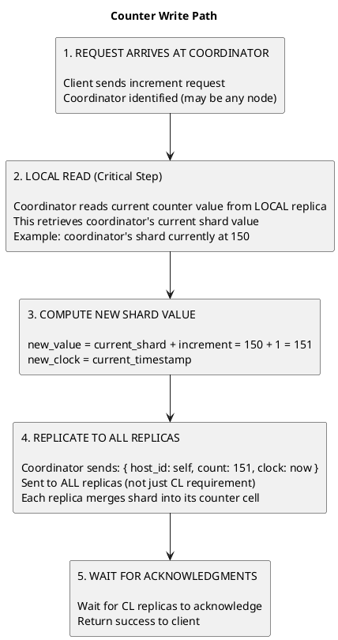
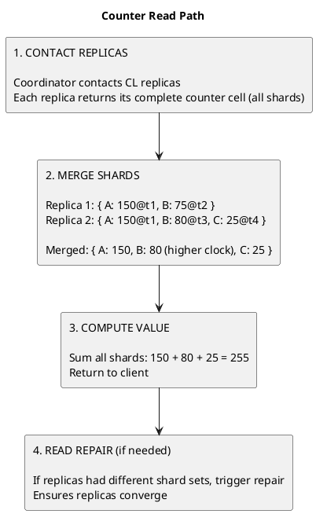

# Distributed Counters

Counting is among the most deceptively simple operations in computing. On a single machine, incrementing a counter is trivial: read the current value, add one, write the result. This read-modify-write cycle executes atomically, and the counter maintains perfect accuracy regardless of how many clients perform concurrent increments.

Distributed systems shatter this simplicity. When data is replicated across multiple nodes, each capable of accepting writes independently—the read-modify-write pattern breaks down fundamentally. Two clients incrementing "simultaneously" may each read the same value, compute the same result, and write it to different replicas. When those replicas synchronize, one increment vanishes. The system has lost information that was successfully acknowledged to a client.

This problem has no trivial solution. Strong consistency mechanisms like distributed locks or consensus protocols can serialize all counter operations, but at the cost of availability and latency that make them impractical for high-throughput counting scenarios. The challenge is achieving accurate counting while preserving the availability and partition tolerance that define distributed databases.

Cassandra addresses this through a specialized counter implementation based on Conflict-free Replicated Data Types (CRDTs). Rather than maintaining a single value that all nodes modify, each node maintains its own independent contribution. These contributions can be merged deterministically without coordination, ensuring that all acknowledged increments are preserved even when replicas diverge and later reconcile.

---

## History of Cassandra Counters

### The Demand for Distributed Counting

Counters were one of the most requested features in Cassandra's early years. Use cases abounded: page view tracking, vote tallying, rate limiting, real-time analytics, inventory management. All required incrementing values at high throughput across a distributed cluster.

Before native counter support, developers resorted to workarounds: external counting services, application-level aggregation, or accepting inaccuracy. None were satisfactory. The community pressure for native counter support was substantial.

### Version 0.8: First Implementation (2011)

Cassandra 0.8 introduced counters as a new column type. The implementation seemed straightforward: each replica maintained its own count, and these were merged during reads by summing the per-replica values.

The initial design suffered from fundamental flaws:

| Problem | Mechanism | Impact |
|---------|-----------|--------|
| Overcounting | Network timeouts triggered client retries; the same increment applied multiple times | Counter values inflated unpredictably |
| Undercounting | Replica failures during write could lose increments that were partially applied | Counter values lower than expected |
| Read inconsistency | Different read paths could compute different sums from diverged replicas | Same counter returned different values |
| Repair corruption | Anti-entropy repair could not correctly reconcile diverged counter states | Repair sometimes made inconsistency worse |

These issues were not edge cases—they manifested regularly in production workloads. Counter accuracy could drift by 10% or more under normal operating conditions. For use cases requiring precise counting, this was unacceptable.

### Version 1.2–2.0: Incremental Fixes (2012–2013)

Subsequent releases attempted to patch the counter implementation:

- Improved write path to reduce partial application failures
- Better replica coordination during counter reads
- Reduced (but did not eliminate) overcounting from retries

The fundamental architecture remained unchanged. Each patch addressed symptoms while the underlying data model continued to cause problems. Counter reliability improved but remained inferior to regular column operations.

### Version 2.1: Complete Redesign (2014)

Cassandra 2.1 ([CASSANDRA-6504](https://issues.apache.org/jira/browse/CASSANDRA-6504)) replaced the counter implementation entirely. The new design drew from CRDT research and addressed the root causes of previous issues:

**Architectural Changes:**

| Aspect | Pre-2.1 | Post-2.1 |
|--------|---------|----------|
| Data model | Single merged value per replica | Per-node shards with individual timestamps |
| Write handling | Increment applied directly | Increment applied to coordinator's shard only |
| Conflict resolution | Sum of replica values | Max timestamp per shard, then sum |
| Retry safety | Retries cause overcounting | Timestamps make retries idempotent |
| Repair behavior | Could corrupt values | Correctly merges shard states |

The key insight was separating each node's contribution into an independently-managed shard. When replicas diverge and reconcile, the merge operation takes the maximum value for each shard (based on timestamp), then sums across shards. This guarantees that no increment is lost and no increment is counted twice.

### Version 3.0+: Maturity and Limitations (2015–Present)

The 2.1 redesign stabilized counter behavior. Subsequent releases focused on:

- Performance optimizations for counter reads and writes
- Better integration with repair and streaming
- Explicit exclusion from features incompatible with counter semantics (materialized views, certain secondary index types)

Modern Cassandra counters are reliable for their intended use cases, though they retain inherent limitations stemming from their distributed nature.

---

## The Distributed Counting Problem

### Why Standard Approaches Fail

Consider how a naive distributed counter might work:

```
Initial state: counter = 100 on all replicas

Client A (via Replica 1):          Client B (via Replica 2):
1. Read counter: 100               1. Read counter: 100
2. Compute: 100 + 1 = 101          2. Compute: 100 + 1 = 101
3. Write counter: 101              3. Write counter: 101

After synchronization (last-write-wins):
All replicas: counter = 101

Expected: 102
Actual: 101
Lost: 1 increment
```

The problem is fundamental: Cassandra uses timestamps for conflict resolution. When two replicas have different values for the same column, the value with the higher timestamp wins. Counter increments are not additive under this model—they overwrite each other.

Potential solutions and why they fail:

| Approach | Problem |
|----------|---------|
| Distributed locks | Serializes all increments; destroys throughput and availability |
| Consensus per increment | Latency of Paxos round for every increment; impractical at scale |
| Increment-only log | Unbounded growth; read requires scanning entire history |
| Last-write-wins | Loses concurrent increments (as shown above) |

### An Analogy: Counting Conference Attendees

Consider a conference with three entrance doors. The task: count total attendance accurately.

**Naive approach (mirrors last-write-wins):**

Each door volunteer maintains a "total attendance" counter. Periodically, they synchronize by sharing their counts.

```
Door A volunteer: "I've counted 50 people total"
Door B volunteer: "I've counted 30 people total"
Door C volunteer: "I've counted 20 people total"

Synchronization question: What is the total attendance?
```

If synchronization takes the maximum (like last-write-wins), the answer is 50—obviously wrong. If it sums the values, the answer is 100—but this only works if each volunteer's count represents *only their door's arrivals*. If volunteers were attempting to track total attendance (by adding what they heard from others), summing produces overcounting.

**Correct approach (mirrors Cassandra's solution):**

Each volunteer tracks *only their own door's arrivals*, clearly labeled:

```
Door A's arrivals: 50
Door B's arrivals: 30
Door C's arrivals: 20

Total = A + B + C = 100 ✓
```

When synchronizing, volunteers share their individual door counts. The merge operation is simple: for each door, take the highest reported count (in case updates crossed in transit), then sum across all doors.

```
Volunteer 1 knows: { A: 50, B: 28, C: 20 }
Volunteer 2 knows: { A: 48, B: 30, C: 20 }

Merged state: { A: max(50,48)=50, B: max(28,30)=30, C: max(20,20)=20 }
Total = 100 ✓
```

This works because:
1. Each door's count is independent and monotonically increasing
2. Taking the maximum for each door is always safe (higher value is more recent)
3. Summing independent counts produces the correct total

This is precisely how Cassandra counters work: each node maintains its own "shard" of the counter, and the global value is computed by merging shards and summing.

---

## Theoretical Foundation

### CRDTs: Conflict-Free Replicated Data Types

Cassandra's counter implementation is grounded in research on Conflict-free Replicated Data Types (CRDTs), formalized by Shapiro et al. ([Shapiro, M. et al., 2011, "A Comprehensive Study of Convergent and Commutative Replicated Data Types"](https://hal.inria.fr/inria-00555588/document)).

CRDTs are data structures designed for replicated systems where:
- Replicas can be updated independently without coordination
- Updates propagate asynchronously between replicas
- All replicas converge to the same state once all updates are delivered

The key property is that the merge operation is:

| Property | Definition | Counter Application |
|----------|------------|---------------------|
| Commutative | merge(A, B) = merge(B, A) | Order of receiving updates doesn't matter |
| Associative | merge(merge(A, B), C) = merge(A, merge(B, C)) | Grouping of merges doesn't matter |
| Idempotent | merge(A, A) = A | Receiving same update twice has no effect |

These properties guarantee convergence regardless of network delays, reordering, or duplication.

### G-Counter: Grow-Only Counter

The simplest CRDT counter is the G-Counter (grow-only), which supports only increments:

```
G-Counter state: map from node_id to count

{ node_A: 50, node_B: 30, node_C: 20 }

Value = sum of all counts = 100

Increment (on node B):
{ node_A: 50, node_B: 31, node_C: 20 }

Merge (take max per node):
State 1: { node_A: 50, node_B: 30 }
State 2: { node_A: 48, node_B: 35, node_C: 20 }
Merged:  { node_A: 50, node_B: 35, node_C: 20 }
```

The merge operation (per-node maximum) preserves all increments because each node's count only increases. If node B's count is 35 in one state and 30 in another, 35 must include all increments represented by 30, plus additional ones.

### PN-Counter: Positive-Negative Counter

To support decrements, the PN-Counter maintains separate positive and negative counts:

```
PN-Counter state: map from node_id to (positive, negative)

{
  node_A: { P: 60, N: 10 },
  node_B: { P: 30, N: 0 },
  node_C: { P: 25, N: 5 }
}

Value = sum(P) - sum(N) = (60+30+25) - (10+0+5) = 115 - 15 = 100

Increment by 5 (on node B): node_B.P += 5
Decrement by 3 (on node B): node_B.N += 3

Merge: take max for each (node, P/N) pair
```

Cassandra's counter implementation is a variant of the PN-Counter, optimized for its storage engine and consistency model.

### Shard-Based Counter Structure

In Cassandra's implementation, each counter cell contains multiple "shards":

```
Counter cell for (partition_key, column_name):

Shard 1: { host_id: A, count: 150, clock: 1705312800000 }
Shard 2: { host_id: B, count: 75,  clock: 1705312850000 }
Shard 3: { host_id: C, count: -25, clock: 1705312700000 }

Counter value = 150 + 75 + (-25) = 200
```

Each shard represents one node's cumulative contribution to the counter. The clock (timestamp) enables proper conflict resolution when the same shard appears with different values.

**Merge semantics:**

```
Shard from Replica 1: { host_id: B, count: 75, clock: 1000 }
Shard from Replica 2: { host_id: B, count: 80, clock: 1200 }

Merged shard: { host_id: B, count: 80, clock: 1200 }

The higher clock indicates a more recent state that includes all
previous increments plus additional ones.
```

---

## How Counters Work in Cassandra

### Counter Write Path

Counter updates follow a different path than regular writes:

```sql
UPDATE page_views SET count = count + 1 WHERE page_id = 'home';
```




**Key implications:**

| Characteristic | Explanation |
|----------------|-------------|
| Read-before-write | Every counter update requires a local read, adding latency |
| Replica-local shards | Each replica uses its own CounterId for its shard |
| Logical clock | Shards use logical clocks (not requiring global timestamp accuracy) |
| Higher overhead | Counter writes have additional overhead compared to regular writes |

### Counter Read Path

Reading a counter aggregates shards from multiple replicas:

```sql
SELECT count FROM page_views WHERE page_id = 'home';
```



### Consistency Level Behavior

Counter operations interact with consistency levels differently than regular operations:

| Operation | CL Effect |
|-----------|-----------|
| Write (increment/decrement) | Determines how many replicas must acknowledge the shard update |
| Read | Determines how many replicas contribute shards to the merge |

**Write consistency considerations:**

```
RF = 3, Write with CL = ONE:

1. Coordinator reads local shard
2. Coordinator computes new shard value
3. Coordinator sends update to all 3 replicas
4. Waits for 1 acknowledgment
5. Returns success

Risk: If the acknowledging replica fails before others receive
the update, the increment exists on only one replica until
repair or read-triggered merge.

Recommendation: Use QUORUM for counter writes to ensure
the update reaches a majority of replicas.
```

**Read consistency and accuracy:**

```
Counter has diverged shards across replicas:

Replica 1: { A: 100, B: 50 }         Total: 150
Replica 2: { A: 100, B: 50, C: 30 }  Total: 180
Replica 3: { A: 100, B: 55, C: 30 }  Total: 185

Read with CL = ONE (contacts Replica 1):
  Returns 150 (missing C's shard entirely)

Read with CL = QUORUM (contacts Replica 1 and 2):
  Merged: { A: 100, B: 50, C: 30 }
  Returns 180 (missing B's latest update)

Read with CL = ALL (contacts all):
  Merged: { A: 100, B: 55, C: 30 }
  Returns 185 (complete, accurate)
```

Higher read consistency levels produce more accurate results when replicas have diverged.

---

## Counter Limitations

### Fundamental Limitations

These limitations arise from the distributed counter design itself:

| Limitation | Reason |
|------------|--------|
| No absolute value assignment | Cannot set counter to specific value; only increments/decrements allowed |
| No conditional updates | Cannot do "increment if value < 100"; would require distributed coordination |
| Accuracy requires quorum | Lower consistency levels may miss recent updates |
| Shard accumulation | Counters updated by many nodes accumulate shards, increasing storage |

### Schema Restrictions

Counter tables have special requirements:

```sql
-- Counter table structure
CREATE TABLE metrics (
    metric_id text,
    bucket timestamp,
    count counter,
    PRIMARY KEY (metric_id, bucket)
);

-- VALID: Multiple counter columns
CREATE TABLE multi_counter (
    id text PRIMARY KEY,
    reads counter,
    writes counter,
    errors counter
);

-- INVALID: Mixing counter and non-counter columns
CREATE TABLE invalid_mixed (
    id text PRIMARY KEY,
    count counter,
    name text        -- ERROR: cannot mix types
);

-- INVALID: Counter as primary key
CREATE TABLE invalid_pk (
    count counter PRIMARY KEY  -- ERROR
);
```

### Feature Exclusions

Counters are explicitly excluded from several Cassandra features:

| Feature | Status | Reason |
|---------|--------|--------|
| Secondary indexes | Not supported | Counter values are computed, not stored directly |
| Materialized views | Not supported | View maintenance incompatible with counter semantics |
| TTL | Not supported | Expiring shards would corrupt counter value |
| Lightweight transactions (IF) | Not supported | Conditional updates require different consistency model |
| USING TIMESTAMP | Not supported | Counters manage their own timestamps internally |

### Operational Considerations

| Consideration | Details |
|---------------|---------|
| Write latency | Higher than regular writes due to read-before-write |
| Storage overhead | Each updating replica adds a shard |
| Repair behavior | Counter repair uses different mechanics; ensure counters are included in repair schedule |
| Backup/restore | Counter state must be consistent across all replicas after restore |

---

## Counter Operations

### Basic Syntax

```sql
-- Increment by 1
UPDATE page_views SET views = views + 1
WHERE page_id = 'home';

-- Increment by arbitrary amount
UPDATE page_views SET views = views + 100
WHERE page_id = 'home';

-- Decrement
UPDATE page_views SET views = views - 1
WHERE page_id = 'home';

-- Decrement by arbitrary amount
UPDATE page_views SET views = views - 50
WHERE page_id = 'home';

-- Update multiple counters
UPDATE metrics
SET reads = reads + 1, writes = writes + 5
WHERE metric_id = 'api';

-- Read counter value
SELECT views FROM page_views WHERE page_id = 'home';
```

### Counter Batches

```sql
-- Counter batch (reduces round trips, but NOT atomic)
BEGIN COUNTER BATCH
  UPDATE page_views SET views = views + 1
  WHERE page_id = 'home';
  UPDATE page_views SET views = views + 1
  WHERE page_id = 'about';
  UPDATE page_views SET views = views + 1
  WHERE page_id = 'contact';
APPLY BATCH;
```

**Warning:** Counter batches are NOT atomic. Individual updates may succeed or fail independently. Use batches for performance (reducing round trips), not for transactional guarantees.

### Deleting Counter Data

```sql
-- Delete entire row (resets all counters in that row)
DELETE FROM page_views WHERE page_id = 'home';

-- Cannot delete individual counter column without deleting row
-- Cannot reset counter to zero (must delete and re-increment)
```

---

## Best Practices

### Data Modeling

| Practice | Rationale |
|----------|-----------|
| Dedicated counter tables | Cannot mix counter and non-counter columns |
| Time-bucketed partitions | Prevents unbounded partition growth; enables cleanup |
| Meaningful partition keys | Counter updates route through partition coordinator |

**Example: Time-bucketed counters**

```sql
CREATE TABLE hourly_page_views (
    page_id text,
    hour timestamp,
    views counter,
    PRIMARY KEY (page_id, hour)
) WITH CLUSTERING ORDER BY (hour DESC);

-- Current hour
UPDATE hourly_page_views SET views = views + 1
WHERE page_id = 'home'
AND hour = '2024-01-15 14:00:00';

-- Query recent hours
SELECT hour, views FROM hourly_page_views
WHERE page_id = 'home'
LIMIT 24;

-- Delete old data (no TTL available)
DELETE FROM hourly_page_views
WHERE page_id = 'home' AND hour < '2024-01-01';
```

### Consistency Recommendations

| Use Case | Write CL | Read CL | Trade-off |
|----------|----------|---------|-----------|
| Accurate counting | QUORUM | QUORUM | Higher latency, accurate results |
| Approximate counting | ONE | ONE | Lower latency, may miss recent updates |
| Critical counts | ALL | ALL | Highest latency, strongest guarantees |

### When to Avoid Counters

| Scenario | Alternative Approach |
|----------|---------------------|
| Need exact accuracy with low latency | External counting service (Redis, etc.) |
| Extreme write throughput (>100K/sec) | Application-side aggregation, periodic flush |
| Need TTL on counts | Time-bucketed regular columns with TTL |
| Need conditional updates | Regular columns with lightweight transactions |
| Need secondary indexes on count values | Maintain separate summary table |

---

## Monitoring

### Key Metrics

```
# Write latency (includes read-before-write)
org.apache.cassandra.metrics:type=Table,keyspace=ks,scope=tbl,name=WriteLatency

# Coordinator read latency (the read portion of counter update)
org.apache.cassandra.metrics:type=Table,keyspace=ks,scope=tbl,name=CoordinatorReadLatency

# Local read latency
org.apache.cassandra.metrics:type=Table,keyspace=ks,scope=tbl,name=ReadLatency
```

### Troubleshooting

| Symptom | Likely Cause | Resolution |
|---------|--------------|------------|
| Counter value lower than expected | Updates lost to failed replicas | Use higher write CL; run repair |
| Inconsistent reads | Replicas have diverged shards | Use higher read CL; run repair |
| High counter write latency | Normal read-before-write overhead | Expected; optimize partition design |
| Counter stops updating | Coordinator failures | Check cluster health; verify connectivity |

---

## Related Documentation

- **[Distributed Data Overview](index.md)** - How counters fit in distributed architecture
- **[Consistency](consistency.md)** - Consistency levels for counter operations
- **[Replica Synchronization](replica-synchronization.md)** - How counter shards converge
- **[CQL Reference](../../cql/index.md)** - Counter syntax and operations
