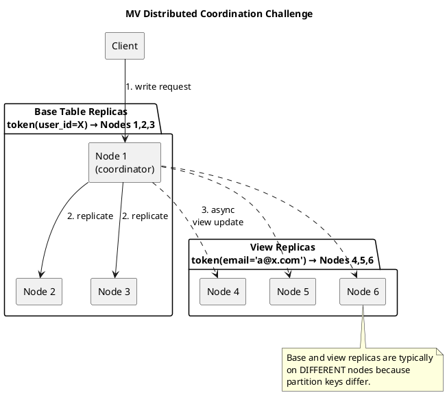
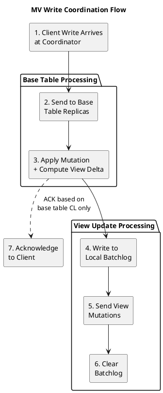
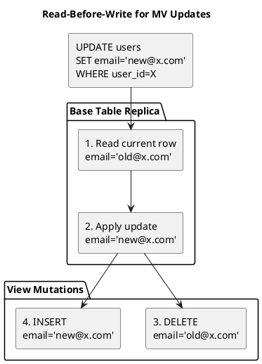

# Materialized Views: Distributed Coordination

Materialized Views (MVs) attempt to automate denormalization across a distributed cluster. This page examines the distributed coordination mechanisms, their inherent challenges, and the consistency issues that have made MVs controversial in production environments.

---

## Historical Context

### The Problem MVs Aimed to Solve

Cassandra's query-first data modeling requires denormalization—storing the same data in multiple tables with different primary keys to support different query patterns:

```sql
-- Base table: query by user_id
CREATE TABLE users (
    user_id uuid PRIMARY KEY,
    email text,
    city text
);

-- Denormalized table: query by email
CREATE TABLE users_by_email (
    email text PRIMARY KEY,
    user_id uuid,
    city text
);

-- Application must maintain both tables
INSERT INTO users (user_id, email, city) VALUES (...);
INSERT INTO users_by_email (email, user_id, city) VALUES (...);
```

This approach has challenges:

- Application complexity to maintain consistency
- Partial failure handling
- No atomic guarantee across tables

### The MV Solution (Cassandra 3.0, 2015)

Materialized Views were introduced to automate this denormalization:

```sql
CREATE MATERIALIZED VIEW users_by_email AS
    SELECT * FROM users
    WHERE email IS NOT NULL AND user_id IS NOT NULL
    PRIMARY KEY (email, user_id);

-- Single write, automatic propagation
INSERT INTO users (user_id, email, city) VALUES (...);
-- users_by_email automatically updated
```

The promise: write once, query many ways, with Cassandra handling synchronization.

### Development Timeline

| Date | Event | Significance |
|------|-------|--------------|
| 2014 | CASSANDRA-6477 | Initial MV proposal |
| 2015 | Cassandra 3.0 | MV implementation merged |
| 2016-2017 | Production issues | Multiple consistency bugs discovered |
| 2017 | CASSANDRA-13883 | Major view inconsistency issues documented |
| 2018-2020 | Ongoing fixes | Numerous patches for edge cases |
| 2021+ | Cautionary status | Community recommends careful evaluation |

---

## Distributed Coordination Architecture

### The Core Challenge

MVs face a fundamental distributed systems challenge: a single write to the base table must atomically update views that may reside on completely different nodes.



### Write Path Coordination

When a write arrives, the MV coordination involves multiple asynchronous steps:



**Critical observation**: The client receives acknowledgment after the base table write succeeds, but *before* view updates are guaranteed complete.

### The Batchlog Mechanism

To provide some durability guarantee for view updates, Cassandra uses a local batchlog:

```
View Update with Batchlog:

1. Base table mutation applied
2. View mutations written to local batchlog (commitlog-backed)
3. View mutations sent to view replicas
4. On success: batchlog entry cleared
5. On failure: batchlog replayed later

Batchlog replay:
- Runs periodically (every 60 seconds by default)
- Resends pending view mutations
- Eventually clears after success or expiry
```

| Batchlog Parameter | Default | Description |
|-------------------|---------|-------------|
| `batchlog_replay_throttle` (5.0+) | 1024KiB/s | Replay throughput limit |
| `batchlog_replay_throttle_in_kb` (pre-5.0) | 1024 | Replay throughput limit (KB/s) |
| View mutation timeout | 1 hour | When batchlog entries expire |

!!! warning "Batchlog Limitations"
    The batchlog provides best-effort delivery, not guaranteed consistency:

    - If a node crashes before batchlog write, view update is lost
    - Expired batchlog entries are discarded, not retried
    - No mechanism to detect permanently lost view updates

---

## Read-Before-Write Requirement

### Why Updates Require Reading

For INSERT operations, Cassandra can directly compute the view mutation. For UPDATE and DELETE, Cassandra must first read the current row to determine which view rows to modify:

```sql
-- Base table
CREATE TABLE users (
    user_id uuid PRIMARY KEY,
    email text,
    city text
);

-- View partitioned by email
CREATE MATERIALIZED VIEW users_by_email AS ...
    PRIMARY KEY (email, user_id);

-- Scenario: Update email
UPDATE users SET email = 'new@x.com' WHERE user_id = X;

-- Cassandra must:
-- 1. Read current row to find old email ('old@x.com')
-- 2. DELETE from users_by_email WHERE email = 'old@x.com'
-- 3. INSERT into users_by_email WHERE email = 'new@x.com'
```



### Performance Impact

| Operation | Without MV | With MV |
|-----------|-----------|---------|
| INSERT | Write only | Write + view writes |
| UPDATE | Write only | Read + Write + delete old view + insert new view |
| DELETE | Write only | Read + Write + delete view rows |

The read-before-write pattern introduces:

- Additional read latency on updates/deletes
- Potential for read timeouts affecting writes
- Increased load on base table replicas

---

## Consistency Problems

### Fundamental Consistency Gap

The MV architecture creates an inherent consistency window:

```
Timeline of a write:

T0: Client sends INSERT to base table
T1: Base table replicas receive and apply mutation
T2: Client receives SUCCESS acknowledgment  ←── Client thinks write is complete
T3: View mutations sent to view replicas (async)
T4: View replicas receive mutations
T5: View replicas apply mutations  ←── View now consistent

Gap: Between T2 and T5, base and view are inconsistent
```

This gap is not just theoretical—it manifests in production as:

1. **Read-your-writes violations**: Write to base, immediately query view, get stale data
2. **View lag**: View falls behind base during high write throughput
3. **Permanent divergence**: In failure scenarios, view may never receive updates

### Known Consistency Issues

#### Issue 1: Lost View Updates (CASSANDRA-13883)

Under specific failure scenarios, view updates can be permanently lost:

```
Failure scenario:

1. Write arrives at coordinator
2. Base table mutation succeeds on RF replicas
3. Client receives acknowledgment
4. Coordinator dies before writing to batchlog
5. View update never sent
6. Base and view permanently inconsistent
```

!!! danger "No Self-Healing"
    Unlike base table inconsistencies which anti-entropy repair can detect, lost view updates cannot be automatically detected or repaired without full base table scans.

#### Issue 2: Read-Before-Write Race Conditions

Concurrent updates can cause incorrect view state:

```
Race condition scenario:

Thread 1: UPDATE users SET email='B' WHERE user_id=X  (was 'A')
Thread 2: UPDATE users SET email='C' WHERE user_id=X  (was 'A')

Interleaving:
T1: Thread 1 reads current email = 'A'
T2: Thread 2 reads current email = 'A'
T3: Thread 1 applies update, computes: DELETE 'A', INSERT 'B'
T4: Thread 2 applies update, computes: DELETE 'A', INSERT 'C'
T5: View receives: DELETE 'A', INSERT 'B', DELETE 'A', INSERT 'C'

Result: View contains both 'B' and 'C' entries pointing to user X
        (should only contain 'C')
```

#### Issue 3: Timestamp Ordering Violations

MV mutations may arrive out of order at view replicas:

```
Timestamp ordering issue:

Base table:
T100: INSERT user_id=X, email='A'
T200: UPDATE email='B' WHERE user_id=X
T300: DELETE WHERE user_id=X

View receives (out of order due to network):
T300: DELETE email='B'  (fails - row doesn't exist yet)
T100: INSERT email='A'
T200: DELETE email='A', INSERT email='B'

Final view state: Contains email='B' → user_id=X
Expected state: Empty (row was deleted)
```

### Repair Complexity

Repairing MV inconsistencies requires special handling:

```bash
# Standard repair does NOT fix MV inconsistencies
nodetool repair keyspace table

# View repair only reconciles view replicas with each other
# Does NOT reconcile view with base table
nodetool repair keyspace view_name

# Full reconciliation requires:
# 1. Repair base table
# 2. Rebuild view (drop and recreate)
# Or use custom tooling to compare base vs view
```

!!! note "No Built-in Consistency Check"
    Cassandra provides no built-in tool to detect base table / view divergence. Operators must implement custom validation or accept eventual consistency.

---

## Why MVs Are Considered Problematic

### Community Sentiment

The Cassandra community has developed cautionary guidance around MVs:

| Concern | Details |
|---------|---------|
| **Consistency bugs** | Numerous JIRA issues, some unfixable without redesign |
| **Operational complexity** | Repair, monitoring, and debugging more difficult |
| **Performance unpredictability** | Read-before-write latency varies widely |
| **Hidden costs** | Write amplification not visible to applications |
| **Limited testing** | Edge cases poorly understood until production incidents |

### Architectural Limitations

The MV design has fundamental constraints that cannot be fixed without major redesign:

1. **Asynchronous by design**: View consistency requires blocking writes on view updates, which defeats the purpose
2. **Different replica sets**: Base and view partitions map to different nodes, requiring coordination
3. **No transaction support**: No mechanism for atomic base + view updates
4. **Batchlog is best-effort**: Provides durability, not consistency
5. **Timestamp-based resolution**: Works for base table, breaks for derived view state

### Production Failure Modes

Real-world MV issues observed in production:

| Failure Mode | Symptom | Impact |
|--------------|---------|--------|
| View lag | Queries return stale data | User-visible inconsistency |
| Missing rows | View lacks rows present in base | Silent data loss from view perspective |
| Orphan rows | View has rows not in base | Phantom results |
| Duplicate rows | Same base row appears multiple times | Incorrect query results |
| Repair failures | nodetool repair errors on views | Operational burden |

---

## Alternatives

### Application-Managed Denormalization

Write to multiple tables with logged batches:

```sql
BEGIN BATCH
    INSERT INTO users (user_id, email, city) VALUES (...);
    INSERT INTO users_by_email (email, user_id, city) VALUES (...);
APPLY BATCH;
```

| Aspect | MV | Logged Batch |
|--------|-----|--------------|
| Atomicity | No | Yes (within batch) |
| Consistency | Eventual, potentially divergent | Atomic visibility |
| Write latency | Lower (async) | Higher (sync) |
| Application code | Simpler | More complex |
| Failure recovery | Batchlog (unreliable) | Batchlog (reliable) |

### SAI (Cassandra 5.0+)

For many MV use cases, SAI provides a better alternative:

```sql
-- Instead of MV for email lookup
CREATE INDEX ON users (email) USING 'sai';

-- Query directly
SELECT * FROM users WHERE email = 'a@x.com';
```

SAI advantages:

- No write amplification
- No separate consistency domain
- Standard repair works
- Simpler operations

### Change Data Capture (CDC)

For complex derived data needs:

1. Enable CDC on base table
2. External process reads CDC log
3. External process maintains derived views/tables

Provides full control over consistency and transformation logic.

---

## Recommendations

### When MVs Might Be Acceptable

| Scenario | Rationale |
|----------|-----------|
| Development/prototyping | Faster iteration, consistency less critical |
| Read-heavy, write-light workloads | Fewer opportunities for inconsistency |
| Tolerance for eventual consistency | Application handles stale reads |
| Simple, infrequent updates | Less read-before-write overhead |

### When to Avoid MVs

| Scenario | Alternative |
|----------|-------------|
| High write throughput | Application-managed tables |
| Strong consistency required | Logged batches |
| Query flexibility | SAI (Cassandra 5.0+) |
| Complex transformations | CDC + external processing |
| Mission-critical data | Anything but MVs |

### If Using MVs

1. **Limit to 1-2 views per table**: Minimize write amplification
2. **Monitor closely**: Track view lag and inconsistencies
3. **Implement consistency checks**: Periodic base vs view validation
4. **Plan for rebuild**: Know how to drop and recreate views
5. **Test failure scenarios**: Understand behavior during node failures
6. **Consider SAI first**: Especially for Cassandra 5.0+

---

## Related Documentation

- **[Materialized Views (Storage Engine)](../storage-engine/materialized-views.md)** - Syntax and usage
- **[Consistency](consistency.md)** - Consistency levels and guarantees
- **[SAI](../storage-engine/indexes/sai.md)** - Recommended alternative
- **[Replica Synchronization](replica-synchronization.md)** - Anti-entropy repair
