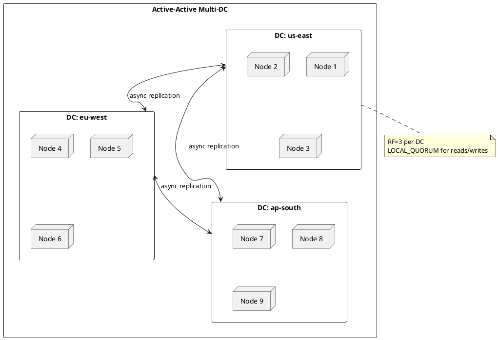
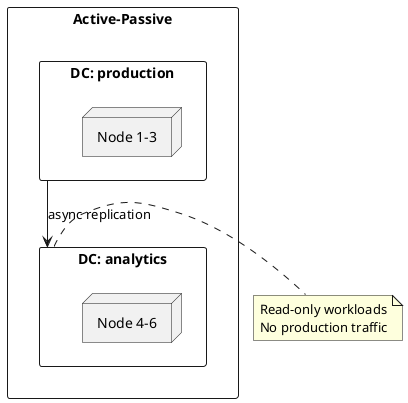
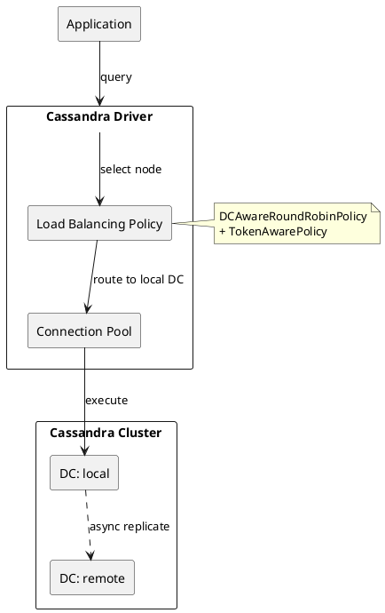
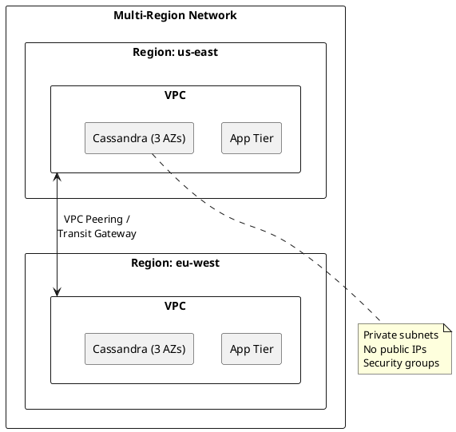

# Multi-Datacenter Deployments

Apache Cassandra provides native support for multi-datacenter deployments, enabling geographic distribution, disaster recovery, and read locality without external replication tools.

---

## Overview

Multi-datacenter deployment distributes data across geographically separated locations. Cassandra treats this as a first-class feature—replication across datacenters uses the same mechanisms as replication within a datacenter.

### When to Deploy Multi-Datacenter

| Use Case | Benefit |
|----------|---------|
| **Geographic read locality** | Users read from nearby nodes (1-5ms vs 50-200ms cross-region) |
| **Disaster recovery** | Survive complete datacenter failure |
| **Regulatory compliance** | Keep data within geographic boundaries |
| **Follow-the-sun operations** | Shift load to active regions |
| **Read scaling** | Isolate analytics workloads to dedicated DC |

### Cassandra Multi-DC Capabilities

| Capability | Description |
|------------|-------------|
| **Asynchronous replication** | Writes replicate across DCs without blocking |
| **Per-DC replication factor** | Configure replicas independently per datacenter |
| **LOCAL consistency levels** | Queries execute within local DC only |
| **Automatic topology awareness** | Drivers discover and route to local nodes |
| **No external coordination** | No ZooKeeper, no consensus protocols for replication |

---

## Architecture Patterns

### Active-Active (Recommended)

All datacenters accept both reads and writes. This is Cassandra's natural operating mode.



**Characteristics:**

- All DCs serve production traffic
- Writes in any DC replicate to all DCs asynchronously
- Use `LOCAL_QUORUM` for local-DC-only latency
- Conflict resolution via last-write-wins (LWW) timestamps

**Configuration:**

```sql
CREATE KEYSPACE ecommerce WITH replication = {
    'class': 'NetworkTopologyStrategy',
    'us-east': 3,
    'eu-west': 3,
    'ap-south': 3
};
```

### Active-Passive (Analytics Replica)

One or more DCs serve only reads, typically for analytics or reporting workloads.



**Use cases:**

- Heavy analytics queries isolated from production
- Reporting systems with eventual consistency tolerance
- Data science workloads

### Disaster Recovery (DR) Replica

A standby DC for failover, receiving writes but not serving traffic until needed.

| Mode | Production DC | DR DC | Failover |
|------|---------------|-------|----------|
| Hot standby | Active R/W | Receives writes, no traffic | Instant |
| Warm standby | Active R/W | Receives writes, periodic validation | Minutes |
| Cold standby | Active R/W | Backup restore only | Hours |

---

## Query Routing: Driver vs CQL

!!! important "Routing is Driver-Level, Not CQL-Level"
    Cassandra does not support query-level hints or directives for datacenter routing in CQL. All routing decisions are made by the client driver based on its configured policies.

### How Routing Works



### What the Driver Handles

| Responsibility | Mechanism |
|----------------|-----------|
| **Datacenter selection** | `withLocalDatacenter("dc-name")` at driver init |
| **Node selection within DC** | Token-aware routing to replica nodes |
| **Failover to remote DC** | Configurable via `usedHostsPerRemoteDc` |
| **Latency optimization** | Latency-aware policy for lowest-latency node |

### What CQL Does NOT Support

- No `USE DATACENTER` directive
- No query hints like `/* dc=us-east */`
- No session-level DC switching
- No per-query DC override

### Controlling Routing

Routing is controlled through:

1. **Driver configuration** (datacenter selection)
2. **Consistency level** (LOCAL_* restricts to local DC)
3. **Application architecture** (deploy app instances per region)

---

## Driver Configuration by Language

### Java (DataStax Driver 4.x)

```java
CqlSession session = CqlSession.builder()
    .addContactPoint(new InetSocketAddress("cassandra-us-east.example.com", 9042))
    .withLocalDatacenter("us-east")  // Critical: sets local DC
    .withLoadBalancingPolicy(
        DefaultLoadBalancingPolicy.builder()
            .withLocalDatacenter("us-east")
            .withSlowReplicaAvoidance(true)
            .build()
    )
    .build();

// All queries route to us-east by default
// Use LOCAL_QUORUM for local-DC-only execution
SimpleStatement stmt = SimpleStatement.builder("SELECT * FROM users WHERE id = ?")
    .setConsistencyLevel(ConsistencyLevel.LOCAL_QUORUM)
    .build();
```

### Python (cassandra-driver)

```python
from cassandra.cluster import Cluster
from cassandra.policies import DCAwareRoundRobinPolicy, TokenAwarePolicy
from cassandra import ConsistencyLevel

# Configure DC-aware routing
load_balancing_policy = TokenAwarePolicy(
    DCAwareRoundRobinPolicy(local_dc='us-east')
)

cluster = Cluster(
    contact_points=['cassandra-us-east.example.com'],
    load_balancing_policy=load_balancing_policy
)
session = cluster.connect('ecommerce')

# Set default consistency level
session.default_consistency_level = ConsistencyLevel.LOCAL_QUORUM

# Execute query (routes to us-east)
rows = session.execute("SELECT * FROM users WHERE id = %s", [user_id])
```

### Go (gocql)

```go
package main

import (
    "github.com/gocql/gocql"
    "log"
)

func main() {
    cluster := gocql.NewCluster("cassandra-us-east.example.com")
    cluster.Keyspace = "ecommerce"

    // Configure DC-aware routing
    cluster.PoolConfig.HostSelectionPolicy = gocql.TokenAwareHostPolicy(
        gocql.DCAwareRoundRobinPolicy("us-east"),
    )

    // Set consistency level
    cluster.Consistency = gocql.LocalQuorum

    session, err := cluster.CreateSession()
    if err != nil {
        log.Fatal(err)
    }
    defer session.Close()

    // Queries route to us-east with LOCAL_QUORUM
    var name string
    err = session.Query("SELECT name FROM users WHERE id = ?", userID).Scan(&name)
}
```

### Node.js (cassandra-driver)

```javascript
const cassandra = require('cassandra-driver');

const client = new cassandra.Client({
    contactPoints: ['cassandra-us-east.example.com'],
    localDataCenter: 'us-east',  // Critical: sets local DC
    keyspace: 'ecommerce',
    policies: {
        loadBalancing: new cassandra.policies.loadBalancing.TokenAwarePolicy(
            new cassandra.policies.loadBalancing.DCAwareRoundRobinPolicy('us-east')
        )
    },
    queryOptions: {
        consistency: cassandra.types.consistencies.localQuorum
    }
});

// All queries route to us-east
const query = 'SELECT * FROM users WHERE id = ?';
const result = await client.execute(query, [userId], { prepare: true });
```

---

## Consistency Level Selection

### Multi-DC Consistency Levels

| Level | Scope | Latency | Durability |
|-------|-------|---------|------------|
| `LOCAL_ONE` | 1 replica in local DC | Lowest (~1ms) | Single node |
| `LOCAL_QUORUM` | Quorum in local DC | Low (~2-5ms) | Local DC durable |
| `QUORUM` | Quorum across all DCs | High (~50-200ms) | Global durable |
| `EACH_QUORUM` | Quorum in each DC | Highest | Strongest |
| `ALL` | All replicas everywhere | Highest | Complete |

### Recommended Patterns

| Workload | Write CL | Read CL | Trade-off |
|----------|----------|---------|-----------|
| **Low-latency reads** | LOCAL_QUORUM | LOCAL_ONE | May read stale |
| **Balanced (recommended)** | LOCAL_QUORUM | LOCAL_QUORUM | Local consistency |
| **Strong consistency** | QUORUM | QUORUM | Cross-DC latency |
| **Critical writes** | EACH_QUORUM | LOCAL_QUORUM | Write waits for all DCs |

### Latency Impact

```
LOCAL_QUORUM (same region):     ~2-5ms
QUORUM (cross-region):          ~50-200ms (depends on distance)
EACH_QUORUM (all regions):      ~100-300ms (slowest DC determines latency)
```

!!! warning "QUORUM in Multi-DC"
    With `QUORUM` across 3 DCs (RF=3 each, 9 total replicas), quorum requires 5 responses. This likely spans multiple DCs, adding cross-region latency to every operation.

---

## CQRS Patterns

For implementing Command Query Responsibility Segregation (CQRS) with multi-datacenter Cassandra, see the dedicated [CQRS Pattern Guide](../../application-development/patterns/cqrs.md).

CQRS aligns naturally with multi-DC deployments:

- **Command services** deploy in primary DC with `LOCAL_QUORUM` writes
- **Query services** deploy per region with `LOCAL_ONE` reads
- Cassandra's async replication provides eventual consistency for read replicas

---

## Cross-Region Failover

### Automatic Failover (Driver-Level)

The driver automatically fails over to remote DCs when local nodes are unavailable:

```java
// Java: Configure remote DC fallback
DefaultLoadBalancingPolicy policy = DefaultLoadBalancingPolicy.builder()
    .withLocalDatacenter("us-east")
    .build();

// Driver automatically tries remote DCs if local DC is completely down
```

```python
# Python: Configure remote DC fallback
policy = DCAwareRoundRobinPolicy(
    local_dc='us-east',
    used_hosts_per_remote_dc=2  # Try 2 hosts per remote DC on failure
)
```

### Failover Behavior

| Scenario | Driver Behavior |
|----------|-----------------|
| Single node failure | Routes to other local DC nodes |
| Multiple node failures | Continues with remaining local nodes |
| Complete local DC failure | Falls back to remote DC (if configured) |
| Network partition | May route to accessible DC |

### Manual Failover Procedure

For planned failover or disaster recovery:

**1. Verify remote DC health:**

```bash
nodetool status  # Check all DCs
nodetool describecluster  # Verify schema agreement
```

**2. Update application configuration:**

```yaml
# Update CASSANDRA_LOCAL_DC to new primary
cassandra:
  local-datacenter: eu-west  # Was us-east
  contact-points: cassandra-eu.example.com
```

**3. Rolling restart applications:**

```bash
kubectl rollout restart deployment/order-service
```

**4. Verify traffic routing:**

```bash
# Check driver metrics or Cassandra logs for query sources
nodetool clientstats
```

### Failback Considerations

| Step | Action |
|------|--------|
| 1. Restore failed DC | Bring nodes back online |
| 2. Verify replication | Run `nodetool repair` if needed |
| 3. Validate data | Check for any conflicts |
| 4. Gradual traffic shift | Update app configs in stages |
| 5. Monitor | Watch latency and error rates |

---

## Network and Infrastructure

### Recommended Network Topology



### Port Requirements

| Port | Purpose | Scope |
|------|---------|-------|
| 9042 | CQL native protocol | App → Cassandra |
| 7000 | Inter-node (unencrypted) | Cassandra → Cassandra |
| 7001 | Inter-node (TLS) | Cassandra → Cassandra |
| 7199 | JMX | Management only |

### Cross-Region Traffic Costs

!!! warning "Data Transfer Costs"
    Cross-region replication generates significant data transfer. Budget for:

    - Write amplification: Each write replicates to RF nodes per DC
    - Repair traffic: Cross-DC repair can be substantial
    - Typical cost: $0.02-0.09/GB depending on cloud provider and regions

### Latency Expectations

| Route | Typical Latency |
|-------|-----------------|
| Same AZ | <1ms |
| Cross-AZ (same region) | 1-2ms |
| US East ↔ US West | 60-80ms |
| US ↔ Europe | 80-120ms |
| US ↔ Asia Pacific | 150-200ms |
| Europe ↔ Asia Pacific | 120-180ms |

---

## Best Practices

### Do

| Practice | Reason |
|----------|--------|
| Use `NetworkTopologyStrategy` | Required for multi-DC awareness |
| Set `LOCAL_QUORUM` as default | Balances consistency and latency |
| Configure driver with explicit local DC | Prevents routing to wrong DC |
| Use `GossipingPropertyFileSnitch` | Production-grade topology detection |
| Deploy RF ≥ 3 per DC | Survives node failures within DC |
| Run repairs regularly | Maintains consistency across DCs |

### Don't

| Anti-Pattern | Problem |
|--------------|---------|
| Using `SimpleStrategy` | No DC awareness |
| Using `QUORUM` for all operations | Unnecessary cross-DC latency |
| Relying on external load balancer | Loses token awareness, adds latency |
| Mixing snitch types | Causes topology confusion |
| Skipping `withLocalDatacenter()` | Driver may route to wrong DC |
| RF=1 in any DC | No fault tolerance |

---

## Related Documentation

- [CQRS Pattern](../../application-development/patterns/cqrs.md) - Command Query Responsibility Segregation with Cassandra
- [Replication](replication.md) - Replication strategies and RF configuration
- [Consistency Levels](consistency.md) - Detailed consistency level reference
- [Load Balancing Policies](../../application-development/drivers/policies/load-balancing.md) - Driver routing policies
- [Snitch Configuration](../../operations/configuration/snitch-config/index.md) - Topology detection setup
- [AWS Deployment](../../cloud/aws/index.md) - AWS-specific multi-region guidance
