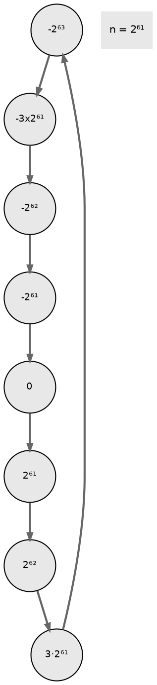
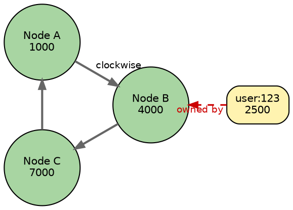
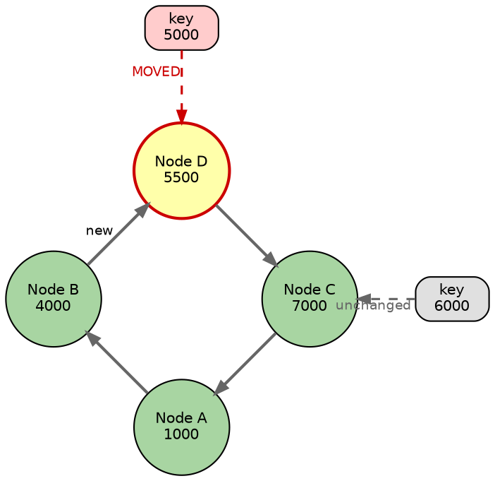
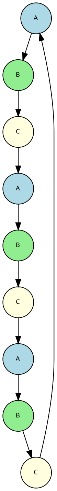

# Partitioning

Partitioning determines how data is distributed across nodes in a Cassandra cluster. Each row is assigned to a node based on its partition key, which is hashed to produce a token value. The token determines which node owns the data.

---

## The Problem with Modulo Hashing

Traditional hash-based distribution uses modulo arithmetic:

```
node = hash(key) % number_of_nodes
```

This approach fails catastrophically when the cluster size changes:

```
Before: 3 nodes
hash("user:123") % 3 = 1 → Node 1
hash("user:456") % 3 = 2 → Node 2
hash("user:789") % 3 = 0 → Node 0

After adding 1 node: 4 nodes
hash("user:123") % 4 = 3 → Node 3  ← MOVED
hash("user:456") % 4 = 2 → Node 2  ← Same
hash("user:789") % 4 = 1 → Node 1  ← MOVED

Result: ~75% of data must move when adding one node
        In a large cluster, this is operationally catastrophic
```

---

## Consistent Hashing

Consistent hashing, introduced by Karger et al. ([Karger, D. et al., 1997, "Consistent Hashing and Random Trees"](https://www.cs.princeton.edu/courses/archive/fall09/cos518/papers/chash.pdf)), solves the data movement problem by mapping both **keys** and **nodes** onto a shared circular hash space.

### The Hash Ring

Instead of using modulo arithmetic, consistent hashing places everything on a circular number line (a "ring") where the maximum value wraps around to zero:



Both nodes and data keys are hashed to positions on this ring. A key is owned by the first node encountered when walking **clockwise** from the key's position.

### Nodes and Keys on the Ring

Consider three nodes placed on the ring at positions 1000, 4000, and 7000:



**Finding the owner**: The key `user:123` hashes to position 2500. Walking clockwise from 2500, Node B (at 4000) is the first node encountered. Therefore, **Node B owns this key**.

Each node owns all keys between itself and the previous node (counter-clockwise):

| Node | Position | Owns Keys in Range |
|------|----------|-------------------|
| A | 1000 | 7001 → 1000 (wrapping through 0) |
| B | 4000 | 1001 → 4000 |
| C | 7000 | 4001 → 7000 |

### Adding a Node: Minimal Data Movement

When Node D joins at position 5500, only keys in the range 4001–5500 move to the new node. All other keys remain on their original nodes:



| Key | Position | Before (3 nodes) | After (4 nodes) | Moved? |
|-----|----------|------------------|-----------------|--------|
| key at 2500 | 2500 | Node B | Node B | No |
| key at 5000 | 5000 | Node C | **Node D** | **Yes** |
| key at 6000 | 6000 | Node C | Node C | No |
| key at 8000 | 8000 | Node A | Node A | No |

Only keys in the range that Node D now owns (4001–5500) move. Everything else stays in place.

### Data Movement Comparison

| Operation | Modulo Hashing | Consistent Hashing |
|-----------|---------------|-------------------|
| Add 1 node to 3-node cluster | ~75% of data moves | ~25% of data moves |
| Add 1 node to 10-node cluster | ~90% of data moves | ~10% of data moves |
| Add 1 node to 100-node cluster | ~99% of data moves | ~1% of data moves |

**Formula**: With modulo hashing, adding a node moves ~(N-1)/N of data. With consistent hashing, only ~1/N of data moves. The larger the cluster, the greater the advantage.

---

## Partition Key to Token

Every row has a partition key that the partitioner hashes to a token:

```sql
-- See the token for a partition key
SELECT token(user_id), user_id, name FROM users;

-- Output:
 system.token(user_id)     | user_id                              | name
---------------------------+--------------------------------------+-------
 -8750879223671532049      | 550e8400-e29b-41d4-a716-446655440000 | Alice
 -3485723948573892001      | 6ba7b810-9dad-11d1-80b4-00c04fd430c8 | Bob
  2749583759385739583      | 7ba7b810-9dad-11d1-80b4-00c04fd430c8 | Carol
```

---

## Partitioners

The partitioner determines how partition keys are mapped to token values on the ring. The choice of partitioner affects data distribution, query capabilities, and cluster behavior.

### Murmur3Partitioner (Default)

The default and recommended partitioner since Cassandra 1.2 ([CASSANDRA-3772](https://issues.apache.org/jira/browse/CASSANDRA-3772)). It uses the MurmurHash3 algorithm ([Appleby, A., 2008](https://github.com/aappleby/smhasher/wiki/MurmurHash3)), a non-cryptographic hash function designed for high performance and excellent distribution properties.

```
Hash function: MurmurHash3 (128-bit, uses lower 64 bits)
Token range: -2^63 to +2^63 - 1
Distribution: Uniform random distribution
```

| Characteristic | Description |
|----------------|-------------|
| Distribution | Excellent—keys distribute evenly regardless of input patterns |
| Range queries | Not supported across partition keys |
| Hot spots | Rare—even sequential keys distribute randomly |
| Token range | -9,223,372,036,854,775,808 to +9,223,372,036,854,775,807 |

**How Murmur3 distributes data:**

```
Sequential input keys:              Resulting tokens (random distribution):
user:1                      →       -7,509,452,495,886,106,294
user:2                      →        3,248,973,570,287,400,012
user:3                      →       -1,042,345,729,384,756,129
user:4                      →        8,127,364,501,928,374,650

Even though keys are sequential, tokens are randomly distributed
across the entire ring. This prevents hot spots from sequential inserts.
```

### RandomPartitioner (Legacy)

The original default partitioner, now superseded by Murmur3Partitioner.

```
Hash function: MD5
Token range: 0 to 2^127 - 1
Distribution: Uniform random distribution
```

| Characteristic | Description |
|----------------|-------------|
| Distribution | Good—similar to Murmur3 |
| Performance | Slower than Murmur3 (MD5 is cryptographic) |
| Token format | Large integers (harder to read) |
| Status | Legacy—use Murmur3Partitioner for new clusters |

**Why Murmur3 replaced Random:**

| Aspect | RandomPartitioner | Murmur3Partitioner |
|--------|------------------|-------------------|
| Hash function | MD5 (cryptographic) | MurmurHash3 (non-cryptographic) |
| Performance | Slower | 3-5× faster |
| Token size | 128-bit (large numbers) | 64-bit (readable numbers) |
| Purpose | Cryptographic security | Speed and distribution |

Cryptographic properties of MD5 are unnecessary for partitioning—only uniform distribution matters.

### ByteOrderedPartitioner (Special Use Cases)

Preserves the byte ordering of partition keys, enabling range scans across partitions.

```
Hash function: None (uses raw bytes)
Token range: Raw byte sequences
Distribution: Reflects data distribution
```

| Characteristic | Description |
|----------------|-------------|
| Distribution | Reflects input data patterns—can cause severe hot spots |
| Range queries | Supported across partition keys |
| Hot spots | Common—sequential keys go to same node |
| Use cases | Time-series with range scans, ordered data access |

**Warning:** ByteOrderedPartitioner can cause severe operational problems:

```
Sequential writes (e.g., time-series with timestamp keys):

2024-01-15T10:00:00 → Node A
2024-01-15T10:00:01 → Node A
2024-01-15T10:00:02 → Node A
2024-01-15T10:00:03 → Node A
...
2024-01-15T11:00:00 → Node A (still!)

All current writes hit ONE node while others sit idle.
This node becomes a bottleneck and may fail under load.

With Murmur3Partitioner:
2024-01-15T10:00:00 → Node C (random)
2024-01-15T10:00:01 → Node A (random)
2024-01-15T10:00:02 → Node B (random)
2024-01-15T10:00:03 → Node C (random)

Writes distribute evenly across all nodes.
```

**When ByteOrderedPartitioner might be appropriate:**

- Range scans across partition keys are required (rare in Cassandra data models)
- Data is pre-distributed by key design
- Full understanding of operational implications

**Recommendation:** Use Murmur3Partitioner. If range scans are needed, model data with clustering columns instead.

### Partitioner Configuration

The partitioner is set at cluster creation and cannot be changed without rebuilding the cluster.

```yaml
# cassandra.yaml
partitioner: org.apache.cassandra.dht.Murmur3Partitioner
```

| Partitioner Class | Use Case |
|-------------------|----------|
| `org.apache.cassandra.dht.Murmur3Partitioner` | Default, recommended for all new clusters |
| `org.apache.cassandra.dht.RandomPartitioner` | Legacy clusters only |
| `org.apache.cassandra.dht.ByteOrderedPartitioner` | Special cases requiring range scans |

**Partitioner cannot be changed after data is written.** Tokens computed by one partitioner are meaningless to another. Changing partitioners requires:

1. Create new cluster with desired partitioner
2. Migrate all data using `sstableloader` or application-level ETL
3. Switch applications to new cluster
4. Decommission old cluster

---

## Viewing Token Information

### Check Token Distribution

```bash
# View token ring
nodetool ring

# View token ownership for a keyspace
nodetool status my_keyspace

# Describe ring for a keyspace
nodetool describering my_keyspace
```

### Find Replicas for a Key

```bash
# Show which nodes hold replicas for a partition key
nodetool getendpoints my_keyspace my_table 'partition_key_value'

# Output: List of IP addresses that hold this partition
# 10.0.1.1
# 10.0.1.2
# 10.0.1.3
```

### Query Token Values

```sql
-- Get token for a partition key
SELECT token(user_id) FROM users WHERE user_id = 123;

-- Find rows in a token range (advanced use)
SELECT * FROM users WHERE token(user_id) > -1000000 AND token(user_id) < 1000000;
```

---

## Virtual Nodes (vnodes)

Virtual nodes fundamentally change how Cassandra distributes token ownership. Instead of each physical node owning one contiguous token range, each node owns many small, non-contiguous ranges scattered across the ring.

### The Problem with Single Tokens

In early Cassandra (pre-1.2), each node owned exactly one token, representing its position on the ring:

```
Single-token architecture (3 nodes):

Token Ring: -9×10^18 ────────────────────────────────────── +9×10^18
                    │           │           │           │
                 Node A      Node B      Node C      (wrap)
                    │           │           │
            Range: -9 to -3   -3 to +3   +3 to +9  (×10^18)

Each node owns exactly 1/3 of the ring (one contiguous range).
```

This architecture created significant operational challenges:

**Problem 1: Adding nodes required manual token calculation**

```
Adding Node D to a 3-node cluster:

Before:
  Node A: -9×10^18 to -3×10^18 (33.3%)
  Node B: -3×10^18 to +3×10^18 (33.3%)
  Node C: +3×10^18 to +9×10^18 (33.3%)

To achieve even distribution, must recalculate ALL tokens:
  Node A: -9×10^18 to -4.5×10^18 (25%)
  Node B: -4.5×10^18 to 0 (25%)
  Node C: 0 to +4.5×10^18 (25%)
  Node D: +4.5×10^18 to +9×10^18 (25%)

This required:
1. Manual token calculation for even split
2. Moving data on EVERY existing node
3. Careful coordination to avoid data loss
```

**Problem 2: Streaming bottlenecks**

```
Node B fails in a 6-node cluster:

                 A ─── B ─── C
                 │           │
                 F ─── E ─── D

With single tokens:
- Only Node A and Node C stream data (B's neighbors)
- A and C become bottlenecks
- Other nodes (D, E, F) sit idle during recovery

Recovery time: Limited by slowest of 2 nodes
```

**Problem 3: Uneven hardware utilization**

Assigning proportional load to nodes with different capacities required complex token weight calculations that were error-prone and difficult to maintain.

### How Virtual Nodes Work

Virtual nodes solve these problems by assigning multiple tokens to each physical node:

```
Virtual node architecture (3 nodes, num_tokens=4):

Token Ring: -9×10^18 ────────────────────────────────────── +9×10^18
               A  B  C  A  C  B  A  B  C  A  C  B
               │  │  │  │  │  │  │  │  │  │  │  │
              Each letter represents one vnode (token range)

Node A owns tokens at positions: -8, -2, +1, +7 (×10^18)
Node B owns tokens at positions: -6, -1, +4, +8 (×10^18)
Node C owns tokens at positions: -4, +2, +5, +9 (×10^18)

Total: Each node still owns ~33% of data, but in 4 scattered pieces.
```



### History and Origins

Virtual nodes were introduced in [CASSANDRA-3768](https://issues.apache.org/jira/browse/CASSANDRA-3768), released in **Cassandra 1.2** (January 2013). The feature was inspired by Amazon Dynamo's approach to consistent hashing, which used virtual nodes from its inception.

**Evolution of defaults:**

| Version | Default num_tokens | Token Assignment | Notes |
|---------|-------------------|------------------|-------|
| Pre-1.2 | 1 (single token) | Manual calculation | Required token planning spreadsheets |
| 1.2 - 2.x | 256 | Random | Maximized evenness, high overhead |
| 3.0 - 3.x | 256 | Random or allocator | Introduced `allocate_tokens_for_keyspace` |
| 4.0+ | 16 | Optimized allocator | `allocate_tokens_for_local_replication_factor` |
| 5.0+ | 16 | Optimized allocator | Further allocator improvements |

**Why 256 was chosen initially:**

The original num_tokens default of 256 was based on probability theory. With random token assignment, statistical evenness improves with more tokens. Analysis showed:

- 256 tokens achieved ~1% standard deviation in load distribution
- Diminishing returns beyond 256
- Acceptable memory overhead at the time

**Why 16 replaced 256:**

[CASSANDRA-13701](https://issues.apache.org/jira/browse/CASSANDRA-13701) demonstrated that the new token allocator could achieve equivalent or better distribution with far fewer tokens:

| Metric | 256 random tokens | 16 allocated tokens |
|--------|-------------------|---------------------|
| Load distribution std dev | ~1% | <1% |
| Gossip state per node | ~8 KB | ~0.5 KB |
| Token metadata memory | High | 16× smaller |
| Repair coordination | Complex | Simpler |

### Streaming Benefits in Detail

The primary operational advantage of vnodes is parallelized streaming:

**Scenario: Replacing a failed node**

```
6-node cluster, RF=3, replacing Node B:

With single tokens (num_tokens=1):
┌─────────────────────────────────────────────────┐
│ Node A ═══════════════════════════════════════> │ New Node
│ Node C ═══════════════════════════════════════> │ (replaces B)
│ Node D (idle)                                   │
│ Node E (idle)                                   │
│ Node F (idle)                                   │
└─────────────────────────────────────────────────┘
Streams from: 2 nodes (B's ring neighbors)
Bottleneck: Slowest of A or C
Time: ~6 hours (example)

With vnodes (num_tokens=16):
┌─────────────────────────────────────────────────┐
│ Node A ════════════════════>                    │
│ Node C ════════════════════>                    │ New Node
│ Node D ════════════════════>                    │ (replaces B)
│ Node E ════════════════════>                    │
│ Node F ════════════════════>                    │
└─────────────────────────────────────────────────┘
Streams from: ALL 5 nodes in parallel
Bottleneck: Aggregate cluster throughput
Time: ~1-2 hours (example)
```

**Why this works:**

With vnodes, Node B's data is scattered across many token ranges. Each range has different replica sets:

```
Node B's vnode at token -6×10^18:
  Replicas: B, C, D → Stream from C or D

Node B's vnode at token -1×10^18:
  Replicas: B, A, F → Stream from A or F

Node B's vnode at token +4×10^18:
  Replicas: B, E, A → Stream from E or A

Result: All nodes participate in recovery, not just ring neighbors.
```

### Impact on Repairs

Virtual nodes significantly affect repair operations:

**Repair coordination complexity:**

```
Single token: Each node has 1 token range to repair
  - Simple: repair range -3×10^18 to +3×10^18

Vnodes (num_tokens=16): Each node has 16 token ranges
  - Must coordinate repairs across 16 separate ranges
  - Each range may have different replica sets
  - Subrange repair becomes important
```

**Repair parallelism:**

| Repair Type | Single Token | vnodes |
|-------------|--------------|--------|
| Full repair | Sequential by range | Parallel across ranges |
| Incremental repair | One range per node | Multiple ranges per node |
| Subrange repair | Not needed | Essential for large datasets |

**Recommended repair approach with vnodes:**

```bash
# Cassandra 4.0+: Use -pr (primary range) to avoid redundant work
nodetool repair -pr keyspace_name

# For large clusters: Use subrange repairs
nodetool repair -st START_TOKEN -et END_TOKEN keyspace_name
```

### Impact on Compaction

Vnodes affect SSTable organization and compaction behavior:

```
Single token:
  All SSTables contain data from one contiguous range
  Compaction is straightforward

Vnodes:
  SSTables may contain data from multiple token ranges
  Local token boundaries affect SSTable splitting
  More token ranges = more potential SSTable fragments
```

With Cassandra 4.0+, the reduced num_tokens (16 vs 256) significantly decreases this fragmentation.

### Token Allocation Algorithms

#### Random Assignment (Legacy)

Prior to Cassandra 3.0, tokens were assigned using random number generation:

```java
// Simplified algorithm
for (int i = 0; i < num_tokens; i++) {
    tokens.add(randomTokenInRange(MIN_TOKEN, MAX_TOKEN));
}
```

**Problems with random assignment:**

```
Example: 3 nodes, num_tokens=4, random assignment

Ideal: Each node owns 33.3% of token space

Actual (random):
  Node A: 28% (unlucky distribution)
  Node B: 41% (got clustered tokens)
  Node C: 31% (slightly under)

With 256 tokens, variance decreases but never disappears.
```

#### Replication-Aware Allocator (Cassandra 3.0+)

[CASSANDRA-7032](https://issues.apache.org/jira/browse/CASSANDRA-7032) introduced an allocator that considers replica placement:

```yaml
# cassandra.yaml
allocate_tokens_for_keyspace: my_keyspace
```

**How it works:**

1. Examine existing token distribution in the cluster
2. For each new token, calculate the resulting replica balance
3. Choose token positions that optimize overall balance
4. Consider rack and datacenter placement

**Limitation:** Requires an existing keyspace to analyze, problematic for new clusters.

#### Optimized Allocator (Cassandra 4.0+)

[CASSANDRA-13701](https://issues.apache.org/jira/browse/CASSANDRA-13701) introduced a new allocator that uses replication factor directly:

```yaml
# cassandra.yaml
allocate_tokens_for_local_replication_factor: 3
```

**Advantages:**

- Works without existing keyspace
- Computes mathematically optimal token placement
- Achieves near-perfect distribution with only 16 tokens
- Considers datacenter-local replication

**How the Algorithm Works:**

The optimized allocator solves a mathematical optimization problem: given the existing token distribution and the target replication factor, find token positions for the new node that minimize ownership imbalance across all replicas.

**Step 1: Define the optimization goal**

The allocator aims to equalize "replica-weighted ownership" rather than simple token range ownership. With RF=3, each token range is replicated to 3 nodes. The goal is that each node handles an equal share of:
- Primary replicas (data it owns)
- Secondary replicas (data it stores as backup)

```
Ideal state (6 nodes, RF=3):
Each node should own:
  - 1/6 of primary ranges
  - 1/6 of secondary ranges
  - 1/6 of tertiary ranges

Total replicated data per node: (1/6) × 3 = 50% of total data
```

**Step 2: Build a token-to-replica mapping**

For each potential token position, the allocator calculates which nodes would hold replicas:

```
Token position T:
  - Primary: Node owning T (clockwise lookup)
  - Secondary: Next node clockwise (considering rack)
  - Tertiary: Next node clockwise after secondary

The allocator evaluates thousands of candidate positions to find
optimal placements that balance all three replica levels.
```

**Step 3: Account for rack awareness**

When racks are configured, replicas must be placed on different racks when possible. The allocator incorporates this constraint:

```
3 racks, RF=3:
  Token T → Primary on Rack1
         → Secondary on Rack2 (skip nodes on Rack1)
         → Tertiary on Rack3 (skip nodes on Rack1, Rack2)

The allocator ensures token placement doesn't create
rack-level hotspots where one rack holds more replicas.
```

**Step 4: Iterative optimization**

For a node joining with `num_tokens=16`, the allocator:

```
for each token slot (1 to 16):
    for each candidate position on the ring:
        calculate resulting ownership distribution
        calculate replica balance across all nodes
        score = ownership_variance + replica_imbalance

    select position with lowest score
    add token to new node's token set
    update ring state for next iteration
```

**Step 5: Minimize future disruption**

The allocator also considers how the new token placement affects future node additions. Positions are preferred that:
- Leave room for additional nodes to join evenly
- Don't create token clusters that would require major rebalancing later

**Example: Adding a 4th node to a 3-node cluster**

```
Before (3 nodes, num_tokens=16, RF=3):
  Node A: 16 tokens, owns 33.3% primary
  Node B: 16 tokens, owns 33.3% primary
  Node C: 16 tokens, owns 33.3% primary

Adding Node D with optimized allocator:

1. Allocator analyzes 48 existing tokens (16 × 3)
2. For each of D's 16 tokens, finds position that:
   - Takes equal share from A, B, and C
   - Balances replica distribution
   - Respects rack placement

After:
  Node A: 16 tokens, owns 25.0% primary
  Node B: 16 tokens, owns 25.0% primary
  Node C: 16 tokens, owns 25.0% primary
  Node D: 16 tokens, owns 25.0% primary

Data movement: Only ~25% of data moves (to new node)
Replica balance: Each node holds ~75% of total data (RF=3/4 nodes)
```

**Comparison with random allocation:**

| Metric | Random (256 tokens) | Optimized (16 tokens) |
|--------|--------------------|-----------------------|
| Ownership std dev | 1-3% | <0.5% |
| Replica balance | Variable | Near-perfect |
| Token count | 256 | 16 |
| Memory overhead | High | Low |
| Gossip size | ~8KB/node | ~0.5KB/node |

**Multi-datacenter behavior:**

When `allocate_tokens_for_local_replication_factor` is set, the allocator optimizes within each datacenter independently:

```yaml
# Node in dc1 with RF=3 in dc1, RF=2 in dc2
allocate_tokens_for_local_replication_factor: 3

# The allocator only considers dc1's replication factor
# dc2 replication is handled by dc2's nodes
```

Each datacenter maintains its own balanced token distribution, with cross-DC replication handled by NetworkTopologyStrategy at the keyspace level.

### Configuration Reference

```yaml
# cassandra.yaml - Complete vnode configuration

# Number of tokens per node
# Cassandra 4.0+ recommendation: 16
# Legacy clusters: 256
num_tokens: 16

# Token allocator (choose one, Cassandra 4.0+)
# Option 1: Use replication factor directly (recommended)
allocate_tokens_for_local_replication_factor: 3

# Option 2: Reference existing keyspace (Cassandra 3.0+)
# allocate_tokens_for_keyspace: my_keyspace

# Initial token (only for num_tokens: 1)
# Used for manual single-token assignment
# initial_token: -3074457345618258602
```

### Viewing Token Information

**List all tokens for a node:**

```bash
nodetool info
# Shows: Token(s): [list of tokens]

nodetool ring
# Shows all tokens in the cluster with ownership percentages
```

**Example nodetool ring output:**

```
Datacenter: dc1
=================
Address      Rack   Status  State   Load       Owns    Token
                                                        -9223372036854775808
10.0.1.1     rack1  Up      Normal  15.2 GiB   33.3%   -9223372036854775808
10.0.1.1     rack1  Up      Normal  15.2 GiB   33.3%   -6148914691236517206
10.0.1.1     rack1  Up      Normal  15.2 GiB   33.3%   -3074457345618258604
10.0.1.2     rack2  Up      Normal  14.8 GiB   33.3%   -2
10.0.1.2     rack2  Up      Normal  14.8 GiB   33.3%   3074457345618258600
...
```

**Check token distribution balance:**

```bash
nodetool describering keyspace_name
# Shows token ranges and their endpoints

nodetool status keyspace_name
# Shows ownership percentage per node (should be ~equal)
```

### Recommended Configuration by Scenario

| Scenario | num_tokens | Allocator Setting | Rationale |
|----------|-----------|-------------------|-----------|
| **New cluster, Cassandra 4.0+** | 16 | `allocate_tokens_for_local_replication_factor: 3` | Optimal balance with minimal overhead |
| **New cluster, Cassandra 3.x** | 32 | `allocate_tokens_for_keyspace: system_auth` | Good distribution without 4.0 allocator |
| **Existing cluster, upgrading** | Keep current | Keep current | Changing requires node replacement |
| **Single-token (advanced)** | 1 | Set `initial_token` manually | Maximum control, complex operations |
| **Heterogeneous hardware** | Proportional | Per-node configuration | More tokens on larger nodes |
| **Very large cluster (500+)** | 4-8 | `allocate_tokens_for_local_replication_factor` | Reduce coordination overhead |

### Heterogeneous Hardware Configuration

For clusters with nodes of varying capacity, assign more vnodes to more powerful nodes:

```yaml
# Large node (2× capacity): cassandra.yaml
num_tokens: 32

# Standard node: cassandra.yaml
num_tokens: 16

# Result: Large node owns ~2× the data
```

**Considerations:**

- All nodes should use the same allocator setting
- Ratio should reflect actual capacity difference
- Monitor load distribution after deployment
- Repair and streaming times will differ by node

### Migration and Operational Considerations

**Changing num_tokens on existing nodes:**

Changing `num_tokens` after a node has joined the cluster has no effect. The tokens are assigned at bootstrap time and persist in the system tables.

**Strategies for changing token configuration:**

| Strategy | Process | Downtime | Risk |
|----------|---------|----------|------|
| Rolling replacement | Replace nodes one by one with new config | None | Low |
| Parallel replacement | Replace multiple nodes simultaneously | Partial | Medium |
| New cluster migration | Build new cluster, migrate data | Application switch | Low |

**Rolling replacement process:**

```bash
# 1. Decommission old node (streams data out)
nodetool decommission

# 2. Bootstrap new node with new num_tokens
#    (new cassandra.yaml with updated num_tokens)
#    Node joins and streams data in

# 3. Repeat for each node in the cluster
```

### Troubleshooting

**Uneven load distribution:**

```bash
# Check ownership percentages
nodetool status my_keyspace

# Expected: All nodes within 5% of (100/num_nodes)%
# Problem: One node showing 45% when expected 33%
```

**Causes and solutions:**

| Symptom | Cause | Solution |
|---------|-------|----------|
| Large ownership variance | Random token assignment | Replace nodes with allocator enabled |
| One node much higher | Hot partition | Redesign partition key |
| Consistent skew | Token misconfiguration | Check allocator settings |

**Token collision (rare):**

If two nodes are assigned the same token:

```bash
# Check for duplicate tokens
nodetool ring | sort -t: -k2 | uniq -d

# Resolution: Replace one node with new token assignment
```

### Single Token vs vnodes Comparison

| Aspect | Single Token (num_tokens=1) | vnodes (num_tokens=16+) |
|--------|----------------------------|-------------------------|
| Token assignment | Manual calculation required | Automatic |
| Adding nodes | Must recalculate all tokens | Just bootstrap |
| Removing nodes | Must recalculate all tokens | Just decommission |
| Streaming parallelism | Limited to ring neighbors | All nodes participate |
| Recovery time | Slower (2-node bottleneck) | Faster (parallel) |
| Repair complexity | Simple (one range) | Complex (many ranges) |
| Memory overhead | Minimal | ~1KB per 16 tokens per node |
| Gossip overhead | Minimal | Proportional to num_tokens |
| Operational expertise | High (token math) | Low (automated) |

**When single token might still be preferred:**

- Extremely large clusters (1000+ nodes) where gossip overhead matters
- Specialized workloads requiring precise token control
- Organizations with deep Cassandra expertise and automation


---

## Related Documentation

- **[Distributed Data Overview](index.md)** - How partitioning, replication, and consistency work together
- **[Replication](replication.md)** - How partitions are copied across nodes
- **[Data Modeling](../../data-modeling/index.md)** - Designing partition keys for even distribution
