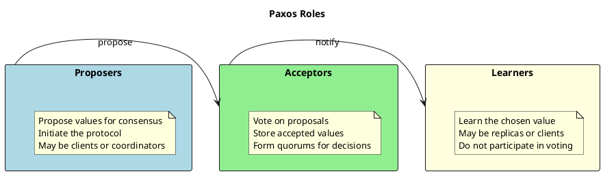
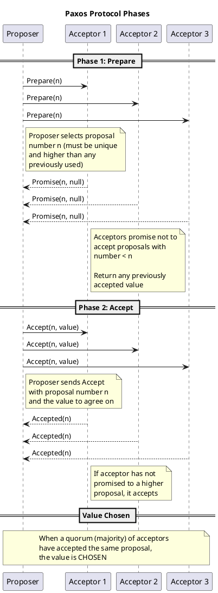
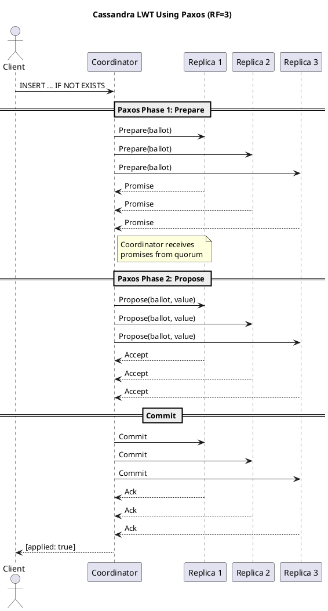

# Consensus Algorithms and Paxos

This page explains consensus algorithms in distributed systems and how Cassandra uses the Paxos protocol to implement lightweight transactions (LWTs) for strong consistency guarantees.

---

## What are Consensus Algorithms?

In distributed systems, **consensus** is the process by which multiple nodes agree on a single value or decision, even when some nodes may fail or messages may be delayed. Consensus is fundamental to distributed computing because it enables coordination without a single point of failure.

### Why Consensus Matters

Distributed systems face inherent challenges:

- **Network partitions**: Nodes may become temporarily unreachable
- **Node failures**: Individual machines may crash or restart
- **Message delays**: Network latency causes unpredictable timing
- **Concurrent operations**: Multiple clients may attempt conflicting updates

Consensus algorithms solve these problems by providing guarantees that all participating nodes will eventually agree on the same value, even in the presence of failures.

### Where Consensus is Needed

| Use Case | Problem | Consensus Solution |
|----------|---------|-------------------|
| **Leader election** | Which node coordinates operations? | Elect a single leader all nodes agree on |
| **Distributed locks** | Prevent concurrent access to resources | Agree on which client holds the lock |
| **Replicated state machines** | Keep multiple copies in sync | Agree on the order of operations |
| **Atomic commits** | All-or-nothing transactions | Agree on commit/abort decision |
| **Configuration management** | Consistent view of cluster state | Agree on configuration changes |

---

## Common Consensus Algorithms

Several consensus algorithms have been developed to solve distributed agreement problems. Each makes different trade-offs between simplicity, performance, and fault tolerance.

### Raft

**Raft** was designed explicitly for understandability. Published in 2014 by Diego Ongaro and John Ousterhout, Raft provides the same guarantees as Paxos but with a clearer structure.

**Key characteristics:**

- **Leader-based**: One node is elected leader; all writes go through the leader
- **Log replication**: Leader appends entries to a replicated log
- **Strong leadership**: Leader handles all client interactions

**Used in:** etcd, Consul, CockroachDB, TiKV

**Trade-offs:**

| Advantage | Disadvantage |
|-----------|--------------|
| Easy to understand and implement | Leader bottleneck for writes |
| Well-documented | Leader election adds latency during failures |
| Extensive tooling | Not optimized for wide-area networks |

### Zab (ZooKeeper Atomic Broadcast)

**Zab** is the consensus protocol used by Apache ZooKeeper. It focuses on providing total ordering of all state updates.

**Key characteristics:**

- **Atomic broadcast**: All updates delivered in the same order to all nodes
- **Primary-backup model**: A primary processes requests; backups replicate
- **Recovery protocol**: Handles leader failures and ensures consistency

**Used in:** Apache ZooKeeper, Apache Kafka (for metadata coordination)

### Byzantine Fault Tolerance (BFT)

**Byzantine Fault Tolerant** algorithms handle not just crashed or slow nodes, but also nodes that behave maliciously or incorrectly (Byzantine failures).

**Key characteristics:**

- **Handles malicious nodes**: Tolerates nodes that lie, send conflicting messages, or collude
- **Higher overhead**: Requires more messages and nodes (typically 3f+1 nodes to tolerate f Byzantine failures)
- **Stronger guarantees**: Provides safety even under adversarial conditions

**Examples:** PBFT (Practical Byzantine Fault Tolerance), Tendermint

**Comparison with Crash Fault Tolerance (CFT):**

| Property | CFT (Paxos, Raft) | BFT |
|----------|-------------------|-----|
| Failure model | Nodes crash or are slow | Nodes may be malicious |
| Nodes required | 2f+1 for f failures | 3f+1 for f failures |
| Message complexity | Lower | Higher |
| Use cases | Trusted environments | Blockchain, untrusted environments |

### Algorithm Comparison

| Algorithm | Complexity | Latency | Fault Model | Best For |
|-----------|------------|---------|-------------|----------|
| **Paxos** | High | Variable | Crash | Theoretical foundation, proven correctness |
| **Raft** | Low | Moderate | Crash | New implementations, understandability |
| **Zab** | Moderate | Low | Crash | Total ordering, ZooKeeper workloads |
| **PBFT** | Very High | High | Byzantine | Untrusted environments |

---

## Introduction to Paxos

**Paxos** is one of the most influential consensus algorithms in distributed computing. It provides a foundation for building fault-tolerant distributed systems.

### Historical Context

Paxos was designed by Leslie Lamport in 1989 and first published in 1998. The algorithm is named after a fictional Greek island where Lamport imagined a parliament trying to pass laws despite legislators frequently leaving.

Lamport later wrote ["Paxos Made Simple"](https://lamport.azurewebsites.net/pubs/paxos-simple.pdf) (2001) to explain the algorithm more accessibly, noting that "the Paxos algorithm, when presented in plain English, is very simple."

### Why Paxos is Significant

Paxos was the first consensus algorithm proven correct for asynchronous networks with crash failures. It demonstrates that:

- Consensus is achievable without synchronized clocks
- Safety is guaranteed even with arbitrary message delays
- Progress is possible when a majority of nodes are operational

Many modern consensus implementations (including Raft) are derived from or inspired by Paxos.

### Core Concepts

Paxos defines three roles that participants can play:



**Proposers**: Entities that propose values for the nodes to agree on. In Cassandra, the coordinator node acts as the proposer.

**Acceptors**: Entities that vote on proposals. They may accept or reject proposals based on the protocol rules. In Cassandra, replica nodes are acceptors.

**Learners**: Entities that learn the final agreed-upon value. They do not participate in the voting process but are notified of the outcome.

**Quorum**: A majority of acceptors. For consensus to be reached, a quorum must agree. With N acceptors, a quorum requires (N/2) + 1 nodes. This ensures that any two quorums overlap, preventing conflicting decisions.

### The Paxos Protocol

Paxos operates in two main phases:



**Phase 1 (Prepare):**

1. Proposer selects a unique proposal number `n`
2. Proposer sends `Prepare(n)` to all acceptors
3. Each acceptor responds with a `Promise` if `n` is the highest proposal number seen
4. The promise includes any previously accepted value

**Phase 2 (Accept):**

1. If proposer receives promises from a quorum, it sends `Accept(n, value)`
2. The value is either the proposer's own value (if no prior acceptance) or the highest-numbered previously accepted value
3. Acceptors accept if they haven't promised to a higher proposal number
4. When a quorum accepts, the value is **chosen**

### Why Paxos for Cassandra

Cassandra chose Paxos for lightweight transactions because:

| Requirement | How Paxos Meets It |
|-------------|-------------------|
| Asynchronous networks | Paxos handles arbitrary message delays |
| No single point of failure | Any node can be a proposer; no leader required |
| Crash fault tolerance | Tolerates minority of node failures |
| Strong consistency | Provides linearizability for operations that need it |
| Integration with existing model | Works alongside Cassandra's eventual consistency |

---

## Paxos in Cassandra: Lightweight Transactions

Cassandra uses Paxos to implement **Lightweight Transactions (LWTs)**—operations that require strong consistency guarantees beyond what eventual consistency provides.

### The Problem LWTs Solve

Regular Cassandra operations use eventual consistency with last-write-wins conflict resolution. This works well for many use cases but fails when applications need:

- **Compare-and-set semantics**: Update only if current value matches expected
- **Unique constraints**: Ensure a value (like username) is unique across the cluster
- **Conditional inserts**: Insert only if the row doesn't exist
- **Atomic read-modify-write**: Read a value, compute new value, write atomically

Without consensus, concurrent operations can overwrite each other:

```
Client A: Read balance = 100
Client B: Read balance = 100
Client A: Write balance = 150 (add 50)
Client B: Write balance = 120 (add 20)
Result: balance = 120 (Client A's update lost!)
```

With LWTs:

```sql
-- Only succeeds if current balance is 100
UPDATE accounts SET balance = 150
WHERE id = 123
IF balance = 100;
```

### How Cassandra Uses Paxos

When a client executes an LWT, Cassandra runs the Paxos protocol across the replicas:



**LWT Execution Steps:**

1. **Client sends LWT** to any node (coordinator)
2. **Prepare phase**: Coordinator proposes a ballot number to all replicas
3. **Read phase**: If the LWT has a condition (IF clause), read current values
4. **Propose phase**: If condition is satisfied, propose the new value
5. **Commit phase**: If quorum accepts, commit the change
6. **Response**: Return success/failure and whether the condition was applied

### LWT Syntax Examples

```sql
-- Insert only if row doesn't exist
INSERT INTO users (id, username, email)
VALUES (uuid(), 'alice', 'alice@example.com')
IF NOT EXISTS;

-- Update only if condition matches
UPDATE accounts
SET balance = 150
WHERE account_id = 123
IF balance = 100;

-- Delete only if condition matches
DELETE FROM sessions
WHERE user_id = 456
IF last_active < '2024-01-01';
```

### Cost and Trade-offs

LWTs provide strong consistency but at a cost:

| Aspect | Regular Write | LWT Write |
|--------|---------------|-----------|
| Round trips | 1 | 4 (prepare, read, propose, commit) |
| Latency | Low (~1-5ms) | Higher (~10-30ms) |
| Throughput | High | Lower |
| Replicas involved | Configurable (CL) | All replicas (SERIAL) |
| Conflict handling | Last-write-wins | Retry or abort |

**When to use LWTs:**

- Unique constraints (usernames, email addresses)
- Financial transactions requiring atomicity
- Distributed locks and leases
- Any operation where lost updates are unacceptable

**When NOT to use LWTs:**

- High-throughput writes where eventual consistency is acceptable
- Time-series data where overwrites are rare
- Caching or analytics workloads
- Any operation that can tolerate last-write-wins

> **Guideline:** LWTs **SHOULD** be used selectively for operations that truly require strong consistency. Using LWTs for all writes negates many of Cassandra's performance advantages.

---

## Paxos v1 vs Paxos v2

Cassandra 4.1 introduced **Paxos v2**, an improved implementation of the Paxos protocol for LWTs.

### Paxos v1 (Original)

The original Paxos implementation in Cassandra (pre-4.1) followed the classic Paxos protocol:

- Four round-trips for each LWT operation
- Paxos state stored indefinitely without automatic cleanup
- Higher latency under contention
- Required manual Paxos repairs to clean up state

### Paxos v2 (Cassandra 4.1+)

Paxos v2 provides significant improvements:

| Improvement | Description |
|-------------|-------------|
| **Reduced round-trips** | Optimized protocol reduces network hops |
| **Better contention handling** | Improved behavior when multiple clients compete |
| **Automatic state purging** | Paxos state can be automatically cleaned up |
| **Lower latency** | Faster LWT operations in common cases |

### Enabling Paxos v2

Paxos v2 is configured in `cassandra.yaml`:

```yaml
# Select Paxos implementation
paxos_variant: v2

# Configure state purging (recommended with v2)
paxos_state_purging: repaired
```

For detailed configuration options, see [Paxos-Related cassandra.yaml Configuration](../../operations/repair/strategies.md#paxos-related-cassandrayaml-configuration) in the Repair Strategies guide.

### Upgrade Considerations

- Clusters with heavy LWT usage **SHOULD** consider upgrading to Paxos v2
- Clusters with no LWTs: upgrade is not critical
- Changes to `paxos_variant` **SHOULD** be done during a maintenance window
- All nodes **MUST** be configured consistently

---

## Key Terminology

| Term | Definition |
|------|------------|
| **Chosen value** | A value that a quorum of acceptors has accepted; the consensus decision |
| **Linearizability** | Strong consistency model where operations appear to execute atomically in some total order |
| **Quorum** | Majority of replicas; with RF=3, quorum is 2 |
| **Ballot** | Unique proposal number in Paxos; combines timestamp and node ID |
| **Paxos state** | Entries in `system.paxos` table tracking proposals and accepted values |
| **Paxos repair** | Process of reconciling Paxos state across replicas |
| **LWT** | Lightweight Transaction; Cassandra's conditional atomic operations using Paxos |
| **SERIAL consistency** | Consistency level that uses Paxos for linearizable operations |

---

## Limitations

Paxos and LWTs have important limitations operators **MUST** understand:

### Performance Limitations

- **Latency**: LWTs add significant latency compared to regular writes
- **Throughput**: LWT throughput is lower due to multi-phase protocol
- **Contention**: High contention on the same partition causes transaction aborts and retries

### Fault Model Limitations

- **Crash failures only**: Paxos assumes nodes fail by crashing, not by behaving maliciously
- **No Byzantine tolerance**: Corrupted or malicious nodes can violate guarantees
- **Requires majority**: At least (RF/2)+1 replicas must be available

### Operational Considerations

- **Paxos state accumulates**: Without regular Paxos repairs, `system.paxos` grows unboundedly
- **Topology changes**: Paxos repairs **MUST** complete before topology changes (bootstrap, decommission)
- **Repair requirements**: Clusters using LWTs **MUST** run regular Paxos repairs

For operational guidance on Paxos repairs, see [Paxos Repairs](../../operations/repair/strategies.md#paxos-repairs) in the Repair Strategies guide.

---

## References and Further Reading

### Academic Papers

- **Leslie Lamport, ["Paxos Made Simple"](https://lamport.azurewebsites.net/pubs/paxos-simple.pdf)** (2001) - The accessible explanation of Paxos by its inventor
- **Leslie Lamport, "The Part-Time Parliament"** (1998) - The original Paxos paper
- **Diego Ongaro and John Ousterhout, "In Search of an Understandable Consensus Algorithm"** (2014) - The Raft paper

### Apache Cassandra Documentation

- [Lightweight Transactions](../../cql/dml/lightweight-transactions.md) - CQL syntax and usage
- [Paxos Repairs](../../operations/repair/strategies.md#paxos-repairs) - Operational maintenance
- [Consistency](consistency.md) - Consistency levels and guarantees

### Related Architecture Topics

- [Replication](replication.md) - How data is replicated across nodes
- [Consistency](consistency.md) - Tunable consistency in Cassandra
- [Replica Synchronization](replica-synchronization.md) - How replicas converge

---

## The Future: Accord and General-Purpose Transactions

While Paxos-based LWTs provide strong consistency for single-partition operations, the Cassandra community is developing **Accord**, a new consensus protocol that will enable general-purpose, multi-partition ACID transactions.

### Beyond Single-Partition LWTs

Current LWT limitations:

- Restricted to single-partition operations
- Cannot coordinate transactions across multiple partitions
- Leader-based consensus designs (like Raft/Spanner) are a poor fit for Cassandra's geo-distributed, leaderless architecture

### The Accord Protocol

**Accord** is a leaderless, timestamp-based, dependency-tracking consensus protocol designed specifically for Cassandra's scale and topology goals. It aims to provide:

| Feature | Description |
|---------|-------------|
| **Strict serializability** | Full ACID transaction guarantees |
| **Multi-partition transactions** | Coordinate writes across multiple partitions |
| **Optimal latency** | One WAN round-trip in the common case |
| **Leaderless design** | No single global leader bottleneck |
| **Geo-distribution friendly** | Designed for multi-region deployments |

Accord combines the best properties of recent consensus research (Caesar, Tempo, Egalitarian Paxos) while maintaining Cassandra's distributed, peer-to-peer character.

### CEP-15: General-Purpose Transactions

The Accord protocol is being implemented as part of [CEP-15: General Purpose Transactions](https://cwiki.apache.org/confluence/display/CASSANDRA/CEP-15). When complete, this will make Cassandra one of the first petabyte-scale, multi-region databases offering global, strictly serializable, general-purpose transactions on commodity hardware.

### Learn More

For a deep technical dive into the evolution from Paxos-based LWTs to Accord, watch Benedict Elliott Smith's ApacheCon@Home 2021 talk:

- **[Consensus in Apache Cassandra](https://www.youtube.com/watch?v=YAE7E-QEAvk)** - Covers the past, present, and future of transactions in Cassandra, including:
  - How current Paxos-based LWTs work and their optimizations in Paxos v2
  - Survey of consensus designs (leader-based vs leaderless) and their trade-offs
  - Introduction to the Accord protocol and its design goals

---

## Summary

Consensus algorithms enable distributed systems to agree on values despite failures. Paxos, while complex, provides proven correctness guarantees that Cassandra leverages for lightweight transactions.

**Key takeaways:**

- Consensus algorithms solve the fundamental problem of distributed agreement
- Paxos provides strong consistency guarantees for asynchronous networks
- Cassandra uses Paxos selectively for LWTs, not for all operations
- LWTs trade performance for consistency—use them judiciously
- Paxos v2 (Cassandra 4.1+) improves performance and operational characteristics
- Regular Paxos repairs are essential for clusters using LWTs
