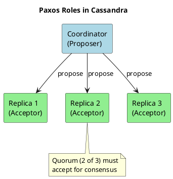
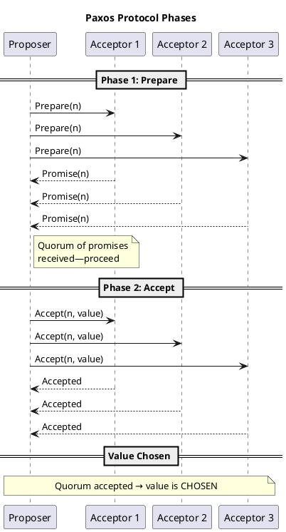
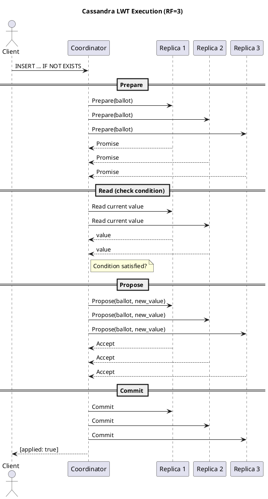

# Consensus Algorithms and Paxos

Cassandra's default consistency model—eventual consistency with last-write-wins—handles most workloads efficiently. But some operations demand stronger guarantees: inserting a user only if the username doesn't exist, updating a balance only if it hasn't changed, acquiring a distributed lock. These operations require **consensus**—agreement among replicas before committing a change.

Cassandra implements consensus through **Paxos**, a proven algorithm that provides linearizable consistency for lightweight transactions (LWTs) without sacrificing Cassandra's masterless architecture.

---

## Why Consensus Matters

In distributed systems, **consensus** is the process by which multiple nodes agree on a single value, even when some nodes fail or messages are delayed.

### The Problem

Without consensus, concurrent operations can silently corrupt data:

```
Client A: Read balance = 100
Client B: Read balance = 100
Client A: Write balance = 150 (add 50)
Client B: Write balance = 120 (add 20)
Result: balance = 120 (Client A's update lost!)
```

Both clients read the same value, computed independently, and wrote back. Last-write-wins meant Client A's update vanished without error.

### The Solution

Consensus algorithms guarantee that all nodes agree on the outcome before any change is committed:

```sql
-- Only succeeds if current balance is 100
UPDATE accounts SET balance = 150
WHERE id = 123
IF balance = 100;
```

If another client modified the balance first, this statement returns `[applied]=false` instead of silently overwriting.

### Where Consensus is Needed

| Use Case | Problem | Consensus Solution |
|----------|---------|-------------------|
| **Unique constraints** | Prevent duplicate usernames | Agree the username doesn't exist before inserting |
| **Distributed locks** | Prevent concurrent access | Agree on which client holds the lock |
| **Atomic updates** | Read-modify-write without lost updates | Agree on the current value before updating |
| **Conditional inserts** | Insert only if row doesn't exist | Agree the row is absent before inserting |

---

## Consensus Algorithm Landscape

Several algorithms solve distributed consensus. Understanding the alternatives helps explain why Cassandra chose Paxos.

### Raft

**Raft** was designed for understandability. Published in 2014, it provides the same guarantees as Paxos with a clearer structure.

- **Leader-based**: One elected leader handles all writes
- **Used in**: etcd, Consul, CockroachDB, TiKV

| Advantage | Disadvantage |
|-----------|--------------|
| Easy to understand and implement | Leader is a bottleneck and single point of coordination |
| Well-documented with extensive tooling | Leader election adds latency during failures |
| Predictable performance | Poor fit for geo-distributed deployments |

!!! note "Why Not Raft for Cassandra?"
    Raft's leader-based design conflicts with Cassandra's masterless architecture. A global leader would become a bottleneck and introduce cross-datacenter latency for every write.

### Zab (ZooKeeper Atomic Broadcast)

**Zab** powers Apache ZooKeeper, focusing on total ordering of state updates.

- **Primary-backup model**: A primary processes requests; backups replicate
- **Used in**: Apache ZooKeeper; Apache Kafka used it for metadata coordination in older versions (Kafka 3.0+ uses KRaft, a Raft-based protocol, instead)

### Byzantine Fault Tolerance (BFT)

**BFT** algorithms handle not just crashed nodes, but nodes that behave maliciously.

| Property | CFT (Paxos, Raft) | BFT |
|----------|-------------------|-----|
| Failure model | Nodes crash or are slow | Nodes may be malicious |
| Nodes required | 2f+1 for f failures | 3f+1 for f failures |
| Message complexity | Lower | Higher |
| Use cases | Trusted environments | Blockchain, untrusted environments |

Cassandra assumes a trusted environment where nodes fail by crashing, not by lying—making CFT algorithms like Paxos appropriate.

### Algorithm Comparison

| Algorithm | Complexity | Leader Required | Best For |
|-----------|------------|-----------------|----------|
| **Paxos** | High | No | Leaderless systems, proven correctness |
| **Raft** | Low | Yes | New implementations, understandability |
| **Zab** | Moderate | Yes | Total ordering, ZooKeeper workloads |
| **PBFT** | Very High | No | Untrusted environments |

---

## Paxos: The Algorithm

**Paxos** is one of the most influential consensus algorithms in distributed computing. Designed by Leslie Lamport in 1989 and published in 1998, it was the first algorithm proven correct for asynchronous networks with crash failures.

!!! tip "Further Reading"
    Lamport's ["Paxos Made Simple"](https://lamport.azurewebsites.net/pubs/paxos-simple.pdf) (2001) explains the algorithm accessibly. As Lamport noted, "the Paxos algorithm, when presented in plain English, is very simple."

### Why Paxos for Cassandra

| Requirement | How Paxos Meets It |
|-------------|-------------------|
| Masterless architecture | Any node can be a proposer—no leader required |
| Asynchronous networks | Handles arbitrary message delays |
| Crash fault tolerance | Tolerates minority of node failures |
| Selective strong consistency | Works alongside eventual consistency for other operations |

### Core Concepts

Paxos defines three roles:

**Proposers**: Propose values for nodes to agree on. In Cassandra, the coordinator acts as proposer.

**Acceptors**: Vote on proposals. In Cassandra, replica nodes are acceptors.

**Learners**: Learn the final agreed-upon value after consensus is reached.

**Quorum**: A majority of acceptors—(N/2) + 1 nodes. Any two quorums overlap, preventing conflicting decisions.



### The Protocol

Paxos operates in two phases:

**Phase 1 (Prepare):**

1. Proposer selects a unique proposal number `n`
2. Proposer sends `Prepare(n)` to all acceptors
3. Each acceptor responds with `Promise` if `n` is higher than any previous proposal
4. The promise includes any previously accepted value

**Phase 2 (Accept):**

1. If proposer receives promises from a quorum, it sends `Accept(n, value)`
2. Acceptors accept if they haven't promised to a higher proposal
3. When a quorum accepts, the value is **chosen**



---

## Paxos in Cassandra: Lightweight Transactions

Cassandra uses Paxos to implement **Lightweight Transactions (LWTs)**—conditional operations that require consensus before committing.

### How LWTs Work

When a client executes an LWT, Cassandra runs Paxos across all replicas:



### LWT Syntax

```sql
-- Insert only if row doesn't exist
INSERT INTO users (id, username, email)
VALUES (uuid(), 'alice', 'alice@example.com')
IF NOT EXISTS;

-- Update only if condition matches
UPDATE accounts
SET balance = 150
WHERE account_id = 123
IF balance = 100;

-- Delete only if condition matches
DELETE FROM sessions
WHERE user_id = 456
IF last_active < '2024-01-01';
```

### Performance Cost

LWTs trade throughput for consistency:

| Aspect | Regular Write | LWT Write |
|--------|---------------|-----------|
| Round trips | 1 | 4 (prepare, read, propose, commit) |
| Latency | ~1-5ms | ~10-30ms |
| Throughput | High | Lower |
| Replicas involved | Configurable (CL) | All replicas (SERIAL) |

!!! warning "Use LWTs Selectively"
    LWTs are 4-10x slower than regular writes. Use them only when you genuinely need compare-and-set semantics. Using LWTs for all writes negates Cassandra's performance advantages.

### When to Use LWTs

**Good use cases:**

- Unique constraints (usernames, email addresses)
- Financial transactions requiring atomicity
- Distributed locks and leases
- Any operation where lost updates are unacceptable

**Avoid LWTs for:**

- High-throughput writes where eventual consistency is acceptable
- Time-series data (overwrites are rare)
- Caching or analytics workloads
- Operations that can tolerate last-write-wins

---

## Paxos v1 vs Paxos v2

Cassandra 4.1 introduced **Paxos v2**, an improved implementation with significant performance benefits.

### Improvements in Paxos v2

| Improvement | Description |
|-------------|-------------|
| **Reduced round-trips** | Optimized protocol reduces WAN round trips from four to two for writes |
| **Better contention handling** | Improved behavior when multiple clients compete for the same partition |
| **Automatic state purging** | Paxos state cleaned up automatically instead of accumulating indefinitely |
| **Lower latency** | Faster LWT operations in common cases |

### Configuration

```yaml
# cassandra.yaml

# Select Paxos implementation
paxos_variant: v2

# Configure state purging (recommended with v2)
paxos_state_purging: repaired
```

For detailed configuration options, see [Paxos-Related cassandra.yaml Configuration](../../operations/repair/strategies.md#paxos-related-cassandrayaml-configuration).

### Upgrade Considerations

- Clusters with heavy LWT usage **SHOULD** upgrade to Paxos v2
- Clusters with no LWTs: upgrade is not critical
- Changes to `paxos_variant` **SHOULD** be done during a maintenance window
- All nodes **MUST** be configured consistently

---

## Terminology Reference

| Term | Definition |
|------|------------|
| **Chosen value** | A value that a quorum of acceptors has accepted—the consensus decision |
| **Linearizability** | Strong consistency where operations appear to execute atomically in total order |
| **Quorum** | Majority of replicas; with RF=3, quorum is 2 |
| **Ballot** | Unique proposal number combining timestamp and node ID |
| **Paxos state** | Entries in `system.paxos` table tracking proposals and accepted values |
| **Paxos repair** | Process of reconciling Paxos state across replicas |
| **LWT** | Lightweight Transaction—Cassandra's conditional atomic operations using Paxos |
| **SERIAL** | Consistency level that uses Paxos for linearizable operations |

---

## Limitations

!!! warning "Understand Before Using"
    Paxos and LWTs have important limitations that operators **MUST** understand.

### Performance Limitations

- **Latency**: LWTs add significant latency compared to regular writes
- **Throughput**: Lower due to multi-phase protocol
- **Contention**: High contention on the same partition causes aborts and retries

### Fault Model

- **Crash failures only**: Paxos assumes nodes fail by crashing, not by behaving maliciously
- **No Byzantine tolerance**: Corrupted or malicious nodes can violate guarantees
- **Requires majority**: At least (RF/2)+1 replicas must be available

### Operational Requirements

- **Paxos state accumulates**: Without regular Paxos repairs, `system.paxos` grows unboundedly
- **Topology changes**: Paxos repairs **MUST** complete before topology changes (bootstrap, decommission)
- **Repair requirements**: Clusters using LWTs **MUST** run regular Paxos repairs

For operational guidance, see [Paxos Repairs](../../operations/repair/strategies.md#paxos-repairs).

---

## The Future: Accord

While Paxos-based LWTs provide strong consistency for single-partition operations, the Cassandra community is developing **Accord**—a new consensus protocol enabling general-purpose, multi-partition ACID transactions.

### Current LWT Limitations

- Restricted to single-partition operations
- Cannot coordinate transactions across multiple partitions
- Leader-based designs (Raft/Spanner) are a poor fit for Cassandra's geo-distributed architecture

### The Accord Protocol

**Accord** is a leaderless, timestamp-based, dependency-tracking protocol designed for Cassandra's scale:

| Feature | Description |
|---------|-------------|
| **Strict serializability** | Full ACID transaction guarantees |
| **Multi-partition transactions** | Coordinate writes across partitions |
| **Optimal latency** | One WAN round-trip in the common case |
| **Leaderless design** | No single global leader bottleneck |
| **Geo-distribution friendly** | Designed for multi-region deployments |

Accord combines the best properties of recent consensus research (Caesar, Tempo, Egalitarian Paxos) while maintaining Cassandra's peer-to-peer character.

### CEP-15

The Accord protocol is being implemented as part of [CEP-15: General Purpose Transactions](https://cwiki.apache.org/confluence/display/CASSANDRA/CEP-15). When complete, Cassandra will be one of the first petabyte-scale, multi-region databases offering global, strictly serializable transactions on commodity hardware.

### Learn More

For a deep technical dive, watch Benedict Elliott Smith's ApacheCon@Home 2021 talk:

**[Consensus in Apache Cassandra](https://www.youtube.com/watch?v=YAE7E-QEAvk)** covers:

- How Paxos-based LWTs work and optimizations in Paxos v2
- Survey of consensus designs (leader-based vs leaderless) and their trade-offs
- Introduction to the Accord protocol and its design goals

---

## References

### Academic Papers

- **Leslie Lamport, ["Paxos Made Simple"](https://lamport.azurewebsites.net/pubs/paxos-simple.pdf)** (2001) — Accessible explanation by the inventor
- **Leslie Lamport, "The Part-Time Parliament"** (1998) — The original Paxos paper
- **Diego Ongaro and John Ousterhout, "In Search of an Understandable Consensus Algorithm"** (2014) — The Raft paper

### Related Documentation

- [Lightweight Transactions](../../cql/dml/lightweight-transactions.md) — CQL syntax and usage
- [Paxos Repairs](../../operations/repair/strategies.md#paxos-repairs) — Operational maintenance
- [Consistency](consistency.md) — Consistency levels and guarantees
- [Replication](replication.md) — How data is replicated across nodes
