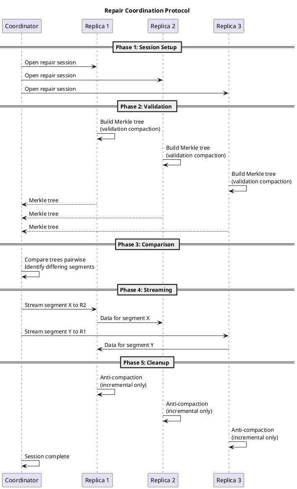
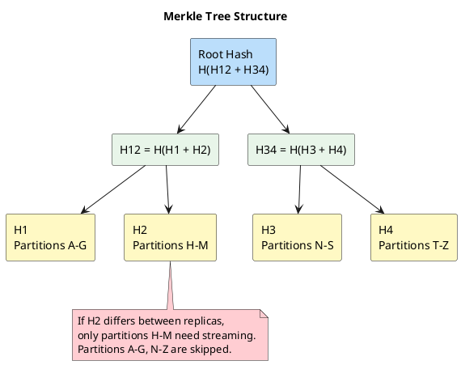
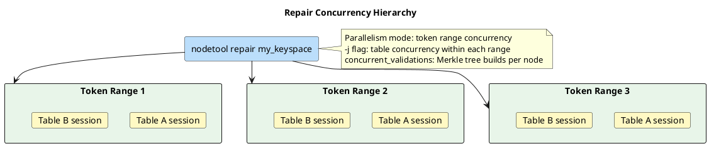

# What is Repair

Repair is the process by which Apache Cassandra detects and resolves data inconsistencies between replicas. In a distributed system where writes can arrive at different replicas at different times — or not at all, due to network partitions or node failures — replicas can diverge. Repair systematically compares data across replicas and streams any differences to restore convergence.

Repair is also known as **anti-entropy repair** in distributed systems literature. The term "anti-entropy" originates from information theory: entropy measures disorder, and these processes reduce disorder by ensuring all replicas eventually hold identical data.

For operational procedures on running and scheduling repair, see the [Repair Operations Guide](../../operations/repair/index.md).

---

## Why Repair Is Necessary

Cassandra provides two opportunistic synchronization mechanisms — [hinted handoff and read reconciliation](replica-synchronization.md) — that handle common cases of replica divergence. However, these mechanisms are insufficient in several scenarios:

| Scenario | Why Opportunistic Mechanisms Fail |
|----------|----------------------------------|
| Node down longer than hint window | Hints expire after `max_hint_window` (default 3 hours); writes during the remainder of the outage are never delivered to that replica |
| Data never read | Read reconciliation only affects data that is queried; cold data remains divergent indefinitely |
| Deleted data (tombstones) | Tombstones must propagate to all replicas before `gc_grace_seconds` expires, or deleted data can resurrect |
| Schema changes during outage | Hints do not handle DDL changes |
| Coordinator failure after hint storage | If the coordinator storing a hint fails permanently before delivery, the hint is lost |

Repair addresses all of these by performing a systematic comparison of data across replicas, independent of read or write activity.

---

## Repair Coordination Protocol

Repair is a coordinated, multi-phase process involving a coordinator node and all replica nodes that own the token ranges being repaired.

### Phase 1: Session Setup

The coordinator node (where `nodetool repair` is executed) initiates a repair session:

1. Determines which token ranges to repair based on the keyspace's replication strategy and the coordinator's token ownership
2. Identifies all replica nodes for those token ranges
3. Opens a repair session with each participating replica
4. Assigns a unique session ID for tracking

### Phase 2: Validation (Merkle Tree Construction)

Each participating replica independently builds a **Merkle tree** for the requested token ranges:

1. A **validation compaction** reads all relevant SSTables for the token range
2. Data is hashed at the leaf level — each leaf corresponds to a partition or range of partitions
3. Parent hashes are computed by combining child hashes up to the root
4. The completed Merkle tree is sent to the coordinator

Validation compaction appears in `nodetool compactionstats` as a "Validation" type compaction.

### Phase 3: Comparison

The coordinator receives Merkle trees from all replicas and compares them pairwise:

1. Root hashes are compared first — if they match, the replicas are consistent for that range and no further work is needed
2. On mismatch, the coordinator recursively descends into child nodes to identify exactly which segments differ
3. This tree-walking process requires O(log n) comparisons to identify differing segments, rather than comparing every record

### Phase 4: Streaming

For each pair of replicas with identified differences:

1. The coordinator instructs the replica with newer data to stream the differing segments to the replica with stale data
2. Streaming uses Cassandra's built-in streaming protocol
3. The receiving replica incorporates the streamed data

### Phase 5: Cleanup

After streaming completes:

1. In incremental repair, an **anti-compaction** step separates repaired and unrepaired data (see [Anti-Compaction](#anti-compaction))
2. The repair session is marked as complete
3. Session status is recorded in `system_distributed.repair_history` (Cassandra 4.0+)



---

## The Merkle Tree

Merkle trees, introduced by Ralph Merkle ([Merkle, R., 1987, "A Digital Signature Based on a Conventional Encryption Function"](https://link.springer.com/chapter/10.1007/3-540-48184-2_32)), enable efficient comparison of large datasets by hierarchically hashing data segments.

### Structure

A Merkle tree is a binary tree where:

- **Leaf nodes** contain hashes of individual data segments (partitions or partition ranges)
- **Internal nodes** contain hashes computed from their children
- **The root hash** represents the entire dataset



### Efficiency

When two replicas have identical data, only the root hashes are compared — a single comparison confirms consistency. When differences exist, the tree structure narrows the search:

| Dataset size | Full comparison | Merkle tree comparison |
|-------------|-----------------|----------------------|
| 1 million partitions | 1,000,000 comparisons | ~20 comparisons (log₂) |
| 1 billion partitions | 1,000,000,000 comparisons | ~30 comparisons (log₂) |

### Tree Depth and Memory

The Merkle tree depth determines both precision and memory consumption:

| Parameter | Description |
|-----------|-------------|
| `cassandra.repair_session_max_tree_depth` | Maximum tree depth (JVM property) |

Deeper trees provide finer-grained difference detection (streaming smaller segments), but consume more memory. Shallower trees use less memory but may stream more data than strictly necessary when differences are found.

In Cassandra 4.0+, the default tree depth is dynamically calculated based on the data size of the token range being repaired, with a configurable maximum.

---

## Full Repair vs Incremental Repair

### Full Repair

Full repair compares **all data** on each replica for the requested token ranges, regardless of whether it has been previously repaired.

- Builds Merkle trees over the entire dataset
- Streams all differing data
- Does not modify SSTable metadata
- Required after topology changes, node replacements, or when incremental repair state is inconsistent

### Incremental Repair

Incremental repair, introduced in Cassandra 2.1 and significantly improved in Cassandra 4.0, compares only data that has been written **since the last successful repair**.

#### How It Works

Cassandra tracks whether each SSTable has been repaired:

1. **Unrepaired SSTables** contain data that has not yet been validated across replicas
2. When incremental repair runs, only unrepaired SSTables participate in Merkle tree construction
3. After successful repair, participating SSTables are marked as **repaired** via anti-compaction
4. Subsequent incremental repairs skip already-repaired SSTables

This approach reduces repair overhead because only new data needs validation.

#### Repaired vs Unrepaired SSTables

| State | Meaning | Participates in Incremental Repair |
|-------|---------|-----------------------------------|
| Unrepaired | Data not yet validated across replicas | Yes |
| Repaired | Data confirmed consistent across replicas | No |
| Pending | Data currently being repaired (4.0+) | No |

The `pending` state was introduced in Cassandra 4.0 to address a race condition in earlier versions where data written during repair could be incorrectly marked as repaired.

```bash
# Check percent repaired for a table
nodetool tablestats my_keyspace.my_table | grep "Percent repaired"
```

#### Incremental Repair Improvements in 4.0

Prior to Cassandra 4.0, incremental repair had several known issues:

- **Race condition**: Data written during repair could be incorrectly marked as repaired without validation
- **Anti-compaction overhead**: Every repair triggered anti-compaction on all SSTables
- **Inconsistent state**: Failed repairs could leave SSTables in an inconsistent repaired/unrepaired state

Cassandra 4.0 addressed these with:

- **Pending state**: SSTables are marked as "pending" during repair and only promoted to "repaired" after successful completion
- **Transient replication awareness**: Repair correctly handles transient replicas (if configured)
- **Preview repair**: Allows checking for inconsistencies without actually repairing

In Cassandra 4.0+, incremental repair is the **default mode**. Full repair requires the explicit `-full` flag.

---

## Anti-Compaction

Anti-compaction is a process that runs after incremental repair to separate repaired data from unrepaired data within the same SSTable.

### Why Anti-Compaction Is Needed

An SSTable may contain a mix of:

- Data that was included in the repair session (now confirmed consistent)
- Data that was written after the repair session started (not yet validated)

Anti-compaction splits these SSTables so that repaired and unrepaired data reside in separate SSTables. This allows future incremental repairs to skip the repaired SSTables entirely.

### Process

1. For each SSTable that participated in repair, determine which token ranges were repaired
2. Split the SSTable: data in repaired ranges goes to a new SSTable marked as repaired; data outside repaired ranges goes to a new SSTable marked as unrepaired
3. Remove the original SSTable

Anti-compaction appears in `nodetool compactionstats` as an "AntiCompaction" type.

### Performance Implications

Anti-compaction adds I/O overhead after every incremental repair:

- Each participating SSTable must be read and rewritten
- Temporary disk space is needed for the split SSTables
- This overhead is proportional to the amount of unrepaired data

---

## Primary Range Repair

By default, `nodetool repair` repairs all token ranges that a node holds replicas for — including ranges where the node is a secondary or tertiary replica. This means the same token range may be repaired multiple times if repair is run on every node in the cluster.

**Primary range repair** (`-pr` flag) restricts repair to only the token ranges for which the node is the **primary** (first) replica. When `-pr` is used on every node in the cluster, each token range is repaired exactly once.

| Mode | Token ranges repaired | Redundancy |
|------|----------------------|------------|
| Default (no `-pr`) | All ranges the node holds replicas for | Significant — same range repaired from multiple nodes |
| Primary range (`-pr`) | Only ranges where node is primary replica | None — each range repaired exactly once |

!!! tip "Recommendation"
    For routine maintenance, use `-pr` on every node. This achieves full coverage with minimal redundant work.

---

## The gc_grace_seconds Constraint

Tombstones (deletion markers) have a finite lifespan defined by `gc_grace_seconds`. This creates a critical constraint on repair frequency.

### The Data Resurrection Problem

```
gc_grace_seconds defines tombstone retention period.
Default: 864000 (10 days)

Note: In Cassandra 4.1+, this can also be specified as a duration
      (e.g., '10d').

CRITICAL CONSTRAINT:
Repair must complete on every node within gc_grace_seconds.

Failure scenario:

Day 0: Application deletes row on N1, N2 (tombstone created)
       N3 is unavailable, does not receive tombstone

Day 11: Tombstones expire on N1, N2 (gc_grace = 10 days)
        Compaction purges tombstones

Day 12: N3 returns to service
        N3 retains the "deleted" row (no tombstone received)
        Read reconciliation propagates N3's data to N1, N2
        DELETED DATA REAPPEARS

Prevention: Complete repair cycle within gc_grace_seconds
```

!!! danger "Data Resurrection"
    Failure to complete repair within `gc_grace_seconds` can cause deleted data to reappear. This is one of the most common and serious operational issues in Cassandra deployments.

### Why gc_grace_seconds Exists

The `gc_grace_seconds` parameter balances two competing concerns:

1. **Tombstone propagation**: Tombstones must remain on disk long enough for repair to propagate them to all replicas
2. **Disk space reclamation**: Tombstones consume disk space and degrade read performance; they should be purged once they are no longer needed

Setting `gc_grace_seconds` too low risks data resurrection. Setting it too high wastes disk space and increases read latency due to accumulated tombstones.

---

## Repair Concurrency

Repair involves multiple levels of concurrency. Understanding these levels is essential for predicting cluster impact and tuning repair performance.

### Repair Sessions, Commands, and Jobs

Repair work is organized in a hierarchy:

| Concept | Scope | Description |
|---------|-------|-------------|
| **Repair command** | One `nodetool repair` invocation | Coordinates repair for all token ranges and tables in scope |
| **Repair session** | One token range, one table | A session validates and synchronizes a single table across replicas for a specific token range |
| **Repair job** | One column family within a session | The unit of Merkle tree validation and streaming |

A single `nodetool repair` command may create many repair sessions — one per (token range, table) combination. For example, repairing a keyspace with 5 tables on a node with 256 vnodes could create up to 1,280 sessions.

### Parallelism Modes

The parallelism mode controls how **repair sessions for different token ranges** execute relative to each other. This is distinct from the number of concurrent sessions or jobs.

#### Sequential (`-seq`)

```
Token Range 1: [Validate] [Compare] [Stream] ────────────────────>
Token Range 2:                                 [Validate] [Compare] [Stream] ──>
Token Range 3:                                                                   [Validate]...
```

Each token range is repaired one at a time. Within a range, all replicas participate, but only one range is active at a time across the repair coordinator.

- Only one set of replicas is performing validation compaction at any given time
- Lowest cluster-wide I/O impact
- Longest total duration
- Suitable for clusters with limited I/O headroom or shared storage

#### Datacenter-Parallel (`-dcpar`)

Token ranges are repaired sequentially within each datacenter, but different datacenters can proceed in parallel.

- Replicas in different datacenters validate and stream concurrently
- Replicas in the same datacenter process ranges sequentially
- Good for multi-datacenter deployments where cross-DC bandwidth is the bottleneck

#### Parallel (default in 4.0+)

```
Token Range 1: [Validate] [Compare] [Stream] ──>
Token Range 2: [Validate] [Compare] [Stream] ──>
Token Range 3: [Validate] [Compare] [Stream] ──>
               ↑ All ranges processed concurrently
```

Multiple token ranges are repaired simultaneously. All replica pairs can validate and stream concurrently.

- Highest throughput — repairs complete fastest
- Highest cluster impact — multiple validation compactions and streams run at once
- Default mode in Cassandra 4.0+

### Concurrent Validation Sessions

Within a single parallelism mode, the number of validation compactions that can run concurrently on each node is controlled by:

```yaml
# cassandra.yaml (4.0+)
concurrent_validations: -1  # Default: -1 (auto: uses concurrent_compactors value)
```

| Value | Behavior |
|-------|----------|
| `-1` (default) | Uses the value of `concurrent_compactors` |
| `0` | Unlimited — all requested validations run immediately |
| `> 0` | Explicit limit on concurrent validation compactions |

Validation compaction is CPU and I/O intensive (it reads all data in the token range and builds a Merkle tree). Limiting concurrent validations prevents repair from consuming all compaction capacity and starving normal compaction.

### Table Concurrency (`-j`)

By default, repair processes tables within a keyspace one at a time. The `-j` flag controls how many tables are repaired concurrently:

```bash
# Repair 4 tables concurrently
nodetool repair -j 4 my_keyspace
```

| `-j` value | Behavior |
|------------|----------|
| `0` | All tables repaired concurrently |
| `1` (default) | Tables repaired sequentially |
| `n` | Up to `n` tables repaired concurrently |

Higher values reduce total repair time but increase resource consumption proportionally.

### Repair Command Pool

The `repair_command_pool_size` controls how many repair command threads are available on each node:

```
-Dcassandra.repair_command_pool_size=<n>
```

This limits the total number of active repair tasks (validation + streaming) a node can participate in simultaneously, regardless of how many remote coordinators are requesting repair.

### How Concurrency Levels Interact



In summary:

- **Parallelism mode** (`-seq`, `-dcpar`, parallel) controls concurrency across **token ranges**
- **`-j` flag** controls concurrency across **tables** within each token range
- **`concurrent_validations`** controls concurrency of **Merkle tree builds** on each node
- **`repair_command_pool_size`** controls the total **repair thread pool** on each node

---


## Version History

| Version | Change |
|---------|--------|
| Pre-2.0 | Full repair only; sequential execution |
| 2.1 | Incremental repair introduced |
| 2.2 | Subrange repair (`-st`, `-et`) added |
| 4.0 | Incremental repair becomes default; preview repair added; pending SSTable state introduced; transient replication support (CASSANDRA-9143) |
| 4.1 | `gc_grace_seconds` accepts duration format (e.g., `'10d'`) |

---

## Resource Impact

| Resource | Cause | Mitigation |
|----------|-------|------------|
| CPU | Merkle tree computation (hashing all data in range) | Schedule during low-traffic periods |
| Disk I/O | Validation compaction reads SSTables; anti-compaction rewrites them | Throttle with `-Dcassandra.repair_command_pool_size` |
| Network | Streaming divergent data between replicas | Throttle with `nodetool setstreamthroughput` |
| Memory | Merkle tree storage (proportional to tree depth) | Reduce with `-Dcassandra.repair_session_max_tree_depth` |
| Disk space | Anti-compaction temporarily requires space for split SSTables | Ensure adequate free space before repair |

---

## Best Practices

| Practice | Rationale |
|----------|-----------|
| Complete repair cycle within `gc_grace_seconds` | Prevents data resurrection |
| Use incremental repair for routine maintenance | Lower resource consumption than full repair |
| Use full repair after topology changes | Node additions, removals, or replacements may leave ranges inconsistent |
| Use `-pr` on every node for routine repair | Ensures each token range is repaired exactly once |
| Automate with AxonOps or Reaper | Eliminates human error and ensures schedule compliance |
| Monitor `percent repaired` metric | Detects tables where repair is falling behind |
| Monitor repair duration trends | Increasing duration indicates growing data volume or resource constraints |

---

## Related Documentation

- **[Replica Synchronization](replica-synchronization.md)** — Hinted handoff, read reconciliation, and how repair fits in the broader synchronization model
- **[Repair Operations Guide](../../operations/repair/index.md)** — Operational procedures for running and managing repair
- **[Consistency](consistency.md)** — How consistency levels interact with convergence
- **[Tombstones](../storage-engine/tombstones.md)** — Deletion markers and gc_grace_seconds
- **[nodetool repair](../../operations/nodetool/repair.md)** — Command reference
- **[nodetool repair_admin](../../operations/nodetool/repair_admin.md)** — Repair session management
