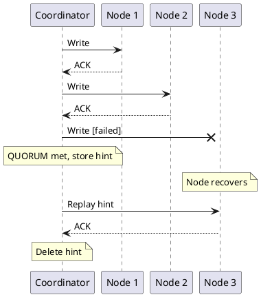

# Replica Synchronization

In distributed systems, replicas can diverge when they receive updates at different times—due to network partitions, node failures, or message ordering. Synchronization mechanisms detect these divergences and propagate missing information to restore convergence.

These mechanisms are sometimes called "anti-entropy" in distributed systems literature. The term originates from thermodynamics, where entropy measures disorder. In Cassandra's context, these processes reduce "disorder" by ensuring all replicas eventually hold identical data.

---

## Overview

Cassandra employs three mechanisms to maintain replica convergence:

| Mechanism | Function | Trigger | Scope |
|-----------|----------|---------|-------|
| Hinted handoff | Deferred write delivery | Write to unavailable replica | Single mutation |
| Read reconciliation | Divergence detection during reads | Query execution | Single partition |
| Merkle tree synchronization | Full dataset comparison | Scheduled maintenance | Token range |

These mechanisms operate at different timescales and granularities, collectively providing eventual consistency while preserving availability during partial failures.

---

## Hinted Handoff

Hinted handoff handles writes to temporarily unavailable replicas by storing the write locally and replaying it when the replica recovers.

### How It Works



### Configuration

```yaml
# cassandra.yaml

# Enable/disable hinted handoff
hinted_handoff_enabled: true

# How long to store hints (default 3 hours)
# Hints older than this are dropped
max_hint_window: 3h                    # 4.1+ (duration format)
# max_hint_window_in_ms: 10800000      # Pre-4.1

# Throttle hint delivery to avoid overwhelming recovering nodes
hinted_handoff_throttle: 1024KiB       # 4.1+ (data size format)
# hinted_handoff_throttle_in_kb: 1024  # Pre-4.1

# Maximum delivery threads
max_hints_delivery_threads: 2

# Hint storage directory
hints_directory: /var/lib/cassandra/hints
```

| Parameter | Pre-4.1 | 4.1+ |
|-----------|---------|------|
| Hint window | `max_hint_window_in_ms` (milliseconds) | `max_hint_window` (duration: `3h`, `30m`) |
| Delivery throttle | `hinted_handoff_throttle_in_kb` (KB/s) | `hinted_handoff_throttle` (data size: `1024KiB`) |

### Hint Window

The hint window setting (`max_hint_window` in 4.1+, `max_hint_window_in_ms` in earlier versions) is critical:

```
Node down for 2 hours:
- Hints accumulated for 2 hours
- Node recovers
- All hints replayed ✓

Node down for 5 hours (default window = 3 hours):
- Hints accumulated for first 3 hours
- After 3 hours, new writes stop generating hints
- Node recovers
- Only 3 hours of hints replayed
- 2 hours of writes are missing ✗

Solution: Run repair to recover missing data
```

### Hints and Consistency Level ANY

```
Consistency level ANY counts hints as acknowledgments:

All replicas down:
- Write cannot reach any replica
- Coordinator stores hint locally
- Returns SUCCESS to client

DANGER:
- Hints are durable on the coordinator (written to commitlog)
- If coordinator is PERMANENTLY lost before hint delivery → DATA LOST
- Hint is only on coordinator, not replicated

ANY should almost never be used for important data.
```

### Monitoring Hints

```bash
# Check hint accumulation
nodetool tpstats | grep Hint

# View hint files
ls -la /var/lib/cassandra/hints/

# Hinted handoff control commands
nodetool disablehandoff   # Disable hinted handoff
nodetool enablehandoff    # Enable hinted handoff
nodetool pausehandoff     # Pause hint delivery
nodetool resumehandoff    # Resume hint delivery
```

**JMX Metrics:**

```
org.apache.cassandra.metrics:type=Storage,name=TotalHints
org.apache.cassandra.metrics:type=HintsService,name=HintsSucceeded
org.apache.cassandra.metrics:type=HintsService,name=HintsFailed
org.apache.cassandra.metrics:type=HintsService,name=HintsTimedOut
```

### Hint Limitations

| Limitation | Implication |
|------------|-------------|
| Hints expire | Long outages require repair |
| Hints use disk | Large hint backlog consumes storage |
| Single copy | Coordinator failure loses hints |
| Not for schema | DDL changes do not use hints |

---

## Read Reconciliation

During read operations, the coordinator may receive different versions of the same data from multiple replicas. When this divergence is detected, the coordinator determines the authoritative version (based on timestamp) and propagates it to replicas holding stale data.

### How It Works

```
QUORUM read discovers inconsistency:

Client reads user_id=123 with QUORUM (2 of 3 replicas):

N1: user_id=123 → name='Alice', timestamp=1000
N2: user_id=123 → name='Alicia', timestamp=2000  ← Newer

Coordinator:
1. Compares timestamps
2. Returns 'Alicia' (newer) to client
3. Sends repair to N1: "update to 'Alicia' with ts=2000"

After repair:
N1: user_id=123 → name='Alicia', timestamp=2000  ← Fixed
N2: user_id=123 → name='Alicia', timestamp=2000
```

### Reconciliation Mode

In Cassandra 4.0+, read repair uses **background reconciliation**:

```
Result returned immediately, propagation occurs asynchronously.
- Lower read latency
- Stale replicas updated after response
```

### Configuration

Read repair is now always attempted when divergence is detected during a read that contacts multiple replicas. The legacy `read_repair_chance` and `dclocal_read_repair_chance` properties were removed in Cassandra 4.0.

```sql
-- Disable read repair entirely (only option in 4.0+)
ALTER TABLE my_table WITH read_repair = 'NONE';
```

!!! note "Removed Properties"
    The following properties were removed in Cassandra 4.0:

    - `read_repair_chance` - Was probability of read repair (0.0-1.0)
    - `dclocal_read_repair_chance` - Was probability for local DC
    - `read_repair = 'BLOCKING'` - Blocking mode removed; background is now default

### Limitations

| Limitation | Implication |
|------------|-------------|
| Query-driven | Only data that is read undergoes reconciliation |
| Single partition scope | Does not propagate across partition boundaries |
| Requires multiple replicas | CL=ONE reads contact only one replica (no comparison possible) |

---

## Anti-Entropy Repair

Anti-entropy repair (`nodetool repair`) is the definitive mechanism for achieving replica convergence across the entire dataset. Unlike hinted handoff and read reconciliation, which operate opportunistically, repair systematically compares and synchronizes all data within a token range using Merkle tree comparison.

For comprehensive coverage of the repair architecture — including the Merkle tree algorithm, repair modes (full, incremental, subrange, preview), the `gc_grace_seconds` constraint, scheduling, monitoring, and troubleshooting — see the dedicated **[Repair Architecture](repair.md)** page.

For operational procedures on running and managing repair, see the **[Repair Operations Guide](../../operations/repair/index.md)**.

---

## Troubleshooting

### Hints Accumulating

```bash
# Check hint backlog
ls -la /var/lib/cassandra/hints/

# If hints are not being delivered:
# 1. Check target node is reachable
nodetool status

# 2. Check hint delivery threads
nodetool tpstats | grep Hint

# 3. Force hint delivery (use with caution)
# Restart the node to trigger hint replay
```

---

## Best Practices

### Hinted Handoff

| Practice | Rationale |
|----------|-----------|
| Keep enabled | Handles transient failures automatically |
| Set appropriate window | Match to expected outage duration |
| Monitor hint accumulation | Large backlogs indicate availability problems |
| Do not rely solely on hints | Scheduled repair is still required |

### Read Reconciliation

| Practice | Rationale |
|----------|-----------|
| Use QUORUM for important reads | Enables divergence detection |
| Monitor reconciliation rate | High rate indicates systemic problems |
| Do not depend solely on reads | Cold data requires scheduled repair |

### Anti-Entropy Repair

| Practice | Rationale |
|----------|-----------|
| Complete within gc_grace_seconds | Prevents data resurrection |
| Use incremental mode for regular maintenance | Lower resource consumption |
| Use full mode after topology changes | Ensures complete convergence |
| Automate with AxonOps or Reaper | Eliminates human error |
| Monitor duration trends | Detects degradation early |

---

## Related Documentation

- **[Repair Architecture](repair.md)** - Merkle trees, repair modes, gc_grace_seconds, and scheduling
- **[Distributed Data Overview](index.md)** - How synchronization fits in the distributed architecture
- **[Consistency](consistency.md)** - How consistency levels interact with convergence
- **[Tombstones](../storage-engine/tombstones.md)** - Deletion markers and gc_grace_seconds
- **[Repair Operations](../../operations/repair/index.md)** - Operational procedures for repair