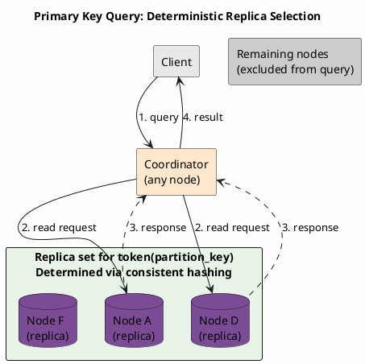
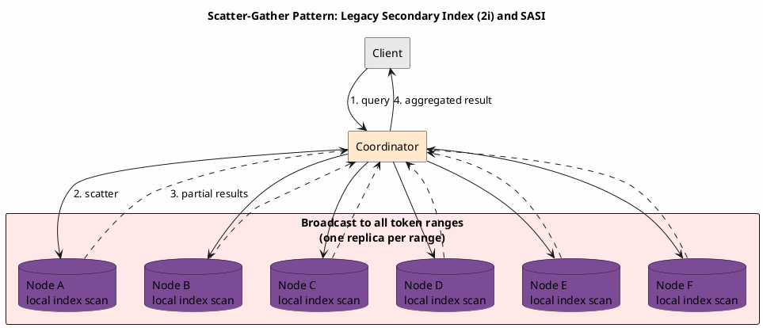
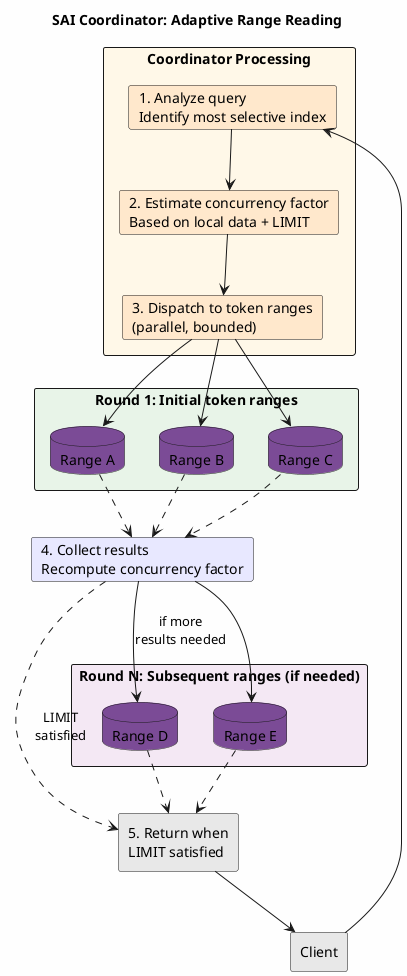
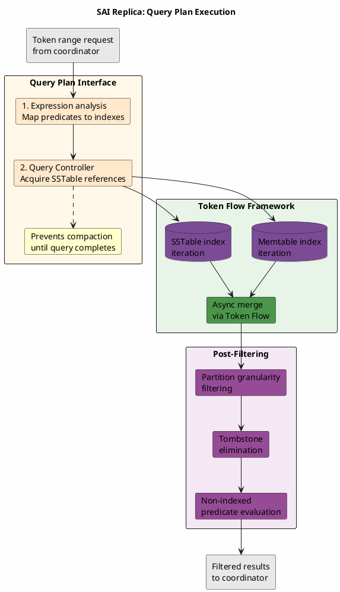
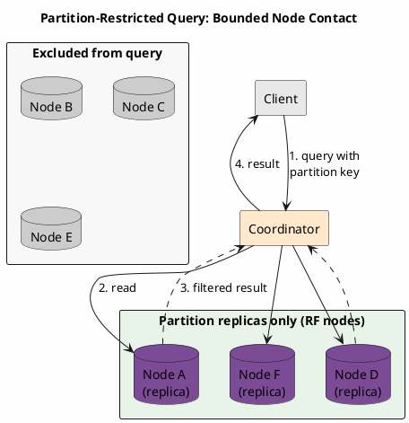

# Secondary Index Query Execution

Secondary index queries in Cassandra employ distinct execution strategies compared to primary key queries. The distributed coordination model varies significantly between index implementations, with Storage Attached Index (SAI) introducing adaptive query routing mechanisms that differ fundamentally from the scatter-gather pattern used by legacy secondary indexes.

---

## Query Execution Models

### Primary Key Query Execution

Queries containing the complete partition key enable deterministic replica identification through token computation:



**Execution characteristics:**

- Replica identification via `token(partition_key)` computation
- Query scope limited to replication factor (RF) nodes
- Node selection determined by consistency level requirements
- Latency bounded by replica response times

### Secondary Index Query Execution

Queries lacking partition key constraints cannot leverage token-based routing. Secondary indexes maintain local data structures—each node indexes exclusively the partitions it owns, necessitating distributed query coordination.

---

## Legacy Index Query Model: Scatter-Gather

Secondary Index (2i) and SASI implementations employ a scatter-gather execution pattern where the coordinator broadcasts queries to all relevant nodes and aggregates responses.



### Scatter Phase

1. Coordinator receives query containing indexed column predicate
2. Coordinator identifies target nodes:
   - **Global query**: One replica from each token range
   - **Partition-restricted query**: Replicas for specified partition only
3. Query dispatched to all identified nodes concurrently

### Gather Phase

1. Each replica node:
   - Executes local index lookup
   - Retrieves matching partition keys from index structure
   - Performs base table reads for matched keys
   - Serializes and returns results
2. Coordinator:
   - Collects responses from all contacted nodes
   - Merges and deduplicates result sets
   - Applies post-filtering for non-indexed predicates
   - Returns final result to client

### Latency Characteristics

Query latency in scatter-gather execution is dominated by the slowest responding node:

```
T_total = T_network + max(T_node_1, T_node_2, ..., T_node_n) + T_merge

Where T_node_i = T_index_lookup + T_base_read + T_serialization
```

This tail latency sensitivity presents challenges in heterogeneous clusters where node performance varies.

---

## SAI Query Model: Adaptive Range Reading

Storage Attached Index introduces a fundamentally different distributed query architecture. Rather than employing static scatter-gather, SAI implements adaptive coordinator-based range reading with dynamic concurrency adjustment.

### Coordinator-Level Query Planning

The SAI coordinator performs query analysis to optimize distributed execution:

1. **Index selectivity analysis**: Identifies the most selective index among available SAI indexes to narrow the filtering space
2. **Read command construction**: Embeds selected index metadata into the distributed range read command
3. **Concurrency factor estimation**: Calculates initial parallel replica query count using local data statistics and query limit parameters



### Multi-Round Execution

SAI executes queries iteratively rather than broadcasting to all nodes simultaneously:

1. **Round initialization**: Coordinator dispatches requests to a subset of token ranges based on computed concurrency factor
2. **Response collection**: Await responses from requested replicas
3. **Concurrency adjustment**: Recompute concurrency factor based on returned row count relative to query limit
4. **Iteration**: Repeat until query limit is satisfied or all ranges exhausted

This adaptive approach yields several advantages:

- Reduced network overhead for queries satisfied by early rounds
- Dynamic adjustment to cluster conditions
- Bounded coordinator memory consumption

### Index Status Propagation

SAI nodes propagate local index status to peers via the gossip protocol. This mechanism enables coordinators to:

- Filter replicas with non-queryable indexes from request routing
- Detect index build completion status
- Identify failed index states requiring rebuild

### Replica-Level Query Processing

Upon receiving a token range request, replicas execute local index queries through the Query Plan interface:



#### Query Plan Components

1. **Expression analysis**: Determines which available SAI column indexes satisfy query predicates
2. **Query Controller acquisition**: Obtains references to active SSTable indexes intersecting the requested token range
3. **Reference retention**: Maintains SSTable references until query completion, preventing compaction interference

#### Token Flow Framework

SAI employs the Token Flow framework for asynchronous iteration over partition matches across Memtable and SSTable indexes. The framework supports three core operations:

| Operation | Description |
|-----------|-------------|
| **Iteration** | Sequential disk access via chunk cache to row IDs for partition key lookups |
| **Token skipping** | Advances past unmatched tokens at paging boundaries or during token intersection |
| **Stream merging** | Combines results from multiple indexes using Boolean logic for multi-predicate queries |

#### Post-Filtering Pipeline

Following index-based partition key retrieval, SAI applies a filter tree for secondary filtering:

| Filter Stage | Purpose |
|--------------|---------|
| **Partition granularity** | Wide partitions require row-level filtering beyond partition key matches |
| **Tombstone elimination** | Removes rows deleted after indexing but before compaction |
| **Non-indexed predicates** | Evaluates query conditions lacking index support |

---

## Query Scope Classification

### Global Queries

Queries without partition key restriction require cluster-wide coordination:

```sql
-- Global query: all token ranges involved
SELECT * FROM users WHERE city = 'NYC';
SELECT * FROM events WHERE level = 'ERROR' LIMIT 1000;
```

| Index Type | Execution Model |
|------------|-----------------|
| 2i / SASI | Scatter to all nodes, gather all results |
| SAI | Adaptive range reading with concurrency factor |

### Partition-Restricted Queries

Queries including partition key constraints limit scope to replica nodes:

```sql
-- Partition-restricted: RF nodes only
SELECT * FROM users WHERE user_id = ? AND city = 'NYC';
SELECT * FROM events WHERE device_id = ? AND level = 'ERROR';
```



**Performance comparison:**

| Query Type | Nodes Contacted | Latency Characteristics | Cluster Scalability |
|------------|-----------------|-------------------------|---------------------|
| Global (2i/SASI) | All token ranges | Bounded by slowest node | Degrades linearly |
| Global (SAI) | Adaptive subset | Bounded by concurrency factor | Improved via adaptation |
| Partition-restricted | RF nodes | Predictable, bounded | Constant |

---

## Index Implementation Comparison

### Secondary Index (2i)

Legacy secondary indexes utilize hidden tables for index storage with independent lifecycle management:

| Characteristic | Implementation |
|----------------|----------------|
| **Storage structure** | Separate table per indexed column |
| **Replication** | Inherits base table replication strategy |
| **Compaction** | Independent from base table |
| **Query coordination** | Static scatter-gather |
| **Consistency** | Index and base table may diverge temporarily |

### SASI (SSTable Attached Secondary Index)

SASI attaches index structures directly to SSTables, ensuring synchronized lifecycle:

| Characteristic | Implementation |
|----------------|----------------|
| **Storage structure** | Per-SSTable index components |
| **Compaction** | Synchronized with base table |
| **Query coordination** | Static scatter-gather |
| **Multi-predicate** | Single-pass intersection within SSTables |
| **Memory model** | Unbounded during query execution |

### SAI (Storage Attached Index)

SAI introduces architectural improvements addressing limitations of prior implementations:

| Characteristic | Implementation |
|----------------|----------------|
| **Storage structure** | Per-SSTable index with segment architecture |
| **Memtable indexing** | Enables read-your-writes semantics |
| **Query coordination** | Adaptive range reading with concurrency factor |
| **Multi-predicate** | Token Flow framework with Boolean merging |
| **Memory model** | Bounded via segment flushing |
| **Cluster awareness** | Index status propagation via gossip |

---

## Performance Considerations

### Latency Model

| Index Type | Latency Formula |
|------------|-----------------|
| 2i / SASI | `T = T_network + max(T_node_i) + T_merge` |
| SAI | `T = Σ(T_round_j)` where rounds ≤ ceil(LIMIT / concurrency_factor) |

SAI's multi-round execution can terminate early when the query limit is satisfied, potentially reducing total latency for bounded queries.

### Throughput Considerations

| Factor | 2i / SASI | SAI |
|--------|-----------|-----|
| Coordinator load | High (all results buffered) | Reduced (streaming, bounded) |
| Network utilization | Proportional to cluster size | Adaptive to result density |
| Memory pressure | Unbounded result accumulation | Bounded via concurrency factor |

### Operational Implications

| Aspect | 2i / SASI | SAI |
|--------|-----------|-----|
| Index build visibility | Limited | Gossip-based status propagation |
| Failed index handling | Manual detection required | Automatic coordinator filtering |
| Zero-copy streaming | Not supported | Fully compatible |

---

## Query Design Guidelines

### Recommended Patterns

| Pattern | Rationale |
|---------|-----------|
| Include partition key when possible | Restricts query to RF nodes |
| Apply LIMIT clause | Enables SAI early termination |
| Prefer high-selectivity predicates | Reduces post-filtering overhead |
| Combine multiple indexed predicates | Leverages Token Flow intersection |

### Query Examples

**Optimal: Partition-restricted with index**

```sql
SELECT * FROM orders
WHERE customer_id = ?      -- partition key constraint
  AND status = 'pending';  -- SAI index predicate
```

**Acceptable: Global query with limit**

```sql
SELECT * FROM orders
WHERE status = 'pending'   -- SAI index predicate
  AND created_at > ?       -- SAI range predicate
LIMIT 100;                 -- enables early termination
```

**Suboptimal: Unbounded global query**

```sql
SELECT * FROM orders
WHERE status = 'pending';  -- unbounded result set
```

---

## Monitoring

### Key Metrics

```
# SAI-specific metrics
org.apache.cassandra.metrics:type=StorageAttachedIndex,name=*

# Per-table read latency
org.apache.cassandra.metrics:type=Table,keyspace=*,scope=*,name=ReadLatency

# Coordinator request metrics
org.apache.cassandra.metrics:type=ClientRequest,scope=Read,name=Latency
```

### Diagnostic Indicators

| Symptom | Probable Cause | Remediation |
|---------|----------------|-------------|
| Elevated P99 latency | Tail latency in scatter-gather | Migrate to SAI, add partition key |
| Query timeouts | Unbounded result sets | Apply LIMIT clause |
| Coordinator GC pressure | Result set accumulation | Pagination, query redesign |
| Index query failures | Non-queryable index state | Check gossip status, rebuild index |

---

## Related Documentation

- **[Index Overview](../storage-engine/indexes/index.md)** - Index type selection criteria
- **[SAI](../storage-engine/indexes/sai.md)** - Storage Attached Index architecture
- **[Consistency](consistency.md)** - Consistency level impact on index queries
- **[Partitioning](partitioning.md)** - Token distribution and routing
