# Inter-Node Data Streaming

Data streaming is the mechanism by which Cassandra nodes transfer SSTable data directly between each other. This inter-node data transfer occurs during cluster topology changes, repair operations, and failure recovery scenarios. Understanding the streaming subsystem is essential for capacity planning, operational troubleshooting, and performance optimization.

---

## Overview

### What is Streaming?

Streaming is Cassandra's bulk data transfer protocol for moving SSTable segments between nodes. Unlike the normal read/write path that operates on individual rows, streaming transfers entire SSTable files or portions thereof at the file level.

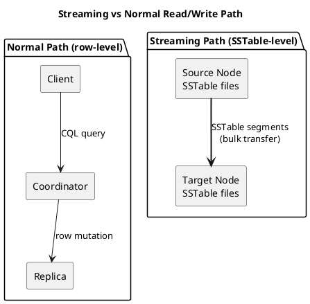

### When Streaming Occurs

| Operation | Direction | Trigger |
|-----------|-----------|---------|
| Bootstrap | Existing → New node | New node joins cluster |
| Decommission | Leaving → Remaining nodes | Node removal initiated |
| Repair | Bidirectional between replicas | Manual or scheduled repair |
| Rebuild | Existing → Rebuilt node | `nodetool rebuild` command |
| Host replacement | Existing → Replacement node | Dead node replaced |
| Hinted handoff | Coordinator → Recovered node | Node recovers after failure |

---

## Streaming Architecture

### Protocol Stack

Cassandra's streaming protocol operates as a separate subsystem from the CQL protocol:

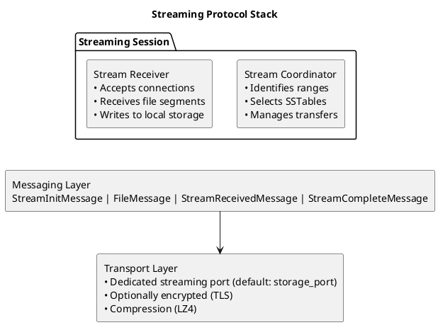

### Streaming Session Lifecycle

A streaming session progresses through distinct phases:

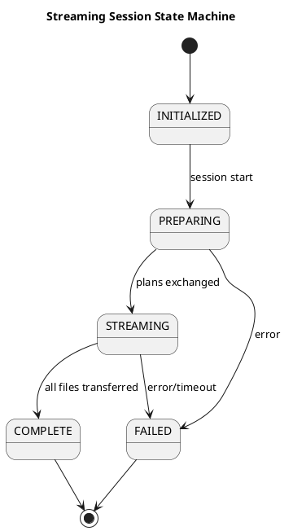

**Phase descriptions:**

| Phase | Operations |
|-------|------------|
| **INITIALIZED** | Session created, peers identified |
| **PREPARING** | Token ranges calculated, SSTable selection, streaming plan exchanged |
| **STREAMING** | File transfers in progress, progress tracking |
| **COMPLETE** | All transfers successful, SSTables integrated |
| **FAILED** | Error occurred, partial cleanup, retry may follow |

### Zero-Copy Streaming (Cassandra 4.0+)

Cassandra 4.0 introduced zero-copy streaming, which transfers entire SSTable components without deserialization:

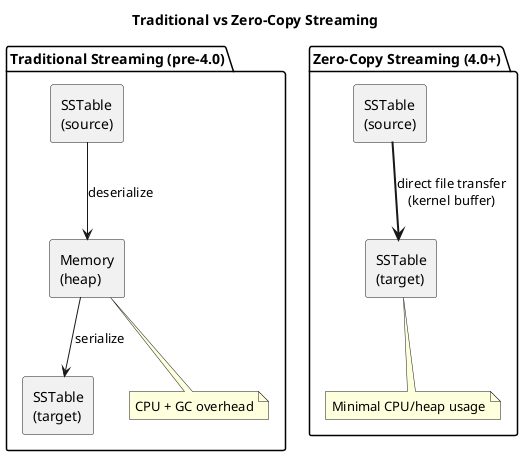

| Characteristic | Traditional | Zero-Copy |
|----------------|-------------|-----------|
| CPU usage | High (ser/deser) | Minimal |
| Heap pressure | Significant | Negligible |
| Throughput | Limited by CPU | Limited by network/disk |
| Compatibility | All SSTables | Same-version SSTables only |
| TLS support | Yes | No |

!!! warning "Zero-Copy Requirements and Limitations"
    Zero-copy streaming has specific requirements that, when not met, cause automatic fallback to traditional streaming:

    - **SSTable format compatibility**: Source and target nodes must use compatible SSTable formats. During rolling upgrades with format changes, traditional streaming is used.
    - **Inter-node encryption (TLS)**: Zero-copy streaming is **disabled** when inter-node encryption is enabled. TLS requires data to pass through the encryption layer, necessitating memory copies for encryption/decryption operations. Clusters with `server_encryption_options` enabled will always use traditional streaming.
    - **Configuration**: Zero-copy must be enabled via `stream_entire_sstables: true` (default in 4.0+).

    For security-conscious deployments requiring TLS, account for the additional CPU and memory overhead of traditional streaming during capacity planning for bootstrap, decommission, and repair operations.

---

## Bootstrap

Bootstrap is the process by which a new node joins the cluster and receives its share of data from existing nodes.

### Bootstrap Sequence

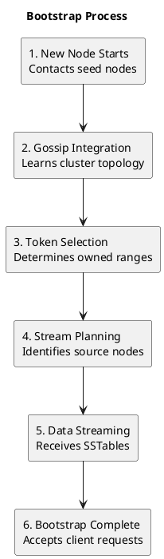

### Token Range Calculation

During bootstrap, the new node must determine which token ranges it will own:

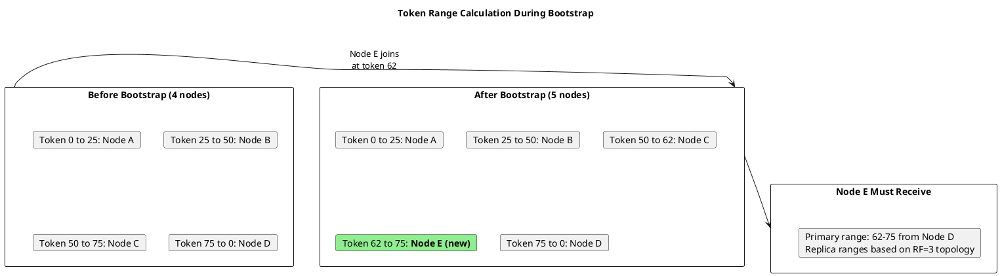

### Streaming Source Selection

The bootstrap coordinator selects source nodes based on:

1. **Token ownership**: Nodes currently owning required ranges
2. **Replica set**: For each range, any replica can serve as source
3. **Node state**: Only UP nodes considered
4. **Load balancing**: Distribute streaming load across sources

| Selection Criterion | Rationale |
|--------------------|-----------|
| Prefer local datacenter | Lower network latency |
| Prefer least-loaded nodes | Minimize impact on production |
| Avoid nodes already streaming | Prevent overload |
| Round-robin across replicas | Balance source load |

### Bootstrap Configuration

```yaml
# cassandra.yaml bootstrap parameters

# Number of concurrent streaming sessions per source
streaming_connections_per_host: 1

# Throughput limit (MB/s, 0 = unlimited)
stream_throughput_outbound_megabits_per_sec: 200

# Enable zero-copy streaming
stream_entire_sstables: true

# Bootstrap timeout
streaming_keep_alive_period_in_secs: 300
```

---

## Decommission

Decommission is the orderly removal of a node from the cluster, streaming all locally-owned data to remaining nodes before shutdown.

### Decommission Sequence

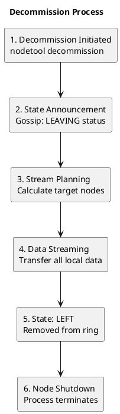

### Range Redistribution

During decommission, the departing node's ranges must be redistributed:

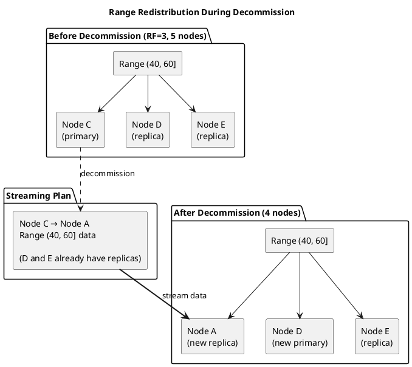

### Decommission vs RemoveNode

| Operation | Use Case | Data Handling |
|-----------|----------|---------------|
| `decommission` | Node healthy, orderly removal | Streams data before leaving |
| `removenode` | Node dead/unrecoverable | No streaming; repair required after |
| `assassinate` | Force remove stuck node | Emergency only; data loss possible |

!!! warning "Decommission Requirements"
    Decommission can only proceed if the remaining cluster can satisfy the replication factor. Attempting to decommission when RF nodes would remain results in an error.

---

## Repair Streaming

Repair operations use streaming to synchronize data between replicas that have diverged.

### Repair Types and Streaming

| Repair Type | Streaming Behavior |
|-------------|-------------------|
| Full repair | Compare all data, stream differences |
| Incremental repair | Compare only unrepaired SSTables |
| Preview repair | Calculate differences only, no streaming |
| Subrange repair | Repair specific token ranges |

### Merkle Tree Exchange

Before streaming, repair uses Merkle trees to identify divergent ranges:

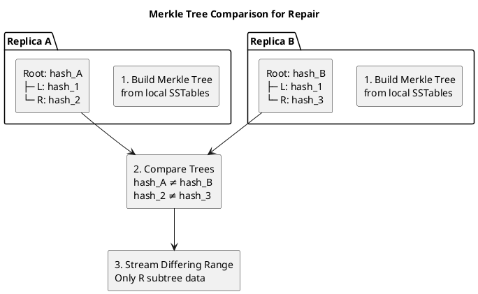

### Streaming During Repair

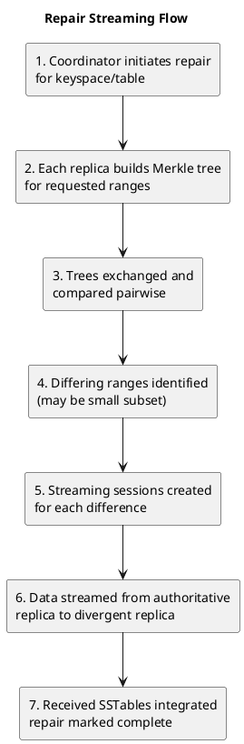

### Incremental Repair Optimization

Incremental repair tracks which SSTables have been repaired, reducing future repair scope:

| SSTable State | Description | Repair Behavior |
|---------------|-------------|-----------------|
| Unrepaired | Never included in repair | Included in next repair |
| Pending | Currently being repaired | Excluded from new repairs |
| Repaired | Successfully repaired | Excluded from incremental repair |

---

## Hinted Handoff

Hinted handoff is a lightweight streaming mechanism that delivers missed writes to nodes that were temporarily unavailable.

### Hint Storage and Delivery

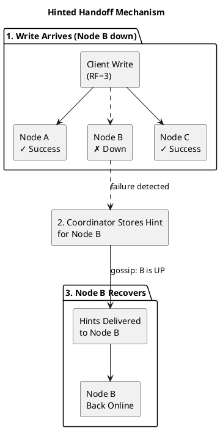

### Hint Structure

Hints are stored locally on the coordinator node:

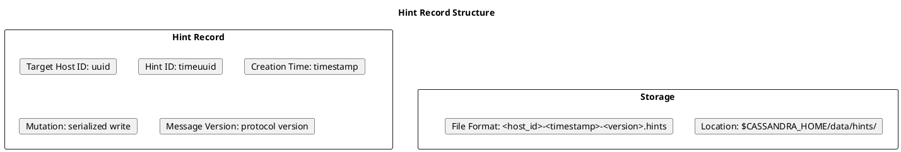

### Hint Configuration

```yaml
# cassandra.yaml hint parameters

# Enable/disable hinted handoff
hinted_handoff_enabled: true

# Maximum time to store hints (default: 3 hours)
max_hint_window: 3h                    # 4.1+ (duration format)
# max_hint_window_in_ms: 10800000      # Pre-4.1

# Directory for hint files
hints_directory: /var/lib/cassandra/hints

# Hint delivery throttle per destination
hinted_handoff_throttle: 1024KiB       # 4.1+ (data size format)
# hinted_handoff_throttle_in_kb: 1024  # Pre-4.1

# Maximum hints delivery threads
max_hints_delivery_threads: 2

# Hint compression
hints_compression:
  - class_name: LZ4Compressor
```

| Parameter | Pre-4.1 | 4.1+ |
|-----------|---------|------|
| Hint window | `max_hint_window_in_ms` | `max_hint_window` (duration) |
| Delivery throttle | `hinted_handoff_throttle_in_kb` | `hinted_handoff_throttle` (data size) |
| Flush period | `hints_flush_period_in_ms` | `hints_flush_period` (duration) |

### Hint Delivery Streaming

Unlike full SSTable streaming used in bootstrap and repair, hint delivery uses a lighter-weight mutation replay mechanism. Hints are streamed as individual mutations rather than file segments.

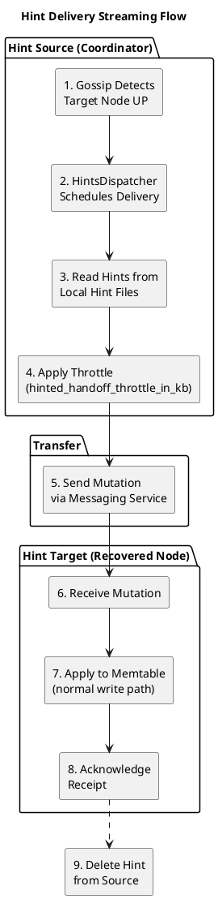

**Delivery mechanism details:**

| Aspect | Description |
|--------|-------------|
| **Transport** | Uses standard inter-node messaging (not dedicated streaming port) |
| **Serialization** | Hints deserialized and sent as mutation messages |
| **Ordering** | Delivered in timestamp order (oldest first) |
| **Batching** | Multiple hints may be batched per network round-trip |
| **Retries** | Failed deliveries retried with exponential backoff |

### Hint Streaming Parameters

The following parameters control hint delivery throughput and resource usage:

| Parameter (4.1+) | Parameter (Pre-4.1) | Default | Description |
|------------------|---------------------|---------|-------------|
| `hinted_handoff_throttle` | `hinted_handoff_throttle_in_kb` | 1024KiB | Max throughput per destination |
| `max_hints_delivery_threads` | `max_hints_delivery_threads` | 2 | Concurrent delivery threads |
| `hints_flush_period` | `hints_flush_period_in_ms` | 10s | How often hint buffers flush to disk |
| `max_hints_file_size` | `max_hints_file_size_in_mb` | 128MiB | Maximum size per hint file |

**Throttling calculation:**

```
Effective hint throughput = hinted_handoff_throttle × max_hints_delivery_threads

Example with defaults:
  1024 KiB/s × 2 threads = 2048 KiB/s = ~2 MiB/s total hint delivery capacity
```

```yaml
# cassandra.yaml - Hint delivery tuning (4.1+ syntax)

# Increase for faster hint delivery (impacts production traffic)
hinted_handoff_throttle: 2048KiB

# More threads for parallel delivery to multiple recovering nodes
max_hints_delivery_threads: 4

# Smaller files for more granular cleanup
max_hints_file_size: 64MiB
```

### Hint Delivery Process

| Phase | Operation |
|-------|-----------|
| **Detection** | Gossip announces target node UP |
| **Scheduling** | HintsDispatcher assigns delivery thread |
| **Reading** | Hints read from local hint files in timestamp order |
| **Throttling** | Delivery rate limited by `hinted_handoff_throttle` |
| **Streaming** | Mutations sent via messaging service |
| **Application** | Target node applies mutations to memtable |
| **Acknowledgment** | Target confirms receipt |
| **Cleanup** | Delivered hints deleted from source |

### Hint Delivery vs SSTable Streaming

| Characteristic | Hint Delivery | SSTable Streaming |
|----------------|---------------|-------------------|
| **Data unit** | Individual mutations | SSTable file segments |
| **Transport** | Messaging service | Dedicated streaming protocol |
| **Throughput** | KB/s (throttled) | MB/s to GB/s |
| **CPU usage** | Moderate (deserialization) | Low (zero-copy) or high (traditional) |
| **Use case** | Small data volumes, short outages | Large data volumes, topology changes |
| **Port** | `native_transport_port` / `storage_port` | `storage_port` |

!!! warning "Hint Window Limitations"
    Hints are only stored for `max_hint_window` duration (default: 3 hours). Nodes down longer than this window will not receive hints and require repair to restore consistency. For extended outages, full repair is necessary.

---

## Streaming Internals

### File Transfer Protocol

SSTable streaming operates on file segments:

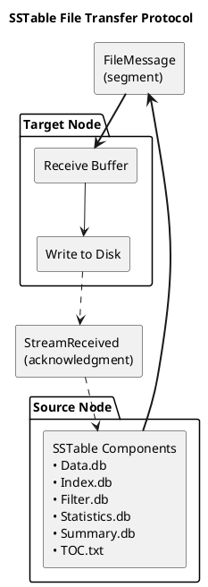

### Segment Size and Buffering

| Parameter | Default | Description |
|-----------|---------|-------------|
| Segment size | 64 KB | Chunk size for file transfer |
| Send buffer | 1 MB | Outbound buffering per session |
| Receive buffer | 4 MB | Inbound buffering per session |
| Max concurrent transfers | 1 per host | Parallelism limit |

### Compression

Streaming data is compressed in transit:

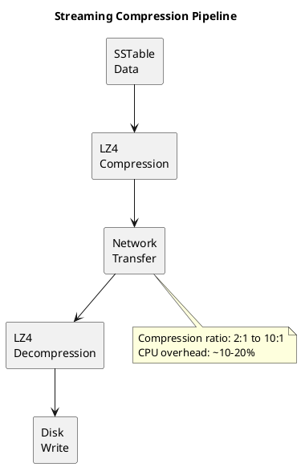

### Progress Tracking

Streaming progress is tracked at multiple granularities:

```bash
# View active streams
nodetool netstats

# Detailed streaming information
nodetool netstats -H

# Per-session progress
Mode: JOINING
    /10.0.1.2
        Receiving 15 files, 1.2 GB total. Already received 8 files, 650 MB
        /10.0.1.3
        Receiving 12 files, 980 MB total. Already received 12 files, 980 MB
```

### JMX Metrics

```
# Streaming metrics (JMX)
org.apache.cassandra.metrics:type=Streaming,name=TotalIncomingBytes
org.apache.cassandra.metrics:type=Streaming,name=TotalOutgoingBytes
org.apache.cassandra.metrics:type=Streaming,name=ActiveStreams
org.apache.cassandra.metrics:type=Streaming,name=StreamingTime
```

---

## Performance Considerations

### Network Impact

Streaming operations can saturate network capacity:

| Factor | Impact | Mitigation |
|--------|--------|------------|
| Bootstrap | Sustained high throughput | Schedule during low-traffic periods |
| Decommission | Sustained high throughput | Rate limit with `stream_throughput_outbound_megabits_per_sec` |
| Repair | Variable, depends on divergence | Use incremental repair |
| Hints | Lower throughput | Generally minimal impact |

### Disk I/O Impact

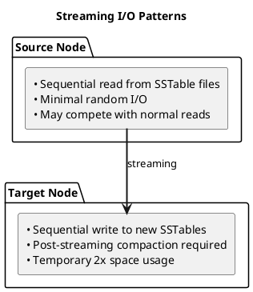

### Memory Pressure

| Streaming Mode | Heap Usage | Recommendation |
|----------------|------------|----------------|
| Zero-copy | Minimal | Preferred when compatible |
| Traditional | Significant | Monitor GC during large operations |

### Throttling Configuration

```yaml
# Limit streaming to prevent impact on production workload

# Outbound throughput limit (Mb/s)
stream_throughput_outbound_megabits_per_sec: 200

# Inter-datacenter streaming limit
inter_dc_stream_throughput_outbound_megabits_per_sec: 25

# Compaction throughput (affects post-streaming compaction)
compaction_throughput_mb_per_sec: 64
```

---

## Operational Procedures

### Monitoring Streaming

```bash
# Active streams summary
nodetool netstats

# Streaming with progress
nodetool netstats -H

# Bootstrap progress
nodetool describecluster | grep -A5 "Bootstrapping"

# Repair progress
nodetool repair_admin list
```

### Troubleshooting

| Symptom | Possible Cause | Resolution |
|---------|----------------|------------|
| Streaming stuck | Network partition | Check connectivity between nodes |
| Slow streaming | Disk I/O saturation | Reduce throttle, check disk health |
| Streaming failures | Timeout | Increase `streaming_socket_timeout` (4.1+) or `streaming_socket_timeout_in_ms` (pre-4.1) |
| OOM during streaming | Traditional mode on large data | Enable zero-copy or increase heap |

### Recovery from Failed Streaming

```bash
# If bootstrap fails
# Option 1: Clear data and retry
sudo rm -rf /var/lib/cassandra/data/*
nodetool bootstrap resume

# Option 2: Wipe and start fresh
sudo rm -rf /var/lib/cassandra/*
# Edit cassandra.yaml: auto_bootstrap: true
# Restart node

# If decommission fails
nodetool decommission  # Retry

# If repair streaming fails
nodetool repair -pr keyspace  # Retry affected ranges
```

---

## Related Documentation

- **[Replica Synchronization](replica-synchronization.md)** - Anti-entropy repair details
- **[Consistency](consistency.md)** - Consistency levels and guarantees
- **[Gossip Protocol](../cluster-management/gossip.md)** - Cluster state dissemination
- **[Compaction](../storage-engine/compaction/index.md)** - Post-streaming compaction
