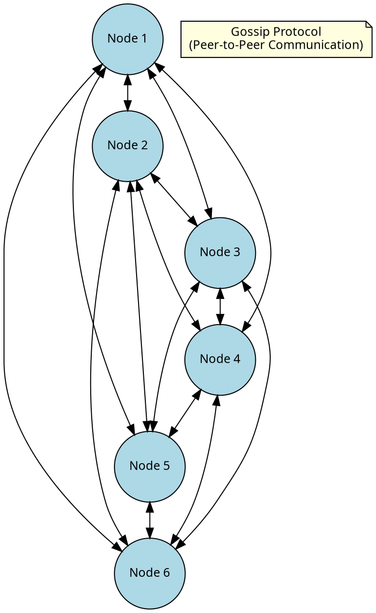
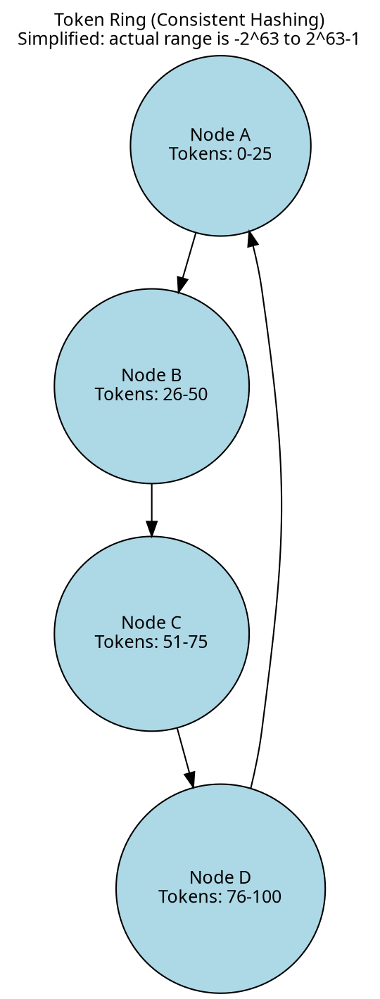
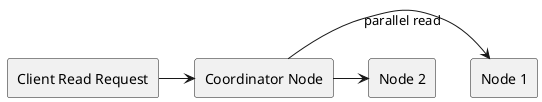

# Cassandra Architecture

Cassandra's architecture explains its behavior. The partition key determines which node stores data—get it wrong, and queries become slow or impossible. Deletes write tombstones instead of removing data immediately—ignore this, and deleted records can reappear. Nodes can disagree on data temporarily—while repair is the primary mechanism for full convergence, hinted handoff and read repair also help synchronize replicas.

The design combines Amazon Dynamo's distribution approach (masterless ring, gossip protocol, tunable consistency) with Google BigTable's storage approach (LSM-tree, [SSTables](storage-engine/sstables.md), memtables). Understanding both sides leads to better decisions about data modeling and operations.

## Architecture Overview

Apache Cassandra is a distributed, peer-to-peer database designed for:

- **High Availability**: No single point of failure
- **Scalability**: Add nodes to increase capacity (actual scaling depends on workload and data model)
- **Geographic Distribution**: Multi-datacenter replication
- **Tunable Consistency**: Balance between consistency and availability




---

## Core Concepts

### Ring Architecture

Cassandra organizes nodes in a logical ring structure using **consistent hashing**:

1. Each node owns a range of **tokens** on the ring
2. Data is assigned to nodes based on **partition key hash**
3. Data is replicated to multiple nodes for **fault tolerance**

#### Partitioner and Hash Calculation

The **partitioner** is responsible for computing a hash (token) value from the partition key. Cassandra uses this hash to determine data placement on both write and read operations:

- **Murmur3Partitioner** (default): Uses the MurmurHash3 algorithm, producing a 64-bit hash value. Token range spans from -2^63 to 2^63-1.
- **RandomPartitioner**: Uses MD5 hashing, producing a 128-bit hash. Token range spans from 0 to 2^127-1.

**Write operations**: When inserting data, the coordinator node computes `hash(partition_key)` to produce a token value. This token maps to a specific position on the ring, identifying the primary replica node. Additional replicas are selected by traversing the ring clockwise.

**Read operations**: The same hash calculation occurs during SELECT queries. The coordinator computes `hash(partition_key)` from the WHERE clause to locate the exact nodes holding the requested data.

This deterministic hashing ensures that:

- The same partition key always maps to the same token
- Any node can calculate which nodes own a given partition
- No central directory or lookup service is required



### Partition Key

The **partition key** determines which node stores the data:

```sql
CREATE TABLE users (
    user_id UUID,          -- Partition key
    name TEXT,
    email TEXT,
    PRIMARY KEY (user_id)
);
```

**How it works**:
1. Partition key value is hashed: `hash(user_id)` → token
2. Token maps to a token range
3. Node owning that range stores the data

### Replication

Data is replicated across multiple nodes for fault tolerance:

```sql
CREATE KEYSPACE my_app WITH replication = {
    'class': 'NetworkTopologyStrategy',
    'dc1': 3,   -- 3 copies in dc1
    'dc2': 3    -- 3 copies in dc2
};
```

**Replication Factor (RF)**: Number of copies across the cluster.

---

## Documentation Structure

### Data Distribution

- **[Partitioning](distributed-data/partitioning.md)** - How data is distributed across nodes
- **[Replication](distributed-data/replication.md)** - SimpleStrategy vs NetworkTopologyStrategy
- **[Consistency Levels](distributed-data/consistency.md)** - Tuning consistency vs availability
- **[Replica Synchronization](distributed-data/replica-synchronization.md)** - Repair, hinted handoff, read repair

### Memory Management

- **[JVM](memory-management/jvm.md)** - Java Virtual Machine configuration and garbage collection
- **[Cassandra Memory](memory-management/memory.md)** - Heap, off-heap, and page cache
- **[Linux](memory-management/linux.md)** - Kernel settings, swap, THP, and NUMA

### Storage Engine

- **[Storage Engine Overview](storage-engine/index.md)** - How Cassandra stores data
- **[Write Path](storage-engine/write-path.md)** - Memtables and commit log
- **[Commit Log](storage-engine/commitlog.md)** - Write-ahead log internals
- **[Read Path](storage-engine/read-path.md)** - How reads are served
- **[SSTables](storage-engine/sstables.md)** - On-disk storage format
- **[Tombstones](storage-engine/tombstones.md)** - How deletes work
- **[Change Data Capture](storage-engine/cdc.md)** - Capturing row-level changes

### Compaction

- **[Compaction Overview](storage-engine/compaction/index.md)** - Compaction overview
- **[STCS](storage-engine/compaction/stcs.md)** - Size-Tiered Compaction Strategy
- **[LCS](storage-engine/compaction/lcs.md)** - Leveled Compaction Strategy
- **[TWCS](storage-engine/compaction/twcs.md)** - Time-Window Compaction Strategy
- **[UCS](storage-engine/compaction/ucs.md)** - Unified Compaction Strategy (5.0+)

### Cluster Communication

- **[Gossip Protocol](cluster-management/gossip.md)** - How nodes discover each other

### Client Connections

- **[Client Connection Architecture](client-connections/index.md)** - How clients communicate with Cassandra
- **[CQL Protocol](client-connections/cql-protocol.md)** - Binary wire protocol specification
- **[Async Connections](client-connections/async-connections.md)** - Connection pooling and multiplexing
- **[Authentication](client-connections/authentication.md)** - SASL authentication mechanisms
- **[Load Balancing](client-connections/load-balancing.md)** - Request routing policies
- **[Prepared Statements](client-connections/prepared-statements.md)** - Statement preparation lifecycle
- **[Pagination](client-connections/pagination.md)** - Query result paging
- **[Throttling](client-connections/throttling.md)** - Rate limiting and backpressure
- **[Compression](client-connections/compression.md)** - Protocol compression
- **[Failure Handling](client-connections/failure-handling.md)** - Retry and speculative execution

---

## Key Architecture Components

### Write Path


1. **Commit Log**: Write-ahead log for durability
2. **Memtable**: In-memory sorted structure
3. **[SSTable](storage-engine/sstables.md)**: Immutable on-disk file (created when memtable flushes)

### Read Path



### [SSTable](storage-engine/sstables.md) Structure

```
SSTable Files:
├── data.db         # Actual data
├── index.db        # Partition index
├── filter.db       # Bloom filter
├── summary.db      # Index summary
├── statistics.db   # Table statistics
├── compression.db  # Compression info
└── toc.txt         # Table of contents
```

---

## Consistency Model

Cassandra offers **tunable consistency** per operation:

### Consistency Levels

| Level | Reads | Writes |
|-------|-------|--------|
| `ONE` | 1 replica | 1 replica |
| `QUORUM` | ⌊RF/2⌋ + 1 | ⌊RF/2⌋ + 1 |
| `LOCAL_QUORUM` | Quorum in local DC | Quorum in local DC |
| `ALL` | All replicas | All replicas |

### Strong Consistency Formula

For **strong consistency** (read-your-writes):

```
R + W > RF

Where:
R = Read consistency level (number of replicas)
W = Write consistency level (number of replicas)
RF = Replication factor
```

**Example with RF=3**:
- `QUORUM` reads (2) + `QUORUM` writes (2) = 4 > 3 ✓
- `ONE` reads (1) + `ONE` writes (1) = 2 < 3 ✗

---

## Fault Tolerance

By storing multiple copies of data across nodes, Cassandra tolerates node failures without loss of service or data. As described in the [Consistency Model](#consistency-model) section, operations succeed as long as enough replicas respond to satisfy the consistency level—allowing nodes, racks, or entire datacenters to fail while maintaining availability.

For details on how Cassandra detects failures and synchronizes replicas after recovery, see [Replica Synchronization](distributed-data/replica-synchronization.md).

### Multi-Datacenter Replication

**NetworkTopologyStrategy** enables per-datacenter replication:

```sql
CREATE KEYSPACE production WITH replication = {
    'class': 'NetworkTopologyStrategy',
    'us-east': 3,
    'eu-west': 3
};
```

```graphviz neato multidc.svg
graph MultiDC {
    bgcolor="transparent"
    graph [fontname="Roboto Flex", fontsize=12]
    node [fontname="Roboto Flex", fontsize=12]
    edge [fontname="Roboto Flex", fontsize=12]

    node [shape=circle, style=filled, fillcolor=lightblue, width=0.5]

    subgraph cluster_dc1 {
        label="Datacenter 1 (RF=3)"
        style=rounded
        bgcolor="white"
        penwidth=2

        pad_dc1_tl [style=invis, width=0, pos="0,10!"]
        pad_dc1_br [style=invis, width=0, pos="10,0!"]

        A1 [label="N1", pos="5,8.5!"]
        A2 [label="N2", pos="7.2,7.7!"]
        A3 [label="N3", pos="8.4,5.6!"]
        A4 [label="N4", pos="8,3.2!"]
        A5 [label="N5", pos="6.2,1.7!"]
        A6 [label="N6", pos="3.8,1.7!"]
        A7 [label="N7", pos="2,3.2!"]
        A8 [label="N8", pos="1.6,5.6!"]
        A9 [label="N9", pos="2.8,7.7!"]

        A1 -- A2 -- A3 -- A4 -- A5 -- A6 -- A7 -- A8 -- A9 -- A1
    }

    subgraph cluster_dc2 {
        label="Datacenter 2 (RF=3)"
        style=rounded
        bgcolor="white"
        penwidth=2

        pad_dc2_tl [style=invis, width=0, pos="14,10!"]
        pad_dc2_br [style=invis, width=0, pos="24,0!"]

        B1 [label="N1", pos="19,8.5!"]
        B2 [label="N2", pos="21.2,7.7!"]
        B3 [label="N3", pos="22.4,5.6!"]
        B4 [label="N4", pos="22,3.2!"]
        B5 [label="N5", pos="20.2,1.7!"]
        B6 [label="N6", pos="17.8,1.7!"]
        B7 [label="N7", pos="16,3.2!"]
        B8 [label="N8", pos="15.6,5.6!"]
        B9 [label="N9", pos="16.8,7.7!"]

        B1 -- B2 -- B3 -- B4 -- B5 -- B6 -- B7 -- B8 -- B9 -- B1
    }

    cluster_dc1 -- - cluster_dc2 [label="Replication", style=dashed]
}
```

With **LOCAL_QUORUM**, each datacenter operates independently—surviving node failures, network partitions, or complete datacenter outages without losing availability or data.

---

## Performance Characteristics

### Write Performance

| Factor | Impact |
|--------|--------|
| Commit log sync | `periodic` (default) vs `batch` |
| Memtable size | Larger = fewer flushes |
| Compaction | Background CPU/IO |
| Replication | More replicas = more writes |

### Read Performance

| Factor | Impact |
|--------|--------|
| Partition size | Smaller is better |
| [SSTable](storage-engine/sstables.md) count | Fewer is better |
| Bloom filters | Reduce disk reads |
| Caching | Key/row cache hit rate |
| Data model | Query-driven design |

---

## Further Reading

### Deep Dives

- [Data Distribution Deep Dive](distributed-data/index.md)
- [Compaction Strategies Explained](storage-engine/compaction/index.md)
- [Consistency Levels Guide](distributed-data/consistency.md)
- [Storage Engine Internals](storage-engine/index.md)

### Related Topics

- [Data Modeling](../data-modeling/index.md) - Design for Cassandra
- [Performance Tuning](../operations/performance/index.md) - Optimize cluster performance
- [Operations](../operations/index.md) - Day-to-day management