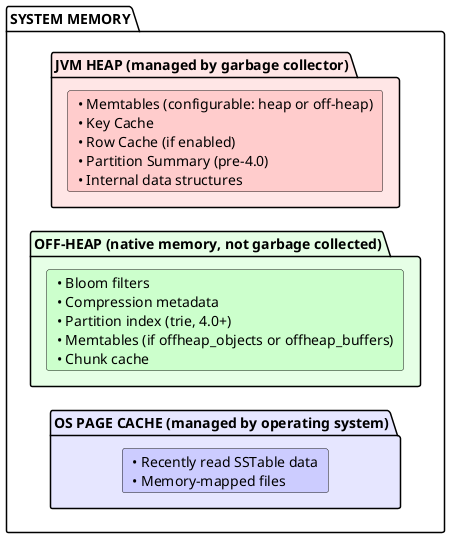
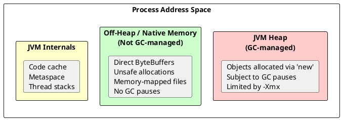
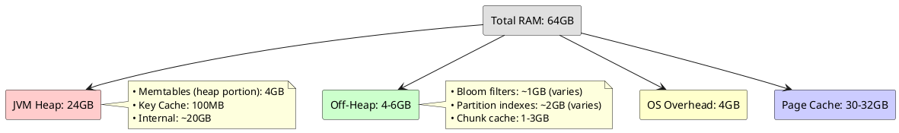

# Memory Management

Cassandra uses multiple memory regions: JVM heap, off-heap native memory, and OS page cache. Understanding how Cassandra allocates memory across these regions is essential for capacity planning and performance tuning.

For JVM configuration and garbage collection tuning, see [JVM](jvm.md).

---

## Memory Architecture



---

## Heap Components

The JVM heap holds Cassandra's managed data structures. These are subject to garbage collection.

| Component | Description | Configuration |
|-----------|-------------|---------------|
| Memtables | In-memory write buffer per table | `memtable_heap_space_in_mb` |
| Key Cache | Maps partition keys to SSTable offsets | `key_cache_size_in_mb` |
| Row Cache | Caches entire rows (use sparingly) | `row_cache_size_in_mb` |
| Partition Summary | Sampled index (pre-4.0 only) | `min_index_interval` |

### Memtables

Memtables buffer writes before flushing to SSTables. Each table has one active memtable.

```yaml
# cassandra.yaml

# Total heap space for memtables across all tables
memtable_heap_space_in_mb: 4096

# Flush threshold (fraction of memtable space)
memtable_cleanup_threshold: 0.11
```

!!! tip "Memtable Sizing"
    Larger memtables reduce flush frequency but increase memory pressure. For write-heavy workloads, consider off-heap memtables.

### Key Cache

The key cache stores partition key to SSTable offset mappings, eliminating partition index lookups for frequently accessed partitions.

```yaml
# cassandra.yaml

# Key cache size (default: min of 5% heap or 100MB)
key_cache_size_in_mb: 100

# Save interval (0 disables saving)
key_cache_save_period: 14400

# Keys to save (empty = all)
key_cache_keys_to_save:
```

### Row Cache

The row cache stores entire rows. It can dramatically improve read performance for frequently accessed rows but consumes significant heap space and can cause GC pressure.

```yaml
# cassandra.yaml

# Disabled by default (0)
row_cache_size_in_mb: 0

# Save interval
row_cache_save_period: 0
```

!!! warning "Row Cache Caution"
    Row cache is disabled by default for good reason. Enable only for specific tables with read-heavy, rarely-updated data. Consider the key cache or OS page cache first.

---

## Off-Heap Memory

Off-heap memory is native memory allocated outside the JVM heap. It is not subject to garbage collection, eliminating GC pauses for these structures.

### Off-Heap Memory Benefits

Garbage collection is the primary source of latency variability in Java applications. For databases like Cassandra, GC pauses directly translate to:

- **Query latency spikes**: A 500ms GC pause means 500ms added to every in-flight query
- **Coordinator timeouts**: Other nodes may mark a pausing node as unresponsive
- **Cluster instability**: Gossip failures during long pauses can trigger unnecessary node replacements

The fundamental problem is that **GC pause duration scales with heap size and object count**. A database handling millions of partitions with gigabytes of cached data will have longer GC pauses than a simple web application.

Off-heap memory solves this by removing large, long-lived data structures from GC's responsibility entirely. The GC only sees a small pointer to the off-heap region, not the gigabytes of data stored there.

### What is Off-Heap Memory?

The JVM manages two distinct memory regions:

- **Heap memory**: Managed by the garbage collector. Objects are allocated here by default. When objects are no longer referenced, the GC reclaims the memory during collection cycles, which can cause application pauses.

- **Off-heap (native) memory**: Allocated directly from the operating system, bypassing the JVM's garbage collector. The application is responsible for explicitly allocating and freeing this memory. No GC pauses occur for off-heap allocations.



### How Java Accesses Off-Heap Memory

Java provides several mechanisms for allocating and accessing memory outside the heap:

**1. Direct ByteBuffers (`ByteBuffer.allocateDirect()`)**

The standard Java API for off-heap memory allocation. Direct buffers allocate memory outside the heap and are commonly used for I/O operations.

```java
// Allocate 1MB of off-heap memory
ByteBuffer buffer = ByteBuffer.allocateDirect(1024 * 1024);

// Write data
buffer.putInt(42);
buffer.putLong(System.currentTimeMillis());

// Read data
buffer.flip();
int value = buffer.getInt();
```

- Memory is allocated via `malloc()` in native code
- Buffer object on heap tracks the native memory address
- Memory is freed when the ByteBuffer is garbage collected (via a `Cleaner`)
- Can also be explicitly freed in Java 9+ via `sun.misc.Unsafe` or the Foreign Memory API

**2. `sun.misc.Unsafe` (Internal API)**

Provides low-level, direct memory access with no bounds checking. Used by high-performance libraries including Cassandra.

```java
// Cassandra uses Unsafe for direct memory operations
Unsafe unsafe = getUnsafe();

// Allocate native memory
long address = unsafe.allocateMemory(1024);

// Write directly to memory address
unsafe.putInt(address, 42);
unsafe.putLong(address + 4, System.currentTimeMillis());

// Read from memory address
int value = unsafe.getInt(address);

// Must explicitly free
unsafe.freeMemory(address);
```

- Fastest possible memory access (no bounds checking)
- Application must manage allocation and deallocation
- Memory leaks occur if `freeMemory()` is not called
- Being replaced by the Foreign Function & Memory API in newer Java versions

**3. Memory-Mapped Files (`MappedByteBuffer`)**

Maps a file directly into the process address space. The OS handles paging data between disk and RAM.

```java
// Map a file into memory
FileChannel channel = FileChannel.open(path, READ, WRITE);
MappedByteBuffer mapped = channel.map(MapMode.READ_WRITE, 0, fileSize);

// Access file contents as memory
int value = mapped.getInt(offset);
```

- OS manages which portions are in RAM (page cache)
- Efficient for large files that don't fit in memory
- Used by Cassandra for SSTable access in some configurations

### How Cassandra Uses Off-Heap Memory

Cassandra strategically places different data structures on or off the heap based on their characteristics:

| Component | Why Off-Heap? |
|-----------|---------------|
| **Bloom filters** | Bloom filters are large (10 bits per partition key × number of SSTables), long-lived (exist for SSTable lifetime), and accessed on every read. On-heap, they would consume gigabytes and be scanned by every GC cycle. |
| **Partition index (trie)** | The trie-based partition index (4.0+) grows with partition count. A table with 100 million partitions could have a multi-gigabyte index. Off-heap placement prevents this from bloating GC pause times. |
| **Compression metadata** | Stores byte offsets for each compressed chunk in an SSTable. Grows proportionally to data size and SSTable count. Rarely changes once written. |
| **Off-heap memtables** | Memtables have high object churn—data is constantly written and then flushed. This churn creates GC pressure. Off-heap memtables keep write-path allocations out of the heap. |
| **Chunk cache** | Caches decompressed SSTable blocks. Can grow to multiple gigabytes for read-heavy workloads. Off-heap prevents cache growth from impacting GC. |
| **Networking buffers** | Direct ByteBuffers enable zero-copy I/O between the network stack and Cassandra. Data can be sent/received without copying through the heap. |

**Why Not Put Everything Off-Heap?**

Off-heap memory requires manual lifecycle management. Cassandra keeps some structures on-heap because:

- **Short-lived objects**: Request-scoped objects that are quickly discarded benefit from generational GC, which efficiently handles short-lived allocations
- **Complex object graphs**: Data structures with many internal references are difficult to serialize to flat memory regions
- **Debugging**: Heap dumps capture on-heap objects; off-heap memory is invisible to standard Java profiling tools

**Cassandra's Memory Allocators**

Cassandra implements custom memory allocators to manage off-heap memory efficiently:

- **`BufferPool`**: Manages pools of direct ByteBuffers for networking and chunk cache, avoiding allocation overhead
- **`NativeAllocator`**: Uses `Unsafe` for bloom filters and index structures with explicit lifecycle management
- **Slab allocation**: Reduces fragmentation by allocating fixed-size chunks rather than variable-sized blocks

### Off-Heap Trade-offs

| Advantage | Disadvantage |
|-----------|--------------|
| No GC pauses | Manual memory management required |
| Can exceed heap size limits | Memory leaks if not freed properly |
| Better cache locality for large structures | Slightly slower allocation than heap |
| Reduced heap pressure | Harder to debug (not visible in heap dumps) |
| Enables larger working sets | Must account for in capacity planning |

### Monitoring Off-Heap Usage

```bash
# Total off-heap memory used by Cassandra
nodetool info | grep "Off Heap"

# Native memory tracking (JVM flag required)
# Add to jvm-server.options: -XX:NativeMemoryTracking=summary
jcmd <pid> VM.native_memory summary
```

### Off-Heap Components in Detail

| Component | Description | Memory Scaling |
|-----------|-------------|----------------|
| Bloom filters | Probabilistic existence checks | ~10 bits per partition key per SSTable |
| Compression metadata | Chunk offset mappings | Proportional to data size |
| Partition index | Trie-based index (4.0+) | Proportional to partition count |
| Memtables | Write buffer (if configured) | `memtable_offheap_space_in_mb` |
| Chunk cache | Compressed SSTable chunks | `file_cache_size_in_mb` |

### Off-Heap Memtables

Moving memtables off-heap reduces GC pressure significantly for write-heavy workloads.

```yaml
# cassandra.yaml

# Off-heap memtable allocation (choose based on workload)
# memtable_allocation_type: offheap_objects  # Write-heavy: lowest GC
# memtable_allocation_type: offheap_buffers  # Read-heavy: minimal read impact
memtable_allocation_type: offheap_objects
```

| Type | Description | Best For |
|------|-------------|----------|
| `heap_buffers` | All memtable data on heap (default) | Low-memory environments, simple deployments |
| `offheap_buffers` | Cell names/values in DirectBuffers, metadata on heap | Read-heavy workloads, large cell values (blobs, long strings) |
| `offheap_objects` | Entire cells off-heap, only pointers on heap | Write-heavy workloads, small cell values (ints, UUIDs), lowest GC pressure |

!!! tip "Choosing a Memtable Allocation Type"
    - **`offheap_objects`**: Recommended for write-heavy workloads. Provides lowest GC pressure but adds slight read overhead (data copied back to heap when read). Requires JNA library.
    - **`offheap_buffers`**: Recommended for read-heavy workloads with large values. Minimal read impact but less GC reduction than `offheap_objects`.
    - **`heap_buffers`**: Default. Use when off-heap complexity is not justified or JNA is unavailable.

### Chunk Cache

The chunk cache stores decompressed SSTable chunks, reducing CPU overhead for repeated reads.

```yaml
# cassandra.yaml

# Auto-sized by default (1/4 of available memory)
# file_cache_size_in_mb: auto

# Manually set if needed
file_cache_size_in_mb: 2048
```

---

## OS Page Cache

The operating system automatically caches recently accessed file data in unused RAM. This is Cassandra's primary read cache for SSTable data.

### How It Works

- SSTable data cached after first read
- No Cassandra configuration required
- Automatically sized to available RAM
- Shared across all processes
- Evicted under memory pressure (LRU)

### Sizing

```
Page Cache = Total RAM - JVM Heap - Off-Heap - OS Overhead

Example (64GB server):
- JVM Heap: 24GB
- Off-heap: 4-6GB
- OS overhead: 4GB
- Page cache: 30-32GB available
```

### Maximizing Page Cache Effectiveness

- Size heap appropriately (not too large)
- Leave sufficient free RAM
- Avoid memory-hungry co-located processes
- Use SSDs for faster cache misses

---

## Memory Sizing Example

### 64GB Server Configuration



### Configuration

```yaml
# cassandra.yaml

# Memtables
memtable_heap_space_in_mb: 4096
memtable_allocation_type: offheap_buffers

# Key cache
key_cache_size_in_mb: 100

# Row cache (disabled)
row_cache_size_in_mb: 0
```

```bash
# jvm-server.options
-Xms24G
-Xmx24G
```

---

## Monitoring Memory

### Heap and Off-Heap Usage

```bash
# Overall memory status
nodetool info

# Heap memory
nodetool info | grep "Heap Memory"

# Off-heap memory
nodetool info | grep "Off Heap Memory"

# GC statistics
nodetool gcstats
```

### Per-Table Memory

```bash
# Table statistics including bloom filter size
nodetool tablestats keyspace.table

# Bloom filter memory
nodetool tablestats | grep -i bloom
```

### JMX Metrics

```
# Heap
java.lang:type=Memory/HeapMemoryUsage

# Memtables
org.apache.cassandra.metrics:type=Table,name=MemtableOnHeapSize
org.apache.cassandra.metrics:type=Table,name=MemtableOffHeapSize

# Caches
org.apache.cassandra.metrics:type=Cache,scope=KeyCache,name=Size
org.apache.cassandra.metrics:type=Cache,scope=RowCache,name=Size

# Bloom filters
org.apache.cassandra.metrics:type=Table,name=BloomFilterOffHeapMemoryUsed
```

---

## Troubleshooting

### High Heap Usage

**Symptoms:**
- Long GC pauses
- Heap usage consistently >70%
- OutOfMemoryError

**Solutions:**

1. Move memtables off-heap (`memtable_allocation_type: offheap_buffers`)
2. Reduce key cache size
3. Disable row cache if enabled
4. Reduce number of tables (see below)

### Memory Pressure from Many Tables

Each table requires memory for:
- One memtable
- Bloom filters per SSTable
- Index structures per SSTable

!!! warning "Table Count Guideline"
    Avoid more than 200 tables per node. Each table consumes memory regardless of data volume.

### Bloom Filter Memory

Bloom filter memory scales with partition count and SSTable count:

```
Memory ≈ partitions × SSTables × bits_per_key

Example:
- 100 million partitions
- 20 SSTables average
- 10 bits per key
- ≈ 2.5GB bloom filter memory
```

**Reduce bloom filter memory by:**

- Increasing `bloom_filter_fp_chance` (allows more false positives)
- Reducing SSTable count through better compaction
- Using fewer, larger partitions

```sql
-- Increase false positive rate to reduce memory
ALTER TABLE my_table WITH bloom_filter_fp_chance = 0.1;
```

---

## Configuration Reference

### Workload-Specific Settings

**Write-Heavy:**

```yaml
memtable_heap_space_in_mb: 4096
memtable_allocation_type: offheap_objects  # Lowest GC pressure for high write rates
memtable_flush_writers: 4
```

**Read-Heavy:**

```yaml
memtable_allocation_type: offheap_buffers  # Minimal read overhead
key_cache_size_in_mb: 200
# Ensure sufficient page cache for working set
```

**Mixed:**

```yaml
memtable_heap_space_in_mb: 2048
memtable_allocation_type: offheap_objects
key_cache_size_in_mb: 100
```

---

## Related Documentation

- **[JVM](jvm.md)** - JVM configuration and garbage collection
- **[Linux](linux.md)** - Kernel settings, swap, THP, and NUMA
- **[Storage Engine Overview](../storage-engine/index.md)** - Architecture overview
- **[Write Path](../storage-engine/write-path.md)** - Memtable flush process
- **[Read Path](../storage-engine/read-path.md)** - Cache behavior during reads
