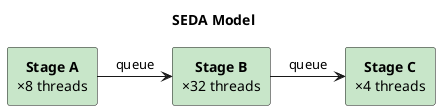
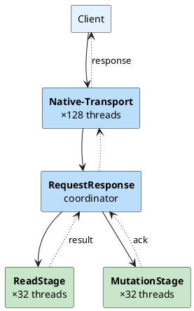
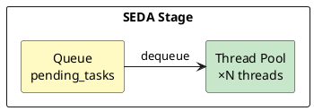

# Staged Event-Driven Architecture (SEDA)

Cassandra uses Staged Event-Driven Architecture (SEDA) to manage concurrency and resource allocation. Operations are decomposed into discrete stages, each with its own thread pool and queue. This design enables controlled parallelism, natural backpressure, and fine-grained performance tuning.

---

## Why SEDA?

When Cassandra was designed (2008), servers typically had 2-8 CPU cores. Thread-per-request models were impractical—a server handling 10,000 concurrent requests would need 10,000 threads, but with only 4-8 cores, most threads would be waiting while consuming ~1MB stack memory each and creating context-switching overhead.

SEDA addressed this by:

1. **Matching threads to cores** - Each stage has a small, bounded thread pool sized for available CPU
2. **Queues absorb concurrency** - 10,000 requests become queue entries, not threads
3. **Work decomposition** - Breaking requests into stages allows pipeline parallelism
4. **Natural backpressure** - Full queues signal upstream to slow down

| Era | Typical Cores | Thread-per-Request | SEDA |
|-----|---------------|-------------------|------|
| 2008 | 4-8 | 10K threads = disaster | 4-8 threads per stage |
| 2015 | 16-32 | Still problematic | Scales with core count |
| 2024 | 64-128 | Context switching still expensive | Thread pools sized to cores |



---

## Architecture Overview

### Request Flow Through Stages

A CQL request flows through multiple stages from arrival to response:



### Stage Components

Each stage consists of a queue and a thread pool:



| Component | Metric | Description |
|-----------|--------|-------------|
| **Queue** | `pending_tasks` | Tasks waiting for a thread |
| **Thread Pool** | `active_tasks` | Currently executing tasks |
| **Thread Pool** | `active_tasks_limit` | Pool size (max concurrent) |
| **Counter** | `completed_tasks` | Total completed since startup |
| **Counter** | `blocked_tasks` | Tasks blocked on downstream queue |

---

## Stage Categories

### Request Path Stages

These stages are on the critical path for every request:

| Stage | Default Threads | Purpose | Tuning Parameter |
|-------|-----------------|---------|------------------|
| `Native-Transport-Requests` | 128 | CQL protocol handling | `native_transport_max_threads` |
| `ReadStage` | 32 | Local read execution | `concurrent_reads` |
| `MutationStage` | 32 | Local write execution | `concurrent_writes` |
| `CounterMutationStage` | 32 | Counter write execution | `concurrent_counter_writes` |
| `ViewMutationStage` | 32 | Materialized view updates | `concurrent_materialized_view_writes` |
| `RequestResponseStage` | (shared) | Coordinator logic | - |

### Storage Stages

Background stages for data persistence:

| Stage | Default Threads | Purpose | Tuning Parameter |
|-------|-----------------|---------|------------------|
| `MemtableFlushWriter` | 2 | Flush memtables to SSTables | `memtable_flush_writers` |
| `MemtablePostFlush` | 1 | Post-flush cleanup | - |
| `CompactionExecutor` | 2-4 | Compact SSTables | `concurrent_compactors` |
| `ValidationExecutor` | 1 | Repair validation | `concurrent_validations` |

### Cluster Communication Stages

Inter-node coordination:

| Stage | Purpose | When Active |
|-------|---------|-------------|
| `GossipStage` | Cluster state propagation | Always (background) |
| `AntiEntropyStage` | Repair coordination | During repairs |
| `MigrationStage` | Schema changes | Schema modifications |
| `HintsDispatcher` | Hint delivery | Catching up nodes |
| `InternalResponseStage` | Internal coordination | Various |

### Auxiliary Stages

| Stage | Purpose |
|-------|---------|
| `SecondaryIndexManagement` | Index maintenance |
| `CacheCleanupExecutor` | Cache eviction |
| `Sampler` | Query sampling |
| `PendingRangeCalculator` | Token range computation |

---

## Backpressure Mechanism

When a stage's queue fills, Cassandra applies backpressure to upstream stages. This prevents memory exhaustion and cascading failures.

### Backpressure Flow

```plantuml
@startuml
skinparam backgroundColor transparent
skinparam defaultTextAlignment center
skinparam rectangle {
    RoundCorner 5
}

rectangle "Client" as client #E3F2FD
rectangle "**Stage A**\nqueue: 0" as A #C8E6C9
rectangle "**Stage B**\nqueue: 950" as B #FFF9C4
rectangle "**Stage C**\nqueue: FULL" as C #FFCDD2

client -right-> A
A -right-> B
B -right-> C : blocked

@enduml
```



When Stage C's queue fills, Stage B blocks trying to enqueue. Stage B's queue then fills, blocking Stage A. Eventually the client experiences increased latency or receives `OverloadedException`.

### Blocked Tasks

When a stage cannot enqueue work to the next stage:

1. The submitting thread blocks
2. `blocked_tasks` metric increments
3. If persistent, `blocked_tasks_all_time` accumulates
4. Eventually, backpressure reaches the client

```sql
-- Find stages experiencing backpressure
SELECT name, pending_tasks, blocked_tasks, blocked_tasks_all_time
FROM system_views.thread_pools
WHERE blocked_tasks > 0 OR pending_tasks > 100;
```

### Native Transport Backpressure (Cassandra 4.0+)

The native transport layer has memory-based backpressure:

```yaml
# cassandra.yaml

# Total bytes allowed in flight (node-wide)
# Cassandra 4.1+: native_transport_max_request_data_in_flight (auto-calculated ~1/10 heap)
# Cassandra 4.0:  native_transport_max_concurrent_requests_in_bytes
native_transport_max_request_data_in_flight: # auto (default)

# Bytes allowed per client IP
# Cassandra 4.1+: native_transport_max_request_data_in_flight_per_ip (auto-calculated ~1/40 heap)
# Cassandra 4.0:  native_transport_max_concurrent_requests_in_bytes_per_ip
native_transport_max_request_data_in_flight_per_ip: # auto (default)

# Response when overloaded
# false: Apply TCP backpressure (recommended)
# true: Return OverloadedException immediately
native_transport_throw_on_overload: false
```

When limits are exceeded:

- **`throw_on_overload: false`** (default): Stops reading from client sockets, TCP buffers fill, client naturally slows down
- **`throw_on_overload: true`**: Returns `OverloadedException` immediately, client must handle

---

## Metrics Reference

### Per-Stage Metrics

Each stage exposes these metrics via JMX and virtual tables:

| Metric | Type | Description |
|--------|------|-------------|
| `active_tasks` | Gauge | Currently executing tasks |
| `active_tasks_limit` | Gauge | Thread pool size (max concurrent) |
| `pending_tasks` | Gauge | Tasks queued waiting for execution |
| `blocked_tasks` | Gauge | Tasks currently blocked (waiting to enqueue downstream) |
| `blocked_tasks_all_time` | Counter | Total blocked tasks since startup |
| `completed_tasks` | Counter | Total completed tasks since startup |

### JMX Path

```
org.apache.cassandra.metrics:type=ThreadPools,path=<category>,scope=<stage>,name=<metric>

Examples:
org.apache.cassandra.metrics:type=ThreadPools,path=request,scope=ReadStage,name=PendingTasks
org.apache.cassandra.metrics:type=ThreadPools,path=request,scope=MutationStage,name=ActiveTasks
org.apache.cassandra.metrics:type=ThreadPools,path=internal,scope=CompactionExecutor,name=CompletedTasks
```

### Monitoring Commands

```bash
# All thread pool stats
nodetool tpstats

# Via virtual table
cqlsh -e "SELECT name, active_tasks, pending_tasks, blocked_tasks
          FROM system_views.thread_pools;"

# Via JMX
nodetool sjk mx -b "org.apache.cassandra.metrics:type=ThreadPools,path=request,scope=ReadStage,name=PendingTasks" -f Value
```

### Key Thresholds

| Stage | Metric | Warning | Critical |
|-------|--------|---------|----------|
| `MutationStage` | `pending_tasks` | > 0 sustained | > 10 |
| `MutationStage` | `blocked_tasks` | > 0 | Any |
| `ReadStage` | `pending_tasks` | > 50 | > 100 |
| `ReadStage` | `blocked_tasks` | > 0 | Any |
| `MemtableFlushWriter` | `pending_tasks` | > 2 | > 5 |
| `CompactionExecutor` | `pending_tasks` | > 50 | > 100 |
| `Native-Transport-Requests` | `pending_tasks` | > 500 | > 1000 |

---

## Configuration Tuning

### Thread Pool Sizing

```yaml
# cassandra.yaml

# Request path stages
concurrent_reads: 32              # ReadStage threads
concurrent_writes: 32             # MutationStage threads
concurrent_counter_writes: 32     # CounterMutationStage threads
concurrent_materialized_view_writes: 32

# Storage stages
memtable_flush_writers: 2         # MemtableFlushWriter threads
concurrent_compactors: 4          # CompactionExecutor threads
concurrent_validations: 1         # ValidationExecutor threads

# Native transport
native_transport_max_threads: 128
```

### Sizing Guidelines

| Stage | Sizing Consideration |
|-------|---------------------|
| `ReadStage` | Match to disk parallelism. NVMe: 32-64. HDD: 8-16. |
| `MutationStage` | Similar to ReadStage. Memory-bound, not disk-bound. |
| `MemtableFlushWriter` | 2-4 typically. More if flush falls behind. |
| `CompactionExecutor` | Balance with read/write load. Too many impacts foreground ops. |

### Dynamic Tuning

Some settings can be changed at runtime:

```bash
# Change compaction threads
nodetool setconcurrentcompactors 8

# Check current setting
nodetool getconcurrentcompactors
```

---

## Troubleshooting

### Identifying Bottleneck Stages

```sql
-- Find the problem stage
SELECT name,
       active_tasks,
       pending_tasks,
       blocked_tasks,
       completed_tasks
FROM system_views.thread_pools
WHERE pending_tasks > 0 OR blocked_tasks > 0
ORDER BY pending_tasks DESC;
```

### Common Issues

#### MutationStage Blocked

**Symptoms:** `blocked_tasks > 0`, write latency spikes

**Cause:** Downstream stage (usually `MemtableFlushWriter`) cannot keep up

**Resolution:**
1. Check disk I/O: `iostat -x 1`
2. Increase flush writers: `memtable_flush_writers: 4`
3. Verify commit log on fast disk

#### ReadStage Backed Up

**Symptoms:** High `pending_tasks`, read latency increases

**Cause:** Disk I/O bottleneck, large partitions, or tombstone scanning

**Resolution:**
1. Check partition sizes
2. Review tombstone metrics
3. Verify key cache hit ratio
4. Consider faster storage or more nodes

#### CompactionExecutor Behind

**Symptoms:** `pending_tasks > 100`, growing disk usage, increasing read latency

**Cause:** Write rate exceeds compaction throughput

**Resolution:**
1. Increase `concurrent_compactors`
2. Review compaction strategy
3. Check if compactions are completing (not stuck)

#### Native Transport Saturated

**Symptoms:** `Native-Transport-Requests` high pending, client timeouts

**Cause:** More requests than the node can handle

**Resolution:**
1. Add nodes to distribute load
2. Implement client-side throttling
3. Review query patterns for inefficiencies

---

## Historical Context

SEDA was introduced in the [2001 SOSP paper](http://www.sosp.org/2001/papers/welsh.pdf) by Matt Welsh, David Culler, and Eric Brewer at UC Berkeley. The paper addressed a fundamental problem of that era: servers had very few CPU cores (often 1-4) but needed to handle thousands of concurrent connections.

Cassandra adopted SEDA from its earliest versions (2008) when 4-8 core servers were common. The architecture allowed Cassandra to handle massive concurrency without creating thousands of threads.

**Why SEDA remains relevant today:**

Even with 64-128 core servers, SEDA provides benefits beyond core matching:

- **Graceful degradation** - Under overload, throughput plateaus rather than collapsing
- **Resource isolation** - Slow reads don't block writes, compaction doesn't block queries
- **Visibility** - Per-stage metrics pinpoint exactly where bottlenecks occur
- **Tuning granularity** - Disk-bound stages can have different thread counts than CPU-bound stages

---

## Related Documentation

- **[Thread Pools Virtual Table](../operations/virtual-tables/thread-pools.md)** - Monitoring via CQL
- **[nodetool tpstats](../operations/nodetool/tpstats.md)** - Command-line monitoring
- **[Write Path](storage-engine/write-path.md)** - How writes flow through stages
- **[Read Path](storage-engine/read-path.md)** - How reads flow through stages
- **[Client Throttling](client-connections/throttling.md)** - Backpressure at client level
