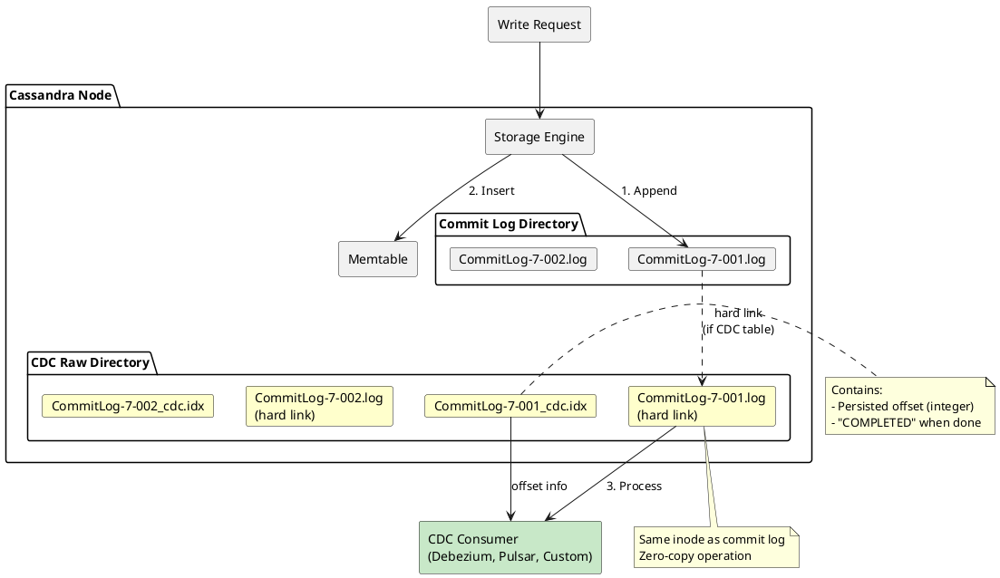
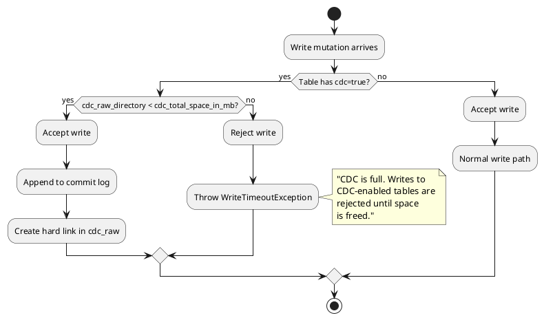
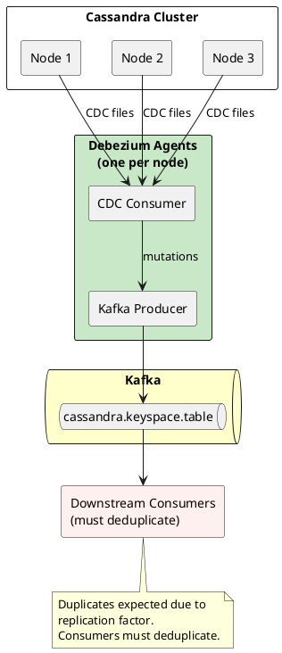
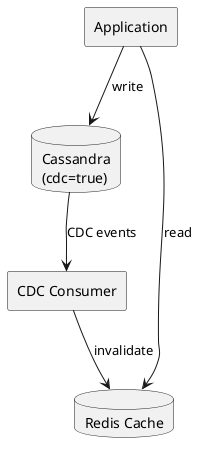

# Change Data Capture (CDC)

Change Data Capture (CDC) provides a mechanism for capturing row-level changes in Cassandra tables. When enabled, CDC creates hard links from commit log segments to a dedicated directory, allowing external systems to consume mutations as they occur.

CDC was introduced in Cassandra 3.8 and is designed for integration with streaming platforms, real-time analytics, and cross-system data synchronization.

---

## Architecture Overview

CDC operates by leveraging the existing commit log infrastructure. Rather than modifying the write path, it creates hard links to commit log segments containing mutations for CDC-enabled tables.



### How CDC Works

1. **Write arrives**: Mutation is written to commit log and memtable (normal write path)
2. **Segment creation**: When a new commit log segment is created, if `cdc_enabled=true`, a hard link is created in `cdc_raw_directory`
3. **Index file creation**: On segment fsync, a `<segment_name>_cdc.idx` file is created containing the byte offset of persisted data
4. **Segment completion**: When the segment is fully flushed, "COMPLETED" is appended to the index file
5. **Consumer processing**: External consumers read segments from `cdc_raw_directory`, respecting offset values for durability
6. **Cleanup**: Consumers must delete processed segments; Cassandra does not automatically clean up CDC files

---

## Configuration

CDC is configured at two levels: node-wide settings in `cassandra.yaml` and per-table settings via CQL.

### Node Configuration (cassandra.yaml)

```yaml
# Enable CDC functionality node-wide
cdc_enabled: true

# Directory for CDC commit log hard links
# Should be on separate spindle from data directories
# Must be on same filesystem as commitlog_directory
cdc_raw_directory: /var/lib/cassandra/cdc_raw

# Maximum space for CDC logs before writes are rejected
# Default: min(4096 MiB, 1/8 of volume space)
cdc_total_space_in_mb: 4096

# How often to check CDC directory space usage
# Default: 250ms
cdc_free_space_check_interval_ms: 250
```

| Parameter | Default | Description |
|-----------|---------|-------------|
| `cdc_enabled` | `false` | Enables CDC node-wide. When `true`, writes to CDC-enabled tables are rejected if `cdc_raw_directory` exceeds space limit |
| `cdc_raw_directory` | `$CASSANDRA_HOME/data/cdc_raw` | Destination for commit log hard links |
| `cdc_total_space_in_mb` | min(4096, 1/8 volume) | Space threshold before write rejection |
| `cdc_free_space_check_interval_ms` | 250 | Frequency of space usage recalculation |

### Table Configuration (CQL)

Enable CDC on individual tables:

```sql
-- Enable CDC when creating table
CREATE TABLE events (
    event_id UUID,
    event_time TIMESTAMP,
    event_type TEXT,
    payload TEXT,
    PRIMARY KEY (event_id)
) WITH cdc = true;

-- Enable CDC on existing table
ALTER TABLE events WITH cdc = true;

-- Disable CDC
ALTER TABLE events WITH cdc = false;
```

---

## CDC File Format

### Commit Log Hard Links

Files in `cdc_raw_directory` are hard links to commit log segments. They share the same inode as the original commit log file, meaning:

- No additional disk space is consumed (until the original segment is recycled)
- Reading from CDC directory reads the same data as the commit log
- Modifications to the original segment are visible through the hard link

```
cdc_raw_directory/
├── CommitLog-7-1702987654321.log      # Hard link to commit log segment
├── CommitLog-7-1702987654321_cdc.idx  # Index file with offset
├── CommitLog-7-1702987654322.log
├── CommitLog-7-1702987654322_cdc.idx
└── ...
```

### Index Files (_cdc.idx)

Each commit log segment in the CDC directory has a corresponding index file:

```
# While segment is being written
1234567

# After segment is complete
1234567
COMPLETED
```

| State | Index File Content | Consumer Action |
|-------|-------------------|-----------------|
| In progress | Integer offset only | Read up to offset bytes only |
| Complete | Offset + "COMPLETED" | Safe to read entire segment and delete |

!!! warning "Durability Guarantee"
    Consumers must only parse data up to the offset specified in the index file. Data beyond that offset may not be durable and could be lost on crash recovery.

---

## Backpressure and Write Rejection

When `cdc_raw_directory` exceeds the configured space limit, Cassandra applies backpressure by rejecting writes to CDC-enabled tables.



### Monitoring CDC Space

Monitor the following metrics to avoid write rejection:

| Metric | Description |
|--------|-------------|
| `CommitLog.CDCTotalSpace` | Total CDC space configured |
| `CommitLog.CDCUsedSpace` | Current CDC space usage |
| `StorageService.CDCRawDirectorySize` | Size of cdc_raw_directory |

### Alerting Recommendations

| Threshold | Action |
|-----------|--------|
| CDC usage > 50% | Warning: Consumer may be falling behind |
| CDC usage > 75% | Critical: Consumer is falling behind |
| CDC usage > 90% | Emergency: Write rejection imminent |

---

## Consumption Patterns

### Consumer Responsibilities

CDC consumers must:

1. **Poll for new segments**: Watch `cdc_raw_directory` for new files
2. **Read index files**: Parse `_cdc.idx` to determine safe read offset
3. **Parse commit log format**: Decode mutations from binary commit log format
4. **Handle duplicates**: Same mutation may appear in multiple segments (replicas)
5. **Delete processed files**: Remove segments after successful processing

!!! danger "Consumer Required"
    Do not enable CDC without an active consumption process. Without consumers deleting processed files, `cdc_raw_directory` fills up and writes to CDC-enabled tables are rejected.

### Integration Options

| Tool | Description | Deduplication | Use Case |
|------|-------------|---------------|----------|
| **Debezium** | Open-source CDC platform | No - consumers must deduplicate | Kafka integration, schema evolution |
| **DataStax CDC for Pulsar** | Official connector | Yes - MD5 digest cache | Apache Pulsar streaming |
| **Custom consumer** | Direct commit log parsing | Must implement | Specialized requirements |

### Debezium Integration

Debezium provides a Cassandra connector that consumes CDC data and produces change events to Kafka:



Key Debezium characteristics:

- Runs agent on each Cassandra node
- Monitors `cdc_raw_directory` for new segments
- Produces Kafka messages with row change data
- **Does not deduplicate**: Due to replication factor, the same mutation appears on multiple nodes; downstream consumers must handle deduplication
- **Default behavior waits for completion**: By default, Debezium waits for the `_cdc.idx` file to be marked "COMPLETED" before processing, adding latency

!!! info "Real-Time Processing Trade-off"
    The default Debezium behavior (waiting for segment completion) adds latency but guarantees durability. Organizations requiring near real-time CDC (sub-second latency) have modified Debezium to process commit logs continuously as data arrives, before the completion marker. This trades durability guarantees for lower latency—on crash, some events may be reprocessed or lost.

---

## Operational Considerations

### Filesystem Requirements

| Requirement | Reason |
|-------------|--------|
| Same filesystem for commitlog and cdc_raw | Hard links cannot span filesystems |
| Separate spindle for cdc_raw (recommended) | Reduces I/O contention with commit log |
| Sufficient space | Consumers must keep up to avoid write rejection |

### Performance Impact

CDC has minimal performance impact on normal operations:

| Operation | Impact |
|-----------|--------|
| Write latency | Negligible (hard link creation is metadata-only) |
| Commit log fsync | Slight increase (index file creation) |
| Disk space | None (hard links share inodes) until consumer processes |
| CPU | None on Cassandra side; consumers bear parsing cost |

### Version Compatibility

| Cassandra Version | CDC Support |
|-------------------|-------------|
| < 3.8 | Not available |
| 3.8 - 3.11 | Basic CDC |
| 4.0+ | Enhanced CDC with improved metrics |
| 5.0+ | CDC improvements for large partitions |

!!! warning "Mixed-Version Clusters"
    Do not enable CDC on mixed-version clusters. Upgrade all nodes to the same version before enabling CDC.

---

## Use Cases

### Event Streaming

Capture mutations as events for downstream processing:

```sql
CREATE TABLE orders (
    order_id UUID,
    customer_id UUID,
    order_time TIMESTAMP,
    status TEXT,
    total DECIMAL,
    PRIMARY KEY (order_id)
) WITH cdc = true;
```

Each insert or update produces a change event containing the full row state.

### Cache Invalidation

Invalidate caches when source data changes:



### Cross-Datacenter Sync

Replicate changes to external systems:

| Source | Target | Method |
|--------|--------|--------|
| Cassandra | Elasticsearch | CDC → Kafka → ES Connector |
| Cassandra | Data Lake | CDC → Kafka → S3 Sink |
| Cassandra | Analytics DB | CDC → Kafka → JDBC Sink |

### Audit Logging

Capture all changes for compliance:

```sql
CREATE TABLE user_profiles (
    user_id UUID PRIMARY KEY,
    email TEXT,
    phone TEXT,
    preferences MAP<TEXT, TEXT>
) WITH cdc = true;
```

CDC events provide a complete audit trail of all profile changes.

---

## Deduplication Strategies

Due to Cassandra's replication, the same mutation is captured on multiple nodes. For RF=3, each write produces up to 3 CDC events. Consumers must deduplicate.

| Strategy | Description | Trade-off |
|----------|-------------|-----------|
| **MD5 digest cache** | Hash mutation content, cache seen digests | Memory-bound; loses state on restart |
| **Kafka exactly-once** | Use Kafka transactions with idempotent producers | Adds latency; requires Kafka configuration |
| **Downstream dedup** | Deduplicate in stream processor (Flink, Spark) | Adds processing layer; more infrastructure |
| **Database constraint** | Use upserts/idempotent writes to target | Target must support; may miss deletes |
| **Single-node consumption** | Consume from one node only | Loses CDC if that node fails |

For high-scale environments (tens of thousands of events per second), dedicated deduplication infrastructure is typically required. Solutions like Apache Flink or custom stateful processors provide the scale and state retention needed for reliable deduplication.

---

## Limitations

| Limitation | Description |
|------------|-------------|
| No built-in parser | Consumers must parse binary commit log format |
| No automatic cleanup | Consumers must delete processed files |
| Space-based backpressure | Write rejection when CDC directory fills |
| Replica duplication | Same mutation captured on all replicas; consumers must deduplicate |
| No filtering | All mutations to CDC-enabled tables are captured |
| Schema changes | Consumers must handle schema evolution |
| Latency vs durability | Real-time processing requires trading off durability guarantees |

---

## Related Documentation

- [Write Path](write-path.md) - Commit log and memtable operations
- [Commit Log Configuration](../../operations/configuration/cassandra-yaml/index.md) - cassandra.yaml settings
- [Monitoring](../../monitoring/index.md) - Metrics and alerting
- [Outbox Pattern](../../application-development/patterns/outbox.md) - Alternative pattern for event publishing
