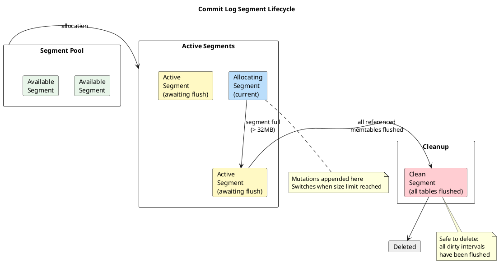
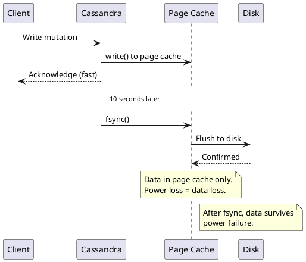
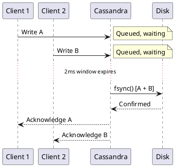
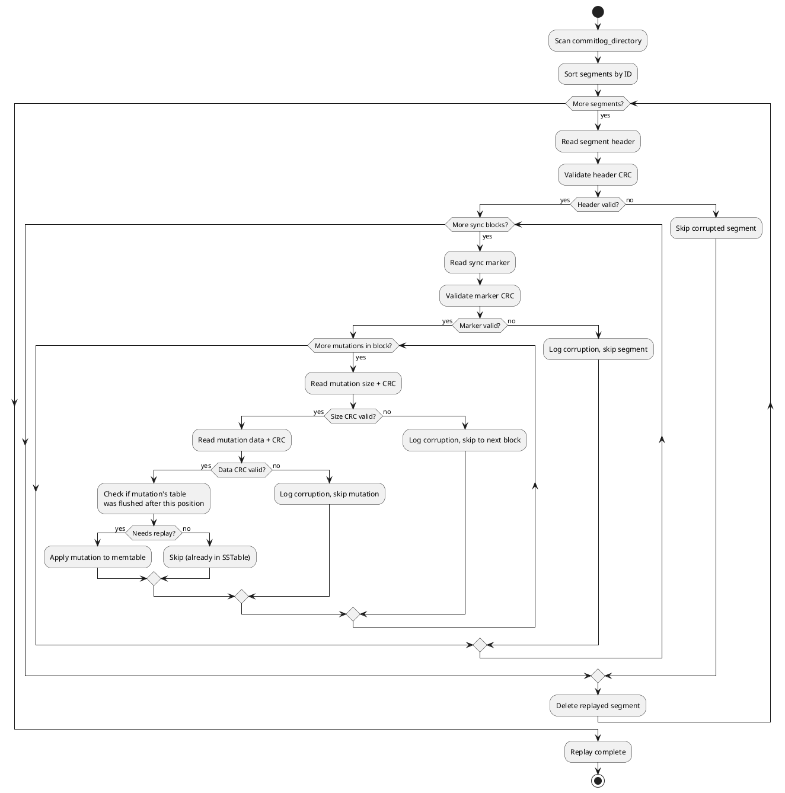

# Commit Log

The commit log is Cassandra's write-ahead log (WAL), providing durability for all mutations. Every write is appended to the commit log before being acknowledged, ensuring data can be recovered after a crash.

For an overview of how the commit log fits into the write path, see [Write Path](write-path.md).

---

## Purpose and Guarantees

The commit log serves a single purpose: **crash recovery**. It is not used for reads—all read operations go through memtables and SSTables.

| Guarantee | Description |
|-----------|-------------|
| Durability | Acknowledged writes survive node restart |
| Ordering | Mutations are replayed in segment order; correctness relies on mutation timestamps |
| Atomicity | Individual mutations are atomic (all-or-nothing) |

!!! info "Commit Log vs Replication"
    The commit log provides single-node durability. For cluster-wide durability, Cassandra relies on replication. With RF=3 and QUORUM writes, data survives even if one node loses its commit log before flushing.

---

## Segment Architecture

The commit log is organized into segments—fixed-size files that are allocated, filled, and eventually deleted.



### Segment States

| State | Description |
|-------|-------------|
| **Available** | Allocated, empty, queued for use |
| **Allocating** | Currently receiving mutations |
| **Active** | Full (reached `commitlog_segment_size_in_mb`), awaiting memtable flush |
| **Clean** | All referenced data flushed to SSTables; segment is deleted |

### Segment Allocation

The `CommitLogSegmentManager` maintains a pool of available segments to ensure a new segment is always ready when the current one fills. Segments are allocated on demand—they are not pre-allocated to their full size on disk.

**Memory-mapped segments** (default): The segment file is created and memory-mapped. The file grows as mutations are appended, up to `commitlog_segment_size_in_mb`.

**Compressed/encrypted segments**: Mutations are buffered in memory and written in blocks. The on-disk size depends on compression ratio.

!!! note "Historical: Pre-allocation and Recycling (removed in 2.2)"
    Prior to Cassandra 2.2, segments were pre-allocated to their full size (128MB default) and recycled after use. This was removed to reduce page cache pressure and simplify the code. Modern Cassandra deletes segments when clean rather than recycling them.

### Dirty Interval Tracking

Each segment maintains a map of which table mutations it contains and their position ranges:

```
Segment: CommitLog-7-1702345678901.log

Dirty Intervals:
┌─────────────────┬────────────────────┐
│ Table ID        │ Position Range     │
├─────────────────┼────────────────────┤
│ users           │ [1024, 15360]      │
│ orders          │ [2048, 31744]      │
│ events          │ [8192, 28672]      │
└─────────────────┴────────────────────┘
```

When a memtable flushes, it reports its commit log position range. The segment marks those intervals as clean. Once all intervals are clean, the segment is deleted.

---

## Segment File Format

Each segment file contains a header followed by sync blocks of serialized mutations.

### File Structure

```
┌─────────────────────────────────────────────────────────────┐
│                         HEADER                              │
├──────────┬───────────┬─────────────┬────────────┬───────────┤
│ Version  │ Segment   │ Params Len  │ Params     │ Header    │
│ (4 bytes)│ ID (8)    │ (2 bytes)   │ (JSON)     │ CRC (4)   │
└──────────┴───────────┴─────────────┴────────────┴───────────┘

┌─────────────────────────────────────────────────────────────┐
│                      SYNC BLOCK 1                           │
├─────────────────────────────────────────────────────────────┤
│ Sync Marker: [next block offset (4) | marker CRC (4)]       │
├─────────────────────────────────────────────────────────────┤
│ Mutation 1: [size (4) | size CRC (4) | data | data CRC (4)] │
│ Mutation 2: [size (4) | size CRC (4) | data | data CRC (4)] │
│ ...                                                         │
└─────────────────────────────────────────────────────────────┘

┌─────────────────────────────────────────────────────────────┐
│                      SYNC BLOCK 2                           │
│                         ...                                 │
└─────────────────────────────────────────────────────────────┘
```

### Header Fields

| Field | Size | Description |
|-------|------|-------------|
| Version | 4 bytes | Commit log format version |
| Segment ID | 8 bytes | Unique segment identifier |
| Parameters length | 2 bytes | Length of JSON parameters (unsigned short) |
| Parameters | Variable | JSON: compression/encryption settings |
| Header CRC | 4 bytes | CRC32 checksum of header |

### Sync Block Structure

Each sync block begins with a marker indicating the offset to the next block:

| Field | Size | Description |
|-------|------|-------------|
| Next offset | 4 bytes | File position of next sync block |
| Marker CRC | 4 bytes | CRC32 of the offset value |

### Mutation Entry Format

| Field | Size | Description |
|-------|------|-------------|
| Size | 4 bytes | Serialized mutation size |
| Size CRC | 4 bytes | CRC32 of size field |
| Data | Variable | Serialized mutation bytes |
| Data CRC | 4 bytes | CRC32 of mutation data |

The dual CRC design (size + data) allows detection of both truncation and corruption during replay.

---

## Sync Modes

The sync mode controls when data is flushed from OS page cache to persistent storage.

### Periodic (Default)

```yaml
commitlog_sync: periodic
commitlog_sync_period_in_ms: 10000
```

Mutations are written to the page cache and acknowledged immediately. A background thread calls `fsync()` every N milliseconds.



**Trade-off**: Lowest latency, but up to `commitlog_sync_period_in_ms` of data can be lost on power failure (mitigated by replication).

### Batch

```yaml
commitlog_sync: batch
commitlog_sync_batch_window_in_ms: 2
```

Mutations are batched for up to N milliseconds, then flushed together with a single `fsync()`.



**Trade-off**: Higher latency (waits for batch window), but stronger single-node durability.

### Group

```yaml
commitlog_sync: group
commitlog_sync_group_window_in_ms: 1000
```

Similar to batch, but with a larger default window. Mutations are grouped and synced together.

| Mode | Default Window | Latency | Durability |
|------|----------------|---------|------------|
| periodic | 10,000 ms | Lowest | Weakest (single-node) |
| group | 1,000 ms | Low | Moderate |
| batch | 2 ms | Higher | Strongest |

---

## Segment Types

The segment type determines how data is written to disk.

### Memory-Mapped (Default)

```yaml
# No special configuration - this is the default
```

Uses memory-mapped I/O. The segment is mapped into virtual memory, and writes go directly to the mapped region. The OS handles flushing based on sync mode.

**Characteristics:**

- Simplest implementation
- Relies on OS page cache management
- No compression overhead

### Compressed

```yaml
commitlog_compression:
  - class_name: LZ4Compressor
    parameters: {}
```

Mutations are compressed in memory before writing to disk.

| Algorithm | Class Name | Ratio | CPU |
|-----------|------------|-------|-----|
| LZ4 | `LZ4Compressor` | ~2-3x | Very low |
| Snappy | `SnappyCompressor` | ~2x | Low |
| Deflate | `DeflateCompressor` | ~4-5x | High |

**Characteristics:**

- Reduces disk I/O
- Smaller commit log footprint
- Slight CPU overhead
- Compression happens in fixed-size buffers before writing

### Encrypted

```yaml
transparent_data_encryption_options:
  enabled: true
  chunk_length_kb: 64
  cipher: AES/CBC/PKCS5Padding
  key_alias: testing:1
  key_provider:
    - class_name: org.apache.cassandra.security.JKSKeyProvider
      parameters:
        - keystore: conf/.keystore
          keystore_password: changeit
          store_type: JCEKS
          key_password: changeit
```

Data is written in configurable-size blocks. Each block is compressed (if enabled) then encrypted.

**Block Structure (Encrypted):**

```
┌───────────────────────────────────────────┐
│ Total Block Length (unencrypted, 4 bytes) │
│ Encrypted Data Length (unencrypted, 4)    │
│ Encrypted Data (variable)                 │
│   └── Contains: compressed mutation data  │
└───────────────────────────────────────────┘
```

The length fields are unencrypted to allow reading block boundaries without decryption.

---

## Replay Process

On startup, Cassandra replays commit log segments to recover mutations that weren't flushed to SSTables.

### Replay Algorithm



### Replay Filtering

Not all mutations in a segment need replay. Each SSTable records the commit log position at flush time. During replay:

1. Read mutation's commit log position
2. Check if the mutation's table has an SSTable flushed after that position
3. If yes, skip (data already durable in SSTable)
4. If no, apply mutation to memtable

### Handling Corruption

| Corruption Type | Detection | Recovery |
|-----------------|-----------|----------|
| Header corruption | Header CRC mismatch | Skip entire segment |
| Sync marker corruption | Marker CRC mismatch | Skip to next segment |
| Size field corruption | Size CRC mismatch | Skip to next sync block |
| Data corruption | Data CRC mismatch | Skip mutation, continue |
| Truncation | Unexpected EOF | Stop replay at truncation point |

The CRC-based design allows partial recovery—corruption in one mutation doesn't prevent replaying subsequent valid mutations.

---

## Configuration Reference

### Core Settings

| Parameter | Default | Description |
|-----------|---------|-------------|
| `commitlog_directory` | `$CASSANDRA_HOME/data/commitlog` | Commit log location |
| `commitlog_segment_size_in_mb` | 32 | Max segment size before switching |
| `commitlog_total_space_in_mb` | 8192 | Max total commit log space |

### Sync Settings

| Parameter | Default | Description |
|-----------|---------|-------------|
| `commitlog_sync` | `periodic` | Sync mode: periodic, batch, or group |
| `commitlog_sync_period_in_ms` | 10000 | Periodic sync interval |
| `commitlog_sync_batch_window_in_ms` | 2 | Batch mode window |
| `commitlog_sync_group_window_in_ms` | 1000 | Group mode window |

### Compression Settings

| Parameter | Default | Description |
|-----------|---------|-------------|
| `commitlog_compression` | none | Compression algorithm configuration |

### Encryption Settings

| Parameter | Default | Description |
|-----------|---------|-------------|
| `transparent_data_encryption_options.enabled` | false | Enable encryption |
| `transparent_data_encryption_options.chunk_length_kb` | 64 | Encryption block size |
| `transparent_data_encryption_options.cipher` | AES/CBC/PKCS5Padding | Cipher algorithm |

---

## Operational Considerations

### Storage Recommendations

| Recommendation | Rationale |
|----------------|-----------|
| Dedicated disk/volume | Isolate commit log I/O from data I/O |
| Fast storage (NVMe/SSD) | Commit log is write-intensive |
| Battery-backed cache | Allows safer periodic sync with durability |
| Separate from `data_file_directories` | Prevents commit log from competing with compaction |

### Monitoring

```bash
# Check commit log size
du -sh /var/lib/cassandra/commitlog/

# Count segments
ls -1 /var/lib/cassandra/commitlog/*.log | wc -l

# Monitor via JMX
nodetool sjk mx -b "org.apache.cassandra.metrics:type=CommitLog,name=TotalCommitLogSize" -f Value
nodetool sjk mx -b "org.apache.cassandra.metrics:type=CommitLog,name=PendingTasks" -f Value
```

| Metric | Description | Alert Threshold |
|--------|-------------|-----------------|
| `TotalCommitLogSize` | Current size of all segments | > 75% of `commitlog_total_space_in_mb` |
| `PendingTasks` | Mutations awaiting sync | Sustained high values |
| `WaitingOnCommit` | Time waiting for fsync | > 100ms average |
| `WaitingOnSegmentAllocation` | Time waiting for new segment | Should be ~0 |

### Troubleshooting

| Symptom | Possible Cause | Resolution |
|---------|----------------|------------|
| High `WaitingOnCommit` | Slow disk, high load | Faster storage, tune sync mode |
| Growing commit log | Memtables not flushing | Check `memtable_flush_writers`, disk space |
| Slow startup | Large commit log replay | More frequent flushing, check flush triggers |
| Segment allocation delays | Disk full or slow | Free space, faster storage |

---

## Version History

| Version | Cassandra | Changes |
|---------|-----------|---------|
| 6 | 3.0 - 3.11 | Introduced with storage engine rewrite |
| 7 | 4.0+ | Current format, improved checksums |

See [Segment Allocation](#segment-allocation) for details on segment recycling removal in 2.2.

---

## Related Documentation

- [Write Path](write-path.md) - How writes flow through the storage engine
- [Change Data Capture (CDC)](cdc.md) - Exposing commit log for external consumption
- [Memtables](write-path.md#memtable) - In-memory write buffer
- [Backup and Restore](../../operations/backup-restore/index.md) - Commit log in backup strategies
