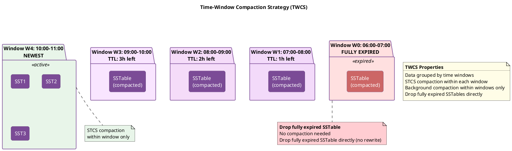
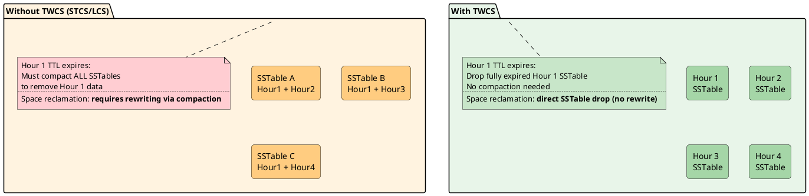
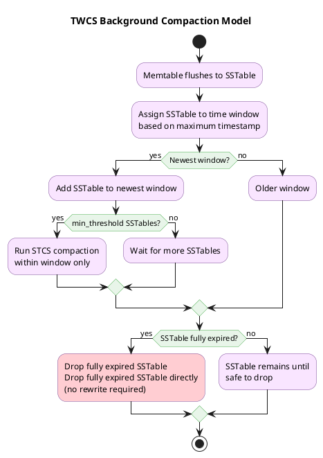
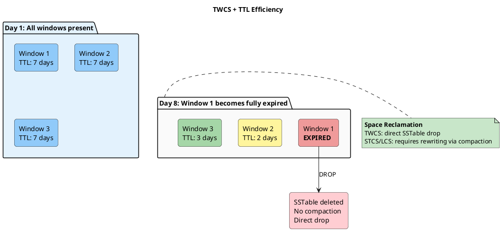
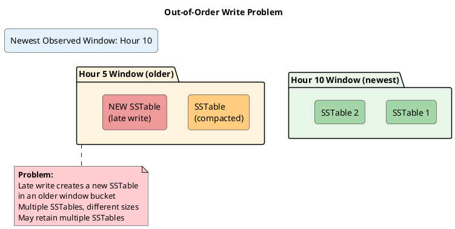
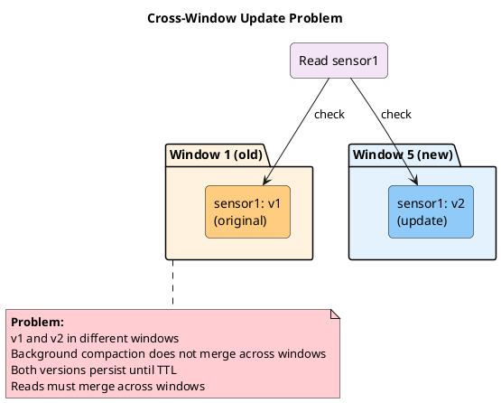
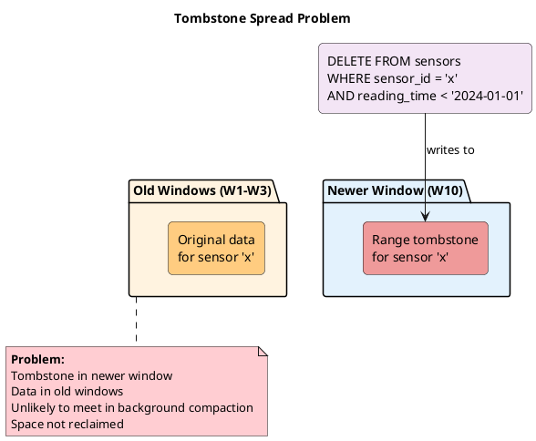
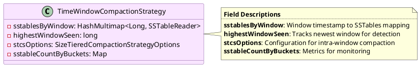

# Time-Window Compaction Strategy (TWCS)

!!! note "Cassandra 5.0+"
    Starting with Cassandra 5.0, [Unified Compaction Strategy (UCS)](ucs.md) is the recommended compaction strategy for most workloads, including time-series patterns. UCS can handle time-series data efficiently with appropriate configuration. TWCS remains fully supported for existing deployments.

!!! warning "Optimized for Append-Only Workloads"
    TWCS is designed for **append-only time-series data** and performs best when data is written once and not updated. When newer writes for previously written data land in SSTables assigned to newer windows, TWCS background compaction does not merge those SSTables back into older windows. This means both versions persist, causing read amplification and preventing efficient space reclamation. TWCS can tolerate occasional updates, but frequent updates significantly degrade performance and space efficiency.

!!! danger "Avoid Explicit DELETE Statements"
    TWCS is optimized around time-windowed SSTables and expiration handling. Tombstones from `DELETE` operations are written into SSTables that may be assigned to newer windows, while the data they mark for deletion exists in older windows. Since TWCS background compaction selects candidates within a single window bucket, tombstones and their target data are unlikely to meet during normal background compaction, preventing proper space reclamation. Use TTL-based expiration instead.

TWCS is designed for time-series data. It groups SSTables into time-window buckets using each SSTable's maximum timestamp. In normal background compaction, candidate selection is bucket-based, so compactions are chosen from a single window bucket rather than spanning multiple window buckets. This can enable efficient space reclamation when TTL-aligned SSTables become fully expired and are safe to drop.

---

## Background and History

### Origins

Time-Window Compaction Strategy was introduced in Cassandra 3.0.8/3.8 (2016) to address the inefficiency of STCS and LCS for time-series workloads with TTL. It evolved from DateTieredCompactionStrategy (DTCS), which was introduced in Cassandra 2.0.11/2.1.1 but proved problematic in production due to complexity and edge cases.

TWCS simplified the time-based approach: rather than complex tiering by age, it uses fixed-size time windows. This design made behavior predictable and eliminated many DTCS edge cases.

### Design Motivation

Time-series data has unique characteristics that STCS and LCS handle poorly:

1. **Append-only writes**: Data is written once and never updated
2. **Time-ordered access**: Queries typically request recent data or specific time ranges
3. **Uniform expiration**: Data often expires after a fixed retention period (TTL)
4. **High volume**: Continuous streams of measurements, events, or logs

With STCS, expired data requires compaction to reclaim space—expensive for large datasets. With LCS, the leveled structure provides no benefit since time-series queries don't need key-range organization.

TWCS addresses these issues by:

- Grouping data into time-based windows
- Background compaction selecting within a single window bucket
- Enabling fully expired SSTables to be dropped when the compaction controller determines they are safe to reclaim

| Aspect | STCS | LCS | TWCS |
|--------|------|-----|------|
| Space reclamation | Requires compaction | Requires compaction | Drop fully expired SSTable |
| TTL efficiency | Poor (scattered data) | Poor (spread across levels) | Excellent (window-aligned) |
| Time-range queries | No optimization | No optimization | Natural data locality |
| Write amplification | Low | High | Low |

---

## How TWCS Works in Theory

### Core Concept

TWCS organizes compaction around time windows:

1. **Window assignment**: Each SSTable is assigned to a window based on its maximum timestamp
2. **Intra-window compaction**: TWCS applies STCS-style prioritization to the newest window and allows compaction of older windows when sufficient SSTables are present (see [Intra-Window Compaction](#intra-window-compaction) for details).
3. **Background compaction is bucket-based**: Normal background compaction selects candidates from a single window bucket rather than spanning multiple windows. Note that user-triggered compaction (e.g., `nodetool compact`) and maximal compaction may operate across windows.
4. **Window expiration**: TWCS periodically checks for fully expired SSTables and can reclaim them directly when the compaction controller determines they are safe to drop.

### Time Window Structure



### Window Assignment Algorithm

Each SSTable is assigned to exactly one window based on its maximum timestamp:

```
SSTable metadata:
  Minimum timestamp: 2024-01-15 10:23:45
  Maximum timestamp: 2024-01-15 10:58:12

Window configuration:
  compaction_window_unit: HOURS
  compaction_window_size: 1

Calculation:
  Window start = floor(max_timestamp / (window_size × unit)) × (window_size × unit)
  Window start = floor(10:58:12 / (1 × 1 hour)) × (1 × 1 hour)
  Window start = 10:00:00

Result: SSTable assigned to window [10:00:00 - 11:00:00)
```

Using maximum timestamp ensures that all data in the SSTable falls within or before the assigned window.

### Intra-Window Compaction

TWCS applies STCS-style bucketing and prioritization to the newest window it has observed. Older windows are also eligible for compaction when they contain at least two SSTables:

1. **Newest window**: SSTables are grouped by size using STCS bucketing. Compaction triggers when `min_threshold` similar-sized SSTables exist.
2. **Older windows**: Any window with at least 2 SSTables is eligible for compaction, trimmed to `max_threshold`.
3. In practice, completed windows often converge toward a small number of SSTables, but convergence to exactly one SSTable is not guaranteed.

### TTL and Space Reclamation

The key advantage of TWCS is that fully expired SSTables can be dropped directly, avoiding the need to rewrite old and new data together to reclaim expired data:



---

## Benefits

### Efficient TTL Expiration

TWCS's primary advantage is space reclamation without compaction:

- Fully expired SSTables can be dropped directly rather than rewritten through compaction
- More predictable disk space recovery when TTL and windowing align well

### Low Write Amplification

Similar to STCS, TWCS has low write amplification:

- Data is written once to initial SSTable
- Compacted only within its window (typically once)
- TWCS generally has lower write amplification than LCS for append-oriented time-series workloads

### Time-Based Data Locality

Queries for time ranges benefit from data organization:

- Recent data in newer windows
- Historical queries touch specific windows
- Reduced SSTable overlap for time-range scans

### Predictable Behavior

Fixed window sizes make operations predictable:

- Window boundaries are deterministic
- Better estimate when space may be reclaimed
- Plan capacity based on retention period

### Reduced Compaction I/O

By avoiding cross-window compaction:

- Less total data movement
- Compaction confined to individual window buckets
- Older windows are typically no longer selected as the newest compaction bucket

---

## Drawbacks

### Best with Append-Only Workloads

TWCS performs optimally with append-only data:

- Updates to old data can create SSTables assigned to newer windows
- Background compaction does not merge SSTables from different windows, so both versions persist
- Both versions persist until TTL expires
- Occasional updates are tolerable but degrade read performance and space efficiency proportionally to update frequency

### Sensitive to Out-of-Order Writes

Late-arriving data causes problems:

```
Newest observed window: Hour 10
Late write arrives for Hour 5

Result:
  - New SSTable assigned to Hour 5 window bucket
  - Hour 5 bucket now has multiple SSTables
  - These may not compact together (different sizes)
  - Some SSTables may not be eligible for direct expiry-based reclamation yet
```

### Tombstone Inefficiency

Explicit deletes (DELETE statements) are problematic:

- Tombstone written to a newer window
- Original data in old window
- Tombstone and data are unlikely to meet during normal background compaction
- Must wait for both to expire via TTL

### Requires Careful Window Sizing

Window size significantly impacts behavior:

- Too small: Many windows, many SSTables, overhead
- Too large: Less efficient space reclamation timing
- Must match data patterns and TTL

### Not Suitable for All Time-Series

Some time-series patterns don't fit:

- Data without TTL (windows accumulate forever)
- Frequently corrected/updated data
- Heavy delete workloads

---

## When to Use TWCS

### Ideal Use Cases

| Workload Pattern | Why TWCS Works |
|------------------|----------------|
| IoT sensor data | Append-only, TTL-based retention |
| Application metrics | Time-ordered, fixed retention |
| Log aggregation | Immutable events, time-based queries |
| Financial tick data | Sequential writes, regulatory retention |
| Monitoring data | High volume, predictable expiration |

### Avoid TWCS When

| Workload Pattern | Why TWCS Is Wrong |
|------------------|-------------------|
| Mutable data | Updates span windows |
| No TTL defined | Windows accumulate indefinitely |
| Heavy delete workload | Tombstones are unlikely to meet older data during normal background compaction |
| Significant out-of-order writes | Windows may retain multiple SSTables |
| Non-time-based access patterns | No benefit from time organization |

---

## How TWCS Works



### Window Assignment

Each SSTable is assigned to a time window based on its maximum timestamp:

```
SSTable with data timestamps:
- Min timestamp: 2024-01-15 10:30:00
- Max timestamp: 2024-01-15 10:45:00

With 1-hour windows:
- Window: 2024-01-15 10:00:00 - 11:00:00
- SSTable assigned to this window
```

---

## Configuration

```sql
CREATE TABLE sensor_readings (
    sensor_id text,
    reading_time timestamp,
    value double,
    PRIMARY KEY ((sensor_id), reading_time)
) WITH CLUSTERING ORDER BY (reading_time DESC)
AND compaction = {
    'class': 'TimeWindowCompactionStrategy',

    -- Time window size
    'compaction_window_unit': 'HOURS',  -- MINUTES, HOURS, DAYS
    'compaction_window_size': 1,        -- 1 hour windows

    -- Expired SSTable handling
    'unsafe_aggressive_sstable_expiration': false
}
AND default_time_to_live = 86400  -- 24 hour TTL
AND gc_grace_seconds = 3600;      -- 1 hour (shorter for time-series)
```

### Configuration Parameters

#### TWCS-Specific Options

| Parameter | Default | Description |
|-----------|---------|-------------|
| `compaction_window_unit` | DAYS | Time unit for windows. Valid values: MINUTES, HOURS, DAYS. |
| `compaction_window_size` | 1 | Number of units per window. Must be ≥ 1. |
| `timestamp_resolution` | MICROSECONDS | Resolution of timestamps in data. Valid values: SECONDS, MILLISECONDS, MICROSECONDS, NANOSECONDS. A warning is logged if non-default values are used. |
| `expired_sstable_check_frequency_seconds` | 600 | How often (in seconds) to check for fully expired SSTables that can be dropped. Cannot be negative. |
| `unsafe_aggressive_sstable_expiration` | false | When true, drops SSTables without checking for tombstones affecting other SSTables. Requires JVM flag `-DALLOW_UNSAFE_AGGRESSIVE_SSTABLE_EXPIRATION=true`. |

#### Inherited STCS Options

TWCS reuses STCS bucketing and sizing options for compaction candidate selection, especially in the newest window, so these options also apply:

| Parameter | Default | Description |
|-----------|---------|-------------|
| `min_threshold` | 4 | Minimum SSTables in a window to trigger intra-window compaction. |
| `max_threshold` | 32 | Maximum SSTables to compact at once within a window. |
| `bucket_high` | 1.5 | Upper bound multiplier for STCS bucketing within windows. |
| `bucket_low` | 0.5 | Lower bound multiplier for STCS bucketing within windows. |

#### Common Compaction Options (Inherited)

| Parameter | Default | Description |
|-----------|---------|-------------|
| `enabled` | true | Enables background compaction. |
| `tombstone_threshold` | 0.2 | Ratio of droppable tombstones that triggers single-SSTable compaction. |
| `tombstone_compaction_interval` | 86400 | Minimum seconds between tombstone compaction attempts. |
| `unchecked_tombstone_compaction` | false | Bypasses tombstone compaction eligibility pre-checking. |
| `only_purge_repaired_tombstones` | false | Only purge tombstones from repaired SSTables. |
| `log_all` | false | Enables detailed compaction logging. |

!!! info "Tombstone Compactions Disabled by Default"
    TWCS disables tombstone compactions unless one of the tombstone-related options (`tombstone_threshold`, `tombstone_compaction_interval`, or `unchecked_tombstone_compaction`) is explicitly present with a value other than `"false"`. This behavior is set in the strategy constructor.

### Window Size Guidelines

| TTL | Recommended Window | Result |
|-----|-------------------|--------|
| 1 hour | 5-10 minutes | ~6-12 windows |
| 24 hours | 1 hour | 24 windows |
| 7 days | 1 day | 7 windows |
| 30 days | 1 day | 30 windows |
| 90 days | 1 week | ~13 windows |

**Rule of thumb:** Choose window size so that 10-30 windows exist before data expires.

---

## TTL Integration

The primary benefit of TWCS is efficient TTL expiration:



### gc_grace_seconds Consideration

For time-series with TWCS, `gc_grace_seconds` can often be reduced:

```sql
-- Traditional table: 10 days (default)
gc_grace_seconds = 864000

-- Time-series with frequent repair: 1 hour
gc_grace_seconds = 3600

-- Time-series with very frequent repair: 10 minutes
gc_grace_seconds = 600
```

**Warning:** Reducing `gc_grace_seconds` requires running repair at least that frequently to prevent zombie data resurrection.

---

## Production Issues

### Issue 1: Out-of-Order Writes

**Symptoms:**

- Old windows have multiple SSTables that do not compact together
- Space not reclaimed when TTL expires
- SSTable count growing unexpectedly

**Diagnosis:**

```bash
# List SSTables with timestamps
for f in /var/lib/cassandra/data/keyspace/table-*/*-Data.db; do
    echo "=== $f ==="
    tools/bin/sstablemetadata "$f" | grep -E "Minimum|Maximum"
done
```

**Cause:**



**Solutions:**

1. Ensure data arrives in order (fix data pipeline)
2. Use larger windows to accommodate expected delays:
   ```sql
   -- If data can arrive up to 2 hours late, use 4-hour windows
   'compaction_window_size': 4
   ```
3. Accept some space inefficiency for late-arriving data

### Issue 2: Updates to Old Data

**Symptoms:**

- Reads merging data across many windows
- Higher read latency than expected
- Multiple versions of same partition key

**Cause:**

TWCS assumes append-only. Updates violate this assumption:



**Solution:**

TWCS is only appropriate for append-only time-series. If updates are required, consider:

1. LCS for frequently updated data
2. Redesign data model to avoid updates

### Issue 3: Tombstone Spread

**Symptoms:**

- Space not reclaimed after deletes
- Tombstones persisting beyond `gc_grace_seconds`

**Cause:**



**Solution:**

Avoid explicit deletes with TWCS. Use TTL instead:

```sql
-- Instead of DELETE, let TTL handle expiration
INSERT INTO sensors (sensor_id, reading_time, value)
VALUES ('x', '2024-01-15 10:30:00', 42.5)
USING TTL 604800;  -- 7 days
```

### Issue 4: Window Not Compacting

**Symptoms:**

- Multiple SSTables in completed (old) windows
- Expected single SSTable per window not achieved

**Diagnosis:**

```bash
# Check SSTables per window
nodetool tablestats keyspace.table
```

**Causes:**

1. Insufficient similar-sized SSTables (STCS within window)
2. Out-of-order writes
3. Compaction not keeping pace

**Solutions:**

```sql
-- Lower threshold for intra-window compaction
ALTER TABLE keyspace.table WITH compaction = {
    'class': 'TimeWindowCompactionStrategy',
    'compaction_window_unit': 'HOURS',
    'compaction_window_size': 1,
    'min_threshold': 2  -- Compact with fewer SSTables
};
```

---

## Advanced Configuration

### Aggressive SSTable Expiration

When data has uniform TTL and no deletes, aggressive expiration can drop SSTables without full compaction:

```sql
ALTER TABLE keyspace.table WITH compaction = {
    'class': 'TimeWindowCompactionStrategy',
    'compaction_window_unit': 'HOURS',
    'compaction_window_size': 1,
    'unsafe_aggressive_sstable_expiration': true
};
```

**Warning:** "unsafe" means:

- Does not check for tombstones affecting other SSTables
- Only safe when:
  - All data has the same TTL
  - No explicit deletes
  - No range tombstones

### Window Size Selection

| Factor | Consideration | Recommendation |
|--------|---------------|----------------|
| **Query patterns** | Queries typically span 1 hour | Windows ≤ 1 hour |
| | Queries span 1 day | Windows ≤ 1 day |
| **Write rate** | High write rate | Smaller windows (more SSTables, manageable size) |
| | Low write rate | Larger windows (fewer SSTables) |
| **TTL duration** | Short TTL (hours) | Minute/hour windows |
| | Long TTL (weeks) | Day windows |
| **Late-arriving data** | Data arrives up to X late | Window size > X |

---

## Monitoring TWCS

### Key Indicators

| Metric | Healthy | Investigate |
|--------|---------|-------------|
| SSTables per window | 1-2 (completed) | >4 |
| Total SSTable count | ~windows × 2 | Much higher |
| Pending compactions | Low | Sustained growth |
| Space after SSTables become fully expired | Decreasing | Not changing |

### Commands

```bash
# Check SSTable timestamps
for f in /var/lib/cassandra/data/keyspace/table-*/*-Data.db; do
    tools/bin/sstablemetadata "$f" | grep -E "Minimum|Maximum timestamp"
done

# Monitor space usage over time
watch 'nodetool tablestats keyspace.table | grep "Space used"'
```

---

## Implementation Internals

This section documents implementation details from the Cassandra source code.

### Window Boundary Calculation

Conceptually, window boundaries are calculated by flooring the timestamp to the configured window size. In the current implementation, `getWindowBoundsInMillis()` first normalizes the timestamp to seconds, computes lower and upper bounds in seconds for the configured unit (MINUTES, HOURS, or DAYS), and then converts the result back to milliseconds.

The conceptual formula:

$$
\begin{aligned}
L &= t - (t \mod (u \times w)) \\
U &= L + (u \times w) - 1
\end{aligned}
$$

Where:

- $L$ = lower bound (window start)
- $U$ = upper bound (window end)
- $t$ = timestamp
- $w$ = `compaction_window_size`
- $u$ = unit size (e.g., 60 seconds for MINUTES, 3600 seconds for HOURS, 86400 seconds for DAYS)

### SSTable Window Assignment

Each SSTable is assigned to exactly one window based on its **maximum timestamp**:

1. Extract the maximum timestamp from SSTable metadata
2. Calculate window bounds using the formula above
3. The SSTable belongs to the window containing its max timestamp

Using max timestamp (rather than min) ensures all data in the SSTable falls within or before the assigned window.

### Compaction Candidate Selection

The candidate selection algorithm processes windows in order:

1. **Expired SSTables**: Identified first during candidate selection and included whenever found (checked every `expired_sstable_check_frequency_seconds`)
2. **Newest window** (determined by `highestWindowSeen`, not wall clock time): Uses STCS-style bucketing and prioritization when at least `min_threshold` SSTables are present
3. **Older windows**: Any window with ≥2 SSTables is eligible for compaction
4. **Result limiting**: Candidates trimmed to `max_threshold`

### Internal Data Structures



### Constants Reference

| Constant | Value | Description |
|----------|-------|-------------|
| Default window unit | DAYS | Time unit for windows |
| Default window size | 1 | One unit per window |
| Default timestamp resolution | MICROSECONDS | Expected timestamp precision |
| Expired check frequency | 600 seconds | How often to check for fully expired SSTables |
| Default min_threshold | 4 | Minimum SSTables for intra-window compaction |

---

## Related Documentation

- **[Compaction Overview](index.md)** - Concepts and strategy selection
- **[Size-Tiered Compaction (STCS)](stcs.md)** - Used for intra-window compaction
- **[Leveled Compaction (LCS)](lcs.md)** - Alternative for read-heavy workloads
- **[Unified Compaction (UCS)](ucs.md)** - Recommended strategy for Cassandra 5.0+
- **[Tombstones](../tombstones.md)** - gc_grace_seconds and tombstone handling
- **[Compaction Management](../../../operations/compaction-management/index.md)** - Tuning and troubleshooting