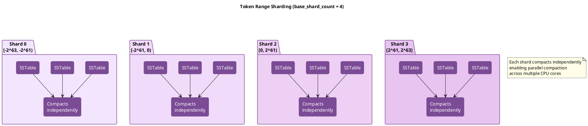
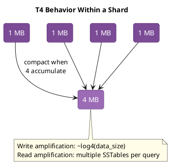
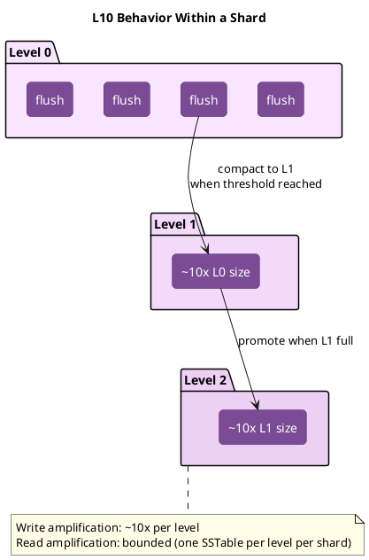

# Unified Compaction Strategy (UCS)

UCS (Cassandra 5.0+) is an adaptive compaction strategy that combines concepts from STCS, LCS, and TWCS. It uses sharding and density-based triggering to provide flexible, efficient compaction across varying workloads.

---

## Background and History

### Origins

Unified Compaction Strategy was introduced in Cassandra 5.0 (2023) as a culmination of years of research into compaction efficiency. It was developed primarily by DataStax engineers, building on academic work around "write-optimized" and "read-optimized" LSM-tree variants and practical experience with STCS, LCS, and TWCS limitations.

The key insight driving UCS was that traditional compaction strategies forced users to choose between write amplification (LCS) and read amplification (STCS), with no middle ground. UCS provides a unified framework where this trade-off is configurable via a single parameter.

### Design Motivation

Each traditional strategy has fundamental limitations:

**STCS limitations:**
- No upper bound on read amplification
- Large SSTables accumulate without compacting
- Space amplification during major compactions

**LCS limitations:**
- High write amplification (~10× per level)
- L0 backlog under write pressure
- Cannot keep pace with write-heavy workloads

**TWCS limitations:**
- Only suitable for append-only time-series
- Breaks with out-of-order writes or updates
- Tombstone handling issues

UCS addresses these by:

1. **Unifying the compaction model**: Single configurable strategy replaces three separate implementations
2. **Sharding**: Token range divided into independent units for parallel compaction
3. **Density-based triggering**: Compaction decisions based on data density, not just counts
4. **Configurable read/write trade-off**: Single parameter (`scaling_parameters`) adjusts behavior

### Academic Foundation

UCS draws from research on LSM-tree optimization:

- **Dostoevsky (2018)**: Demonstrated that tiered and leveled compaction exist on a continuum
- **Monkey (2017)**: Showed how to tune bloom filters and compaction together
- **Lazy Leveling**: Hybrid approach combining tiered and leveled properties

The `scaling_parameters` in UCS directly implements these theoretical insights, allowing operators to position their compaction strategy anywhere on the tiered-to-leveled spectrum.

---

## How UCS Works in Theory

### Core Concepts

UCS introduces several concepts that differ from traditional strategies:

**Shards**: The token range is divided into fixed segments that compact independently. This enables parallelism and bounds the scope of each compaction.

**Runs**: A sequence of SSTables that collectively represent one "generation" of data. Runs replace the concept of levels (LCS) or tiers (STCS).

**Density**: The amount of data per token range unit. UCS triggers compaction when density reaches thresholds, not when SSTable counts reach thresholds.

**Scaling Parameter**: A single value (e.g., T4, L10) that determines whether UCS behaves more like STCS (tiered) or LCS (leveled).


### Shard Structure



Each shard maintains its own set of SSTables and compacts without coordination with other shards. This provides:

- **Parallelism**: Multiple CPU cores compact different shards simultaneously
- **Bounded scope**: Each compaction touches only one shard's data
- **Independent progress**: Slow shards don't block fast shards

*Note: Actual performance benefits from sharding depend on data distribution, hardware characteristics, and workload patterns. Results may vary from theoretical expectations.*

### Tiered Mode (T)

When `scaling_parameters` starts with `T` (e.g., T4), UCS behaves similarly to STCS:



The number after `T` specifies the fanout—how many SSTables accumulate before compaction. Higher values (T8, T16) reduce write amplification but increase read amplification.

### Leveled Mode (L)

When `scaling_parameters` starts with `L` (e.g., L10), UCS behaves similarly to LCS:




The number after `L` specifies the size ratio between levels. L10 means each level is 10× larger than the previous, matching classic LCS behavior.

### Density-Based Triggering

Unlike traditional strategies that trigger on SSTable count, UCS uses density:

$$d = \frac{s}{v}$$

Where:

- $d$ = density
- $s$ = SSTable size
- $v$ = fraction of token space covered by the SSTable

**Traditional (count-based):** Trigger when $\text{SSTable\_count} \geq \text{min\_threshold}$

- Problem: Doesn't account for SSTable sizes or overlap

**UCS (density-based):** Trigger when density exceeds threshold for shard

- Advantage: Considers actual data distribution

**Example:**

- Shard covers 25% of token range ($v = 0.25$)
- Shard contains 10GB of data ($s = 10\text{GB}$)
- Density $d = \frac{10\text{GB}}{0.25} = 40\text{GB}$ effective
- If target density is 32GB, compaction triggers

This approach prevents the "large SSTable accumulation" problem of STCS while avoiding unnecessary compaction of sparse data.

### Level Assignment

SSTables are assigned to levels based on their size relative to the memtable flush size:

$$L = \begin{cases} \left\lfloor \log_f \frac{s}{m} \right\rfloor & \text{if } s \geq m \\ 0 & \text{otherwise} \end{cases}$$

Where:

- $L$ = level number
- $f$ = fanout (derived from scaling parameter)
- $s$ = SSTable size (or density in sharded mode)
- $m$ = memtable flush size (observed or overridden via `flush_size_override`)

This creates exponentially-growing size ranges per level. Level 0 contains SSTables up to size $m$, level 1 contains up to $m \times f$, level 2 up to $m \times f^2$, etc.

**Example with $f=4$ and $m=100\text{MB}$:**

| SSTable Size | Calculation | Level |
|--------------|-------------|-------|
| 50 MB | $s < m$ | 0 |
| 100 MB | $\lfloor \log_4(1) \rfloor$ | 0 |
| 400 MB | $\lfloor \log_4(4) \rfloor$ | 1 |
| 1.6 GB | $\lfloor \log_4(16) \rfloor$ | 2 |
| 6.4 GB | $\lfloor \log_4(64) \rfloor$ | 3 |

**Total levels for a dataset:**

$$\text{Number of levels} = \begin{cases} \left\lfloor \log_f \frac{D}{m} \right\rfloor & \text{if } D \geq m \\ 0 & \text{otherwise} \end{cases}$$

Where $D$ = total dataset density.

---

## Benefits

### Configurable Trade-offs

The primary advantage of UCS is tunable behavior:

- **T4**: STCS-like, optimize for writes
- **L10**: LCS-like, optimize for reads
- **T8, L4, etc.**: Intermediate points on the spectrum
- Change with ALTER TABLE—no data rewrite needed

### Parallel Compaction

Sharding enables efficient use of modern hardware:

- Multiple compactions run simultaneously
- Different shards progress independently
- Scales with CPU core count
- Reduces wall-clock time for compaction

### Bounded Read Amplification

Even in tiered mode, UCS provides better bounds than STCS:

- Sharding limits SSTable count per token range
- Density-based triggering prevents unbounded accumulation
- More predictable read performance

### Unified Codebase

Single strategy implementation simplifies Cassandra:

- Fewer edge cases than maintaining STCS + LCS + TWCS
- Consistent behavior across configurations
- Easier to test and maintain
- Bug fixes benefit all configurations

### Smooth Migration

Transitioning from traditional strategies is straightforward:

- ALTER TABLE to enable UCS immediately
- Existing SSTables remain valid
- Gradual transition as compaction runs
- No major compaction required

---

## Drawbacks

### Newer Strategy

UCS has less production history than traditional strategies:

- Introduced in Cassandra 5.0 (2023)
- Less community experience with edge cases
- Fewer tuning guides and best practices available
- Some workloads may have undiscovered issues

### Learning Curve

Different conceptual model requires adjustment:

- Shards and runs vs levels and tiers
- Density-based vs count-based triggering
- New configuration parameters to understand
- Existing STCS/LCS expertise doesn't directly transfer

### Time-Series Trade-offs

TWCS may still be preferable for pure time-series:

- TWCS drops entire SSTables on TTL expiry (O(1))
- UCS must compact to remove expired data
- Window-based organization provides better locality

### Shard Overhead

Sharding adds some overhead:

- Minimum SSTable size per shard
- More metadata to track
- Very small tables may not benefit
- Configuration requires understanding data size

### Major Compaction Behavior

!!! warning "Major Compaction May Not Parallelize as Expected"
    The official documentation states that major compaction under UCS results in `base_shard_count` concurrent compaction tasks, each containing SSTables from one shard. However, community testing has observed that `nodetool compact` may initiate a single compaction task containing all SSTables in the table, rather than parallel per-shard compactions.

    This behavior has been observed with configurations such as:
    ```
    'base_shard_count': '4',
    'class': 'org.apache.cassandra.db.compaction.UnifiedCompactionStrategy',
    'scaling_parameters': 'T4'
    ```

    When planning maintenance windows that rely on parallel major compaction, verify actual behavior in the target environment before assuming parallel execution.

### Migration Considerations

While migration is smooth, considerations exist:

- Existing tuning may not transfer directly
- Monitoring dashboards need updates
- Operational procedures may need revision
- Testing required before production migration

---

## When to Use UCS

### Ideal Use Cases

| Workload Pattern | Configuration | Why UCS Works |
|------------------|---------------|---------------|
| New Cassandra 5.0+ clusters | T4 (default) | Modern, unified approach |
| Mixed read/write workloads | T4 | Balanced trade-offs |
| High-core-count servers | base_shard_count=16 | Parallel compaction |
| Workloads that evolve | T4, then adjust | Easy reconfiguration |
| Large datasets | T4, target_sstable_size=5GiB | Efficient compaction |

### Avoid UCS When

| Workload Pattern | Alternative | Rationale |
|------------------|-------------|-----------|
| Pure time-series with TTL | TWCS | More efficient TTL handling |
| Cassandra < 5.0 | STCS/LCS | UCS not available |
| Well-tuned existing cluster | Keep current | Migration has risk |
| Very small tables | STCS | Shard overhead not justified |

---

## Sharding

UCS divides the token range into shards, enabling:

- **Parallel compaction**: Different shards compact independently
- **Reduced compaction scope**: Smaller units of work
- **Better resource utilization**: Multiple CPU cores used effectively

```
Token range: -2^63 to 2^63
With 4 base shards:

Shard 0: tokens -2^63 to -2^61
Shard 1: tokens -2^61 to 0
Shard 2: tokens 0 to 2^61
Shard 3: tokens 2^61 to 2^63

Each shard compacts independently with its own SSTable hierarchy
```

### Shard Count Calculation

The number of shards scales dynamically with data density using a four-case formula:

$$S = \begin{cases} 1 & \text{if } d < m \\ \min\left(2^{\lfloor \log_2 \frac{d}{m} \rfloor}, b\right) & \text{if } d < m \cdot b \\ b & \text{if } d < t \cdot b \\ 2^{\lfloor (1-\lambda) \cdot \log_2 (\frac{d}{t} \cdot \frac{1}{b}) \rfloor} \cdot b & \text{otherwise} \end{cases}$$

Where:

- $S$ = number of shards
- $d$ = density (data size / token fraction)
- $m$ = `min_sstable_size` (default: 100 MiB)
- $b$ = `base_shard_count` (default: 4)
- $t$ = `target_sstable_size` (default: 1 GiB)
- $\lambda$ = `sstable_growth` (default: 0.333)

**Case breakdown:**

1. **Very small data** ($d < m$): Single shard, no splitting
2. **Small data** ($d < m \cdot b$): Shard count grows up to base count
3. **Medium data** ($d < t \cdot b$): Fixed at base shard count
4. **Large data**: Shard count doubles as density increases, modulated by growth factor $\lambda$

This ensures power-of-two boundaries for efficient token range splitting while preventing over-sharding of small datasets.

### Growth Component ($\lambda$) Effects

The `sstable_growth` parameter ($\lambda$) controls the trade-off between increasing shard count vs. increasing SSTable size:

| $\lambda$ Value | Shard Growth | SSTable Size | Use Case |
|---------|--------------|--------------|----------|
| 0 | Grows with density | Fixed at target | Many small SSTables, maximum parallelism |
| 0.333 (default) | Cubic-root growth | Square-root growth | Balanced: both grow moderately |
| 0.5 | Square-root growth | Square-root growth | Equal growth for both |
| 1 | Fixed at base count | Grows with density | Fewer large SSTables, less parallelism |

*Note: Actual behavior depends on data distribution and may not match theoretical growth patterns exactly.*

**Detailed effects:**

- **$\lambda = 0$**: Shard count grows proportionally with density; SSTable size stays fixed at `target_sstable_size`
- **$\lambda = 0.333$**: When density quadruples, SSTable size grows by $\sqrt[3]{4} \approx 1.6\times$ and shard count grows by $4/1.6 \approx 2.5\times$
- **$\lambda = 0.5$**: When density quadruples, both SSTable size and shard count double
- **$\lambda = 1$**: Shard count fixed at `base_shard_count`; SSTable size grows linearly with density

### Output SSTable Sizing

Compaction output SSTables target sizes between:

$$\frac{s_t}{\sqrt{2}} \leq \text{output\_size} \leq s_t \times \sqrt{2}$$

Where $s_t$ = `target_sstable_size`.

With default 1 GiB target:

- Minimum: $\frac{1024}{\sqrt{2}} \approx 724$ MiB
- Maximum: $1024 \times \sqrt{2} \approx 1448$ MiB

SSTables are split at predefined power-of-two shard boundaries, ensuring consistent boundaries across all density levels.

---

## Configuration

```sql
CREATE TABLE my_table (
    id uuid PRIMARY KEY,
    data text
) WITH compaction = {
    'class': 'UnifiedCompactionStrategy',

    -- Scaling parameter (strategy behavior)
    -- T = Tiered (STCS-like), number is fanout
    -- L = Leveled (LCS-like), number is fanout
    -- N = None (no compaction)
    'scaling_parameters': 'T4',

    -- Target SSTable size
    'target_sstable_size': '1GiB',

    -- Base shard count
    'base_shard_count': 4,

    -- Minimum SSTable size (prevents over-sharding small data)
    'min_sstable_size': '100MiB'
};
```

### Configuration Parameters

#### UCS-Specific Options

| Parameter | Default | Description |
|-----------|---------|-------------|
| `scaling_parameters` | T4 | Strategy behavior: T (tiered), L (leveled), N (balanced) with fanout. Controls the read/write trade-off. Multiple comma-separated values can specify different behavior per level. |
| `target_sstable_size` | 1 GiB | Target size for output SSTables. Actual sizes may vary between √0.5 and √2 times this value based on sharding calculations. |
| `base_shard_count` | 4 | Base number of token range shards. Actual shard count scales with data density using the `sstable_growth` modifier. Must be a power of 2. |
| `min_sstable_size` | 100 MiB | Minimum SSTable size before sharding applies. Data below this threshold is not split into shards. |
| `sstable_growth` | 0.333 | Controls how shard count grows with data density. Range 0-1. Value of 0 maintains fixed target size; 1 prevents splitting beyond base count; default 0.333 creates cubic-root growth. |
| `flush_size_override` | 0 | Override for expected flush size. When 0, derived automatically from observed flush operations (rounded to whole MB). |
| `max_sstables_to_compact` | 0 | Maximum SSTables per compaction. Value of 0 defaults to Integer.MAX_VALUE (effectively unlimited). |
| `expired_sstable_check_frequency_seconds` | 600 | How often to check for fully expired SSTables that can be dropped. |
| `unsafe_aggressive_sstable_expiration` | false | Drop SSTables without tombstone checking. Same semantics as TWCS. |
| `overlap_inclusion_method` | TRANSITIVE | How to identify overlapping SSTables. TRANSITIVE uses transitive closure; alternatives available for specific use cases. |
| `parallelize_output_shards` | true | Enable parallel output shard writing during compaction. Improves throughput on multi-core systems. |
| `survival_factor` | 1 | Multiplier for calculating space overhead during compaction. Higher values provide more headroom for concurrent compactions. |

#### Common Compaction Options

| Parameter | Default | Description |
|-----------|---------|-------------|
| `enabled` | true | Enables background compaction. |
| `tombstone_threshold` | 0.2 | Ratio of droppable tombstones that triggers single-SSTable compaction. |
| `tombstone_compaction_interval` | 86400 | Minimum seconds between tombstone compaction attempts. |
| `unchecked_tombstone_compaction` | false | Bypasses tombstone compaction eligibility pre-checking. |
| `only_purge_repaired_tombstones` | false | Only purge tombstones from repaired SSTables. |
| `log_all` | false | Enables detailed compaction logging. |

#### Validation Rules

The following constraints are enforced during configuration:

| Parameter | Constraint |
|-----------|------------|
| `target_sstable_size` | Minimum 1 MiB |
| `min_sstable_size` | Must be < `target_sstable_size × √0.5` (approximately 70% of target) |
| `base_shard_count` | Must be positive integer |
| `sstable_growth` | Must be between 0.0 and 1.0 (inclusive) |
| `flush_size_override` | If specified, minimum 1 MiB |
| `expired_sstable_check_frequency_seconds` | Must be positive |
| `scaling_parameters` | Must match format: N, L[2+], T[2+], or signed integer |

---

## Scaling Parameters

The `scaling_parameters` option controls compaction behavior through an internal scaling factor `W`.

### Format

```
[T|L|N][number]

T = Tiered (STCS-like behavior)
L = Leveled (LCS-like behavior)
N = Balanced (neutral, neither tiered nor leveled)

number = threshold/fanout (must be ≥ 2 for L and T)
```

### Internal Calculation

The scaling parameter is converted to an internal value $W$:

$$W = \begin{cases} n - 2 & \text{for } T_n \text{ (e.g., } T_4 \rightarrow W = 2\text{)} \\ 2 - n & \text{for } L_n \text{ (e.g., } L_{10} \rightarrow W = -8\text{)} \\ 0 & \text{for } N \text{ (balanced)} \end{cases}$$

From $W$, the fanout ($f$) and threshold ($t$) are calculated:

$$f = \begin{cases} 2 - W & \text{if } W < 0 \\ 2 + W & \text{otherwise} \end{cases}$$

$$t = \begin{cases} 2 & \text{if } W \leq 0 \\ 2 + W & \text{otherwise} \end{cases}$$

### Examples

| Parameter | $W$ | $f$ | $t$ | Behavior |
|-----------|-----|-----|-----|----------|
| `T4` | 2 | 4 | 4 | Tiered: 4 SSTables trigger compaction, $4\times$ size growth |
| `T8` | 6 | 8 | 8 | Very tiered: higher threshold, more write-optimized |
| `N` | 0 | 2 | 2 | Balanced: minimal fanout and threshold |
| `L4` | -2 | 4 | 2 | Leveled: low threshold, more read-optimized |
| `L10` | -8 | 10 | 2 | Very leveled: $10\times$ fanout, aggressive compaction |

### Per-Level Configuration

Multiple values can be specified for different levels:

```sql
'scaling_parameters': 'T4, T4, L10'
-- Level 0: T4 behavior
-- Level 1: T4 behavior
-- Level 2+: L10 behavior (last value repeats)
```

This enables hybrid strategies where upper levels are tiered (write-optimized) and lower levels are leveled (read-optimized).


---

## Migration from Other Strategies

### From STCS

```sql
-- STCS with min_threshold=4 equivalent
ALTER TABLE keyspace.table WITH compaction = {
    'class': 'UnifiedCompactionStrategy',
    'scaling_parameters': 'T4'
};
```

### From LCS

```sql
-- LCS equivalent
ALTER TABLE keyspace.table WITH compaction = {
    'class': 'UnifiedCompactionStrategy',
    'scaling_parameters': 'L10',
    'target_sstable_size': '160MiB'
};
```

### Migration Process

1. UCS takes effect immediately on ALTER
2. Existing SSTables are not rewritten
3. New compactions follow UCS rules
4. Gradual transition as old SSTables compact

```bash
# Monitor migration
watch 'nodetool compactionstats && nodetool tablestats keyspace.table'
```

---

## Tuning UCS

### Write-Heavy Workload

```sql
ALTER TABLE keyspace.table WITH compaction = {
    'class': 'UnifiedCompactionStrategy',
    'scaling_parameters': 'T8',          -- Higher threshold, less frequent compaction
    'target_sstable_size': '2GiB',       -- Larger SSTables
    'base_shard_count': 4
};
```

### Read-Heavy Workload

```sql
ALTER TABLE keyspace.table WITH compaction = {
    'class': 'UnifiedCompactionStrategy',
    'scaling_parameters': 'L10',         -- Leveled for low read amp
    'target_sstable_size': '256MiB',     -- Smaller SSTables for faster compaction
    'base_shard_count': 8                -- More parallelism
};
```

### Large Dataset

```sql
ALTER TABLE keyspace.table WITH compaction = {
    'class': 'UnifiedCompactionStrategy',
    'scaling_parameters': 'T4',
    'target_sstable_size': '5GiB',       -- Larger to reduce SSTable count
    'base_shard_count': 16               -- More shards for parallelism
};
```

### High-Core Server

```sql
ALTER TABLE keyspace.table WITH compaction = {
    'class': 'UnifiedCompactionStrategy',
    'scaling_parameters': 'T4',
    'base_shard_count': 16,              -- Match available cores
    'target_sstable_size': '1GiB'
};
```

---

## Monitoring UCS

### Key Metrics

| Metric | Healthy | Investigate |
|--------|---------|-------------|
| Pending compactions | <20 | >50 |
| SSTable count per shard | Consistent | Highly variable |
| Compaction throughput | Steady | Dropping |

### Commands

```bash
# Compaction activity
nodetool compactionstats

# Table statistics
nodetool tablestats keyspace.table

# JMX metrics for detailed shard info
# org.apache.cassandra.metrics:type=Table,name=*
```

### JMX Metrics

```
# Pending compactions
org.apache.cassandra.metrics:type=Compaction,name=PendingTasks

# Per-table compaction metrics
org.apache.cassandra.metrics:type=Table,keyspace=*,scope=*,name=PendingCompactions
org.apache.cassandra.metrics:type=Table,keyspace=*,scope=*,name=LiveSSTableCount
```

---

## Comparison with Traditional Strategies

| Aspect | STCS | LCS | TWCS | UCS |
|--------|------|-----|------|-----|
| Write amplification | Low | High | Low | Configurable |
| Read amplification | High | Low | Low | Configurable |
| Space amplification | Medium | Low | Low | Low |
| Parallelism | Limited | Limited | Limited | High (sharding) |
| Adaptability | Fixed | Fixed | Fixed | Configurable |
| Cassandra version | All | All | 3.0+ | 5.0+ |

### UCS Advantages

1. **Single strategy for multiple workloads**: Adjust `scaling_parameters` instead of switching strategies
2. **Better parallelism**: Sharding enables multi-core utilization
3. **Density-based triggering**: More intelligent than fixed thresholds
4. **Unified codebase**: Simplified maintenance and fewer edge cases

### UCS Considerations

1. **Newer strategy**: Less production experience than STCS/LCS
2. **Migration complexity**: Existing clusters need careful transition
3. **Learning curve**: Different configuration model

---

## Overlap Inclusion Methods

The `overlap_inclusion_method` parameter controls how UCS extends the set of SSTables selected for compaction:

### TRANSITIVE (Recommended)

When an SSTable is selected for compaction, all transitively overlapping SSTables are included:

```
If A overlaps B and B overlaps C:
  → A, B, and C are all included in the same compaction
  (even if A and C don't directly overlap)

Algorithm: O(n log n) time complexity
Forms minimal disjoint lists where overlapping SSTables belong together
```

This is the default and recommended setting. It ensures compaction fully resolves overlaps, reducing future read amplification.

### SINGLE (Experimental)

!!! warning "Experimental"
    SINGLE is implemented for experimentation purposes only and is not recommended for production use with UCS sharding.

Extension occurs only once from the initially selected SSTables:

```
If A is selected and overlaps B and C:
  → A, B, and C are included
But if B also overlaps D:
  → D is NOT included (no transitive extension)
```

Use this when compaction scope needs to be limited, at the cost of potentially leaving some overlaps unresolved.

### NONE (Experimental)

!!! warning "Experimental"
    NONE is implemented for experimentation purposes only and is not recommended for production use with UCS sharding.

No overlap extension occurs. Only directly selected SSTables are compacted:

```
Only the initially selected bucket is compacted
Overlapping SSTables in other buckets are not included
```

**Not recommended** for most use cases as it may leave significant overlaps, degrading read performance.

---

## Implementation Internals

This section documents implementation details from the Cassandra source code.

### Level Structure

UCS supports up to 32 levels (`MAX_LEVELS = 32`), sufficient for petabytes of data. This accommodates 2^32 SSTables at minimum 1MB each.

### Shard Management

The `ShardManager` organizes compaction across token ranges:

1. **Boundary calculation**: Token range divided into `base_shard_count` segments
2. **Density tracking**: Each shard tracks data density for triggering decisions
3. **Dynamic scaling**: Shard count grows based on `sstable_growth` modifier
4. **Output sharding**: Compaction output can be parallelized via `ShardTracker`

### Compaction Candidate Selection

The selection algorithm prioritizes efficiency and coverage:

```
Selection process:
1. Filter unsuitable SSTables (suspect, early-open)
2. Exclude currently compacting SSTables
3. Organize remaining SSTables by density into levels (up to 32)
4. Form buckets by overlap relationships within each level
5. Find buckets with highest overlap count
6. Among equal candidates:
   - Prioritize LOWEST levels (cover larger token fraction for same work)
   - Random uniform selection within same level (reservoir sampling)
7. Extend selection using overlap_inclusion_method
```

**Level prioritization rationale**: Lower levels cover a larger fraction of the token space for the same amount of compaction work, making them more efficient targets.

### Major Compaction Behavior

When major compaction is triggered:

1. Compacts all SSTables that have transitive overlap
2. Produces `base_shard_count` concurrent compaction tasks
3. Each task handles SSTables from one shard
4. Output is split at shard boundaries appropriate for resulting density

### Output Sharding

When `parallelize_output_shards` is enabled:

- Compaction tasks can write to multiple output shards simultaneously
- Output SSTables are split at power-of-two shard boundaries
- Task IDs use sequences 1+ for parallelized operations (sequence 0 for non-parallelized)
- Improves throughput on multi-core systems

### Overlap Set Formation

The overlap detection algorithm forms a minimal list of overlap sets satisfying three properties:

1. **Non-overlapping SSTables never share a set**
2. **Overlapping SSTables exist together in at least one set**
3. **SSTables occupy consecutive positions within sets**

```
Algorithm:
1. Sort SSTables by first token
2. Iterate through sorted list
3. Extend current set while SSTables overlap
4. Close set and start new when gap found
5. Result: minimal lists where all overlapping SSTables are grouped

Time complexity: O(n log n)
```

**Example:** If SSTables A, B, C, D cover tokens 0-3, 2-7, 6-9, 1-8 respectively:
- Overlap sets computed: {A, B, D} and {B, C, D}
- A and C don't overlap, so they're in separate sets
- A, B, D overlap at token 2 → must be in at least one set together
- B, C, D overlap at token 7 → must be in at least one set together

The overlap sets determine read amplification: any key lookup touches at most one SSTable per non-overlapping set.

### Constants Reference

| Constant | Value | Description |
|----------|-------|-------------|
| `MAX_LEVELS` | 32 | Maximum hierarchy depth |
| Default scaling_parameters | T4 | Tiered with fanout/threshold of 4 |
| Default target_sstable_size | 1 GiB | Target output SSTable size |
| Default base_shard_count | 4 | Initial token range divisions |
| Default sstable_growth | 0.333 | Cubic-root density/shard growth |
| Default expired check | 600 seconds | TTL expiration check frequency |
| Output size range | s_t/√2 to s_t×√2 | Actual output SSTable size bounds |

---

## Related Documentation

- **[Compaction Overview](index.md)** - Concepts and strategy selection
- **[Size-Tiered Compaction (STCS)](stcs.md)** - Traditional write-heavy strategy
- **[Leveled Compaction (LCS)](lcs.md)** - Traditional read-heavy strategy
- **[Time-Window Compaction (TWCS)](twcs.md)** - Optimized for time-series with TTL
- **[Compaction Management](../../../operations/compaction-management/index.md)** - Tuning and troubleshooting
