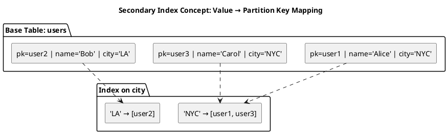
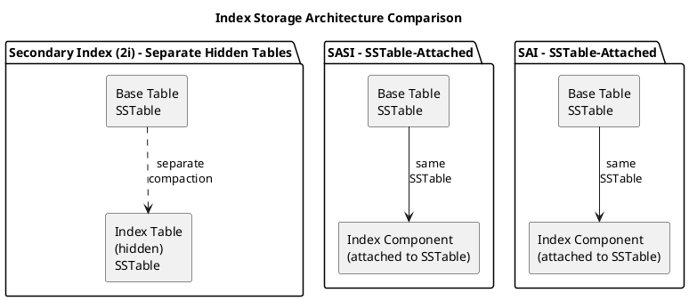
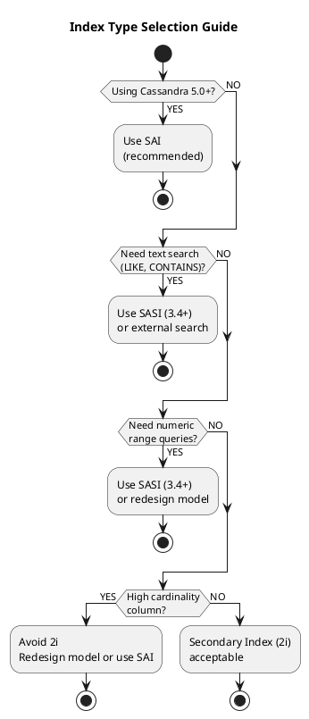

# Indexes

Indexes in Cassandra provide efficient data access patterns beyond partition key lookups. Understanding the available index types, their implementation differences, and appropriate use cases is essential for query optimization.

---

## Background

### The Primary Key Index

Every Cassandra table has an implicit primary key index. This index is fundamental to Cassandra's data model and requires no additional configuration.

**Partition Key Index**: Each SSTable contains an index mapping partition key tokens to their data positions. This enables O(log n) lookups within an SSTable.

**Clustering Column Ordering**: Within a partition, data is physically sorted by clustering columns. Range queries on clustering columns are efficient because they read contiguous disk regions.

```sql
-- Primary key enables these efficient queries:
CREATE TABLE events (
    sensor_id uuid,
    event_time timestamp,
    reading double,
    PRIMARY KEY (sensor_id, event_time)
);

-- Partition key lookup: O(log n) per SSTable
SELECT * FROM events WHERE sensor_id = ?;

-- Clustering range: sequential read within partition
SELECT * FROM events WHERE sensor_id = ? AND event_time > ?;
```

### The Need for Secondary Indexes

Primary key indexes only support queries that include the partition key. Without secondary indexes, queries on non-key columns require full table scans—scanning every partition across all nodes.

```sql
-- Without secondary index: requires ALLOW FILTERING (full scan)
SELECT * FROM events WHERE reading > 100.0 ALLOW FILTERING;

-- With secondary index: targeted lookup
CREATE INDEX ON events (reading);
SELECT * FROM events WHERE reading > 100.0;
```

### Evolution of Secondary Indexes in Cassandra

Cassandra has developed multiple secondary index implementations over time:

| Version | Index Type | Status |
|---------|------------|--------|
| 0.7 (2011) | Secondary Index (2i) | Legacy, still supported |
| 3.4 (2016) | SASI | Experimental, limited support |
| 5.0 (2023) | SAI | Recommended for new deployments |

Each generation addressed limitations of its predecessors while introducing new capabilities and trade-offs.

### Feature Availability by Version

| Feature | Cassandra 4.x | Cassandra 5.0+ |
|---------|:-------------:|:--------------:|
| Secondary Index (2i) | ✅ | ✅ |
| SASI (experimental) | ✅ | ✅ |
| SAI | ⚠️ (experimental) | ✅ (recommended) |
| Vector search | ❌ | ✅ |
| Equality queries | ✅ | ✅ |
| Range queries | SASI only | SAI/SASI |
| LIKE prefix | SASI only | SAI/SASI |
| LIKE contains | SASI only | SAI/SASI |
| Collection indexing | 2i only | 2i/SAI |
| ANN (vector) | ❌ | SAI only |

!!! tip "Version Recommendation"
    - **Cassandra 5.0+**: Use SAI for all new indexes
    - **Cassandra 4.x**: Use 2i for equality, SASI for range (with caution)
    - **Upgrading**: Plan migration from SASI to SAI when moving to 5.0

---

## Index Architecture Comparison

### How Secondary Indexes Work

All Cassandra secondary indexes share a common principle: they create a mapping from indexed column values to partition keys. The implementation of this mapping differs significantly between index types.



### Storage Location Differences

The primary architectural distinction between index types is where index data is stored:



**Separate Tables (2i)**: Legacy secondary indexes store index data in hidden tables. These tables have their own SSTables and compact independently from base table data.

**SSTable-Attached (SASI, SAI)**: Modern indexes attach index data directly to base table SSTables. Index data compacts together with base table data, maintaining consistency.

---

## Index Type Comparison

| Characteristic | Secondary Index (2i) | SASI | SAI |
|----------------|---------------------|------|-----|
| **Storage** | Separate hidden table | Attached to SSTable | Attached to SSTable |
| **Cassandra Version** | 0.7+ | 3.4+ | 5.0+ |
| **Status** | Legacy | Experimental | Recommended |
| **Query Types** | Equality only | Equality, range, LIKE | Equality, range, LIKE |
| **Numeric Range** | No | Yes | Yes |
| **Text Search** | No | PREFIX, CONTAINS | Yes |
| **AND Queries** | Scatter-gather | Single-pass | Single-pass |
| **Write Overhead** | Medium | Medium | Low (typical) |
| **Cardinality Handling** | Poor at extremes | Better | Best (generally) |
| **Production Ready** | Yes (with caveats) | No | Yes |

---

## Operator Support Matrix

This table shows which CQL operators are generally supported by each index type. Actual behavior may vary by Cassandra version, analyzer configuration, and data type. Consult version-specific documentation for definitive support.

| Operator | Secondary Index (2i) | SASI | SAI | Notes |
|----------|:-------------------:|:----:|:---:|-------|
| `=` (equality) | ✅ | ✅ | ✅ | All index types |
| `>` | ❌ | ✅ | ✅ | Requires SPARSE mode for SASI |
| `>=` | ❌ | ✅ | ✅ | Requires SPARSE mode for SASI |
| `<` | ❌ | ✅ | ✅ | Requires SPARSE mode for SASI |
| `<=` | ❌ | ✅ | ✅ | Requires SPARSE mode for SASI |
| `LIKE 'prefix%'` | ❌ | ✅ | ✅ | PREFIX mode default for SASI |
| `LIKE '%substring%'` | ❌ | ✅ | ⚠️ | SASI: CONTAINS mode; SAI: requires analyzer |
| `LIKE '%suffix'` | ❌ | ❌ | ❌ | Not supported by any index |
| `IN` | ✅ | ✅ | ✅ | Multiple equality values |
| `CONTAINS` (collection) | ✅ | ❌ | ✅ | Collection element search |
| `CONTAINS KEY` (map) | ✅ | ❌ | ✅ | Map key search |
| `!=` (not equal) | ❌ | ❌ | ❌ | Not supported by any index |
| `OR` (cross-column) | ❌ | ❌ | ❌ | Application-level union required |

**Legend:** ✅ Supported | ⚠️ Partial/Conditional | ❌ Not Supported

### Data Type Support

| Data Type | Secondary Index (2i) | SASI | SAI |
|-----------|:-------------------:|:----:|:---:|
| `text` / `varchar` | ✅ | ✅ | ✅ |
| `int` / `bigint` | ✅ | ✅ | ✅ |
| `float` / `double` | ✅ | ✅ | ✅ |
| `decimal` | ✅ | ✅ | ✅ |
| `timestamp` | ✅ | ✅ | ✅ |
| `date` / `time` | ✅ | ✅ | ✅ |
| `uuid` / `timeuuid` | ✅ | ✅ | ✅ |
| `boolean` | ✅ | ⚠️ | ✅ |
| `inet` | ✅ | ✅ | ✅ |
| `blob` | ✅ | ⚠️ | ✅ |
| `list<T>` | ✅ | ❌ | ✅ |
| `set<T>` | ✅ | ❌ | ✅ |
| `map<K,V>` | ✅ | ❌ | ✅ |
| `vector<float, N>` | ❌ | ❌ | ✅ |
| `frozen<T>` | ✅ | ⚠️ | ✅ |

!!! warning "SASI Collection Support"
    SASI does not support indexing collections. Use SAI or denormalized tables for collection queries.

### Choosing an Index Type



---

## Query Execution

### Single-Index Query

When a query uses one index, all index types follow a similar pattern:

1. Query coordinator identifies relevant nodes
2. Each node queries its local index
3. Index returns matching partition keys
4. Node reads base table partitions
5. Results returned to coordinator

### Multi-Index Query (AND)

Queries with multiple indexed predicates differ significantly:

**Secondary Index (2i)**: Executes each predicate separately, intersects results at coordinator. Creates scatter-gather pattern with potential for large intermediate result sets.

**SASI / SAI**: Intersects predicates within each SSTable before returning results. More efficient for multi-predicate queries.

```sql
-- Multi-predicate query
SELECT * FROM users WHERE city = 'NYC' AND age > 25;

-- 2i: Two separate index lookups, coordinator intersection
-- SAI: Single-pass intersection per SSTable
```

---

## Performance Considerations

### Write Path Impact

All secondary indexes add overhead to the write path:

| Index Type | Write Overhead | Reason |
|------------|---------------|--------|
| 2i | Medium | Separate table mutation |
| SASI | Medium | Index structure update |
| SAI | Low | Optimized append-only design |

### Read Path Characteristics

| Query Type | 2i | SASI | SAI |
|------------|-----|------|-----|
| Single equality | Fair | Good | Good |
| Multiple AND | Poor | Good | Good |
| Range | N/A | Good | Good |
| High selectivity | Poor | Fair | Good |
| Low selectivity | Poor | Fair | Fair |

### Anti-Patterns

!!! danger "Do Not Index These Columns"
    The following patterns will cause performance problems or outright failures. These are not recommendations—they are hard constraints.

#### High Cardinality Columns

!!! danger "Never Index UUIDs, Timestamps, or Unique Identifiers"
    **Problem:** Index size equals or exceeds base table size. Every query contacts all nodes to find one row.

    **Symptoms:** Query latency worse than full table scan, excessive disk usage, coordinator timeouts.

    **Instead:** Include the column in the partition key or create a denormalized lookup table.

    ```sql
    -- DO NOT DO THIS
    CREATE INDEX ON events (event_id);  -- event_id is UUID

    -- INSTEAD: Make it the partition key
    CREATE TABLE events_by_id (
        event_id uuid PRIMARY KEY,
        ...
    );
    ```

#### Low Cardinality Columns

!!! danger "Never Index Boolean or Low-Enum Columns Without Partition Key"
    **Problem:** Each index entry points to millions of rows. Single query returns unbounded results.

    **Symptoms:** Memory exhaustion, GC storms, query timeouts, coordinator OOM.

    **Instead:** Partition by the low-cardinality value, or always combine with partition key restriction.

    ```sql
    -- DO NOT DO THIS
    CREATE INDEX ON users (is_active);  -- Returns 50% of all rows

    -- INSTEAD: Partition by status
    CREATE TABLE users_by_status (
        is_active boolean,
        user_id uuid,
        PRIMARY KEY (is_active, user_id)
    );
    ```

#### Frequently Updated Columns

!!! warning "Avoid Indexing Columns That Change Often"
    **Problem:** Every update requires index delete + insert. Tombstones accumulate rapidly.

    **Symptoms:** Growing read latency, tombstone warnings, compaction pressure.

    **Instead:** Store mutable state separately or accept query trade-offs.

    ```sql
    -- PROBLEMATIC
    CREATE INDEX ON sessions (last_activity);  -- Updated every request

    -- Every update creates a tombstone in the index
    -- After 1M updates: 1M tombstones to scan
    ```

#### Global Queries Without Partition Restriction

!!! warning "Avoid Index-Only Queries in Large Clusters"
    **Problem:** Query contacts ALL nodes, latency = slowest node, no locality benefit.

    **Acceptable:** Combined with partition key (restricts to one node).

    **Problematic:** Global queries in large clusters with high throughput requirements.

    ```sql
    -- SLOW: Contacts all nodes
    SELECT * FROM users WHERE city = 'NYC';

    -- FAST: Restricted to one partition
    SELECT * FROM users WHERE region = 'us-east' AND city = 'NYC';
    ```

---

## Operational Considerations

### Index Building

```bash
# Check index build progress
nodetool describecluster

# Rebuild index (SAI)
nodetool rebuild_index keyspace table index_name

# View index status
nodetool tablestats keyspace.table
```

### Monitoring

```
# JMX metrics for index performance
org.apache.cassandra.metrics:type=Index,scope=*,name=*

# Per-table index metrics
org.apache.cassandra.metrics:type=Table,keyspace=*,scope=*,name=IndexSummaryOffHeapMemoryUsed
```

---

## Related Documentation

- **[Secondary Indexes (2i)](secondary-indexes.md)** - Legacy index implementation
- **[SASI](sasi.md)** - SSTable Attached Secondary Index
- **[SAI](sai.md)** - Storage Attached Index (recommended)
- **[Read Path](../read-path.md)** - Query execution details
- **[Compaction](../compaction/index.md)** - Impact on index maintenance
