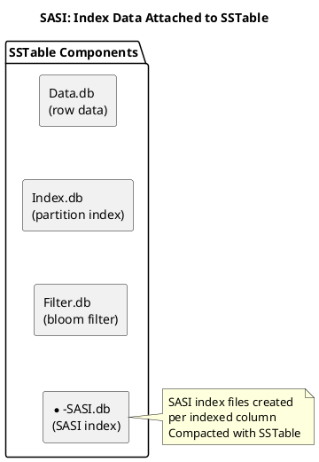
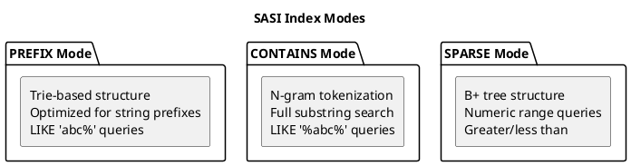
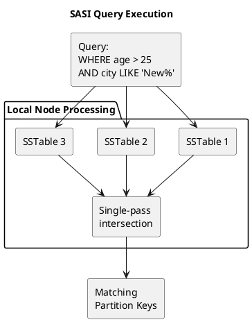

# SASI (SSTable Attached Secondary Index)

SASI (SSTable Attached Secondary Index) was introduced in Cassandra 3.4 (2016) as an experimental indexing system providing range queries and text search capabilities. While offering significant improvements over legacy secondary indexes, SASI remains experimental and has known limitations.

!!! warning "Experimental Status"
    SASI is marked as experimental in Cassandra. For production workloads on Cassandra 5.0+, use [SAI](sai.md) instead.

---

## Background and History

### Origins

SASI was developed by Apple and contributed to Apache Cassandra in 2016 (CASSANDRA-10661). The design addressed key limitations of legacy secondary indexes:

- Inability to perform range queries
- No text search capabilities
- Scatter-gather query patterns
- Separate index table compaction

### Design Goals

SASI introduced several architectural improvements:

1. **SSTable attachment**: Index data stored alongside base table SSTables
2. **Range queries**: Support for inequality operators (`>`, `<`, `>=`, `<=`)
3. **Text search**: PREFIX and CONTAINS operations
4. **Single-pass intersection**: Multiple predicates evaluated together

### Experimental Status

Despite its capabilities, SASI has remained experimental since introduction:

- Complex codebase with limited maintainership
- Memory management concerns during queries
- Known bugs in edge cases
- Superseded by SAI in Cassandra 5.0

---

## Architecture

### SSTable-Attached Storage

Unlike legacy secondary indexes that use separate hidden tables, SASI stores index data as additional SSTable components:



**Benefits of SSTable attachment:**

- Index compacts with base data
- No separate compaction coordination
- Index lifecycle matches data lifecycle
- Reduced storage overhead

### Index Modes

SASI supports three index modes optimized for different data types:



| Mode | Data Type | Query Support | Use Case |
|------|-----------|---------------|----------|
| PREFIX | Text | `LIKE 'abc%'` | String prefix matching |
| CONTAINS | Text | `LIKE '%abc%'` | Full-text search |
| SPARSE | Numeric | `>`, `<`, `>=`, `<=` | Range queries |

### Query Execution

SASI queries iterate through SSTables, applying predicates locally before returning results:



**Single-pass intersection**: Multiple SASI predicates are intersected within each SSTable iteration on each node, providing more efficient local processing for multi-predicate queries. Note that in a distributed cluster, queries still scatter to replicas and gather results at the coordinator—the intersection occurs locally on each node, not globally.

---

## Configuration

### Creating SASI Indexes

```sql
-- Basic SASI index (PREFIX mode for text)
CREATE CUSTOM INDEX ON users (email)
USING 'org.apache.cassandra.index.sasi.SASIIndex';

-- CONTAINS mode for substring search
CREATE CUSTOM INDEX ON users (bio)
USING 'org.apache.cassandra.index.sasi.SASIIndex'
WITH OPTIONS = {
    'mode': 'CONTAINS',
    'analyzer_class': 'org.apache.cassandra.index.sasi.analyzer.StandardAnalyzer',
    'case_sensitive': 'false'
};

-- SPARSE mode for numeric ranges
CREATE CUSTOM INDEX ON events (timestamp)
USING 'org.apache.cassandra.index.sasi.SASIIndex'
WITH OPTIONS = { 'mode': 'SPARSE' };

-- PREFIX mode with case insensitivity
CREATE CUSTOM INDEX ON products (name)
USING 'org.apache.cassandra.index.sasi.SASIIndex'
WITH OPTIONS = {
    'mode': 'PREFIX',
    'case_sensitive': 'false'
};
```

### Configuration Options

| Option | Values | Default | Description |
|--------|--------|---------|-------------|
| `mode` | PREFIX, CONTAINS, SPARSE | PREFIX | Index mode for query types |
| `case_sensitive` | true, false | true | Case sensitivity for text |
| `analyzed` | true, false | false | Enable text analysis |
| `analyzer_class` | class name | - | Custom analyzer for tokenization |
| `max_compaction_flush_memory_in_mb` | integer | 1024 | Memory limit during compaction |

### Analyzer Options

For text search with CONTAINS mode:

```sql
-- Standard analyzer (whitespace tokenization)
CREATE CUSTOM INDEX ON articles (content)
USING 'org.apache.cassandra.index.sasi.SASIIndex'
WITH OPTIONS = {
    'mode': 'CONTAINS',
    'analyzer_class': 'org.apache.cassandra.index.sasi.analyzer.StandardAnalyzer',
    'tokenization_enable_stemming': 'true',
    'tokenization_locale': 'en',
    'tokenization_skip_stop_words': 'true'
};

-- Non-tokenizing analyzer (exact substring matching)
CREATE CUSTOM INDEX ON logs (message)
USING 'org.apache.cassandra.index.sasi.SASIIndex'
WITH OPTIONS = {
    'mode': 'CONTAINS',
    'analyzer_class': 'org.apache.cassandra.index.sasi.analyzer.NonTokenizingAnalyzer',
    'case_sensitive': 'false'
};
```

---

## Query Capabilities

### Text Queries

```sql
-- PREFIX: Starts with
SELECT * FROM users WHERE email LIKE 'john%';

-- CONTAINS: Substring anywhere
SELECT * FROM articles WHERE content LIKE '%database%';

-- Case insensitive (if configured)
SELECT * FROM products WHERE name LIKE 'Apple%';
```

### Range Queries

```sql
-- Greater than
SELECT * FROM events WHERE timestamp > '2024-01-01';

-- Less than or equal
SELECT * FROM sensors WHERE reading <= 100.0;

-- Range (requires two conditions)
SELECT * FROM events
WHERE timestamp >= '2024-01-01'
AND timestamp < '2024-02-01';
```

### Combined Queries

```sql
-- Multiple SASI indexes
SELECT * FROM users
WHERE age > 25
AND city LIKE 'New%'
AND status = 'active';

-- SASI with partition key (most efficient)
SELECT * FROM events
WHERE sensor_id = ?
AND timestamp > '2024-01-01';
```

---

## Limitations

### Memory Consumption

SASI queries can consume significant memory:

```
Problem: CONTAINS mode builds in-memory structures
         Large result sets held in memory
         No streaming for intermediate results

Symptoms:
- GC pressure during queries
- OOM errors on large datasets
- Query timeouts
```

**Mitigation:**

- Use LIMIT clauses
- Combine with partition key restrictions
- Tune `max_compaction_flush_memory_in_mb`

### Tombstone Handling

SASI has known issues with tombstones:

```
Problem: Tombstones not always properly filtered
         Deleted data may appear in results

Impact: Consistency issues in rare cases
```

### CONTAINS Mode Overhead

N-gram tokenization for CONTAINS mode creates storage overhead:

```
Example: String "database"
N-grams (n=3): dat, ata, tab, aba, bas, ase

Storage impact: ~3x original string size
Query impact: More index entries to scan
```

### Experimental Bugs

Known issues include:

- Memory leaks under specific query patterns
- Incorrect results with certain predicate combinations
- Performance degradation with high tombstone ratios
- Compaction issues with large indexes

---

## Benefits

### Range Query Support

Primary advantage over legacy secondary indexes:

```sql
-- Not possible with 2i, possible with SASI
SELECT * FROM metrics WHERE value > 100.0;
SELECT * FROM logs WHERE timestamp >= '2024-01-01';
```

### Text Search

Built-in text search without external systems:

```sql
-- Substring search
SELECT * FROM products WHERE description LIKE '%wireless%';

-- Prefix search
SELECT * FROM users WHERE name LIKE 'John%';
```

### Efficient Multi-Predicate Queries

Single-pass intersection reduces overhead on each node:

```sql
-- 2i: Two separate index lookups per node + coordinator merge
-- SASI: Single pass through SSTables with local intersection per node
SELECT * FROM users
WHERE age > 25 AND city LIKE 'San%';
```

Note: The query still contacts multiple nodes; the efficiency gain is in local processing on each node.

### SSTable Integration

Index lifecycle matches data:

- Compacts together
- Deleted together
- No orphaned index entries

---

## When to Use SASI

### Acceptable Use Cases

| Scenario | Rationale |
|----------|-----------|
| Development/testing with range queries | Faster than data model redesign |
| Low-traffic text search | Avoids external search system |
| Cassandra 3.4 - 4.x without SAI | Only range query option |
| Proof of concept | Validate query patterns before SAI migration |

### Avoid SASI When

| Scenario | Alternative |
|----------|-------------|
| Production Cassandra 5.0+ | Use SAI |
| High-throughput queries | Denormalized tables |
| Large CONTAINS searches | External search (Elasticsearch) |
| Mission-critical workloads | SAI or data model redesign |

---

## Migration to SAI

For Cassandra 5.0+, migrate SASI indexes to SAI:

```sql
-- Drop SASI index
DROP INDEX IF EXISTS users_email_idx;

-- Create SAI index
CREATE INDEX users_email_idx ON users (email)
USING 'sai';

-- SAI with text analysis
CREATE INDEX users_bio_idx ON users (bio)
USING 'sai'
WITH OPTIONS = {
    'index_analyzer': 'standard'
};
```

**Migration considerations:**

- SAI syntax differs from SASI
- Some SASI analyzers have no SAI equivalent
- Test query patterns after migration
- SAI is production-ready; SASI is not

---

## Monitoring

### Index Status

```bash
# Check index build status
nodetool describecluster

# Table statistics
nodetool tablestats keyspace.table
```

### Warning Signs

| Symptom | Likely Cause | Action |
|---------|--------------|--------|
| High GC during queries | Memory pressure | Add LIMIT, restrict partition |
| Slow CONTAINS queries | Large n-gram index | Consider external search |
| Inconsistent results | Tombstone bugs | Verify with full scan |
| Compaction failures | Memory limits | Tune flush memory |

---

## Related Documentation

- **[Index Overview](index.md)** - Index type comparison
- **[Secondary Indexes (2i)](secondary-indexes.md)** - Legacy indexes
- **[SAI](sai.md)** - Recommended replacement (Cassandra 5.0+)
- **[Compaction](../compaction/index.md)** - SSTable lifecycle