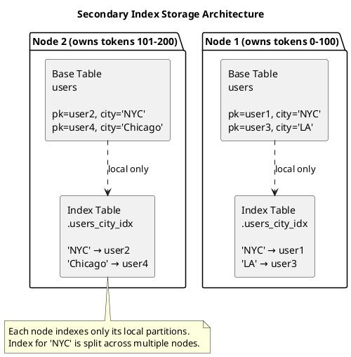
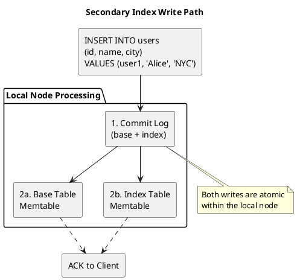
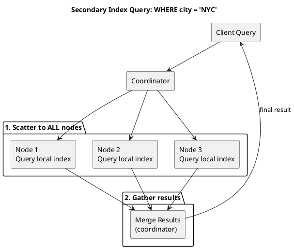

# Secondary Indexes (2i)

Secondary Indexes, often called "2i" (secondary index), are Cassandra's original secondary indexing implementation introduced in version 0.7 (2011). While still supported, they have significant limitations that make them unsuitable for many production workloads.

---

## Background and History

### Origins

Secondary indexes were introduced in Cassandra 0.7 to address the limitation that queries could only filter on partition keys. The implementation used a simple approach: create hidden tables that map indexed column values to partition keys.

This design was straightforward to implement but created architectural challenges that became apparent at scale. The fundamental issue is that secondary index data is distributed differently than base table data.

### Design Goals

The original secondary index design prioritized:

1. **Simplicity**: Reuse existing table storage mechanisms
2. **Consistency**: Maintain index atomically with base table writes
3. **Query Flexibility**: Enable queries on non-primary-key columns

### Design Trade-offs

The implementation made trade-offs that limit secondary index utility:

- **Local-only indexes**: Each node indexes only its local data
- **Separate compaction**: Index tables compact independently from base tables
- **No range queries**: Only equality predicates supported
- **Scatter-gather queries**: Queries must contact all nodes

---

## Architecture

### Storage Implementation

Secondary indexes store data in hidden tables within the same keyspace as the base table:



**Key characteristics:**

- Index table name: `.<table>_<column>_idx`
- Partition key: indexed column value
- Clustering column: base table partition key
- Each node only indexes rows it owns

### On-Disk File Structure

Secondary indexes create a separate hidden table directory with its own SSTable files:

```
data/
└── keyspace/
    ├── users-<table_id>/                         # Base table
    │   ├── nb-1-big-Data.db
    │   ├── nb-1-big-Index.db
    │   ├── nb-1-big-Filter.db
    │   ├── nb-1-big-Summary.db
    │   ├── nb-1-big-Statistics.db
    │   ├── nb-1-big-CompressionInfo.db
    │   └── nb-1-big-TOC.txt
    │
    └── .users.city_idx-<index_id>/               # Hidden index table
        ├── nb-1-big-Data.db                      # Index data (value → pk mappings)
        ├── nb-1-big-Index.db                     # Partition index
        ├── nb-1-big-Filter.db                    # Bloom filter
        ├── nb-1-big-Summary.db                   # Partition summary
        ├── nb-1-big-Statistics.db                # SSTable statistics
        ├── nb-1-big-CompressionInfo.db           # Compression metadata
        └── nb-1-big-TOC.txt                      # Table of contents
```

| Characteristic | Description |
|----------------|-------------|
| **Directory naming** | `.tablename.indexname-uuid` (dot prefix indicates hidden table) |
| **File structure** | Complete SSTable set identical to regular tables |
| **Compaction** | Independent schedule from base table |
| **Size estimation** | `unique_indexed_values × average_posting_list_size` |

!!! warning "Hidden Directory Visibility"
    The dot-prefixed directory is hidden by default in Unix systems. Use `ls -la` to view hidden index tables. The `nodetool tablestats` command includes index table statistics.

### Write Path

When a row is written to a table with secondary indexes:



1. Write arrives at replica node
2. Base table mutation and index mutation written to commit log atomically
3. Both mutations applied to respective memtables
4. Acknowledgment sent to client

### Read Path (Query Execution)

Secondary index queries follow a scatter-gather pattern:



**Query execution steps:**

1. Query arrives at coordinator
2. Coordinator sends query to replicas (one replica per token range for consistency level, not necessarily all nodes)
3. Each contacted node queries its local index
4. Each node reads matching base table rows
5. Results gathered at coordinator
6. Final result returned to client

*Note: The coordinator may choose one replica per token range rather than contacting every node, depending on consistency level and load balancing. However, the scatter-gather scope remains broad.*

---

## Limitations

### Scatter-Gather Overhead

Every secondary index query contacts multiple nodes, even if the result exists on only one node:

```
Query: SELECT * FROM users WHERE city = 'NYC';

Without index knowledge:
- Must query ALL nodes
- Each node checks local index
- Results merged at coordinator

Impact:
- Latency = slowest node response
- Network traffic proportional to cluster size
- Coordinator memory for result merging
```

### Cardinality Problems

Secondary indexes perform poorly at cardinality extremes:

**High Cardinality** (many unique values):

```
Index on: user_id (UUID)
Problem: Index table grows as large as base table
         Every lookup returns ~1 row but queries all nodes
Result:  Worse than full table scan
```

**Low Cardinality** (few unique values):

```
Index on: status ENUM('active', 'inactive', 'pending')
Problem: Each index entry points to millions of rows
         'active' → [user1, user2, user3, ..., userN]
Result:  Huge partitions in index table
         Memory pressure during queries
```

**Optimal Cardinality**: Medium cardinality works best (thousands to millions of distinct values with reasonable distribution).

### No Range Queries

Secondary indexes support only equality predicates:

```sql
-- Supported
SELECT * FROM events WHERE status = 'error';

-- NOT supported (requires ALLOW FILTERING)
SELECT * FROM events WHERE timestamp > '2024-01-01';
SELECT * FROM events WHERE value BETWEEN 10 AND 100;
```

### Tombstone Accumulation

Deleted index entries create tombstones that persist until compaction:

```
1. Row deleted from base table
2. Tombstone written to index table
3. Index queries must skip tombstones
4. gc_grace_seconds delay before removal

Impact:
- Read performance degrades with deletes
- "Tombstone overwhelm" errors possible
```

### Independent Compaction

Index tables compact on their own schedule:

```
Base table: Compacted, old data removed
Index table: May still reference deleted rows

Result:
- Index returns stale partition keys
- Base table read finds nothing
- Wasted I/O
```

---

## Configuration

### Creating Secondary Indexes

```sql
-- Basic index
CREATE INDEX ON users (city);

-- Named index
CREATE INDEX users_city_idx ON users (city);

-- Index on collection values
CREATE INDEX ON users (VALUES(tags));

-- Index on collection keys
CREATE INDEX ON users (KEYS(attributes));

-- Index on collection entries
CREATE INDEX ON users (ENTRIES(attributes));

-- Index on frozen collection
CREATE INDEX ON users (FULL(frozen_list));
```

### Index Options

```sql
-- Custom index class (rarely needed)
CREATE CUSTOM INDEX ON users (city)
USING 'org.apache.cassandra.index.internal.composites.ClusteringColumnIndex';
```

### Managing Indexes

```sql
-- Drop index
DROP INDEX IF EXISTS users_city_idx;

-- View indexes
SELECT * FROM system_schema.indexes
WHERE keyspace_name = 'my_keyspace';
```

---

## When to Use Secondary Indexes

### Acceptable Use Cases

| Scenario | Rationale |
|----------|-----------|
| Low-traffic queries | Scatter-gather overhead acceptable |
| Medium cardinality columns | Reasonable index size and selectivity |
| Combined with partition key | Reduces scatter to single partition |
| Development/testing | Simpler than data model redesign |

### Combined with Partition Key

Secondary indexes perform well when combined with a partition key:

```sql
-- Efficient: partition key + indexed column
SELECT * FROM orders
WHERE customer_id = ? AND status = 'pending';

-- customer_id restricts to single partition
-- status index filters within that partition
```

### Avoid Secondary Indexes When

| Scenario | Alternative |
|----------|-------------|
| High-throughput queries | Denormalized table |
| Range queries needed | SAI or data model redesign |
| Very high cardinality | Denormalized table |
| Very low cardinality | Partition by the value |
| Write-heavy workload | Avoid indexes entirely |

---

## Alternatives

### Denormalized Tables

Create a separate table optimized for the query pattern:

```sql
-- Base table
CREATE TABLE users (
    user_id uuid PRIMARY KEY,
    name text,
    city text
);

-- Query table (denormalized)
CREATE TABLE users_by_city (
    city text,
    user_id uuid,
    name text,
    PRIMARY KEY (city, user_id)
);

-- Application maintains both tables
```

**Trade-offs:**

- Additional write overhead (maintain multiple tables)
- Storage duplication
- Guaranteed query performance
- No scatter-gather

### Materialized Views

Automatic denormalization managed by Cassandra:

```sql
CREATE MATERIALIZED VIEW users_by_city AS
    SELECT * FROM users
    WHERE city IS NOT NULL
    PRIMARY KEY (city, user_id);
```

See [Materialized Views](../materialized-views.md) for details and limitations.

### Modern Index Types

For Cassandra 3.4+, consider:

- **[SASI](sasi.md)**: Range queries, text search (experimental)
- **[SAI](sai.md)**: Recommended for Cassandra 5.0+ (production-ready)

---

## Monitoring

### Index Size and Health

```bash
# Table statistics including index
nodetool tablestats keyspace.table

# Compaction statistics
nodetool compactionstats

# SSTable distribution
nodetool cfstats keyspace.table
```

### JMX Metrics

```
# Index memory usage
org.apache.cassandra.metrics:type=Index,scope=*,name=*

# Per-table index metrics
org.apache.cassandra.metrics:type=Table,keyspace=*,scope=*,name=IndexSummaryOffHeapMemoryUsed
```

### Warning Signs

| Symptom | Likely Cause | Action |
|---------|--------------|--------|
| Slow index queries | High cardinality or tombstones | Review data model |
| Growing latency | Index size growth | Check compaction |
| Timeout errors | Scatter-gather overload | Reduce query frequency |
| Tombstone warnings | High delete rate | Adjust gc_grace or data model |

---

## Related Documentation

- **[Index Overview](index.md)** - Index type comparison
- **[SASI](sasi.md)** - SSTable Attached Secondary Index
- **[SAI](sai.md)** - Storage Attached Index
- **[Materialized Views](../materialized-views.md)** - Automatic denormalization
- **[Compaction](../compaction/index.md)** - Index table compaction