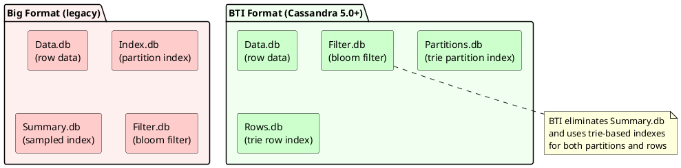

# SSTable Reference

SSTables (Sorted String Tables) are Cassandra's persistent storage files. All data ultimately resides in SSTables on disk—they are the database files. When a memtable flushes, it creates an SSTable. When compaction runs, it reads SSTables and writes new ones. When a node restarts, it reads SSTables to rebuild its state.

Each SSTable is **immutable** once written. This immutability simplifies concurrency (no locks needed for reads), enables efficient sequential writes, and allows safe snapshots via hard links. However, it also means that updates and deletes create new data rather than modifying existing files, requiring background compaction to reclaim space and merge versions.

An SSTable is not a single file but a set of component files: data, indexes, bloom filter, compression metadata, and statistics. Understanding these components is essential for troubleshooting, capacity planning, and performance analysis.

---

## SSTable File Location

```
data_directory/keyspace_name/table_name-table_uuid/
├── na-1-big-Data.db
├── na-1-big-Index.db
├── na-1-big-Filter.db
├── na-1-big-Statistics.db
├── na-1-big-Summary.db
├── na-1-big-CompressionInfo.db
├── na-1-big-Digest.crc32
└── na-1-big-TOC.txt
```

---

## File Naming Convention

```
<version>-<generation>-<format>-<component>.<extension>

Example: na-1-big-Data.db

na      - SSTable format version
1       - Generation number (increments with compaction)
big     - Format type
Data    - Component type
db      - File extension
```

### Version Identifiers

| Version | Cassandra Version | Notes |
|---------|-------------------|-------|
| `la` | 2.1 | Legacy format |
| `lb` | 2.1 | Legacy format |
| `ma` | 3.0 | Introduced new storage format |
| `mb` | 3.0 | Storage format revision |
| `mc` | 3.0 | Storage format revision |
| `md` | 3.11 | Storage format revision |
| `me` | 3.0.25, 3.11.11 | Storage format revision |
| `na` | 4.0 | Storage format revision |
| `nb` | 4.0+ | Format revision |
| `oa` | 5.0 | Storage format revision |
| `pa` | 6.0 | Storage format revision |

*Note: Version identifiers are for the Big format. BTI format uses `bti` as the format component instead of `big`.*

### SSTable Format Types

The second-to-last component in the filename (e.g., `big` or `bti`) indicates the SSTable format type. Cassandra 5.0 introduces the BTI format as an alternative to the legacy "big" format.

| Format | Name | Introduced | Description |
|--------|------|------------|-------------|
| `big` | Big Table Format | Original | Legacy format with separate index and summary files |
| `bti` | Big Trie Index | 5.0 | New format with block-based trie indexes |

---

## SSTable Formats: Big vs BTI

Cassandra 5.0 introduced the **BTI (Big Trie Index)** format ([CASSANDRA-17056](https://issues.apache.org/jira/browse/CASSANDRA-17056)), a significant redesign of SSTable on-disk structure. The BTI format uses block-based trie indexes for both partition and row lookups, replacing the legacy index structures.

### Format Comparison



| Aspect | Big Format | BTI Format |
|--------|-----------|------------|
| **Partition index** | Index.db + Summary.db | Partitions.db (trie) |
| **Row index** | Embedded in Index.db | Rows.db (trie) |
| **Memory usage** | Higher (summary in heap) | Lower (off-heap, memory-mapped) |
| **Index size** | Larger | Generally smaller (prefix compression), degree varies by data |
| **Lookup complexity** | O(log n) | O(key length) |
| **Write amplification** | Standard | May be slightly higher during flush (workload-dependent) |

### BTI Format File Components

The BTI format introduces new file extensions:

| Component | Big Format | BTI Format | Description |
|-----------|-----------|------------|-------------|
| Partition Index | `-Index.db` | `-Partitions.db` | Maps partition keys to data offsets |
| Row Index | (in Index.db) | `-Rows.db` | Maps clustering keys within partitions |
| Summary | `-Summary.db` | (eliminated) | Not needed with trie index |

**BTI SSTable file listing:**

```
data_directory/keyspace_name/table_name-table_uuid/
├── nc-1-bti-Data.db           # Row data (same as big format)
├── nc-1-bti-Partitions.db     # Trie-based partition index (replaces Index.db)
├── nc-1-bti-Rows.db           # Trie-based row index (new)
├── nc-1-bti-Filter.db         # Bloom filter (same as big format)
├── nc-1-bti-Statistics.db     # SSTable metadata
├── nc-1-bti-CompressionInfo.db
├── nc-1-bti-Digest.crc32
└── nc-1-bti-TOC.txt
```

### How BTI Trie Indexes Work

The BTI format uses **byte-ordered trie** data structures for both partition and row indexes. This approach provides several advantages over the legacy format:

**1. Prefix Compression**

Partition keys with common prefixes share storage in the trie structure:

```
Keys: user:1001, user:1002, user:1003, user:2001

Legacy Index.db:
  user:1001 → offset 1000
  user:1002 → offset 2000
  user:1003 → offset 3000
  user:2001 → offset 4000
  (each key stored in full)

BTI Partitions.db (trie):
  root → "user:" → "100" → "1" → offset 1000
                         → "2" → offset 2000
                         → "3" → offset 3000
               → "2001" → offset 4000
  (common prefixes stored once)
```

**2. Block-Based Organization**

The trie is organized into fixed-size blocks that can be:

- Memory-mapped for efficient access
- Loaded on-demand (not all in memory)
- Cached at the OS page cache level

**3. Efficient Range Queries**

The trie structure naturally supports efficient iteration for range queries, as entries are stored in sorted order.

### Configuration

SSTable format is configured cluster-wide in `cassandra.yaml` using the `sstable` section:

```yaml
# cassandra.yaml (Cassandra 5.0+)

# SSTable configuration
sstable:
  # Default SSTable format for new SSTables
  # Options: big, bti
  # Default: big (for compatibility)
  selected_format: bti
```

*Note: The configuration structure changed in Cassandra 5.0. There is no top-level `sstable_format` key.*

Per-table SSTable format configuration is not yet available. See [CASSANDRA-18534](https://issues.apache.org/jira/browse/CASSANDRA-18534) for status.

### Migration Considerations

| Consideration | Details |
|---------------|---------|
| **Compatibility** | Big and BTI SSTables can coexist in the same table |
| **Conversion** | Existing SSTables remain in their format until rewritten |
| **Upgrade path** | Set `sstable_format: bti`, then run `nodetool upgradesstables -a` |
| **Downgrade** | BTI SSTables cannot be read by Cassandra < 5.0 |
| **Tools** | All SSTable tools (sstablemetadata, sstabledump, etc.) support BTI |

**Converting existing tables to BTI:**

```bash
# 1. Update cassandra.yaml to use BTI format
# 2. Rewrite all SSTables to the new format
nodetool upgradesstables -a keyspace table

# -a flag rewrites all SSTables, even if already at current version
# Without -a, only SSTables from older Cassandra versions are rewritten
```

### When to Use BTI Format

**Recommended for:**

- New Cassandra 5.0+ clusters
- Tables with many partitions (index size savings)
- Tables with long partition keys (prefix compression benefits)
- Memory-constrained environments (lower heap usage)

**Consider staying with Big format if:**

- Running mixed-version clusters during upgrade
- Need to maintain downgrade capability to < 5.0
- Existing tooling depends on legacy file structure

### SSTable Identifiers (Cassandra 4.1+)

Cassandra 4.1 introduced an alternative SSTable naming scheme using globally unique identifiers instead of sequential generation numbers. This feature is enabled by default in Cassandra 5.0.

**Traditional (sequential):**
```
na-1-big-Data.db
na-2-big-Data.db
na-3-big-Data.db
```

**ULID-based (Cassandra 4.1+):**
```
nb-1-big-Data.db                              (sequential)
nb-3fw2_0zer_0000wjnhm8y18d-big-Data.db       (ULID-based)
```

#### What is ULID?

ULID (Universally Unique Lexicographically Sortable Identifier) is a 128-bit identifier designed as an alternative to UUID that maintains chronological ordering when sorted as strings.

**Why ULID instead of UUID:**

| Characteristic | UUID v1/v4 | ULID |
|----------------|------------|------|
| Sortability | Not sortable (random bits) | Lexicographically sortable by time |
| Time component | UUID v1: present but not prefix | First 48 bits are timestamp |
| String encoding | Hex with dashes (36 chars) | Base32/Base36 (26-28 chars) |
| Natural ordering | None | Creation time order |
| Filesystem friendliness | Contains dashes | No special characters |

Standard UUIDs (even time-based UUID v1) do not sort lexicographically by creation time because the timestamp bits are not positioned at the start. ULID places the timestamp in the most significant bits, ensuring that lexicographic string comparison produces chronological ordering.

**Identifier Structure:**

Cassandra's ULID implementation uses 28 characters in Base36 encoding (`0-9a-z`):

```
3fw2_0zer_0000wjnhm8y18d000
├──┘ ├──┘ ├───┘├──────────┘
│    │    │    │
│    │    │    └── Random part (13 chars) - unique per Cassandra process
│    │    └─────── Nano part (5 chars) - nanosecond precision
│    └──────────── Second part (4 chars) - seconds within day
└───────────────── Day part (4 chars) - days since epoch
```

Format regex: `([0-9a-z]{4})_([0-9a-z]{4})_([0-9a-z]{5})([0-9a-z]{13})`

**Benefits of ULID for SSTables:**

- **Lexicographically sortable** - SSTable files sort naturally by creation time in directory listings
- **Globally unique** - No collisions across the entire cluster, even after truncate and restart
- **Self-describing** - Creation time encoded directly in the identifier without metadata lookup
- **Monotonic** - Within the same millisecond, identifiers increment to preserve ordering
- **Compact** - 28 characters vs 36 for standard UUID string representation

**Configuration:**

```yaml
# cassandra.yaml

# Enable ULID-based SSTable identifiers
# Default: false (4.1), true (5.0+)
# WARNING: Cannot be disabled once SSTables are created with ULIDs
uuid_sstable_identifiers_enabled: true
```

Note: The configuration parameter retains the name `uuid_sstable_identifiers_enabled` for historical reasons, though the implementation uses ULID.

**Comparison:**

| Aspect | Sequential | ULID-based |
|--------|------------|------------|
| Uniqueness | Per-table only | Cluster-wide |
| Streaming conflicts | Possible | None |
| Sorting | Numeric order | Lexicographic (time-ordered) |
| Creation time | Requires metadata lookup | Encoded in identifier |
| Downgrade | Always supported | Not supported once enabled |

**Problem: Generation Counter Reset After Truncate**

Sequential generation numbers reset after truncating a table and restarting the node. This causes SSTable identifier collisions during backup restore operations.

*Scenario: Backup and restore after truncate*

```
Step 1: Table has data, take a snapshot backup
└── keyspace/table-abc123/
    ├── nb-1-big-Data.db
    ├── nb-2-big-Data.db
    └── nb-3-big-Data.db

    → nodetool snapshot keyspace table (backup saved)

Step 2: Truncate the table
    → TRUNCATE keyspace.table;
    → All SSTables removed, generation counter state cleared

Step 3: Restart the node
    → Generation counter resets to 1

Step 4: New data written to table
└── keyspace/table-abc123/
    ├── nb-1-big-Data.db    ← NEW data, same filename as backup!
    ├── nb-2-big-Data.db    ← NEW data, same filename as backup!
    └── nb-3-big-Data.db    ← NEW data, same filename as backup!

Step 5: Attempt to restore backup
    → CONFLICT: Backup files (nb-1, nb-2, nb-3) collide with current files
    → Cannot restore without overwriting current data or manually renaming
```

**Remote backup storage corruption:**

The problem is worse with remote backup destinations (S3, GCS, Azure Blob). Incremental backups upload SSTables by filename:

```
Remote storage (S3 bucket):
└── backups/cluster1/node1/keyspace/table/
    ├── nb-1-big-Data.db    ← From initial backup (important data)
    ├── nb-2-big-Data.db
    └── nb-3-big-Data.db

After truncate + restart + new writes:
└── New SSTable files: nb-1, nb-2, nb-3

Next incremental backup runs:
└── backups/cluster1/node1/keyspace/table/
    ├── nb-1-big-Data.db    ← OVERWRITTEN with new data!
    ├── nb-2-big-Data.db    ← OVERWRITTEN - original backup lost!
    └── nb-3-big-Data.db    ← OVERWRITTEN
```

The original backup data is permanently lost. Backup tools cannot distinguish between "same file updated" and "different file with same name."

*Same scenario with ULID identifiers:*

```
Step 1: Table has data, take a snapshot backup
└── keyspace/table-abc123/
    ├── nb-3fw2_0zer_0000wjnhm8y18d000-big-Data.db
    ├── nb-3fw2_0zer_0001xkpl9z28e111-big-Data.db
    └── nb-3fw2_0zer_0002ymqm0a39f222-big-Data.db

    → nodetool snapshot keyspace table (backup saved)

Step 2: Truncate and restart
    → TRUNCATE keyspace.table;
    → Restart node (ULID generator continues with new random component)

Step 3: New data written to table
└── keyspace/table-abc123/
    ├── nb-3fw3_1abc_0000wabc123def00-big-Data.db   ← Different identifier
    ├── nb-3fw3_1abc_0001xdef456ghi11-big-Data.db
    └── nb-3fw3_1abc_0002yghi789jkl22-big-Data.db

Step 4: Restore backup - no conflicts
└── keyspace/table-abc123/
    ├── nb-3fw2_0zer_0000wjnhm8y18d000-big-Data.db   ← Restored from backup
    ├── nb-3fw2_0zer_0001xkpl9z28e111-big-Data.db   ← Restored from backup
    ├── nb-3fw2_0zer_0002ymqm0a39f222-big-Data.db   ← Restored from backup
    ├── nb-3fw3_1abc_0000wabc123def00-big-Data.db   ← Current data preserved
    ├── nb-3fw3_1abc_0001xdef456ghi11-big-Data.db
    └── nb-3fw3_1abc_0002yghi789jkl22-big-Data.db
```

ULID identifiers incorporate a random component unique to each Cassandra process, so identifiers never repeat even after truncate and restart.

**Scenarios where ULID identifiers prevent collisions:**

| Operation | Sequential Problem | ULID Solution |
|-----------|-------------------|---------------|
| Restore after truncate | Generation resets, filenames collide | Unique identifiers always |
| Incremental backup to S3/GCS | New files overwrite old backups | Each backup file unique |
| Multiple backup restore | Cannot merge backups from different times | Safe to combine |
| Repair streaming | Incoming SSTable may match local name | No conflicts possible |
| Node rebuild | Streamed files may collide | Safe parallel streaming |

**Source:** [Apache Cassandra 4.1: New SSTable Identifiers](https://cassandra.apache.org/_/blog/Apache-Cassandra-4.1-New-SSTable-Identifiers.html)

---

## SSTable Component Files

### Data File (Data.db)

Contains the actual row data for all partitions in the SSTable.

| Attribute | Description |
|-----------|-------------|
| **Purpose** | Store partition and row data |
| **Contents** | Serialized partitions with rows and cells |
| **Compression** | Compressed in chunks (configurable) |
| **Size** | Largest component, varies with data volume |

**Structure:**

```
┌─────────────────────────────────────────────────────────┐
│ Partition 1                                             │
│ ├── Partition Key (serialized)                          │
│ ├── Partition Header (deletion info, flags)             │
│ ├── Row 1 (clustering key + cells)                      │
│ ├── Row 2 (clustering key + cells)                      │
│ └── ...                                                 │
├─────────────────────────────────────────────────────────┤
│ Partition 2                                             │
│ └── ...                                                 │
├─────────────────────────────────────────────────────────┤
│ ...                                                     │
└─────────────────────────────────────────────────────────┘
```

---

### Partition Index

Maps partition keys to byte offsets in the Data file. The implementation differs between SSTable formats.

#### Big Format: Index.db

| Attribute | Description |
|-----------|-------------|
| **File** | `-Index.db` |
| **Purpose** | Map partition keys to data file offsets |
| **Structure** | Sorted list of (partition key, offset) pairs with embedded trie (4.0+) |
| **Memory** | Off-heap trie index (4.0+), or heap-based with Summary.db (pre-4.0) |

**Pre-4.0 lookup flow:**
```
Partition Key → Summary.db (sampled) → Index.db (scan) → Data.db offset
```

**4.0+ lookup flow:**
```
Partition Key → Index.db (trie lookup) → Data.db offset
```

#### BTI Format: Partitions.db (Cassandra 5.0+)

| Attribute | Description |
|-----------|-------------|
| **File** | `-Partitions.db` |
| **Purpose** | Block-based trie partition index |
| **Structure** | Byte-ordered trie with fixed-size blocks |
| **Memory** | Memory-mapped, fully off-heap |
| **Benefits** | Generally smaller than Index.db, O(key length) lookups |

**BTI lookup flow:**
```
Partition Key → Partitions.db (trie traversal) → Data.db offset
```

The BTI format's block-based organization allows efficient memory mapping and on-demand loading—only accessed blocks are read from disk.

---

### Row Index

Maps clustering keys to positions within large partitions, enabling efficient lookups without scanning entire partitions.

#### Big Format: Embedded in Index.db

| Attribute | Description |
|-----------|-------------|
| **Location** | Stored within Index.db |
| **Purpose** | Locate rows within partitions exceeding column_index_size |
| **Contents** | Clustering key boundaries at configurable intervals |
| **Threshold** | Created when partition exceeds `column_index_size_in_kb` (default: 64KB) |

#### BTI Format: Rows.db (Cassandra 5.0+)

| Attribute | Description |
|-----------|-------------|
| **File** | `-Rows.db` |
| **Purpose** | Separate trie-based row index |
| **Structure** | Byte-ordered trie of clustering keys |
| **Memory** | Memory-mapped, off-heap |
| **Benefits** | Faster row lookups in wide partitions, separate from partition index |

The BTI format separates row indexing into its own file, improving cache efficiency and allowing independent optimization of partition and row lookups.

---

### Bloom Filter (Filter.db)

Probabilistic data structure for quick partition key lookups.

| Attribute | Description |
|-----------|-------------|
| **Purpose** | Quickly eliminate SSTables from read path |
| **Contents** | Bit array with hashed partition keys |
| **False Positives** | Possible (configurable rate) |
| **False Negatives** | Impossible |
| **Memory** | Loaded into memory (may be on-heap or off-heap depending on implementation) |

**Configuration:**

```sql
ALTER TABLE my_table WITH bloom_filter_fp_chance = 0.01;
```

---

### Summary (Summary.db) - Big Format Only

Sampled index for efficient partition lookup.

| Attribute | Description |
|-----------|-------------|
| **File** | `-Summary.db` |
| **Purpose** | In-memory sample of partition index |
| **Contents** | Every Nth partition key from Index.db |
| **Memory** | Loaded into JVM heap |
| **Status** | Used by Big format (including 4.0+); not used by BTI format |

The summary file provides jump points into Index.db, enabling faster partition key lookups without scanning the entire index.

**Configuration:**

```yaml
# cassandra.yaml
min_index_interval: 128    # Minimum sampling rate
max_index_interval: 2048   # Maximum sampling rate
```

| Format | Summary.db Present? |
|--------|-------------------|
| Big (all versions) | Yes |
| BTI (5.0+) | No |

---

### Compression Info (CompressionInfo.db)

Metadata for compressed data chunks.

| Attribute | Description |
|-----------|-------------|
| **Purpose** | Map uncompressed offsets to compressed chunks |
| **Contents** | Chunk boundaries and compressed sizes |
| **Required For** | Random access within compressed data |

**Structure:**

```
Data.db is compressed in fixed-size chunks:

Uncompressed: [Chunk 1: 64KB][Chunk 2: 64KB][Chunk 3: 64KB]
                   ↓              ↓              ↓
Compressed:   [28KB]         [30KB]         [25KB]

CompressionInfo.db stores:
- Chunk 1 starts at offset 0
- Chunk 2 starts at offset 28672
- Chunk 3 starts at offset 59392
```

---

### Statistics (Statistics.db)

Metadata about the SSTable contents.

| Attribute | Description |
|-----------|-------------|
| **Purpose** | Store SSTable metadata for query optimization |
| **Contents** | Min/max values, tombstone counts, timestamps |
| **Used By** | Query planner, compaction, repair |

**Contents include:**

| Statistic | Description |
|-----------|-------------|
| Partition count | Number of partitions in SSTable |
| Row count | Total rows across all partitions |
| Min/max timestamp | Timestamp range of data |
| Min/max clustering | Clustering key range |
| Min/max partition key | Partition key range (token) |
| Tombstone count | Number of tombstones |
| Droppable tombstone count | Tombstones eligible for removal |
| SSTable level | Compaction level (for LCS) |
| Compression ratio | Achieved compression ratio |

---

### Digest (Digest.crc32 / Digest.adler32 / Digest.sha1)

Checksum for data integrity verification.

| Attribute | Description |
|-----------|-------------|
| **Purpose** | Detect data corruption |
| **Contents** | Checksum of Data.db contents |
| **Verification** | Used primarily during streaming and certain verification operations (not checked on every read) |

---

### Table of Contents (TOC.txt)

Lists all component files for the SSTable.

| Attribute | Description |
|-----------|-------------|
| **Purpose** | Enumerate SSTable components |
| **Contents** | List of component file names |
| **Format** | Plain text, one file per line |

**Example contents (Big format):**

```
TOC.txt
Data.db
Index.db
Filter.db
Statistics.db
CompressionInfo.db
Digest.crc32
```

**Example contents (BTI format):**

```
TOC.txt
Data.db
Partitions.db
Rows.db
Filter.db
Statistics.db
CompressionInfo.db
Digest.crc32
```

---

## Component File Reference Summary

### By SSTable Format

| Component | Big Format | BTI Format | Purpose |
|-----------|-----------|------------|---------|
| Data | `-Data.db` | `-Data.db` | Row data |
| Partition Index | `-Index.db` | `-Partitions.db` | Key → offset mapping |
| Row Index | (in Index.db) | `-Rows.db` | Clustering key → offset |
| Bloom Filter | `-Filter.db` | `-Filter.db` | Partition existence check |
| Summary | `-Summary.db` (pre-4.0) | — | Sampled index (legacy) |
| Compression Info | `-CompressionInfo.db` | `-CompressionInfo.db` | Chunk offsets |
| Statistics | `-Statistics.db` | `-Statistics.db` | SSTable metadata |
| Digest | `-Digest.*` | `-Digest.*` | Data checksum |
| TOC | `-TOC.txt` | `-TOC.txt` | Component file list |

### Memory Location by Component

| Component | Pre-4.0 | 4.0+ Big Format | BTI Format |
|-----------|---------|-----------------|------------|
| Data | Page cache | Page cache | Page cache |
| Partition Index | Heap (via Summary) | Off-heap | Off-heap (mmap) |
| Row Index | — | Off-heap | Off-heap (mmap) |
| Bloom Filter | Off-heap | Off-heap | Off-heap |
| Summary | Heap | — | — |
| Compression Info | Off-heap | Off-heap | Off-heap |

---

## Compression

SSTable data is compressed in chunks for efficient random access.

### Compression Configuration

```sql
-- View current compression
SELECT compression FROM system_schema.tables
WHERE keyspace_name = 'ks' AND table_name = 'table';

-- Configure compression
ALTER TABLE my_table WITH compression = {
    'class': 'LZ4Compressor',
    'chunk_length_in_kb': 64
};

-- Disable compression
ALTER TABLE my_table WITH compression = {'enabled': 'false'};
```

### Compressor Comparison

| Compressor | Speed | Ratio | CPU | Use Case |
|------------|-------|-------|-----|----------|
| LZ4Compressor | Fastest | ~2.5x | Lowest | Default, most workloads |
| SnappyCompressor | Fast | ~2.5x | Low | Alternative to LZ4 |
| ZstdCompressor | Medium | ~3-4x | Medium | Better ratio (4.0+) |
| DeflateCompressor | Slow | ~3-4x | High | Maximum compression |
| NoCompressor | N/A | 1x | None | Pre-compressed data |

### Chunk Size

| Chunk Size | Read Pattern | Compression Ratio |
|------------|--------------|-------------------|
| 16KB | Random reads | Lower |
| 64KB (default) | Mixed | Balanced |
| 256KB | Sequential reads | Higher |

```sql
-- Smaller chunks for random reads
ALTER TABLE random_access WITH compression = {
    'class': 'LZ4Compressor',
    'chunk_length_in_kb': 16
};

-- Larger chunks for sequential reads
ALTER TABLE sequential_access WITH compression = {
    'class': 'LZ4Compressor',
    'chunk_length_in_kb': 256
};
```

---

## SSTable Tools

### sstablemetadata

Display SSTable metadata:

```bash
tools/bin/sstablemetadata /path/to/na-1-big-Data.db
```

Output includes:
- Partition count
- Row count
- Timestamp range
- Tombstone statistics
- Compression ratio

### sstableutil

List SSTable files:

```bash
tools/bin/sstableutil keyspace table
```

### sstabledump

Dump SSTable contents as JSON:

```bash
tools/bin/sstabledump /path/to/na-1-big-Data.db
```

### sstablescrub

Rebuild SSTable, removing corrupt data:

```bash
tools/bin/sstablescrub keyspace table
```

### sstableexpiredblockers

Find SSTables blocking tombstone removal:

```bash
tools/bin/sstableexpiredblockers keyspace table
```

---

## Monitoring SSTables

```bash
# SSTable count per table
nodetool tablestats keyspace.table | grep "SSTable count"

# Total disk usage
nodetool tablestats keyspace.table | grep "Space used"

# List SSTables
ls -la /var/lib/cassandra/data/keyspace/table-*/

# SSTable sizes
du -sh /var/lib/cassandra/data/keyspace/table-*/*.db
```

### JMX Metrics

```
org.apache.cassandra.metrics:type=Table,name=LiveSSTableCount
org.apache.cassandra.metrics:type=Table,name=SSTablesPerReadHistogram
org.apache.cassandra.metrics:type=Table,name=TotalDiskSpaceUsed
org.apache.cassandra.metrics:type=Table,name=CompressionRatio
```

---

## Related Documentation

- **[Storage Engine Overview](index.md)** - Architecture overview
- **[Write Path](write-path.md)** - How SSTables are created
- **[Read Path](read-path.md)** - How SSTables are read
- **[Compaction](compaction/index.md)** - How SSTables are merged