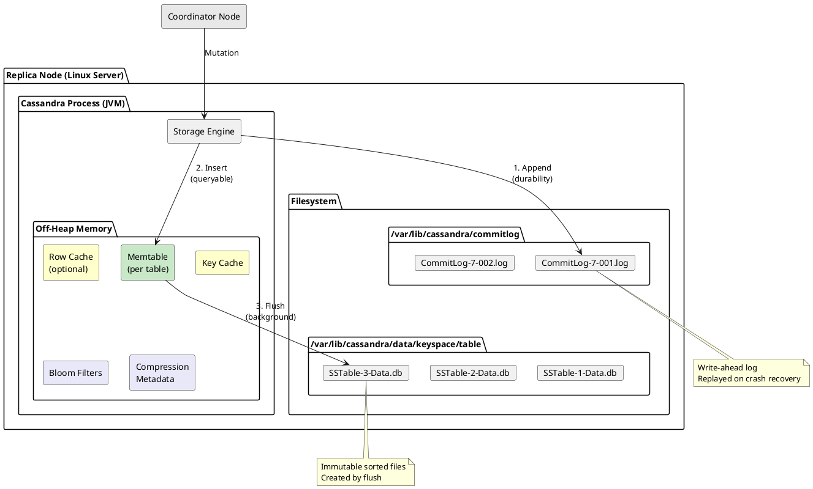
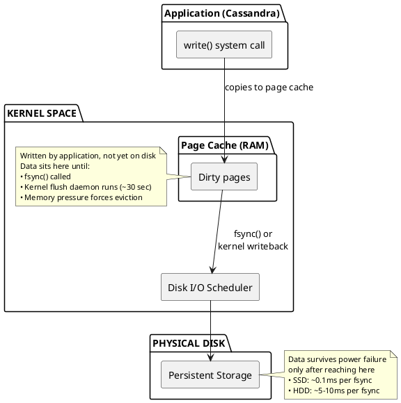
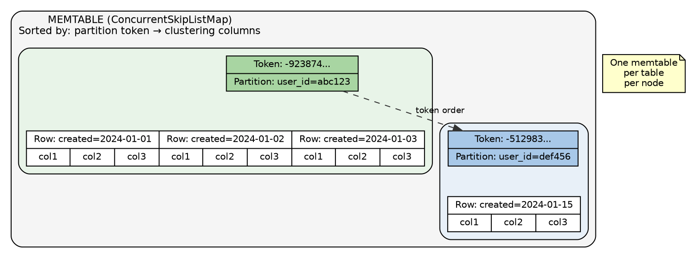
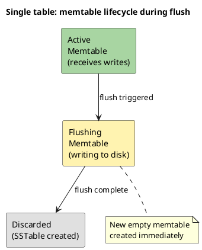

# Write Path

This document describes the write path within a single Cassandra node—how incoming mutations are persisted to durable storage. The focus is on the storage engine mechanics: commit log, memtable, and flush operations.

For cluster-level write coordination—how writes are routed to replicas and how consistency levels are satisfied—see [Distributed Data: Consistency](../distributed-data/consistency.md).

---

## Architecture Overview

When a node receives a write (whether as coordinator or replica), the storage engine performs these steps:




The write is considered durable once it reaches the commit log. The memtable update makes the data immediately queryable. Flushing to SSTable happens later, in the background.

---

## Commit Log

The commit log is a write-ahead log providing durability. Its sole purpose is crash recovery—if a node fails before memtables flush, the commit log is replayed on restart.

For a deep dive into commit log internals—segment file format, sync block structure, replay algorithm, compression, and encryption—see the dedicated [Commit Log](commitlog.md) reference.

### Commit Log Structure

```
commitlog_directory/
├── CommitLog-7-1234567890.log    (active - awaiting flush)
├── CommitLog-7-1234567891.log    (active - awaiting flush)
├── CommitLog-7-1234567892.log    (active - awaiting flush)
└── CommitLog-7-1234567893.log    (current - receiving writes)
```

Segments grow up to `commitlog_segment_size_in_mb` (default 32MB). Once all referenced memtables flush, the segment is deleted. See [Commit Log: Segment Architecture](commitlog.md#segment-architecture) for the full lifecycle.

### File Naming Convention

Commit log files follow a specific naming pattern:

```
CommitLog-<version>-<segment_id>.log

Example: CommitLog-7-1702345678901.log
         │         │ │
         │         │ └── Segment ID (base timestamp + sequence)
         │         └──── Commitlog format version
         └────────────── Prefix
```

| Component | Description |
|-----------|-------------|
| `CommitLog` | Fixed prefix identifying the file type |
| `version` | Commitlog serialization format version. Changes between major Cassandra releases when the format evolves. |
| `segment_id` | Unique identifier combining a base timestamp with a sequence number. |

**Segment ID Generation:**

The segment ID is computed as: `base_id + sequence_number`

| Component | Description |
|-----------|-------------|
| `base_id` | Set at Cassandra startup to the greater of: current time (milliseconds) or (highest existing segment ID + 1) |
| `sequence_number` | Atomic counter starting at 1, incremented for each new segment |

This approach ensures:

- **Monotonic ordering**: IDs always increase, even across restarts
- **Uniqueness**: No collisions from rapid segment creation
- **Recovery safety**: If existing segments have future-dated IDs (e.g., clock skew), new segments still receive higher IDs

```
Example startup scenario:

Existing segments: CommitLog-7-1702345678901.log
                   CommitLog-7-1702345678902.log

Current time:      1702345700000 (greater than max existing)
Base ID set to:    1702345700000

New segments:      CommitLog-7-1702345700001.log  (base + 1)
                   CommitLog-7-1702345700002.log  (base + 2)
                   CommitLog-7-1702345700003.log  (base + 3)
```

**Version History:**

| Version | Cassandra Version | Notes |
|---------|-------------------|-------|
| 6 | 3.0 - 3.11 | Introduced with storage engine rewrite |
| 7 | 4.0+ | Current format |

```bash
# List commit log segments
ls -la /var/lib/cassandra/commitlog/

# The base timestamp approximates when Cassandra started
# (first segment ID after restart reflects startup time)
```

### Configuration

```yaml
# cassandra.yaml

# Sync mode determines durability guarantees
# periodic: sync every N milliseconds (default)
# batch: sync after each write batch
commitlog_sync: periodic
commitlog_sync_period_in_ms: 10000

# For batch mode
# commitlog_sync: batch
# commitlog_sync_batch_window_in_ms: 2

# Segment size (default 32MB)
commitlog_segment_size_in_mb: 32

# Directory (should be on fast storage, separate from data)
commitlog_directory: /var/lib/cassandra/commitlog

# Maximum total space for commit log segments
commitlog_total_space_in_mb: 8192
```

### Sync Mode Comparison

Cassandra supports three sync modes: periodic, batch, and group. See [Commit Log: Sync Modes](commitlog.md#sync-modes) for detailed diagrams and trade-offs.

| Mode | Configuration | Latency | Data Loss Window |
|------|---------------|---------|------------------|
| Periodic (10s) | `commitlog_sync: periodic` | Lowest | Up to 10 seconds |
| Periodic (1s) | `commitlog_sync_period_in_ms: 1000` | Low | Up to 1 second |
| Batch (2ms) | `commitlog_sync: batch` | Higher | Up to 2ms |
| Batch (50ms) | `commitlog_sync_batch_window_in_ms: 50` | Medium | Up to 50ms |

### Understanding Filesystem Buffering and fsync

To understand why 10-second periodic sync is acceptable, it is necessary to understand UNIX filesystem architecture.

**Write Path Through the Operating System:**


**What `write()` Does:**

- Copies data from application memory to kernel page cache
- Returns immediately (sub-microsecond)
- Data is NOT durable—power loss loses unfsynced data

**What `fsync()` Does:**

- Forces all dirty pages for a file to physical storage
- Waits for disk controller acknowledgment
- Expensive: 0.1ms (SSD) to 10ms (HDD) per call
- Required for true durability

### Why 10 Seconds Is Acceptable

The 10-second default seems dangerous, but consider:

**1. Distributed Durability**

With replication factor 3 and `QUORUM` writes:

```
Write to partition key X:
├── Node A: write() to commitlog (page cache) ✓
├── Node B: write() to commitlog (page cache) ✓
└── Node C: write() to commitlog (page cache) ✓

Data loss requires:
- All 3 nodes lose power simultaneously
- Within the 10-second sync window
- Before kernel writeback occurs (~30 seconds)
```

The probability of all replicas failing within 10 seconds is extremely low in properly deployed clusters.

**2. Performance Impact of fsync**

| Metric | Periodic (10s) | Batch (2ms) |
|--------|----------------|-------------|
| `write()` latency | ~1μs | ~1μs |
| `fsync()` frequency | Once per 10 seconds | Every 2ms |
| fsync cost amortization | Across thousands of writes | Per batch only |
| Throughput (SSD) | 100,000+ writes/sec | Limited by fsync |
| Throughput (HDD) | 50,000+ writes/sec | ~100 writes/sec × batch size |
| Write latency P99 | Sub-millisecond | 2-10ms (fsync bound) |

**Throughput Calculations:**

For **periodic sync**, fsync overhead is amortized:

$$
\text{Effective write cost} = t_{write} + \frac{t_{fsync}}{\text{writes per sync period}}
$$

$$
\text{Effective write cost} = 1\mu s + \frac{0.1ms}{100{,}000} \approx 1\mu s
$$

For **batch sync**, each batch pays the fsync cost:

$$
\text{Max batches/sec} = \frac{1}{t_{batch\_window} + t_{fsync}}
$$

$$
\text{Max batches/sec (SSD)} = \frac{1}{2ms + 0.1ms} \approx 476 \text{ batches/sec}
$$

$$
\text{Max batches/sec (HDD)} = \frac{1}{2ms + 10ms} \approx 83 \text{ batches/sec}
$$

**fsync overhead comparison:**

$$
\text{Overhead ratio} = \frac{\text{fsync calls (batch)}}{\text{fsync calls (periodic)}} = \frac{500/sec}{0.1/sec} = 5000\times
$$

**3. When to Use Batch Sync**

Batch sync is appropriate when:

- Single-node deployment (no replication for durability)
- Regulatory requirements mandate immediate persistence
- Data loss of any amount is unacceptable
- Write throughput requirements are modest

```yaml
# Batch sync configuration
commitlog_sync: batch
commitlog_sync_batch_window_in_ms: 2

# Writes are grouped into 2ms windows
# fsync called at end of each window
# Higher latency but stronger single-node durability
```

### Sync Mode Selection Guide

| Scenario | Recommended Mode | Rationale |
|----------|------------------|-----------|
| Multi-node cluster (RF≥3) | Periodic 10s | Replication provides durability |
| Single node, can tolerate loss | Periodic 10s | Best performance |
| Single node, no data loss | Batch 2-50ms | fsync per batch |
| Compliance requirements | Batch | Regulatory mandate |
| Maximum throughput | Periodic 10s | Minimal fsync overhead |

Most production deployments use periodic sync with 10-second intervals. The distributed nature of Cassandra means true data loss requires catastrophic, correlated failures across multiple nodes.

### Commit Log Placement

Place the commit log on dedicated fast storage:

- Separate physical device from data directory
- SSD strongly recommended
- Prevents data I/O from blocking commit log writes

---

## Memtable

The memtable is an in-memory sorted data structure holding recent writes. Data in the memtable is queryable immediately after the write completes.

### Memtable Structure



### Configuration

```yaml
# cassandra.yaml

# Total heap space for all memtables
memtable_heap_space_in_mb: 2048

# Total off-heap space for memtables
memtable_offheap_space_in_mb: 2048

# Allocation type
# heap_buffers: on-heap (default)
# offheap_objects: objects off-heap, metadata on-heap
# offheap_buffers: everything off-heap
memtable_allocation_type: heap_buffers

# Concurrent flush operations
memtable_flush_writers: 2

# Flush threshold as fraction of heap
# Flush starts when memtables exceed this percentage
memtable_cleanup_threshold: 0.11
```

### Memory Calculation

The effective memtable flush threshold is the minimum of two values:

$$
\text{Threshold}_{\text{cleanup}} = \text{Heap Size} \times \texttt{memtable_cleanup_threshold}
$$

$$
\text{Threshold}_{\text{configured}} = \texttt{memtable_heap_space_in_mb}
$$

$$
\text{Effective Limit} = \min(\text{Threshold}_{\text{cleanup}}, \text{Threshold}_{\text{configured}})
$$

**Example with 32GB heap:**

$$
\text{Threshold}_{\text{cleanup}} = 32\text{GB} \times 0.11 = 3.52\text{GB}
$$

$$
\text{Threshold}_{\text{configured}} = 2048\text{MB} = 2\text{GB}
$$

$$
\text{Effective Limit} = \min(3.52\text{GB}, 2\text{GB}) = 2\text{GB}
$$

When total memtable size across all tables reaches 2GB, flush begins for the largest memtable.

### Monitoring Memtables

```bash
# Check memtable size
nodetool tablestats keyspace.table | grep -i memtable

# JMX metrics
# org.apache.cassandra.metrics:type=Table,name=MemtableOnHeapSize
# org.apache.cassandra.metrics:type=Table,name=MemtableOffHeapSize
# org.apache.cassandra.metrics:type=Table,name=MemtableLiveDataSize
```

---

## Flush Process

Memtables are flushed to SSTables under the following conditions:

| Trigger | Description |
|---------|-------------|
| Size threshold | Memtable reaches configured size limit |
| Commit log pressure | Commit log segments cannot be recycled |
| Manual flush | `nodetool flush` command |
| Shutdown | `nodetool drain` flushes all memtables |
| Memory pressure | JVM heap pressure triggers emergency flush |

### Flush Sequence

1. Current memtable marked "flushing" (no new writes accepted)
2. New empty memtable created for incoming writes
3. Flushing memtable written to disk as [SSTable](sstables.md) (sorted, sequential I/O)
4. [SSTable](sstables.md) files created atomically
5. Flushing memtable discarded; commit log segments eligible for recycling

During flush, a single table may temporarily have multiple memtables: one active memtable receiving new writes, while older memtables are still being written to disk. This allows writes to continue uninterrupted during flush operations.



All memtables (active and flushing) are checked during reads to ensure data visibility.

### Flush Commands

```bash
# Flush specific table
nodetool flush keyspace_name table_name

# Flush all tables in keyspace
nodetool flush keyspace_name

# Flush all tables on node
nodetool flush

# Prepare for shutdown (flush + stop writes)
nodetool drain
```

---

## Write Completion

From the node's perspective, a write is complete when both steps finish:

```
Write completion timeline (single node):

T+0.0ms:  Mutation received
T+0.1ms:  Commit log append begins
T+0.2ms:  Commit log append complete (data durable*)
T+0.3ms:  Memtable update begins
T+0.4ms:  Memtable update complete (data queryable)
T+0.4ms:  Acknowledgment sent to coordinator

* Durability depends on commitlog_sync mode
```

| Step | Time (typical) | Result |
|------|----------------|--------|
| Commit log append | 0.1–0.5ms | Data survives node restart |
| Memtable insert | 0.1–0.3ms | Data visible to queries |
| Total | 0.2–0.8ms | Node acknowledges write |

The node sends its acknowledgment to the coordinator (or client, if this node is the coordinator). Cluster-level consistency—how many nodes must acknowledge before the client receives success—is handled by the coordination layer, not the storage engine.

---

## Write Performance Tuning

### High Write Throughput

```yaml
# Larger memtables reduce flush frequency
memtable_heap_space_in_mb: 4096

# More flush writers for parallel I/O
memtable_flush_writers: 4

# Batch sync for throughput (higher latency)
commitlog_sync: batch
commitlog_sync_batch_window_in_ms: 2

# Separate commit log storage
commitlog_directory: /mnt/nvme/commitlog
```

### Low Write Latency

```yaml
# Periodic sync for lower latency
commitlog_sync: periodic
commitlog_sync_period_in_ms: 10000

# Fast commit log storage
commitlog_directory: /mnt/nvme/commitlog
```

---

## Troubleshooting

### Commit Log Backing Up

**Symptoms:** Many commit log segments, write latency increasing

```bash
# Check segment count
ls -la /var/lib/cassandra/commitlog/ | wc -l

# Check flush activity
nodetool tpstats | grep -i flush
```

**Causes:**

- Memtables not flushing (disk I/O bottleneck)
- `commitlog_total_space_in_mb` too low
- Too many tables consuming flush capacity

**Solutions:**

- Add faster storage for commit log
- Separate commit log and data directories
- Increase `memtable_flush_writers`

See [Commit Log: Operational Considerations](commitlog.md#operational-considerations) for monitoring metrics and recommendations.

### High Memtable Memory

**Symptoms:** High heap usage, GC pressure

```bash
# Check memtable sizes
nodetool tablestats | grep -i memtable
```

**Causes:**

- Flush not keeping up with writes
- Too many tables

**Solutions:**

- Move memtables off-heap: `memtable_allocation_type: offheap_buffers`
- Reduce number of tables
- Increase flush throughput

---

## Related Documentation

- **[Storage Engine Overview](index.md)** - Architecture overview
- **[Commit Log](commitlog.md)** - Commit log internals, file format, replay
- **[Read Path](read-path.md)** - How reads work
- **[SSTable Reference](sstables.md)** - SSTable file format
- **[Change Data Capture](cdc.md)** - Exposing commit log for external consumption
- **[Memory Management](../memory-management/memory.md)** - Memory configuration
