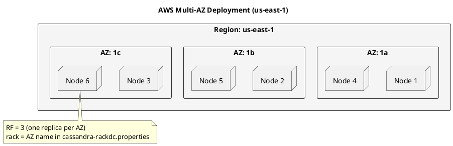

# Cassandra on AWS

This guide covers deploying Apache Cassandra on Amazon Web Services.

## Instance Types

### Recommended Instances

| Use Case | Instance | vCPUs | RAM | Storage | Notes |
|----------|----------|-------|-----|---------|-------|
| Development | m5.large | 2 | 8GB | EBS | Testing only |
| Small Prod | i3.xlarge | 4 | 30.5GB | 950GB NVMe | Good starting point |
| Standard Prod | i3.2xlarge | 8 | 61GB | 1.9TB NVMe | Recommended |
| High Perf | i3en.3xlarge | 12 | 96GB | 7.5TB NVMe | Write-heavy |
| Memory-Optimized | r5.4xlarge | 16 | 128GB | EBS | Large heaps |

### Storage Options

```yaml
# EBS configurations
gp3:
  iops: 3000-16000
  throughput: 125-1000 MB/s
  use_case: "General purpose, cost-effective"

io2:
  iops: up to 64000
  throughput: up to 1000 MB/s
  use_case: "High performance, consistent latency"

# Instance storage (NVMe)
i3_series:
  type: "NVMe SSD"
  iops: "High (instance dependent)"
  note: "Ephemeral - data lost on stop/terminate"
```

## Network Configuration

### VPC Setup

```hcl
# Terraform example
resource "aws_vpc" "cassandra" {
  cidr_block           = "10.0.0.0/16"
  enable_dns_hostnames = true
  enable_dns_support   = true

  tags = {
    Name = "cassandra-vpc"
  }
}

# Subnets across AZs
resource "aws_subnet" "cassandra" {
  count             = 3
  vpc_id            = aws_vpc.cassandra.id
  cidr_block        = "10.0.${count.index}.0/24"
  availability_zone = data.aws_availability_zones.available.names[count.index]
}
```

### Security Groups

```hcl
resource "aws_security_group" "cassandra" {
  name        = "cassandra-sg"
  vpc_id      = aws_vpc.cassandra.id

  # CQL client access
  ingress {
    from_port   = 9042
    to_port     = 9042
    protocol    = "tcp"
    cidr_blocks = ["10.0.0.0/16"]
  }

  # Inter-node communication
  ingress {
    from_port   = 7000
    to_port     = 7001
    protocol    = "tcp"
    self        = true
  }

  # JMX
  ingress {
    from_port   = 7199
    to_port     = 7199
    protocol    = "tcp"
    cidr_blocks = ["10.0.0.0/16"]
  }

  egress {
    from_port   = 0
    to_port     = 0
    protocol    = "-1"
    cidr_blocks = ["0.0.0.0/0"]
  }
}
```

## Snitch Configuration

### Ec2Snitch (Single Region)

```yaml
# cassandra.yaml
endpoint_snitch: Ec2Snitch

# Automatically detects:
# - DC = region (e.g., us-east-1)
# - Rack = availability zone (e.g., us-east-1a)
```

### Ec2MultiRegionSnitch (Multi-Region)

```yaml
# cassandra.yaml
endpoint_snitch: Ec2MultiRegionSnitch

# For multi-region:
# - Uses public IP for cross-region communication
# - Private IP for intra-region
listen_address: <private_ip>
broadcast_address: <public_ip>
```

## Deployment Example

### CloudFormation Template

```yaml
AWSTemplateFormatVersion: '2010-09-09'
Description: Cassandra cluster on AWS

Parameters:
  InstanceType:
    Type: String
    Default: i3.2xlarge
  ClusterSize:
    Type: Number
    Default: 3

Resources:
  CassandraASG:
    Type: AWS::AutoScaling::AutoScalingGroup
    Properties:
      LaunchTemplate:
        LaunchTemplateId: !Ref CassandraLaunchTemplate
        Version: !GetAtt CassandraLaunchTemplate.LatestVersionNumber
      MinSize: !Ref ClusterSize
      MaxSize: !Ref ClusterSize
      VPCZoneIdentifier:
        - !Ref SubnetA
        - !Ref SubnetB
        - !Ref SubnetC

  CassandraLaunchTemplate:
    Type: AWS::EC2::LaunchTemplate
    Properties:
      LaunchTemplateData:
        InstanceType: !Ref InstanceType
        ImageId: !Ref AmiId
        SecurityGroupIds:
          - !Ref CassandraSecurityGroup
        UserData:
          Fn::Base64: |
            #!/bin/bash
            # Install Cassandra
            # Configure based on instance metadata
```

## Multi-AZ Best Practices



## Monitoring with CloudWatch

```yaml
# CloudWatch agent configuration
{
  "metrics": {
    "metrics_collected": {
      "disk": {
        "measurement": ["used_percent"],
        "resources": ["/var/lib/cassandra"]
      },
      "mem": {
        "measurement": ["mem_used_percent"]
      }
    }
  }
}
```

## Cost Optimization

| Strategy | Savings | Trade-off |
|----------|---------|-----------|
| Reserved Instances | 30-60% | 1-3 year commitment |
| Savings Plans | 20-40% | Flexible commitment |
| Spot for non-prod | 60-90% | Can be interrupted |
| Right-sizing | Variable | Requires monitoring |

---

## Next Steps

- **[GCP Deployment](../gcp/index.md)** - Google Cloud guide
- **[Performance Tuning](../../operations/performance/index.md)** - Optimization
