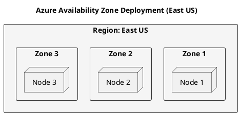

# Cassandra on Microsoft Azure

This guide covers deploying Apache Cassandra on Microsoft Azure.

## Virtual Machine Sizes

### Recommended VM Sizes

| Use Case | VM Size | vCPUs | RAM | Notes |
|----------|---------|-------|-----|-------|
| Development | Standard_D2s_v3 | 2 | 8GB | Testing |
| Small Prod | Standard_E4s_v3 | 4 | 32GB | Small workloads |
| Standard Prod | Standard_L8s_v2 | 8 | 64GB | NVMe storage |
| High Perf | Standard_L16s_v2 | 16 | 128GB | Heavy workloads |

### Storage Options

```yaml
# Managed Disk options
Premium_SSD:
  iops: "Up to 20K"
  throughput: "Up to 900 MB/s"
  use_case: "General production"

Ultra_Disk:
  iops: "Up to 160K"
  throughput: "Up to 2000 MB/s"
  use_case: "High performance"

# Lsv2 series includes NVMe
NVMe_local:
  note: "Ephemeral, included with Lsv2"
```

## Network Configuration

### Virtual Network

```hcl
# Terraform example
resource "azurerm_virtual_network" "cassandra" {
  name                = "cassandra-vnet"
  address_space       = ["10.0.0.0/16"]
  location            = var.location
  resource_group_name = azurerm_resource_group.cassandra.name
}

resource "azurerm_subnet" "cassandra" {
  count                = 3
  name                 = "cassandra-subnet-${count.index}"
  resource_group_name  = azurerm_resource_group.cassandra.name
  virtual_network_name = azurerm_virtual_network.cassandra.name
  address_prefixes     = ["10.0.${count.index}.0/24"]
}
```

### Network Security Group

```hcl
resource "azurerm_network_security_group" "cassandra" {
  name                = "cassandra-nsg"
  location            = var.location
  resource_group_name = azurerm_resource_group.cassandra.name

  security_rule {
    name                       = "CQL"
    priority                   = 100
    direction                  = "Inbound"
    access                     = "Allow"
    protocol                   = "Tcp"
    source_port_range          = "*"
    destination_port_range     = "9042"
    source_address_prefix      = "VirtualNetwork"
    destination_address_prefix = "*"
  }

  security_rule {
    name                       = "Internode"
    priority                   = 110
    direction                  = "Inbound"
    access                     = "Allow"
    protocol                   = "Tcp"
    source_port_range          = "*"
    destination_port_ranges    = ["7000", "7001"]
    source_address_prefix      = "VirtualNetwork"
    destination_address_prefix = "*"
  }
}
```

## Snitch Configuration

### AzureSnitch

```yaml
# cassandra.yaml
# Note: Azure snitch is community-contributed
# Alternative: GossipingPropertyFileSnitch with manual config

endpoint_snitch: GossipingPropertyFileSnitch
```

```properties
# cassandra-rackdc.properties
dc=azure-eastus
rack=zone1
```

## Availability Zones



---

## Next Steps

- **[Kubernetes](../kubernetes/index.md)** - AKS deployment
- **[Performance](../../operations/performance/index.md)** - Optimization
