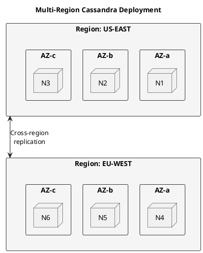

# Cassandra Cloud Deployment Guide

This guide covers deploying and operating Apache Cassandra in cloud environments.

## Cloud Platforms

| Platform | Guide | Key Features |
|----------|-------|--------------|
| **[AWS](aws/index.md)** | Amazon Web Services | EC2, EBS, Multi-AZ |
| **[GCP](gcp/index.md)** | Google Cloud Platform | GCE, Persistent Disks |
| **[Azure](azure/index.md)** | Microsoft Azure | VMs, Managed Disks |
| **[Kubernetes](kubernetes/index.md)** | Container orchestration | Operators, StatefulSets |

## Cloud Considerations

### Instance Selection

| Workload | AWS | GCP | Azure |
|----------|-----|-----|-------|
| Development | m5.large | n2-standard-2 | Standard_D2s_v3 |
| Production | i3.2xlarge | n2-highmem-8 | Standard_L8s_v2 |
| High Performance | i3en.3xlarge | n2-highmem-16 | Standard_L16s_v2 |

### Storage Options

```
Recommended storage types:
- AWS: io2 or gp3 EBS, i3 NVMe
- GCP: pd-ssd, local SSD
- Azure: Premium SSD, Ultra Disk

Requirements:
- IOPS: 3000+ for production
- Throughput: 125+ MB/s
- Latency: < 1ms
```

### Network Configuration

```yaml
# Security group rules (AWS example)
Inbound:
  - Port 9042: Client connections (CQL)
  - Port 7000: Inter-node communication
  - Port 7001: Inter-node SSL
  - Port 7199: JMX monitoring

Outbound:
  - All traffic to cluster nodes
```

## Multi-Region Deployment



## Best Practices

### High Availability

- Deploy across 3+ availability zones
- Use RF=3 minimum per region
- Configure proper snitch for cloud
- Enable rack awareness

### Cost Optimization

- Use reserved instances for stable workloads
- Right-size instances based on actual usage
- Consider spot instances for non-critical workloads
- Monitor and optimize storage

### Security

- Use VPCs/VNets for network isolation
- Enable encryption at rest and in transit
- Use IAM roles instead of credentials
- Regular security audits

---

## Next Steps

- **[AWS Deployment](aws/index.md)** - AWS-specific guide
- **[Kubernetes](kubernetes/index.md)** - Container deployment
