# Cloud Storage Strategy

Storage selection is a fundamental architectural decision for Cassandra in cloud environments. This guide analyzes ephemeral versus persistent storage across cost, performance, durability, and operational dimensions.

---

## Storage Types

### Ephemeral Storage (Instance/Local)

Ephemeral storage refers to disks physically attached to the host machine. Data persists only while the instance is running.

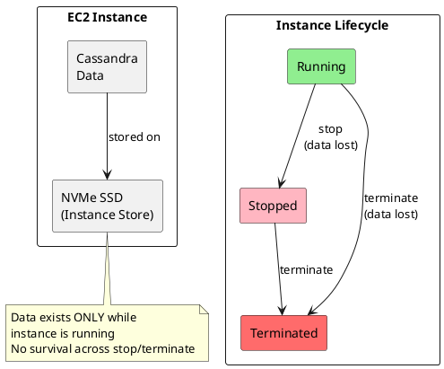

#### AWS

AWS provides multiple storage-optimized instance families with different processor architectures:

| Instance Family | Processor | vCPUs (max) | RAM (max) | NVMe Storage (max) | Notes |
|----------------|-----------|-------------|-----------|-------------------|-------|
| **I8g** | Graviton4 (ARM) | 192 | 1,536 GiB | 45 TB | Latest generation, best performance |
| **I8ge** | Graviton4 (ARM) | 192 | 1,536 GiB | 120 TB | Extended storage variant |
| **I7i** | Intel Emerald Rapids | 192 | 1,536 GiB | 45 TB | Latest Intel, 50% better than I4i |
| **I7ie** | Intel Emerald Rapids | 192 | 1,536 GiB | 120 TB | Extended storage variant |
| **I4i** | Intel Ice Lake | 128 | 1,024 GiB | 30 TB | Previous generation Intel |
| **I4g** | Graviton2 (ARM) | 64 | 512 GiB | 15 TB | Previous generation ARM |
| **Im4gn** | Graviton2 (ARM) | 64 | 256 GiB | 30 TB | Higher storage density per vCPU |
| **Is4gen** | Graviton2 (ARM) | 96 | 192 GiB | 30 TB | Lowest cost per TB |

**Processor selection:**

| Architecture | Best For | Price-Performance |
|-------------|----------|-------------------|
| Graviton (ARM) | Native ARM workloads, cost optimization | 20-40% better |
| Intel | x86 compatibility, specific instruction sets | Baseline |
| AMD (via R-series) | General purpose with EBS | Competitive |

#### GCP

GCP offers Local SSD through `-lssd` suffix on machine types:

| Machine Series | Processor | vCPUs (max) | RAM (max) | Local SSD (max) | Notes |
|---------------|-----------|-------------|-----------|-----------------|-------|
| **C4D-lssd** | AMD EPYC Genoa | 384 | 3 TB | 12 TB | Latest AMD, 55% more QPS vs C3D |
| **C4-lssd** | Intel Sapphire Rapids | 192 | 1.5 TB | 12 TB | Latest Intel |
| **C4A-lssd** | Ampere Altra (ARM) | 72 | 576 GiB | 6 TB | ARM-based option |
| **C3D-lssd** | AMD EPYC Genoa | 360 | 2,880 GiB | 6 TB | High vCPU count |
| **C3-lssd** | Intel Sapphire Rapids | 176 | 1,408 GiB | 6 TB | Intel alternative |
| **N2D** | AMD EPYC Milan | 224 | 896 GiB | 9 TB | General purpose |

Local SSD disks are 375 GiB each, attached in predetermined quantities per machine type.

#### Azure

Azure L-series provides storage-optimized instances:

| VM Series | Processor | vCPUs (max) | RAM (max) | NVMe Storage (max) | Notes |
|-----------|-----------|-------------|-----------|-------------------|-------|
| **Lsv3** | Intel Ice Lake | 80 | 640 GiB | 19.2 TB (10×1.92TB) | Intel-based, default encryption |
| **Lasv3** | AMD EPYC 7763v | 80 | 640 GiB | 19.2 TB (10×1.92TB) | AMD-based alternative |
| **Lsv2** | AMD EPYC 7551 | 80 | 640 GiB | 19.2 TB | Previous generation |

One 1.92TB NVMe device per 8 vCPUs. NVMe drives encrypted by default using hardware-based encryption.

### Persistent Storage (Network-Attached)

Persistent storage survives instance lifecycle events. Data is stored on network-attached block devices.

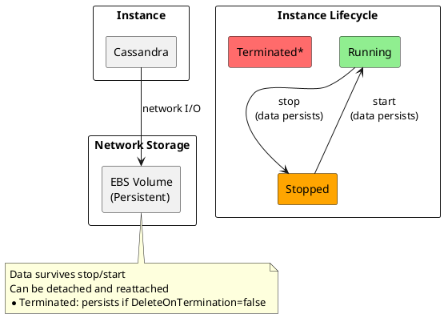

**Cloud offerings:**

| Provider | Storage Types | Performance Tiers |
|----------|--------------|-------------------|
| **AWS** | EBS (gp3, io2, io2 Block Express) | 3,000 - 256,000 IOPS |
| **GCP** | Persistent Disk (pd-ssd, pd-extreme) | 15,000 - 120,000 IOPS |
| **Azure** | Managed Disks (Premium SSD, Ultra Disk) | 5,000 - 160,000 IOPS |

---

## Comparison Matrix

| Dimension | Ephemeral Storage | Persistent Storage |
|-----------|-------------------|-------------------|
| **Cost** | Included in instance price | Additional per-GB/IOPS charge |
| **Performance** | Lowest latency (local NVMe) | Higher latency (network hop) |
| **IOPS** | Very high (device-limited) | Provisioned (pay for what you need) |
| **Durability** | None (data lost on stop) | High (replication within AZ) |
| **Capacity** | Fixed per instance type | Flexible (resize online) |
| **Portability** | Cannot detach/reattach | Can move between instances |
| **Snapshots** | Not available | Native snapshot support |
| **Patching** | Replace instance | In-place updates |

---

## Cost Analysis

### Ephemeral Storage Cost Model

With ephemeral storage, storage is bundled with compute. The cost equation is straightforward:

```
Total Cost = Instance Cost × Hours
```

**Example instances (US-East-1, approximate):**

| Instance | Processor | vCPUs | RAM | NVMe | On-demand/hr | Monthly (OD) | Monthly (1yr RI) |
|----------|-----------|-------|-----|------|--------------|--------------|------------------|
| **i4g.2xlarge** | Graviton2 | 8 | 64 GiB | 1.875 TB | ~$0.53 | ~$380 | ~$240 |
| **i4i.2xlarge** | Intel Ice Lake | 8 | 64 GiB | 1.875 TB | ~$0.62 | ~$450 | ~$280 |
| **i8g.2xlarge** | Graviton4 | 8 | 64 GiB | 1.875 TB | ~$0.55 | ~$400 | ~$250 |
| **i7i.2xlarge** | Intel Emerald Rapids | 8 | 64 GiB | 1.875 TB | ~$0.64 | ~$460 | ~$290 |

Graviton-based instances typically provide 15-30% cost savings over equivalent Intel instances.

### Persistent Storage Cost Model

Persistent storage separates compute and storage costs:

```
Total Cost = Instance Cost × Hours + Storage Cost + IOPS Cost
```

**Example (AWS m5.2xlarge + gp3):**

| Component | Specification | Cost (US-East-1) |
|-----------|--------------|------------------|
| Instance | 8 vCPU, 32GB RAM | ~$0.384/hour |
| Storage | 2TB gp3 | ~$160/month |
| IOPS | 6,000 IOPS | ~$60/month |
| Throughput | 500 MB/s | ~$40/month |
| **Monthly (on-demand)** | | ~$536 |
| **Monthly (1yr reserved)** | | ~$400 |

### Total Cost Comparison

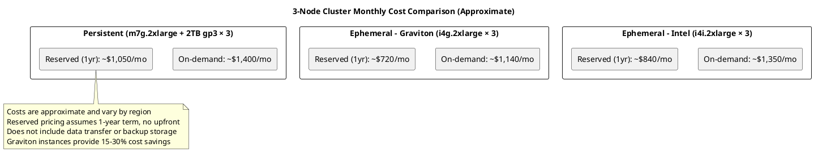

**Key cost considerations:**

| Factor | Ephemeral Advantage | Persistent Advantage |
|--------|--------------------|--------------------|
| Storage included | No additional storage cost | - |
| Right-sizing | - | Pay only for storage needed |
| Scaling storage | Must change instance type | Add/resize volumes independently |
| Backup storage | Must use external backup | Snapshots (but cost extra) |

---

## Performance Analysis

### Latency Comparison

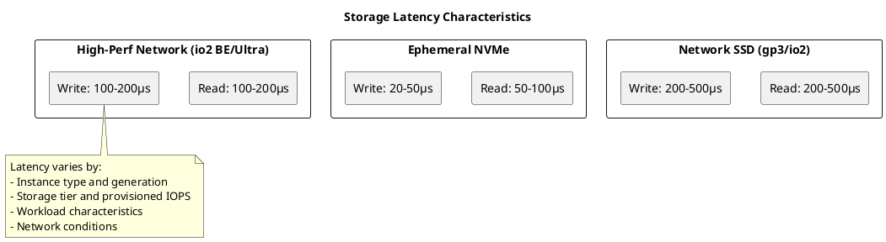

### IOPS and Throughput

| Storage Type | Random Read IOPS | Sequential Throughput | Notes |
|-------------|------------------|----------------------|-------|
| **AWS I8g** (Graviton4 NVMe) | ~400,000+ | ~10 GB/s | 65% better than I4g |
| **AWS I7i** (Intel NVMe) | ~350,000+ | ~10 GB/s | 50% better than I4i |
| **AWS I4i** (Intel Ice Lake NVMe) | ~250,000 | ~8 GB/s | Per 1.875TB drive |
| **AWS I4g** (Graviton2 NVMe) | ~200,000 | ~7 GB/s | Per 1.875TB drive |
| **GCP C4D** (Local SSD) | ~100,000+ | ~4 GB/s | Per 3TB attachment |
| **Azure Lsv3** (NVMe) | ~400,000 | ~4.75 GB/s | Per 1.92TB drive |
| AWS gp3 (baseline) | 3,000 | 125 MB/s | Network-attached |
| AWS gp3 (provisioned) | 16,000 | 1,000 MB/s | Additional cost |
| AWS io2 Block Express | 256,000 | 4,000 MB/s | Highest network tier |

### Cassandra Workload Impact

| Workload Pattern | Ephemeral NVMe | Persistent SSD |
|-----------------|----------------|----------------|
| Write-heavy | Excellent (local append) | Good (network latency overhead) |
| Read-heavy (cached) | Excellent | Excellent (page cache) |
| Read-heavy (disk) | Excellent | Good to Excellent (depends on tier) |
| Mixed | Excellent | Good |
| Compaction | Excellent | Can cause I/O contention |

**Practical performance difference:**

For most Cassandra workloads with proper sizing, the performance gap is smaller than raw specifications suggest:

1. **Page cache effect**: Hot data served from memory, masking storage latency
2. **Compaction scheduling**: Background I/O can be tuned to avoid impact
3. **Modern network storage**: io2 Block Express and Ultra Disk approach local NVMe performance

---

## Durability and Data Protection

### The Durability Challenge

Ephemeral storage provides **zero durability guarantees**. Data is lost when:

- Instance is stopped (not just rebooted)
- Instance is terminated
- Underlying hardware fails
- Host is retired for maintenance

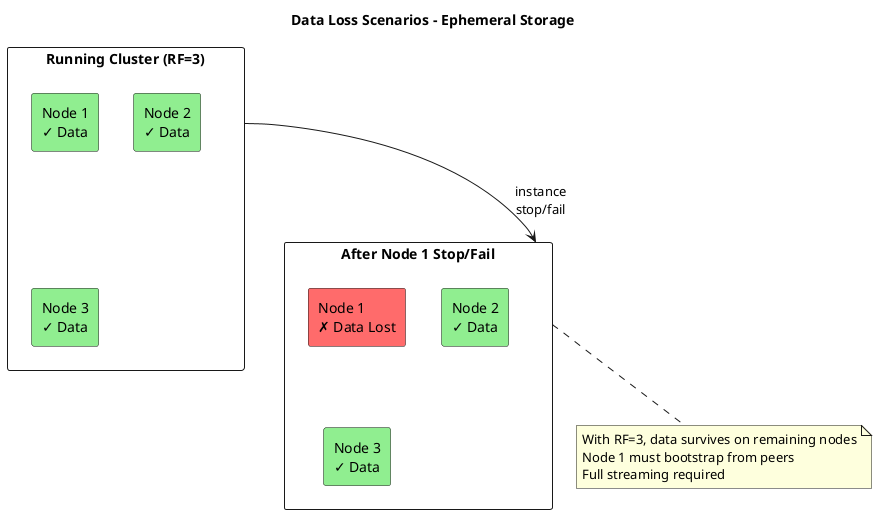

### Durability Through Replication

Cassandra's replication provides durability across ephemeral storage:

| Replication Factor | Nodes That Can Fail | Data Safety |
|-------------------|---------------------|-------------|
| RF=1 | 0 | No redundancy - data loss on any failure |
| RF=2 | 1 | Single node failure tolerance |
| RF=3 | 2 | Recommended minimum for production |
| RF=4+ | N-2 | Higher availability, increased storage cost |

**Requirements for ephemeral storage safety:**

```yaml
# Minimum requirements for ephemeral storage durability
replication_factor: 3                  # Must be >= 3
consistency_level_write: LOCAL_QUORUM  # Ensures multiple copies
rack_awareness: enabled                # Spread across failure domains
```

!!! warning "RF < 3 with Ephemeral Storage"
    Operating with RF < 3 on ephemeral storage creates significant data loss risk.
    A single instance stop or hardware failure results in permanent data loss for affected partitions.

### Backup Strategies

Ephemeral storage requires robust backup strategies since provider snapshots are not available.

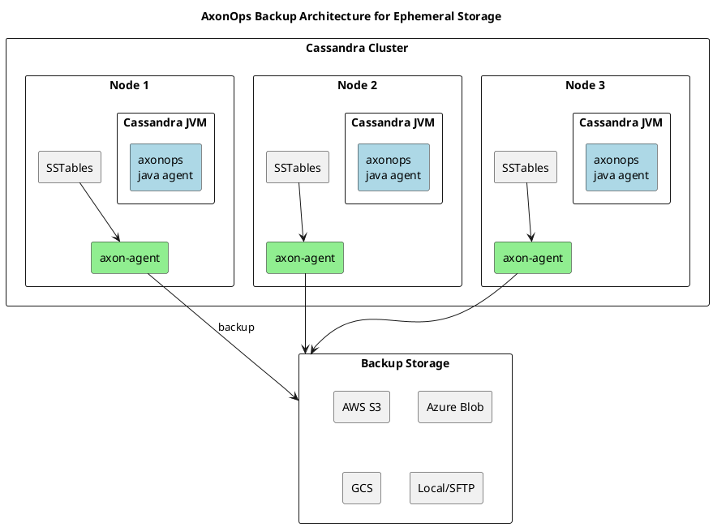

**AxonOps backup components:**

| Component | Location | Function |
|-----------|----------|----------|
| **axonops java agent** | Inside Cassandra JVM | Collects metrics, triggers snapshots |
| **axon-agent** | Each Cassandra host | Uploads SSTables to object storage, executes commands |
| **AxonOps Service** | Central server | Schedules backups, orchestrates restores, stores metadata |
| **Object Storage** | S3/GCS/Azure Blob | Stores backup data with cross-region replication |

**Backup frequency recommendations:**

| Data Change Rate | Backup Frequency | Point-in-Time Granularity |
|-----------------|------------------|---------------------------|
| Low (< 1GB/hour) | Every 6-12 hours | Daily |
| Medium (1-10GB/hour) | Every 1-4 hours | Hourly |
| High (> 10GB/hour) | Every 15-60 minutes | Sub-hourly |

---

## Recovery and Restore

### Recovery Scenarios

| Scenario | Ephemeral Storage | Persistent Storage |
|----------|-------------------|-------------------|
| Single node failure | Stream from peers or restore from backup | Reattach volume or restore snapshot |
| Multiple node failure | Restore from backup | Restore from snapshots |
| Full cluster loss | Restore from backup | Restore from snapshots |
| Datacenter loss | Cross-DC replication + backup | Cross-DC replication + snapshots |

### Recovery Time Comparison

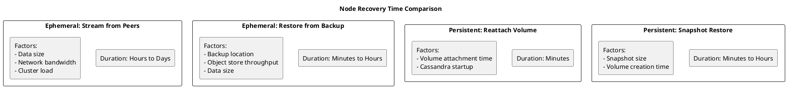

### Fast Restore with AxonOps

AxonOps provides accelerated restore capabilities for ephemeral storage environments:

**Key capabilities:**

| Feature | Benefit |
|---------|---------|
| **Incremental backups** | Reduces backup size and duration |
| **Parallel restore** | Streams data to multiple nodes simultaneously |
| **Object store integration** | S3, GCS, Azure Blob with multipart download |
| **Restore orchestration** | Automated multi-node restore with proper sequencing |
| **Point-in-time recovery** | Restore to specific timestamp |

**Restore process:**

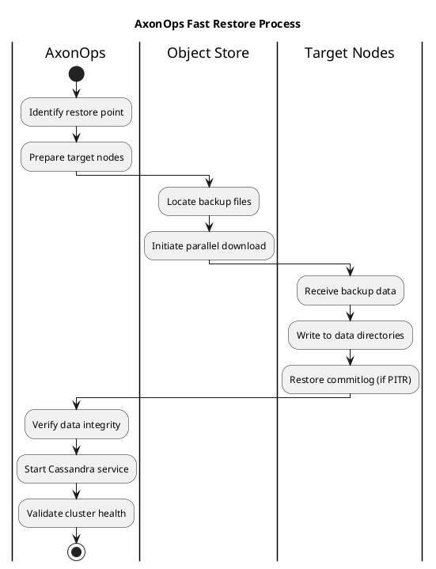

**Restore time estimates:**

| Data Size (per node) | Network Throughput | Estimated Restore Time |
|---------------------|-------------------|----------------------|
| 100 GB | 1 Gbps | ~15 minutes |
| 500 GB | 1 Gbps | ~70 minutes |
| 1 TB | 1 Gbps | ~140 minutes |
| 1 TB | 10 Gbps | ~15 minutes |

---

## Patching Strategies

Storage choice significantly impacts patching and upgrade procedures.

### Persistent Storage: In-Place Patching

With persistent storage, patches are applied to running nodes using rolling restart:

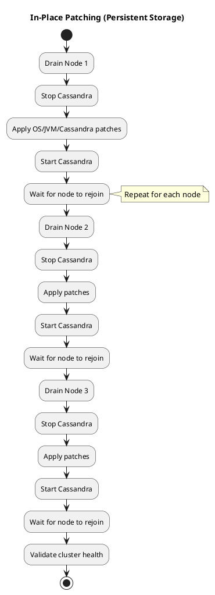

**Procedure:**

1. Disable auto-bootstrap (if applicable)
2. Run `nodetool drain` on target node
3. Stop Cassandra service
4. Apply updates (OS packages, JVM, Cassandra)
5. Start Cassandra service
6. Wait for node to rejoin and become healthy
7. Repeat for next node

**Advantages:**

- No data movement required
- Minimal cluster impact
- Rollback by downgrading packages

**Disadvantages:**

- Configuration drift possible
- Manual intervention required
- Slower for large clusters

### Ephemeral Storage: Immutable Infrastructure

With ephemeral storage, patching means replacing nodes with new instances from updated images:

```plantuml
@startuml
skinparam backgroundColor #FFFFFF

title Immutable Infrastructure Patching (Ephemeral Storage)

rectangle "Current State" as current {
  rectangle "Node 1 (v1.0)" as n1_old
  rectangle "Node 2 (v1.0)" as n2_old
  rectangle "Node 3 (v1.0)" as n3_old
}

rectangle "Build Pipeline" as pipeline {
  rectangle "Base AMI/Image" as base
  rectangle "OS Updates" as os
  rectangle "JVM Updates" as jvm
  rectangle "Cassandra Updates" as cass
  rectangle "New AMI v1.1" as new_ami
}

rectangle "Updated Cluster" as updated {
  rectangle "Node 1 (v1.1)" as n1_new #90EE90
  rectangle "Node 2 (v1.1)" as n2_new #90EE90
  rectangle "Node 3 (v1.1)" as n3_new #90EE90
}

base --> os --> jvm --> cass --> new_ami

n1_old --> n1_new : replace
n2_old --> n2_new : replace
n3_old --> n3_new : replace

note bottom of updated
  Each node replaced with new instance
  Data restored from backup or streamed from peers
end note

@enduml
```

**Procedure:**

1. Build new base image with updates
2. For each node (one at a time):
   a. Launch new instance with updated image
   b. Either:
      - Stream data from existing nodes (slower, uses cluster resources)
      - Restore from recent backup (faster, requires good backup strategy)
   c. Decommission old node
   d. Wait for cluster to stabilize
3. Validate cluster health

**Advantages:**

- Guaranteed consistent configuration
- No configuration drift
- Clean state (no accumulated cruft)
- Tested, reproducible deployments
- Infrastructure-as-code friendly

**Disadvantages:**

- Requires data restoration for each node
- More time-consuming per node
- Requires robust backup/restore capability

### Patching Strategy Comparison

| Aspect | In-Place (Persistent) | Immutable (Ephemeral) |
|--------|----------------------|----------------------|
| Time per node | Minutes | Minutes to hours (data restore) |
| Data movement | None | Full (stream or restore) |
| Configuration consistency | Manual enforcement | Guaranteed by image |
| Rollback complexity | Medium (package downgrade) | Low (use previous image) |
| Automation complexity | Medium | High (but well-defined) |
| Required infrastructure | Package repository | Image builder, backup system |

### Recommended Patching Workflow for Ephemeral Storage

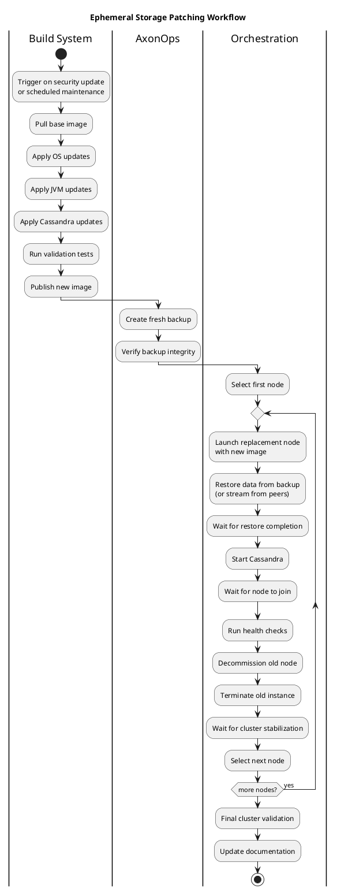

---

## Decision Framework

### When to Choose Ephemeral Storage

Ephemeral storage is appropriate when:

| Condition | Rationale |
|-----------|-----------|
| **Performance is critical** | Local NVMe provides lowest latency |
| **Cost optimization is priority** | Storage included in instance price |
| **Robust backup system exists** | AxonOps or similar provides data protection |
| **Immutable infrastructure model** | Organization embraces infrastructure-as-code |
| **Cluster size is moderate** | Streaming/restore manageable |
| **RF >= 3 is acceptable** | Replication provides durability |

### When to Choose Persistent Storage

Persistent storage is appropriate when:

| Condition | Rationale |
|-----------|-----------|
| **Simplicity is priority** | Native snapshots, familiar operations |
| **Limited backup infrastructure** | Relies on provider snapshots |
| **Traditional operations model** | In-place patching preferred |
| **Independent scaling needed** | Storage grows independently of compute |
| **Compliance requires snapshots** | Audit trail via native snapshots |
| **Large nodes (10TB+)** | Restore time becomes prohibitive |

### Decision Matrix

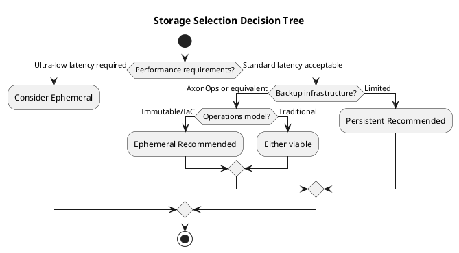

### Hybrid Approach

Some organizations use a hybrid approach:

| Tier | Storage Type | Use Case |
|------|-------------|----------|
| Production (performance-critical) | Ephemeral NVMe | Lowest latency workloads |
| Production (standard) | Persistent SSD | Balanced workloads |
| Development/Test | Ephemeral (smaller instances) | Cost optimization |
| DR/Backup cluster | Persistent | Simplified recovery |

---

## Implementation Checklist

### Ephemeral Storage Checklist

- [ ] **Replication factor >= 3** configured for all keyspaces
- [ ] **Rack awareness** enabled and properly configured
- [ ] **Backup solution** (AxonOps) deployed and tested
- [ ] **Backup schedule** defined based on data change rate
- [ ] **Restore procedure** documented and tested
- [ ] **Image build pipeline** established
- [ ] **Node replacement runbook** created
- [ ] **Monitoring** includes storage health alerts
- [ ] **DR plan** includes full cluster restore scenario

### Persistent Storage Checklist

- [ ] **Storage tier** selected based on IOPS/throughput requirements
- [ ] **Snapshot schedule** configured
- [ ] **Volume encryption** enabled
- [ ] **DeleteOnTermination** set appropriately
- [ ] **IOPS provisioning** matches workload
- [ ] **Patching runbook** created
- [ ] **Monitoring** includes volume metrics
- [ ] **Cross-AZ or cross-region** backup configured

---

## Summary

| Recommendation | Ephemeral Storage | Persistent Storage |
|----------------|-------------------|-------------------|
| **Best for** | Performance-critical, cost-sensitive, modern ops | Simplicity, traditional ops, compliance |
| **Required infrastructure** | Backup system (AxonOps), image pipeline | Snapshot configuration |
| **Minimum RF** | 3 (strongly recommended) | 2 (3 recommended) |
| **Patching model** | Immutable (replace nodes) | In-place (rolling restart) |
| **Recovery method** | Restore from backup | Reattach volume or snapshot |
| **Cost model** | Bundled with compute | Pay separately for storage |

**Key takeaway**: Ephemeral storage offers superior performance and cost efficiency but requires investment in backup infrastructure and operational automation. Persistent storage provides simpler operations at the cost of performance and flexibility.

---

## Related Documentation

- [AWS Deployment](aws/index.md) - AWS-specific storage options
- [GCP Deployment](gcp/index.md) - GCP storage configuration
- [Azure Deployment](azure/index.md) - Azure managed disks
- [Kubernetes](kubernetes/index.md) - Container storage considerations
- [Backup and Restore](../operations/backup-restore/index.md) - Backup procedures
- [Filesystem Selection](../operations/performance/os-tuning/filesystem.md) - Filesystem recommendations
