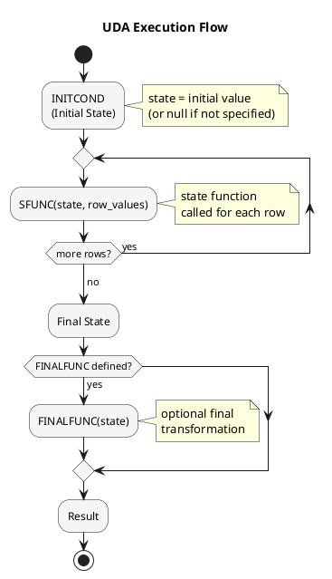
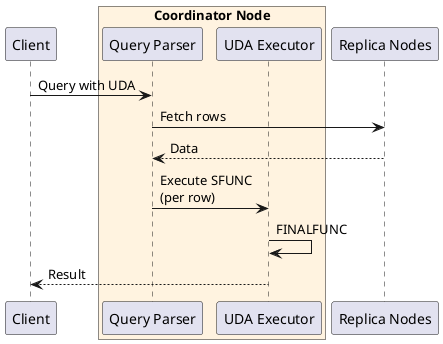

# Aggregate Commands

User-Defined Aggregates (UDAs) process multiple rows and produce a single result value. UDAs combine a state function, optional final function, and initial state to implement custom aggregation logic like weighted averages, custom statistics, or domain-specific calculations.

---

## Overview

### What are User-Defined Aggregates?

UDAs extend CQL's aggregation capabilities beyond the built-in functions (`COUNT`, `SUM`, `AVG`, `MIN`, `MAX`). They enable custom aggregation logic implemented in Java or JavaScript, executed on the coordinator node during query processing.

```sql
-- Built-in aggregate
SELECT AVG(price) FROM products WHERE category = 'electronics';

-- User-defined aggregate for weighted average
SELECT weighted_avg(price, quantity) FROM order_items WHERE order_id = ?;
```

### Version Support

| Feature | Cassandra Version | Notes |
|---------|-------------------|-------|
| User-Defined Aggregates | 2.2+ | Initial UDA support |
| OR REPLACE syntax | 3.0+ | Replace existing aggregates |
| Java UDFs | 2.2+ | Always available |
| JavaScript UDFs | 2.2+ | Requires configuration |
| Improved null handling | 3.0+ | Better INITCOND behavior |

### Configuration Requirements

UDAs require User-Defined Functions (UDFs) to be enabled in `cassandra.yaml`:

```yaml
# Enable Java UDFs (required for UDAs)
enable_user_defined_functions: true

# Enable JavaScript UDFs (optional)
enable_scripted_user_defined_functions: true

# Timeout settings
user_defined_function_warn_timeout: 500ms
user_defined_function_fail_timeout: 10000ms
```

!!! warning "Security Consideration"
    Enabling UDFs allows execution of user-provided code on cluster nodes. In multi-tenant environments, restrict UDF creation permissions to trusted roles only.

### Built-in vs User-Defined Aggregates

| Aspect | Built-in Aggregates | User-Defined Aggregates |
|--------|---------------------|-------------------------|
| Performance | Optimized native code | JVM overhead |
| Availability | Always available | Requires configuration |
| Customization | Fixed behavior | Fully customizable |
| Maintenance | Automatic | User managed |
| Examples | COUNT, SUM, AVG, MIN, MAX | Weighted avg, percentiles, custom stats |

!!! tip "When to Use UDAs"
    Use built-in aggregates when possible—they are faster and require no setup. Use UDAs when:

    - Built-in aggregates don't meet requirements
    - Custom business logic is needed
    - Multiple values must be combined (e.g., weighted calculations)
    - Domain-specific statistics are required

---

## Behavioral Guarantees

### What UDA Operations Guarantee

- CREATE AGGREGATE creates schema metadata that propagates to all nodes via gossip
- Aggregate state function is called once per row in the result set
- Final function (if specified) is called once after all rows are processed
- INITCOND provides the initial state value for the aggregation
- OR REPLACE atomically updates an existing aggregate definition
- IF NOT EXISTS provides idempotent aggregate creation

### What UDA Operations Do NOT Guarantee

!!! warning "Undefined Behavior"
    The following behaviors are undefined and must not be relied upon:

    - **Execution order**: The order in which rows are processed is not guaranteed (unless ORDER BY is used)
    - **Partial aggregation**: Aggregation is not distributed; all matching rows are sent to coordinator
    - **State persistence**: Aggregate state is not persisted between queries
    - **Memory limits**: Large result sets may cause coordinator memory exhaustion
    - **Timeout during aggregation**: Partial state is discarded on timeout

### Execution Contract

| Property | Guarantee |
|----------|-----------|
| Execution location | Coordinator node only |
| State function calls | Once per row in result set |
| Final function calls | Once after all rows processed |
| Initial state | INITCOND value or type default if null |
| Null row handling | Controlled by underlying state function's null handling |

### Aggregation Order Contract

| Query | Row Processing Order |
|-------|---------------------|
| Without ORDER BY | Undefined (implementation-dependent) |
| With ORDER BY | Specified order |
| Multiple partitions | Undefined between partitions |

### Failure Semantics

| Failure Mode | Outcome | Client Action |
|--------------|---------|---------------|
| State function throws exception | Query fails, partial state discarded | Fix state function |
| Final function throws exception | Query fails, aggregation result lost | Fix final function |
| Timeout during aggregation | Query fails, partial state discarded | Reduce result set or increase timeout |
| Referenced function dropped | Query fails with `InvalidRequestException` | Recreate function or aggregate |

### Version-Specific Behavior

| Version | Behavior |
|---------|----------|
| 2.2+ | User-defined aggregates introduced (CASSANDRA-6890) |
| 3.0+ | OR REPLACE syntax, improved null handling |
| 4.0+ | Better timeout handling during aggregation |

---

## Aggregate Architecture

### How UDAs Work

Aggregates process rows through a state accumulation pattern:



### Components

| Component | Required | Purpose | Example |
|-----------|----------|---------|---------|
| **SFUNC** | Yes | State function called for each row | `sum_state(state, val)` |
| **STYPE** | Yes | Data type of the state variable | `BIGINT`, `TUPLE<...>` |
| **FINALFUNC** | No | Transforms final state to result | `avg_final(state) → DOUBLE` |
| **INITCOND** | No | Initial state value (defaults to null) | `0`, `(0, 0)` |

### Execution Flow

1. State initialized to `INITCOND` (or null if not specified)
2. For each row matching the query:
    - State function called: `new_state = SFUNC(current_state, input_values)`
    - State is updated with return value
3. After all rows processed:
    - If `FINALFUNC` defined: `result = FINALFUNC(final_state)`
    - Otherwise: `result = final_state`

### Execution Location

UDAs execute entirely on the **coordinator node**:



!!! warning "Performance Implications"
    - All matching rows are streamed to the coordinator
    - UDA computation happens in coordinator's JVM
    - Large result sets can cause memory pressure
    - Consider filtering with WHERE clause to limit rows

### Null Handling

Understanding null behavior is critical for correct UDA implementation:

| Scenario | Behavior |
|----------|----------|
| Input value is NULL | State function is **not called**; state remains unchanged |
| State function returns NULL | State becomes NULL for remainder of aggregation |
| INITCOND is NULL or unspecified | First SFUNC call receives NULL as initial state |
| All input values are NULL | Result is FINALFUNC(INITCOND) or INITCOND if no FINALFUNC |

!!! warning "Null Propagation"
    If the state function returns NULL at any point, the state remains NULL for all subsequent rows. This is particularly dangerous with arithmetic operations:

    ```java
    // Dangerous: returns null if state is ever null
    return state + val;  // null + anything = null

    // Safe: handle null state explicitly
    if (state == null) return (long) val;
    return state + val;
    ```

!!! tip "Best Practices for Null Safety"
    - Always specify `INITCOND` to avoid null initial state
    - Use `CALLED ON NULL INPUT` for state functions
    - Explicitly check for null state AND null input values in SFUNC
    - Test aggregation with datasets containing NULL values

### Non-Deterministic Functions

!!! danger "Avoid Non-Deterministic Functions in UDAs"
    UDAs can reference UDFs that use non-deterministic operations like `now()` or `uuid()`. This leads to unpredictable results because:

    - Aggregation assumes deterministic behavior for consistency
    - The same input data may produce different results on each execution
    - Replayed queries (e.g., during repair or retry) may yield inconsistent values

    **Recommendation**: Use only deterministic functions in SFUNC and FINALFUNC. If timestamps or UUIDs are needed, pass them as input parameters rather than generating them inside the function.

### Type Constraints

Strict type matching is enforced between aggregate components:

| Constraint | Requirement | Error if Violated |
|------------|-------------|-------------------|
| SFUNC return type | Must exactly match STYPE | `InvalidRequestException` at creation |
| SFUNC first parameter | Must exactly match STYPE | `InvalidRequestException` at creation |
| FINALFUNC input type | Must exactly match STYPE | `InvalidRequestException` at creation |
| INITCOND type | Must be literal of STYPE | Compile-time error |

**INITCOND Parsing Rules:**

```sql
-- Scalar types: use literal values
INITCOND 0           -- for INT, BIGINT
INITCOND 0.0         -- for DOUBLE, FLOAT
INITCOND ''          -- for TEXT

-- Tuple types: use parentheses
INITCOND (0, 0)      -- for TUPLE<BIGINT, BIGINT>
INITCOND (0, 0.0, '') -- for TUPLE<INT, DOUBLE, TEXT>

-- Collection types: use brackets/braces
INITCOND []          -- for LIST
INITCOND {}          -- for SET or empty MAP
INITCOND {'key': 0}  -- for MAP<TEXT, INT>

-- UDT types: use named fields
INITCOND {field1: 0, field2: ''}
```

### Sandbox Restrictions

UDFs (and therefore UDAs) execute in a sandboxed JVM environment with significant restrictions:

| Restriction | Description |
|-------------|-------------|
| No file system access | Cannot read or write files |
| No network access | Cannot open sockets or make HTTP calls |
| Limited Java classes | Only whitelisted JDK classes available |
| No reflection | `java.lang.reflect` package blocked |
| No threading | Cannot create threads or use concurrency utilities |
| Memory limits | Bounded by `user_function_timeout` settings |

!!! note "Allowed Classes"
    The sandbox permits basic Java classes: primitives, `String`, `Math`, collections (`List`, `Set`, `Map`), and Cassandra driver types (`TupleValue`, `UDTValue`). Attempting to use restricted classes throws `SecurityException`.

### Distributed Consistency

UDA execution has implications for distributed consistency:

| Aspect | Behavior |
|--------|----------|
| Aggregation location | Coordinator collects all rows, then aggregates |
| Partition ordering | Rows from different partitions have undefined order |
| Global ordering | Not guaranteed unless single partition with ORDER BY |
| Result merging | No distributed reduce phase; all data flows to coordinator |

!!! warning "No Global Ordering Guarantees"
    If a UDA relies on processing rows in a specific global order or expects uniqueness across partitions, results may differ from expectations. Cassandra does not guarantee ordering between partitions.

    ```sql
    -- Order guaranteed within partition
    SELECT my_agg(value) FROM table WHERE partition_key = ?
        ORDER BY clustering_col;

    -- Order NOT guaranteed across partitions
    SELECT my_agg(value) FROM table;  -- undefined row order
    ```

### Error Handling

UDA error behavior follows fail-fast semantics:

| Error Source | Behavior | Recovery |
|--------------|----------|----------|
| SFUNC throws exception | Query fails immediately | No partial results returned |
| FINALFUNC throws exception | Query fails after aggregation | Aggregated state is lost |
| Timeout during SFUNC | Query fails | Partial state discarded |
| Type conversion error | Query fails | Fix function or input data |

!!! danger "No Partial Aggregation Recovery"
    When any error occurs during UDA execution:

    - The entire query fails
    - No partial aggregation results are returned
    - All accumulated state is discarded
    - The error propagates to the client

    **Mitigation**: Implement defensive programming in SFUNC/FINALFUNC with try-catch blocks that return safe default values rather than throwing exceptions.

---

## CREATE AGGREGATE

Create a user-defined aggregate function.

### Synopsis

```cqlsyntax
CREATE [ OR REPLACE ] AGGREGATE [ IF NOT EXISTS ]
    [ *keyspace_name*. ] *aggregate_name*
    ( [ *arg_type* [, *arg_type* ... ] ] )
    SFUNC *state_function*
    STYPE *state_type*
    [ FINALFUNC *final_function* ]
    [ INITCOND *initial_condition* ]
```

### Description

`CREATE AGGREGATE` defines a UDA composed of user-defined functions. The state function and optional final function must be created before the aggregate.

### Parameters

#### OR REPLACE

Replace existing aggregate with same signature.

#### IF NOT EXISTS

Prevent error if aggregate already exists.

#### *aggregate_name*

Identifier for the aggregate. Aggregates can be overloaded like functions.

#### Argument Types

Input types matching the state function's input parameters (after the state parameter):

```sql
-- Aggregate taking INT values
CREATE AGGREGATE my_sum(INT) ...

-- Aggregate taking multiple arguments
CREATE AGGREGATE weighted_avg(DOUBLE, DOUBLE) ...
```

#### SFUNC

The state function called for each row. Must:

- Accept state type as first parameter
- Accept aggregate argument types as subsequent parameters
- Return the state type

```sql
-- State function signature for my_sum(INT)
CREATE FUNCTION sum_state(state INT, val INT)
    RETURNS INT ...
```

#### STYPE

Data type for the accumulated state. Can be:

- Native types (`INT`, `BIGINT`, `DOUBLE`, etc.)
- Tuples (for multi-value state)
- User-defined types
- Collections

```sql
-- Simple state
STYPE INT

-- Tuple state (for average: sum and count)
STYPE TUPLE<BIGINT, BIGINT>

-- UDT state
STYPE FROZEN<stats_accumulator>
```

#### FINALFUNC

Optional function to transform final state into result:

- Takes state type as input
- Returns the aggregate's result type

```sql
-- Final function for average
CREATE FUNCTION avg_final(state TUPLE<BIGINT, BIGINT>)
    RETURNS DOUBLE ...
```

If not specified, the final state is returned directly.

#### INITCOND

Initial value for the state. Format depends on state type:

```sql
-- Scalar initial condition
INITCOND 0

-- Tuple initial condition
INITCOND (0, 0)

-- Collection initial condition
INITCOND []

-- UDT initial condition
INITCOND {field1: 0, field2: 0}
```

!!! warning "INITCOND Importance"
    Without `INITCOND`:
    - State starts as null
    - First row must handle null state
    - Empty result sets return null

    With `INITCOND`:
    - State has defined starting value
    - Empty result sets return FINALFUNC(INITCOND) or INITCOND

### Examples

#### Simple Sum Aggregate

```sql
-- State function
CREATE FUNCTION sum_state(state BIGINT, val INT)
    CALLED ON NULL INPUT
    RETURNS BIGINT
    LANGUAGE java
    AS '
        if (val == null) return state;
        if (state == null) return (long) val;
        return state + val;
    ';

-- Aggregate
CREATE AGGREGATE my_sum(INT)
    SFUNC sum_state
    STYPE BIGINT
    INITCOND 0;

-- Usage
SELECT my_sum(quantity) FROM orders WHERE customer_id = ?;
```

#### Average Aggregate

```sql
-- State function (accumulates sum and count)
CREATE FUNCTION avg_state(state TUPLE<BIGINT, BIGINT>, val DOUBLE)
    CALLED ON NULL INPUT
    RETURNS TUPLE<BIGINT, BIGINT>
    LANGUAGE java
    AS '
        if (val == null) return state;
        long sum = state.getLong(0) + val.longValue();
        long count = state.getLong(1) + 1;
        return new com.datastax.driver.core.TupleValue(
            com.datastax.driver.core.TupleType.of(
                com.datastax.driver.core.DataType.bigint(),
                com.datastax.driver.core.DataType.bigint()
            )
        ).setLong(0, sum).setLong(1, count);
    ';

-- Final function (computes average)
CREATE FUNCTION avg_final(state TUPLE<BIGINT, BIGINT>)
    RETURNS NULL ON NULL INPUT
    RETURNS DOUBLE
    LANGUAGE java
    AS '
        long count = state.getLong(1);
        if (count == 0) return null;
        return (double) state.getLong(0) / count;
    ';

-- Aggregate
CREATE AGGREGATE my_avg(DOUBLE)
    SFUNC avg_state
    STYPE TUPLE<BIGINT, BIGINT>
    FINALFUNC avg_final
    INITCOND (0, 0);

-- Usage
SELECT my_avg(price) FROM products WHERE category = ?;
```

#### Weighted Average

```sql
-- State function
CREATE FUNCTION weighted_avg_state(
    state TUPLE<DOUBLE, DOUBLE>,
    value DOUBLE,
    weight DOUBLE
)
    CALLED ON NULL INPUT
    RETURNS TUPLE<DOUBLE, DOUBLE>
    LANGUAGE java
    AS '
        if (value == null || weight == null) return state;
        double sum = state.getDouble(0) + (value * weight);
        double totalWeight = state.getDouble(1) + weight;
        return state.getType().newValue()
            .setDouble(0, sum)
            .setDouble(1, totalWeight);
    ';

-- Final function
CREATE FUNCTION weighted_avg_final(state TUPLE<DOUBLE, DOUBLE>)
    RETURNS NULL ON NULL INPUT
    RETURNS DOUBLE
    LANGUAGE java
    AS '
        double totalWeight = state.getDouble(1);
        if (totalWeight == 0.0) return null;
        return state.getDouble(0) / totalWeight;
    ';

-- Aggregate
CREATE AGGREGATE weighted_avg(DOUBLE, DOUBLE)
    SFUNC weighted_avg_state
    STYPE TUPLE<DOUBLE, DOUBLE>
    FINALFUNC weighted_avg_final
    INITCOND (0.0, 0.0);

-- Usage
SELECT weighted_avg(score, credit_hours) FROM grades
WHERE student_id = ?;
```

#### String Concatenation Aggregate

```sql
-- State function
CREATE FUNCTION concat_state(state TEXT, val TEXT, delimiter TEXT)
    CALLED ON NULL INPUT
    RETURNS TEXT
    LANGUAGE java
    AS '
        if (val == null) return state;
        if (state == null || state.isEmpty()) return val;
        return state + delimiter + val;
    ';

-- Aggregate
CREATE AGGREGATE group_concat(TEXT, TEXT)
    SFUNC concat_state
    STYPE TEXT
    INITCOND '';

-- Usage
SELECT group_concat(tag, ', ') FROM items WHERE category = ?;
```

#### Min/Max with Metadata

```sql
-- State type to track min value and its metadata
CREATE TYPE min_with_id (
    min_value DOUBLE,
    id UUID
);

-- State function
CREATE FUNCTION min_state(state FROZEN<min_with_id>, value DOUBLE, id UUID)
    CALLED ON NULL INPUT
    RETURNS FROZEN<min_with_id>
    LANGUAGE java
    AS '
        if (value == null) return state;
        if (state.getDouble("min_value") == null ||
            value < state.getDouble("min_value")) {
            return state.getType().newValue()
                .setDouble("min_value", value)
                .setUUID("id", id);
        }
        return state;
    ';

-- Aggregate returns the UDT
CREATE AGGREGATE min_with_metadata(DOUBLE, UUID)
    SFUNC min_state
    STYPE FROZEN<min_with_id>;

-- Usage
SELECT min_with_metadata(price, product_id) FROM products;
```

#### Count Distinct Approximation

```sql
-- Using a set to track unique values (limited scalability)
CREATE FUNCTION count_distinct_state(state SET<TEXT>, val TEXT)
    CALLED ON NULL INPUT
    RETURNS SET<TEXT>
    LANGUAGE java
    AS '
        if (val == null) return state;
        java.util.Set<String> result = new java.util.HashSet<>(state);
        result.add(val);
        return result;
    ';

CREATE FUNCTION count_distinct_final(state SET<TEXT>)
    RETURNS NULL ON NULL INPUT
    RETURNS INT
    LANGUAGE java
    AS 'return state.size();';

CREATE AGGREGATE count_distinct(TEXT)
    SFUNC count_distinct_state
    STYPE SET<TEXT>
    FINALFUNC count_distinct_final
    INITCOND {};

-- Usage (caution: memory intensive for high cardinality)
SELECT count_distinct(category) FROM products;
```

### Restrictions

!!! danger "Restrictions"
    **Component Requirements:**

    - SFUNC must exist before creating aggregate
    - SFUNC must accept STYPE as first parameter
    - SFUNC must return STYPE
    - FINALFUNC (if specified) must accept STYPE

    **Type Restrictions:**

    - Counter columns not supported
    - State type must be serializable

    **Execution Restrictions:**

    - Aggregates execute on coordinator only
    - Memory bounded by function limits
    - Cannot aggregate across partitions without ALLOW FILTERING

!!! warning "Performance Considerations"
    - Aggregates process all matching rows
    - Large result sets consume coordinator memory
    - Collection state types grow with data volume
    - Consider pre-aggregating for large datasets

### Notes

- Aggregates stored in `system_schema.aggregates`
- View with `DESCRIBE AGGREGATE`
- Built-in aggregates (COUNT, SUM, AVG) are more efficient than UDAs
- Test with representative data volumes before production use

---

## DROP AGGREGATE

Remove a user-defined aggregate.

### Synopsis

```cqlsyntax
DROP AGGREGATE [ IF EXISTS ] [ *keyspace_name*. ] *aggregate_name*
    [ ( [ *arg_type* [, *arg_type* ... ] ] ) ]
```

### Description

`DROP AGGREGATE` removes a UDA. Specify argument types if multiple overloads exist.

### Parameters

#### IF EXISTS

Prevent error if aggregate doesn't exist.

#### Argument Types

Identify specific overload when multiple exist:

```sql
-- If aggregate has overloads
DROP AGGREGATE my_agg(INT);
DROP AGGREGATE my_agg(DOUBLE);
```

### Examples

```sql
-- Drop simple aggregate
DROP AGGREGATE my_sum;

-- Drop with keyspace
DROP AGGREGATE my_keyspace.weighted_avg;

-- Drop specific overload
DROP AGGREGATE my_avg(DOUBLE);

-- Safe drop
DROP AGGREGATE IF EXISTS temp_aggregate;
```

### Restrictions

!!! warning "Restrictions"
    - Cannot drop aggregate while queries using it are running
    - Dropping aggregate does not drop underlying functions
    - Requires DROP permission

### Finding Aggregates

```sql
-- List aggregates in keyspace
SELECT aggregate_name, argument_types, state_type, state_func
FROM system_schema.aggregates
WHERE keyspace_name = 'my_keyspace';

-- Describe aggregate
DESCRIBE AGGREGATE my_keyspace.my_sum;
```

---

## Best Practices

### When to Use UDAs

!!! tip "Good Use Cases"
    - Custom statistical calculations
    - Domain-specific aggregations
    - Multi-value aggregations (returning tuples/UDTs)
    - Aggregations with complex accumulation logic

### When to Avoid UDAs

!!! warning "Avoid When"
    - Built-in aggregates suffice (COUNT, SUM, AVG, MIN, MAX)
    - Aggregating across entire table (too many rows)
    - High-frequency queries (UDA overhead significant)
    - Memory-intensive state types on large datasets

### Design Guidelines

1. **Choose appropriate state type**
      - Simple types for simple aggregations
      - Tuples for multi-value accumulation
      - Avoid unbounded collections

2. **Handle null state correctly**
      - Use INITCOND when possible
      - Make SFUNC null-safe

3. **Test with realistic volumes**
      - Profile memory usage
      - Test with expected result set sizes

4. **Consider pre-aggregation**
      - Maintain aggregated tables for common queries
      - Update aggregates via application logic

### Performance and Safety

UDAs have significant performance implications that must be considered:

| Concern | Impact | Mitigation |
|---------|--------|------------|
| Coordinator memory | All rows streamed to single node | Limit result sets with WHERE clauses |
| State size | Large state consumes heap | Keep state minimal; avoid unbounded collections |
| SFUNC complexity | Called once per row | Keep operations O(1); avoid heavy computation |
| FINALFUNC complexity | Called once at end | Acceptable to be more complex than SFUNC |
| Network transfer | All data flows to coordinator | Pre-filter data; consider materialized views |

!!! warning "Performance Best Practices"
    **Keep state small:**

    - Prefer primitive types over collections
    - Use fixed-size tuples instead of growing lists
    - Accumulate only what's necessary for final computation

    **Keep operations lightweight:**

    - Avoid object allocation in SFUNC when possible
    - No I/O operations (blocked by sandbox anyway)
    - No complex string manipulation per row
    - Pre-compute values that don't change

    **Example - Efficient vs Inefficient:**

    ```java
    // INEFFICIENT: Creates new ArrayList every call
    List<Integer> result = new ArrayList<>(state);
    result.add(val);
    return result;

    // EFFICIENT: Accumulate only sum and count
    return state + val;  // For simple sum
    ```

!!! tip "Capacity Planning"
    Estimate coordinator memory requirements:

    ```
    Memory ≈ (rows × state_size) + (rows × row_size_during_transfer)
    ```

    For 1 million rows with 100-byte state: ~100MB minimum coordinator heap required.

### Cleanup: Dropping Aggregate and Functions

```sql
-- Order matters: drop aggregate before its functions
DROP AGGREGATE IF EXISTS my_avg;
DROP FUNCTION IF EXISTS avg_final;
DROP FUNCTION IF EXISTS avg_state;
```

---

## Related Documentation

- **[CREATE FUNCTION](function.md)** - User-defined functions for aggregates
- **[Functions Reference](../functions/index.md)** - Built-in aggregate functions
- **[SELECT](../dml/select.md)** - Using aggregates in queries
