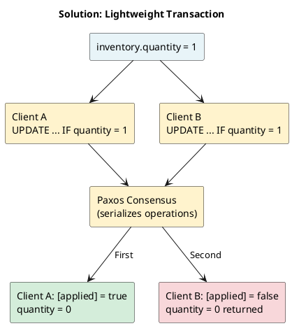
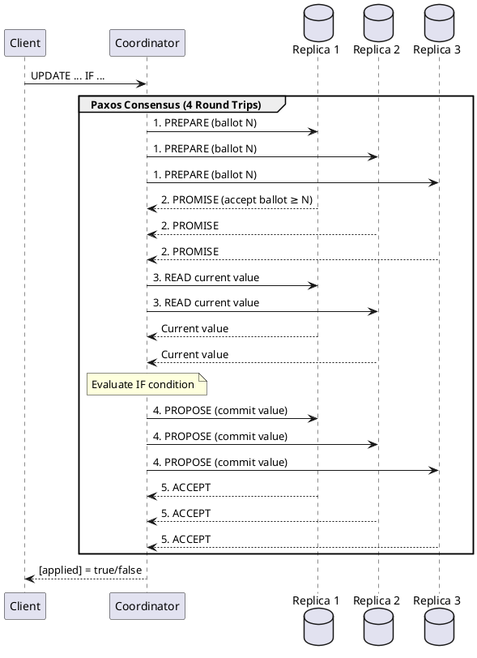
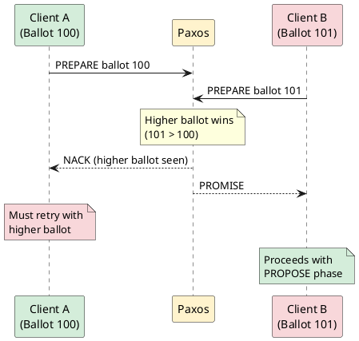

# Lightweight Transactions

Lightweight Transactions (LWT) provide linearizable consistency through compare-and-set operations. They use the Paxos consensus protocol to ensure that only one concurrent operation succeeds when multiple clients attempt to modify the same data.

!!! info "Implementation Reference"
    LWT was introduced in Cassandra 2.0 (CASSANDRA-5062). The Paxos implementation is defined in `StorageProxy.cas()` and `PaxosState.java`.

---

## Behavioral Guarantees

### What LWT Guarantees

- Operations on the same partition appear to execute in some total order consistent with real-time (linearizability)
- The IF condition evaluation and subsequent mutation are atomic
- LWT guarantees apply only within a single partition
- With SERIAL consistency, all datacenters participate in consensus
- With LOCAL_SERIAL, only the local datacenter participates

### What LWT Does NOT Guarantee

!!! warning "Undefined Behavior"
    The following behaviors are undefined and must not be relied upon:

    - **Cross-partition atomicity**: LWT provides no guarantees across different partitions. Multi-partition batches with LWT may leave partitions in inconsistent states on partial failure.
    - **Ordering across partitions**: Two LWT operations on different partitions have no defined ordering relationship.
    - **Timeout outcomes**: If an LWT times out, the operation may or may not have been applied. The outcome is undefined.
    - **Retry safety without idempotency**: Retrying a failed LWT without checking the result may cause duplicate application.

### Mixing LWT and Non-LWT Operations

!!! danger "Mixing LWT with Non-LWT Is Unsafe"
    Mixing lightweight transactions with standard (non-LWT) operations on the same data is **inherently unsafe** and SHOULD be avoided.

    **Why this is dangerous:**

    Paxos uses its own **hybrid-logical clock** to ensure linearizability within LWT operations. This clock is separate from the regular Cassandra timestamp mechanism used by non-LWT writes. When you mix the two:

    - The clocks are never perfectly synchronized between LWT and non-LWT requests
    - A non-LWT operation executed immediately after an LWT may appear to succeed but have no effect
    - The Paxos consensus may not have fully propagated when the non-LWT operation executes

    **Example of the problem:**

    ```sql
    -- Step 1: Insert with LWT (uses Paxos clock)
    INSERT INTO users (user_id, username) VALUES (123, 'alice') IF NOT EXISTS;
    -- Returns [applied] = true

    -- Step 2: Immediately delete without LWT (uses regular timestamp)
    DELETE FROM users WHERE user_id = 123;
    -- Returns success, but row may still exist!

    -- Step 3: Verify
    SELECT * FROM users WHERE user_id = 123;
    -- Row still exists despite "successful" delete
    ```

    **If you MUST mix LWT and non-LWT operations:**

    1. **Use LWT consistently**: If you use `INSERT ... IF NOT EXISTS`, also use `DELETE ... IF EXISTS` for the same data
    2. **Add delays** (not recommended for production): Waiting between operations may allow Paxos to complete, but this is fragile and timing-dependent
    3. **Understand the risk**: Even with precautions, edge cases may cause unexpected behavior

    **Best practice:** Design your data model so that LWT operations are self-contained. If a piece of data is managed with LWT, ALL operations on that data SHOULD use LWT conditions.

    See [Troubleshooting: LWT and Non-LWT Mixing Issues](../../troubleshooting/common-errors/lightweight-transactions.md) for diagnosis and resolution steps.

### Version-Specific Behavior

| Version | Behavior |
|---------|----------|
| 2.0 - 2.1 | Initial Paxos implementation. Contention handling less efficient. |
| 3.0+ | Improved Paxos state management (CASSANDRA-9143) |
| 4.0+ | Paxos state auto-cleanup, configurable timeouts (CASSANDRA-12126) |
| 5.0+ | Accord transaction protocol available as alternative (CEP-15) |

---

## Overview

### The Problem LWT Solves

Standard Cassandra writes use last-write-wins semantics—concurrent writes to the same row can overwrite each other unpredictably:

**Problem: Last-Write-Wins Race Condition**

| Step | Client A | Client B |
|------|----------|----------|
| Initial | `quantity = 1` | `quantity = 1` |
| Read | Reads quantity = 1 | Reads quantity = 1 |
| Write | `UPDATE SET quantity = 0` | `UPDATE SET quantity = 0` |
| **Result** | quantity = 0 | quantity = 0 |

**Problem:** Two items were "sold" but inventory only decremented by 1!

### How LWT Solves It

LWT ensures read-modify-write is atomic:



### Historical Context

| Version | LWT Feature |
|---------|-------------|
| 2.0 | Initial LWT implementation (Paxos) |
| 2.1 | Performance improvements |
| 3.0 | Batch LWT support improvements |
| 4.0 | Paxos state cleanup, better timeouts |
| 5.0 | Accord transaction protocol (future) |

---

## Paxos Consensus

### What Is Paxos?

Paxos is a distributed consensus algorithm that ensures agreement among nodes even when some nodes fail. Cassandra implements a variant called "single-decree Paxos" for LWT.

### Paxos Phases



### Why LWT Is Slow

| Operation | Round Trips | Typical Latency |
|-----------|-------------|-----------------|
| Regular write | 1 | 1-5ms |
| Regular read | 1 | 1-5ms |
| LWT | 4 | 10-50ms |

**Contributing factors:**

- Multiple network round trips
- Contention handling (ballot conflicts)
- Serial execution per partition

---

## Synopsis

### INSERT IF NOT EXISTS

```cqlsyntax
INSERT INTO *table*
    ( *columns* )
    VALUES ( *values* )
    IF NOT EXISTS
```

### UPDATE IF / IF EXISTS

```cqlsyntax
UPDATE *table*
    SET *assignments*
    WHERE *primary_key*
    IF EXISTS
    | IF *condition* [ AND *condition* ... ]
```

### DELETE IF / IF EXISTS

```cqlsyntax
DELETE FROM *table*
    WHERE *primary_key*
    IF EXISTS
    | IF *condition* [ AND *condition* ... ]
```

**condition:**

```cqlsyntax
*column_name* *operator* *value*
| *column_name* [ *index* ] *operator* *value*
| *column_name* [ *key* ] *operator* *value*
| *column_name* IN ( *values* )
```

**operator:**

```cqlsyntax
= | != | < | > | <= | >= | IN
```

---

## INSERT IF NOT EXISTS

Ensures row creation only if it doesn't exist:

```sql
INSERT INTO users (user_id, username, email)
VALUES (uuid(), 'alice', 'alice@example.com')
IF NOT EXISTS;
```

### Results

**When applied (row didn't exist):**

```
 [applied]
-----------
      True
```

**When not applied (row exists):**

```
 [applied] | user_id                              | username | email
-----------+--------------------------------------+----------+---------------------
     False | 550e8400-e29b-41d4-a716-446655440000 | alice    | alice@example.com
```

The existing row values are returned for client decision-making.

### Use Cases

| Use Case | Example |
|----------|---------|
| Unique usernames | `INSERT INTO usernames (username, user_id) VALUES (?, ?) IF NOT EXISTS` |
| Idempotent writes | Prevent duplicate event processing |
| Resource allocation | First-come-first-served |

---

## UPDATE IF EXISTS

Updates only if row exists:

```sql
UPDATE users
SET last_login = toTimestamp(now())
WHERE user_id = ?
IF EXISTS;
```

**Use cases:**

- Don't create accidental rows
- Verify row presence before modification
- Avoid orphan data

## UPDATE IF Condition

Conditional update based on column values:

```sql
UPDATE inventory
SET quantity = quantity - 1
WHERE product_id = 'SKU-001'
IF quantity > 0;
```

### Multiple Conditions

```sql
UPDATE accounts
SET balance = balance - 100
WHERE account_id = ?
IF balance >= 100
  AND status = 'active'
  AND frozen = false;
```

### Collection Conditions

```sql
-- Check list element
UPDATE users
SET phone_numbers = ?
WHERE user_id = ?
IF phone_numbers[0] = '+1-555-0100';

-- Check map entry
UPDATE users
SET preferences = preferences + {'theme': 'dark'}
WHERE user_id = ?
IF preferences['theme'] = 'light';
```

---

## DELETE IF EXISTS / IF Condition

```sql
-- Delete only if exists
DELETE FROM sessions
WHERE session_id = ?
IF EXISTS;

-- Conditional delete
DELETE FROM users
WHERE user_id = ?
IF status = 'inactive'
  AND last_login < '2023-01-01';
```

---

## Serial Consistency Levels

LWT operations use special consistency levels:

### SERIAL

Global linearizability across all datacenters:

```sql
-- All replicas participate in Paxos
CONSISTENCY SERIAL;
UPDATE accounts SET balance = 100 WHERE id = ? IF balance = 50;
```

**Behavior:**

- Paxos runs across all replicas cluster-wide
- Highest consistency guarantee
- Highest latency (cross-DC round trips)

### LOCAL_SERIAL

Linearizability within local datacenter only:

```sql
-- Only local DC participates
CONSISTENCY LOCAL_SERIAL;
UPDATE accounts SET balance = 100 WHERE id = ? IF balance = 50;
```

**Behavior:**

- Paxos limited to local datacenter
- Lower latency than SERIAL
- Not linearizable across datacenters

### Choosing Serial Consistency

| Scenario | Recommended |
|----------|-------------|
| Single datacenter | Either (same behavior) |
| Multi-DC, local consistency acceptable | LOCAL_SERIAL |
| Multi-DC, global consistency required | SERIAL |
| Low latency priority | LOCAL_SERIAL |

---

## Contention and Retries

### Contention Handling

When multiple clients try LWT on the same partition:



### Client-Side Retry Logic

```java
// Java driver example with retry
int maxRetries = 5;
for (int i = 0; i < maxRetries; i++) {
    ResultSet rs = session.execute(lwtStatement);
    Row row = rs.one();

    if (row.getBool("[applied]")) {
        return true;  // Success
    }

    // Read current value and decide whether to retry
    int currentValue = row.getInt("quantity");
    if (currentValue <= 0) {
        return false;  // Can't complete operation
    }

    // Exponential backoff
    Thread.sleep((long) Math.pow(2, i) * 100);
}
throw new RuntimeException("Max retries exceeded");
```

### CAS (Compare-And-Set) Pattern

```sql
-- Read current state
SELECT version, content FROM documents WHERE doc_id = ?;

-- Attempt update with version check
UPDATE documents
SET content = 'new content', version = 6
WHERE doc_id = ?
IF version = 5;

-- If [applied] = false, re-read and retry
```

---

## Performance Considerations

### When to Use LWT

!!! tip "Good LWT Use Cases"
    1. **Unique constraints**: Username uniqueness, email uniqueness
    2. **Inventory management**: Prevent overselling
    3. **Idempotent operations**: Exactly-once processing
    4. **Optimistic locking**: Version-based updates
    5. **Resource allocation**: First-come-first-served

### When to Avoid LWT

!!! warning "Avoid LWT For"
    1. **High-throughput operations**: Consider different data model
    2. **Non-critical uniqueness**: Eventually consistent may suffice
    3. **Counters**: Use native counter columns instead
    4. **Cross-partition atomicity**: LWT is per-partition only

### Performance Metrics

```yaml
# Typical LWT latencies
single_partition_lwt: 15-30ms
contended_lwt: 50-200ms
cross_dc_lwt: 50-100ms

# Throughput impact
regular_write_throughput: 10000/s per partition
lwt_throughput: 500-1000/s per partition
```

### Monitoring LWT

```bash
# Cassandra metrics
nodetool proxyhistograms  # Look at CAS latencies

# CQL tracing
TRACING ON;
UPDATE users SET name = 'Alice' WHERE id = 1 IF name = 'Bob';
```

---

## Batches with LWT

LWT can be used in batches with special semantics:

```sql
BEGIN BATCH
    INSERT INTO users (user_id, username) VALUES (?, 'alice') IF NOT EXISTS;
    INSERT INTO usernames (username, user_id) VALUES ('alice', ?) IF NOT EXISTS;
APPLY BATCH;
```

### Batch LWT Behavior

- All conditions must be on same partition OR...
- Batch becomes a multi-partition Paxos (very expensive)
- All conditions evaluated atomically
- If ANY condition fails, entire batch fails

!!! danger "Multi-Partition LWT Batches"
    Multi-partition LWT batches require Paxos across all involved partitions, dramatically increasing latency and contention. Avoid if possible.

---

## Failure Semantics

Understanding failure behavior is critical for correct LWT usage.

### Failure Modes and Outcomes

| Failure Mode | Outcome | Client Action |
|--------------|---------|---------------|
| `[applied] = true` | Operation succeeded | None required |
| `[applied] = false` | Condition not met, operation rejected | Read returned values, retry with updated condition if appropriate |
| `WriteTimeoutException` | Undefined - may or may not have been applied | Read to determine current state, retry if needed |
| `UnavailableException` | Operation not applied | Safe to retry |
| `ReadTimeoutException` during CAS | Undefined - Paxos read phase failed | Read to determine current state |

### Timeout Handling Contract

!!! danger "Timeout Does Not Mean Failure"
    When an LWT operation times out:

    - The operation may have been successfully applied
    - The operation may have partially executed (Paxos PREPARE succeeded, PROPOSE failed)
    - The outcome is undefined and must be verified by reading current state

    ```java
    // CORRECT: Verify state after timeout
    try {
        session.execute(lwtStatement);
    } catch (WriteTimeoutException e) {
        // Must read to determine actual state
        Row current = session.execute(readStatement).one();
        // Decide based on current state
    }

    // INCORRECT: Assume failure and retry blindly
    try {
        session.execute(lwtStatement);
    } catch (WriteTimeoutException e) {
        session.execute(lwtStatement);  // May cause duplicate application
    }
    ```

### Idempotency Requirements

LWT operations should be designed for safe retry:

| Pattern | Idempotent | Notes |
|---------|------------|-------|
| `INSERT ... IF NOT EXISTS` | ✅ Yes | Safe to retry - second attempt returns `[applied]=false` |
| `UPDATE ... IF column = X SET column = Y` | ✅ Yes | Safe to retry - condition fails after first success |
| `UPDATE ... SET counter = counter + 1 IF ...` | ❌ No | Counter operations not supported with LWT |
| `DELETE ... IF EXISTS` | ✅ Yes | Safe to retry - second attempt returns `[applied]=false` |

### Consistency During Failure

**Preserved guarantees:**

- Linearizability is maintained even during failures
- No partial application visible to other transactions
- Paxos ballots ensure exactly-one-winner semantics

**Not guaranteed:**

- Client notification of success (timeout may occur after commit)
- Bounded latency under contention
- Progress under continuous contention (livelock possible)

---

## Restrictions

!!! danger "Hard Constraints"
    The following restrictions are enforced by Cassandra and will result in errors:

    **Timestamps:**

    - `USING TIMESTAMP` must not be used with IF conditions—Paxos manages timestamps internally
    - Attempting to specify timestamp results in `InvalidRequest`

    **Counters:**

    - Counter columns must not be used with IF conditions
    - Use regular counter increment/decrement instead

    **Scope:**

    - LWT operates on single partition only
    - Cross-partition coordination requires batch (with significant limitations)
    - No cross-table LWT

    **Conditions:**

    - Conditions must only reference non-primary-key columns
    - Conditions must not reference columns in SET clause (no self-reference)
    - Collection element conditions require proper syntax

---

## Examples

### Unique Username Registration

```sql
-- Reserve username
INSERT INTO usernames (username, user_id, created_at)
VALUES ('desired_name', ?, toTimestamp(now()))
IF NOT EXISTS;

-- If applied, create user
-- If not applied, username taken
```

### Inventory Decrement

```sql
UPDATE inventory
SET quantity = quantity - 1,
    last_sale = toTimestamp(now())
WHERE product_id = 'SKU-001'
IF quantity > 0;

-- Handle result
-- [applied] = true: sale completed
-- [applied] = false: out of stock
```

### Optimistic Locking

```sql
-- Attempt update
UPDATE documents
SET content = 'updated content',
    version = 5,
    updated_at = toTimestamp(now()),
    updated_by = 'user123'
WHERE doc_id = ?
IF version = 4;

-- If [applied] = false, someone else modified
-- Re-read, merge changes, retry
```

### Account Balance Transfer

```sql
-- Debit source (with balance check)
UPDATE accounts
SET balance = balance - 100
WHERE account_id = 'source'
IF balance >= 100;

-- Only if debit succeeded, credit destination
-- (Application handles coordination)
```

### Session Management

```sql
-- Create session if user has no active session
INSERT INTO user_sessions (user_id, session_id, created_at)
VALUES (?, uuid(), toTimestamp(now()))
IF NOT EXISTS;

-- Invalidate specific session
DELETE FROM user_sessions
WHERE user_id = ? AND session_id = ?
IF EXISTS;
```

### Distributed Lock

```sql
-- Acquire lock
INSERT INTO locks (lock_name, owner, acquired_at)
VALUES ('resource_x', 'node_1', toTimestamp(now()))
IF NOT EXISTS;

-- Release lock (verify ownership)
DELETE FROM locks
WHERE lock_name = 'resource_x'
IF owner = 'node_1';
```

---

## Future: Accord Transactions

Cassandra 5.0+ introduces Accord, a new transaction protocol:

| Aspect | Paxos (LWT) | Accord |
|--------|-------------|--------|
| Scope | Single partition | Multi-partition |
| Consistency | Linearizable | Serializable |
| Latency | 4 round trips | 2 round trips (optimistic) |
| Throughput | Limited | Higher |

Accord enables true multi-partition transactions without the limitations of batch LWT.

---

## Related Documentation

- **[INSERT](insert.md)** - IF NOT EXISTS
- **[UPDATE](update.md)** - IF condition
- **[DELETE](delete.md)** - IF EXISTS
- **[BATCH](batch.md)** - LWT batches
