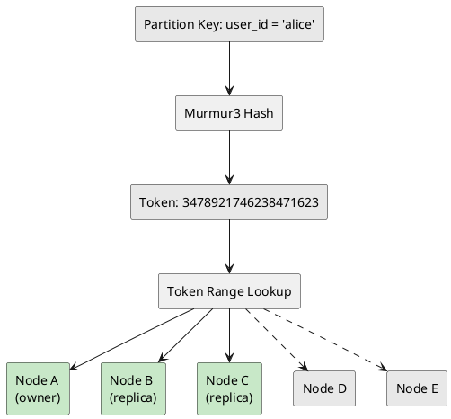

# Data Modeling Concepts

Data modeling in Cassandra works backwards from what might be expected. Instead of designing tables around entities and then writing queries, start with the queries and design tables to serve them. Need to look up users by email? That is a table. Need to look up users by ID? That is another table—possibly with the same data.

This denormalized approach feels wasteful to those accustomed to relational databases, but it is the key to Cassandra's performance. Every query hits exactly the data it needs, stored together on disk, on a predictable set of nodes. No joins, no cross-partition lookups, no surprises at scale.

## The Wide-Column Model

Cassandra's storage model derives from Google's Bigtable—a sorted map structure:

```
(row_key, column_family:column_qualifier, timestamp) → value
```

Cassandra adapted this to:

```
(partition_key, clustering_columns...) → column_values
```

Before CQL (2011), Cassandra used the Thrift API, which exposed this model directly:

```java
// Thrift API (circa 2010)
ColumnPath path = new ColumnPath("Users");
path.setColumn("email".getBytes());
client.insert("user123", path,
    new Column("email".getBytes(), "alice@example.com".getBytes(), timestamp),
    ConsistencyLevel.QUORUM);
```

Thrift required working with raw bytes and column families. CQL provides a SQL-like abstraction, but the underlying storage model remains the same.

## How CQL Maps to Internal Storage

Consider this CQL statement:

```sql
CREATE TABLE user_events (
    user_id UUID,
    event_time TIMESTAMP,
    event_type TEXT,
    data TEXT,
    PRIMARY KEY ((user_id), event_time, event_type)
);

INSERT INTO user_events (user_id, event_time, event_type, data)
VALUES (123e4567-e89b-12d3-a456-426614174000, '2024-01-15 10:30:00', 'click', '{"page": "/home"}');
```

Cassandra stores it internally like this:

**Partition Key:** `123e4567-e89b-12d3-a456-426614174000`

| Cell Key (clustering columns) | Column | Value |
|-------------------------------|--------|-------|
| (2024-01-15 10:30:00, click) | data | '{"page": "/home"}' |
| (2024-01-15 10:30:00, click) | event_type | 'click' |
| (2024-01-15 10:30:00, click) | event_time | ... |

The clustering columns (event_time, event_type) become part of each cell's internal key. The partition key determines which node stores the data. All cells with the same partition key are stored together, sorted by clustering column.

This is why Cassandra queries have strict rules:

- **Partition key required**: Without it, Cassandra does not know which node to ask
- **Clustering columns in order**: They form a composite key—columns cannot be skipped
- **Range queries only on last column**: The storage is sorted, so ranges work on the final sort key

Understanding this mapping explains Cassandra's query restrictions.

---

Cassandra data modeling differs fundamentally from relational databases. There are no JOINs, normalization hurts performance, and tables must be designed around query patterns rather than around entity relationships.

## How Cassandra Data Modeling Is Different

Cassandra's distributed architecture fundamentally changes how data modeling is approached. In relational databases, tables are designed around entities (normalization), then queries are written against them. In Cassandra, tables are designed around queries, then data is arranged to serve them efficiently.

This is not a limitation—it is how Cassandra achieves consistent performance at any scale.

**Traditional RDBMS Approach:**

1. Identify entities (Users, Orders, Products)
2. Normalize to eliminate redundancy
3. Write queries with JOINs
4. Add indexes when queries are slow
5. Scale vertically when database is overwhelmed

*Result: Flexible queries, but joins + indexes + locks = unpredictable latency*

**Cassandra Approach:**

1. List ALL queries the application needs
2. Design one table per query pattern
3. Denormalize data across tables
4. Accept write duplication for read optimization
5. Scale horizontally by adding nodes

*Result: Predictable latency regardless of data size, but queries must be planned*

A poorly designed Cassandra table does not just slow down—it can bring down the entire cluster:

| Bad Design | Consequence |
|------------|-------------|
| Query without partition key | Full cluster scan, timeouts |
| Unbounded partition growth | Node instability, OOM |
| High-cardinality secondary index | Every node queried per request |
| Frequent deletes without TTL | Tombstone accumulation, read amplification |

---

## The Primary Key: Foundation of Everything

The primary key determines:
1. **Where data lives** (which node stores it)
2. **How data is organized** (sort order within a partition)
3. **What queries are efficient** (only partition key + clustering queries work)

```sql
PRIMARY KEY ((partition_key_col1, partition_key_col2), clustering_col1, clustering_col2)
            └──────────────────┬────────────────────┘  └──────────────┬──────────────┘
                               │                                       │
                   Composite Partition Key                    Clustering Columns
                   (Determines node placement)                (Determines sort order)
```

### Partition Key

The partition key is hashed (using Murmur3) to determine which node owns the data:



**Critical implications:**
- All rows with the same partition key are stored together on the same nodes
- Queries must include the partition key (or suffer full cluster scans)
- Partition key choice determines whether data is evenly distributed

### Composite Partition Keys

When a single column does not provide enough distribution:

```sql
-- Single partition key (potential hot spot)
CREATE TABLE events (
    tenant_id TEXT,
    event_time TIMESTAMP,
    data TEXT,
    PRIMARY KEY ((tenant_id), event_time)
);
-- Problem: Tenant "bigcorp" has 90% of traffic → hot partition

-- Composite partition key (better distribution)
CREATE TABLE events (
    tenant_id TEXT,
    day DATE,
    event_time TIMESTAMP,
    data TEXT,
    PRIMARY KEY ((tenant_id, day), event_time)
);
-- Each tenant-day combination is a separate partition
```

### Clustering Columns

Clustering columns determine sort order within a partition:

```sql
CREATE TABLE user_events (
    user_id UUID,
    event_time TIMESTAMP,
    event_type TEXT,
    data TEXT,
    PRIMARY KEY ((user_id), event_time, event_type)
) WITH CLUSTERING ORDER BY (event_time DESC, event_type ASC);
```

**Partition: user_id = alice** (sorted by event_time DESC, then event_type ASC):

| Row | event_time | event_type | data |
|-----|------------|------------|------|
| 1 | 2024-01-03 14:00 | click | ... |
| 2 | 2024-01-03 13:00 | login | ... |
| 3 | 2024-01-03 12:00 | click | ... |
| 4 | 2024-01-02 18:00 | logout | ... |
| ... | | | |

**Clustering column rules:**
- Must be queried in order (cannot skip columns)
- Range queries allowed on the last queried column
- Defines row uniqueness within partition

```sql
-- Valid queries
SELECT * FROM user_events WHERE user_id = ?;
SELECT * FROM user_events WHERE user_id = ? AND event_time = ?;
SELECT * FROM user_events WHERE user_id = ? AND event_time > '2024-01-01';
SELECT * FROM user_events WHERE user_id = ? AND event_time = ? AND event_type = ?;

-- Invalid queries (without ALLOW FILTERING)
SELECT * FROM user_events WHERE event_time = ?;  -- Missing partition key
SELECT * FROM user_events WHERE user_id = ? AND event_type = ?;  -- Skipped event_time
```

---

## Partition Design Deep Dive

### What Makes a Good Partition Key

**High cardinality** - Many unique values distribute data across nodes:

```sql
-- Good: user_id has millions of unique values
PRIMARY KEY ((user_id), ...)

-- Bad: status has only 3 values → 3 partitions total
PRIMARY KEY ((status), ...)  -- active/inactive/pending
```

**Even distribution** - Avoids hot spots:

```sql
-- Problem: Geographic data skewed toward certain countries
PRIMARY KEY ((country), city, user_id)
-- USA partition has 100x more data than Luxembourg

-- Better: Add hash bucket for distribution
PRIMARY KEY ((country, user_bucket), city, user_id)
-- user_bucket = hash(user_id) % 10
```

**Query alignment** - Matches access patterns:

```sql
-- Query: Get all orders for a user
SELECT * FROM orders WHERE user_id = ?;

-- Partition key must be user_id
PRIMARY KEY ((user_id), order_date, order_id)
```

**Bounded growth** - Partitions should not grow forever:

```sql
-- Dangerous: Partition grows indefinitely
PRIMARY KEY ((sensor_id), reading_time)
-- After 5 years: 157 million rows per sensor

-- Safe: Time-bounded partitions
PRIMARY KEY ((sensor_id, month), reading_time)
-- Each partition covers 1 month
```

### Partition Size Calculations

Target partition size: **10MB - 100MB**

**Partition Size Formula:**

```
partition_size = Nv × (Ck + Cs + average_column_sizes) + Nstatic × static_column_sizes
```

| Variable | Description |
|----------|-------------|
| Nv | Number of rows (cells in wide rows) |
| Ck | Clustering key size |
| Cs | Per-cell overhead (~23 bytes) |
| Nstatic | 1 if static columns exist, 0 otherwise |

**Practical example:**

```sql
CREATE TABLE sensor_readings (
    sensor_id TEXT,
    day DATE,
    reading_time TIMESTAMP,
    temperature DOUBLE,
    humidity DOUBLE,
    pressure DOUBLE,
    PRIMARY KEY ((sensor_id, day), reading_time)
);
```

**Per-row storage:**

| Component | Size |
|-----------|------|
| Clustering key (timestamp) | 8 bytes |
| temperature (double) | 8 bytes |
| humidity (double) | 8 bytes |
| pressure (double) | 8 bytes |
| Per-cell overhead (4 cells) | 92 bytes |
| **Total per row** | **~124 bytes** |

**Partition size projections:**

| Frequency | Readings/Day | Daily Partition Size | Status |
|-----------|--------------|---------------------|--------|
| 1/second | 86,400 | 10.7 MB | ✓ Good |
| 10/second | 864,000 | 107 MB | ⚠ Borderline |

!!! tip "High-Frequency Solution"
    Use hourly buckets instead of daily. Hourly partition size: 36,000 × 124 = 4.5 MB ✓

### Monitoring Partition Size in Production

```bash
# Check partition size distribution
nodetool tablehistograms keyspace.table

# Output interpretation:
Partition Size (bytes)
                             Percentile      Value
                                   50%      12.5MB  # Median - good
                                   75%      35.2MB  # OK
                                   95%      89.1MB  # Acceptable
                                   99%     234.5MB  # WARNING: Some large partitions
                                  Max      891.2MB  # CRITICAL: Outliers need investigation
```

```sql
-- Identify large partitions (requires full table scan - use carefully!)
-- Better: Use sstablemetadata on individual sstables
```

---

## Denormalization Strategies

### Why Denormalize

Cassandra has no JOINs. If data from multiple "entities" is needed in one query, that data must be in one table.

```sql
-- Relational (normalized) - Requires JOIN
SELECT o.order_id, o.total, u.name, u.email
FROM orders o
JOIN users u ON o.user_id = u.user_id
WHERE o.order_id = 123;

-- Cassandra (denormalized) - Single query
SELECT order_id, total, user_name, user_email
FROM orders
WHERE order_id = 123;
```

### Denormalization Patterns

**Embedding related data:**

```sql
-- Instead of separate address table
CREATE TABLE users (
    user_id UUID PRIMARY KEY,
    name TEXT,
    email TEXT,
    -- Embedded addresses
    addresses LIST<FROZEN<address_type>>
);

CREATE TYPE address_type (
    label TEXT,        -- 'home', 'work'
    street TEXT,
    city TEXT,
    postal_code TEXT,
    country TEXT
);
```

**Duplicating for different access patterns:**

```sql
-- Query 1: Get order by order_id
CREATE TABLE orders (
    order_id UUID PRIMARY KEY,
    user_id UUID,
    user_email TEXT,    -- Denormalized
    product_count INT,
    total DECIMAL,
    created_at TIMESTAMP
);

-- Query 2: Get orders by user (recent first)
CREATE TABLE orders_by_user (
    user_id UUID,
    order_date DATE,
    order_id UUID,
    product_count INT,
    total DECIMAL,
    PRIMARY KEY ((user_id), order_date, order_id)
) WITH CLUSTERING ORDER BY (order_date DESC, order_id DESC);

-- Same data, different organization
```

**Pre-computing aggregations:**

```sql
-- Instead of: SELECT COUNT(*) FROM orders WHERE user_id = ?
-- Maintain a counter
CREATE TABLE user_stats (
    user_id UUID PRIMARY KEY,
    order_count COUNTER,
    total_spent COUNTER  -- Store as cents
);

-- Increment on each order
UPDATE user_stats SET order_count = order_count + 1
WHERE user_id = ?;
```

### Managing Denormalization

The cost of denormalization is write amplification and consistency complexity:

| Schema Type | Writes Required |
|-------------|-----------------|
| Single write (normalized) | 1 table |
| Denormalized (2 tables) | 2 writes |
| Denormalized (5 tables) | 5 writes |

!!! warning "Consistency Concern"
    What if write #3 of 5 fails? Use batches for atomicity.

**Batch writes for atomicity:**

```sql
-- Logged batch ensures all-or-nothing (same partition preferred)
BEGIN BATCH
    INSERT INTO orders (order_id, user_id, total) VALUES (?, ?, ?);
    INSERT INTO orders_by_user (user_id, order_date, order_id, total) VALUES (?, ?, ?, ?);
APPLY BATCH;
```

**Handling stale denormalized data:**

```sql
-- When user updates their email:
-- 1. Update users table
UPDATE users SET email = ? WHERE user_id = ?;

-- 2. Future orders use new email
-- 3. Old orders retain old email (often acceptable)

-- If old orders must update (expensive):
-- Query all user's orders, update each one
-- Consider: Is this worth the complexity?
```

---

## Query-First Design Process

### Step 1: List All Queries

Before creating any tables, enumerate every query the application needs:

**Application: E-commerce Platform**

| Query | Description |
|-------|-------------|
| Q1 | Get product details by product_id |
| Q2 | List products in a category (paginated) |
| Q3 | Get user profile by user_id |
| Q4 | Authenticate user by email |
| Q5 | Get user's recent orders |
| Q6 | Get order details with items |
| Q7 | Get shopping cart contents |
| Q8 | Check inventory for product |
| Q9 | Get product reviews (recent first) |
| Q10 | Search products by name prefix |

### Step 2: Analyze Query Requirements

For each query, identify:

**Q5: Get user's recent orders**

| Attribute | Value |
|-----------|-------|
| Access pattern | Point lookup + range scan |
| Partition key | user_id (equality) |
| Clustering | order_date (descending range) |
| Columns needed | order_id, order_date, status, total, item_count |
| Cardinality | High (millions of users) |
| Growth pattern | Bounded (users have limited orders) |
| Access frequency | High (every user profile view) |
| Latency SLA | < 50ms p99 |

### Step 3: Design Tables

Map each query to a table:

```sql
-- Q5: Get user's recent orders
CREATE TABLE orders_by_user (
    user_id UUID,               -- Partition key (equality in query)
    order_date DATE,            -- Clustering (for date ranges)
    order_id UUID,              -- Clustering (uniqueness)
    status TEXT,
    total DECIMAL,
    item_count INT,
    PRIMARY KEY ((user_id), order_date, order_id)
) WITH CLUSTERING ORDER BY (order_date DESC, order_id DESC);

-- Query implementation
SELECT * FROM orders_by_user
WHERE user_id = ?
LIMIT 20;

-- With date filter
SELECT * FROM orders_by_user
WHERE user_id = ?
  AND order_date >= '2024-01-01'
  AND order_date <= '2024-12-31';
```

### Step 4: Validate Design

Checklist for each table:

| Check | Requirement |
|-------|-------------|
| ✓ | Primary access query uses partition key equality |
| ✓ | Range queries on clustering columns (in order) |
| ✓ | Partition size bounded (< 100 MB) |
| ✓ | Even distribution (high cardinality partition key) |
| ✓ | No `ALLOW FILTERING` needed |
| ✓ | All columns needed by query are present |
| ✓ | Sort order matches query requirements |

---

## Common Patterns

### Wide Row Pattern

Store related items in one partition:

```sql
-- User's notifications (bounded by application logic)
CREATE TABLE notifications (
    user_id UUID,
    notification_id TIMEUUID,
    message TEXT,
    read BOOLEAN,
    created_at TIMESTAMP,
    PRIMARY KEY ((user_id), notification_id)
) WITH CLUSTERING ORDER BY (notification_id DESC)
  AND default_time_to_live = 2592000;  -- 30 days

-- Query: Recent unread
SELECT * FROM notifications
WHERE user_id = ?
LIMIT 50;
```

### Time Bucketing Pattern

Prevent unbounded partition growth:

```sql
-- High-volume event stream
CREATE TABLE events (
    tenant_id TEXT,
    hour TIMESTAMP,         -- Bucket: truncate to hour
    event_id TIMEUUID,
    event_type TEXT,
    payload TEXT,
    PRIMARY KEY ((tenant_id, hour), event_id)
) WITH CLUSTERING ORDER BY (event_id DESC);

-- Application calculates bucket:
-- hour = event_time - (event_time % 3600000)

-- Query single hour
SELECT * FROM events
WHERE tenant_id = 'acme'
  AND hour = '2024-01-15 14:00:00+0000'
LIMIT 100;
```

### Materialized View Alternative

When the same data needs to be accessible by different keys:

```sql
-- Base table: users by ID
CREATE TABLE users (
    user_id UUID PRIMARY KEY,
    email TEXT,
    name TEXT,
    created_at TIMESTAMP
);

-- Manual materialized view: users by email
CREATE TABLE users_by_email (
    email TEXT PRIMARY KEY,
    user_id UUID,
    name TEXT
);

-- Application maintains both:
BEGIN BATCH
    INSERT INTO users (user_id, email, name, created_at) VALUES (?, ?, ?, ?);
    INSERT INTO users_by_email (email, user_id, name) VALUES (?, ?, ?);
APPLY BATCH;
```

Note: Native materialized views exist but have production stability issues. Manual denormalization is recommended.

---

## Data Types for Modeling

### Choosing the Right Types

| Use Case | Type | Notes |
|----------|------|-------|
| Unique identifiers | UUID or TIMEUUID | TIMEUUID includes timestamp |
| Timestamps | TIMESTAMP | Millisecond precision |
| Dates only | DATE | More efficient than TIMESTAMP |
| Money | DECIMAL | Never use FLOAT for currency |
| Small integers | INT | 32-bit signed |
| Large integers | BIGINT | 64-bit signed |
| Flags | BOOLEAN | |
| Short strings | TEXT | Unbounded, UTF-8 |
| Fixed strings | ASCII | 7-bit ASCII only |
| Binary data | BLOB | Images, serialized objects |
| IP addresses | INET | IPv4 or IPv6 |

### Collections

```sql
-- List: Ordered, allows duplicates
tags LIST<TEXT>
-- Insert: ['cassandra', 'database', 'cassandra'] ✓
-- Max recommended: ~100 elements

-- Set: Unordered, unique values
categories SET<TEXT>
-- Insert: {'electronics', 'computers'} (sorted internally)
-- Max recommended: ~100 elements

-- Map: Key-value pairs
metadata MAP<TEXT, TEXT>
-- Insert: {'color': 'blue', 'size': 'large'}
-- Max recommended: ~100 entries
```

**Collection limitations:**
- Entire collection read/written atomically
- No querying inside collections (without SAI)
- Collections > 100 elements impact performance
- Consider separate table for large collections

### User-Defined Types (UDTs)

```sql
CREATE TYPE address (
    street TEXT,
    city TEXT,
    state TEXT,
    postal_code TEXT,
    country TEXT
);

CREATE TABLE users (
    user_id UUID PRIMARY KEY,
    name TEXT,
    home_address FROZEN<address>,
    work_address FROZEN<address>
);

-- FROZEN required: stored as single blob
-- Cannot update individual fields
UPDATE users SET home_address = {
    street: '123 Main St',
    city: 'Boston',
    state: 'MA',
    postal_code: '02101',
    country: 'USA'
} WHERE user_id = ?;
```

---

## Static Columns

Static columns are shared across all rows in a partition:

```sql
CREATE TABLE team_members (
    team_id UUID,
    member_id UUID,
    team_name TEXT STATIC,      -- Same for all members
    team_budget DECIMAL STATIC, -- Same for all members
    member_name TEXT,
    member_role TEXT,
    PRIMARY KEY ((team_id), member_id)
);

INSERT INTO team_members (team_id, member_id, team_name, team_budget, member_name, member_role)
VALUES (?, ?, 'Engineering', 100000, 'Alice', 'Developer');

INSERT INTO team_members (team_id, member_id, member_name, member_role)
VALUES (?, ?, 'Bob', 'Designer');
-- team_name and team_budget already set for this partition
```

**Partition: team_id = engineering-team**

| Column Type | Column | Value |
|-------------|--------|-------|
| **STATIC** | team_name | 'Engineering' |
| **STATIC** | team_budget | 100000 |

| member_id | member_name | role |
|-----------|-------------|------|
| alice | 'Alice' | 'Dev' |
| bob | 'Bob' | 'Designer' |
| carol | 'Carol' | 'PM' |

**Use cases:**
- Partition metadata (team info, account settings)
- Avoiding denormalization of partition-level data
- Aggregate values (counts, sums) for the partition

---

## Modeling Best Practices Summary

### Do

| Practice |
|----------|
| Start with queries, not entities |
| One table per query pattern |
| Choose partition keys with high cardinality |
| Keep partitions bounded (< 100 MB) |
| Use clustering columns for sort order |
| Denormalize for read performance |
| Use TTL for temporary data |
| Use batches for atomic multi-table writes |
| Use counters for aggregations |
| Test with production-like data volumes |

### Don't

| Anti-Practice |
|---------------|
| Design tables before knowing queries |
| Use `ALLOW FILTERING` in production |
| Create unbounded partitions |
| Use secondary indexes as primary access pattern |
| Store large collections (> 100 elements) |
| Update individual UDT fields (use FROZEN) |
| Rely on Cassandra materialized views |
| Use Cassandra as a queue |
| Perform frequent deletes (use TTL instead) |
| Normalize data like in RDBMS |

---

## Next Steps

- **[Time Bucketing Pattern](../patterns/time-bucketing.md)** - Managing time-series data
- **[Anti-Patterns](../anti-patterns/index.md)** - Mistakes to avoid
- **[E-Commerce Example](../examples/e-commerce.md)** - Complete schema design
- **[CQL Reference](../../cql/index.md)** - Query language details
