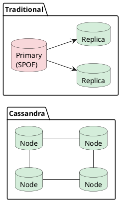
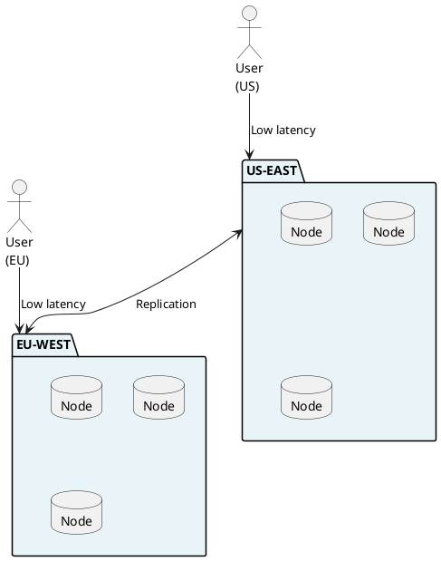
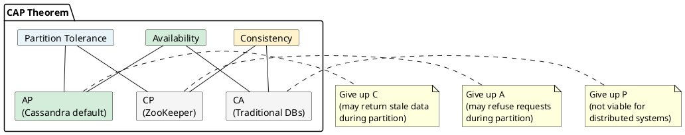
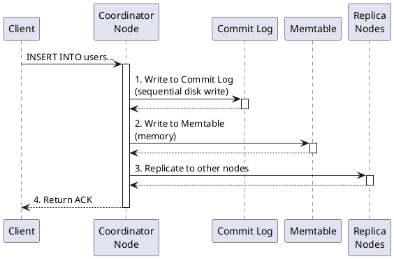
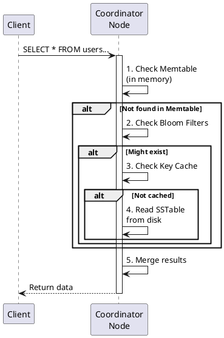
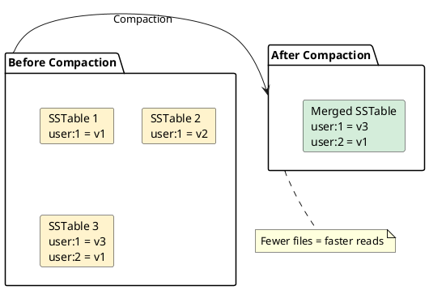

# What is Apache Cassandra?

Apache Cassandra is a distributed, wide-column NoSQL database designed for high availability and linear scalability. It handles massive amounts of data across commodity servers with no single point of failure, making it the database of choice for applications that cannot afford downtime.

This guide goes beyond surface-level descriptions to explain *why* Cassandra works the way it does, when it is the right choice, and what tradeoffs are involved.

## The Problem Cassandra Solves

Before understanding Cassandra, understand the problem it was built to solve.

### The Scalability Wall

Traditional relational databases scale **vertically** - when more capacity is needed, a bigger server is purchased:

```
Year 1: 1 server, 16GB RAM, 500GB disk     → Works great
Year 2: 1 server, 64GB RAM, 2TB disk       → Still okay
Year 3: 1 server, 256GB RAM, 10TB disk     → Expensive, but works
Year 4: ??? Maximum server size reached    → NOW WHAT?
```

At some point, a wall is hit. The biggest server money can buy is not enough. Data must be spread across multiple machines, but traditional databases were not designed for this.

### The Availability Problem

Even with an infinitely large server, it would still be a **single point of failure**. When that server goes down - and it will - the entire application is offline.

Traditional solutions (primary-replica replication, clustering) help but introduce complexity and failure modes:

```
Primary-Replica Problems:
- Primary fails → manual failover required (downtime)
- Replication lag → stale reads from replicas
- Split brain → both think they're primary (data corruption)
- Write scalability → still limited to single primary
```

### The Geographic Distribution Problem

Global applications need data close to users. A user in Tokyo should not wait 200ms for every database query to reach a server in Virginia. But traditional databases were not built for multi-region deployment.

## How Cassandra Solves These Problems

Cassandra was designed from the ground up to address these challenges:

### 1. Linear Horizontal Scalability

Need more capacity? Add more nodes. The relationship is linear:

```
3 nodes  → handles X requests/second
6 nodes  → handles 2X requests/second
12 nodes → handles 4X requests/second

No architectural limit. Companies run 1000+ node clusters.
```

This works because:
- Data is automatically distributed across nodes using consistent hashing
- Each node is responsible for a portion of the data
- Adding nodes automatically rebalances data

### 2. No Single Point of Failure

Every node in a Cassandra cluster is identical. There is no primary, no leader, no special node:



Data is replicated to multiple nodes. When a node fails:
- Other nodes have copies of its data
- Requests are automatically routed to surviving nodes
- When the node recovers, it automatically catches up

### 3. Multi-Datacenter by Design

Cassandra was built for geographic distribution:



- Each region has local replicas for low latency
- Cross-datacenter consistency is tunable per query
- Each region can operate independently during network partitions

## Origin Story

Cassandra's architecture makes more sense when understanding why it was built.

### Facebook's Inbox Search Problem (2007)

Facebook needed to store and search billions of messages. Requirements:
- Handle 100+ million users
- Millisecond search latency
- Never go offline (users expect 24/7 availability)
- Scale without rebuilding

Existing solutions didn't work:
- MySQL could not scale writes
- Oracle was too expensive
- Existing NoSQL options (memcached) could not persist reliably

### The Dynamo + BigTable Combination

Facebook engineers Avinash Lakshman and Prashant Malik combined:

**Amazon Dynamo (2007):**
- Consistent hashing for data distribution
- Gossip protocol for cluster membership
- Tunable consistency
- Sloppy quorum for availability

**Google BigTable (2006):**
- Wide-column data model
- Log-structured storage (LSM trees)
- Column families

The result was Cassandra - open-sourced in 2008, became Apache top-level project in 2010.

### Historical Context

Understanding Cassandra's heritage explains its behavior:

| Inherited From | Feature | Implication |
|----------------|---------|-------------|
| Dynamo | Eventual consistency | Must design for it |
| Dynamo | No single point of failure | True peer-to-peer |
| Dynamo | Tunable consistency | Application chooses |
| BigTable | Column-oriented storage | Efficient for wide rows |
| BigTable | LSM trees | Fast writes, slower reads |

## The CAP Theorem and Cassandra

Understanding Cassandra requires understanding the CAP theorem.

### CAP Theorem Explained

The CAP theorem states that a distributed system can only guarantee two of three properties:

- **C**onsistency: Every read receives the most recent write
- **A**vailability: Every request receives a response
- **P**artition tolerance: System continues despite network failures



### Cassandra's Choice: AP (with Tunable C)

In the real world, network partitions **will** happen. P cannot be given up. So the choice is between:

- **CP systems**: When partition occurs, refuse requests (maintain consistency, sacrifice availability)
- **AP systems**: When partition occurs, continue serving requests (maintain availability, sacrifice consistency)

**Cassandra chose AP** - it will always respond, even if the response might be slightly stale.

**BUT**: Cassandra allows tuning consistency per operation. Strong consistency is available when needed:

```sql
-- AP behavior: fast, available, might be stale
CONSISTENCY ONE;
SELECT * FROM users WHERE user_id = ?;

-- CP behavior: slower, might fail if nodes down, always consistent
CONSISTENCY ALL;
SELECT * FROM users WHERE user_id = ?;

-- The sweet spot for most applications
CONSISTENCY LOCAL_QUORUM;
SELECT * FROM users WHERE user_id = ?;
```

## How Cassandra Actually Works

### The Write Path

When data is written to Cassandra:



**Why writes are fast:**

1. **Commit log is append-only** - Sequential disk writes are 100x faster than random
2. **Memtable is in memory** - Microsecond latency
3. **No read-before-write** - Unlike B-trees, no need to read existing data
4. **Async replication option** - Can acknowledge before all replicas confirm

### The Read Path

When data is read:



**Why reads can be slower:**

1. Data might be spread across multiple SSTables
2. Need to merge results from memtable + multiple SSTables
3. Tombstones (deletes) must be processed
4. May need to query multiple replicas

**This is the fundamental tradeoff: Cassandra optimizes writes at the expense of reads.**

### Compaction: The Background Worker

Over time, writes create many SSTables. Compaction merges them:



Compaction strategies (each optimized for different workloads):

| Strategy | Best For | Characteristics |
|----------|----------|-----------------|
| **STCS** (Size-Tiered) | Write-heavy | Groups similar-sized SSTables |
| **LCS** (Leveled) | Read-heavy | Guarantees bounded read amplification |
| **TWCS** (Time-Window) | Time-series | Efficient for TTL data |
| **UCS** (Unified) | General (5.0+) | Adaptive, combines benefits |

## When to Use Cassandra

### Cassandra Excels At

**1. High Throughput at Scale**

Cassandra handles both high write AND read throughput when data is modeled correctly:

```
Write-heavy examples:
- IoT sensor data (millions of devices writing continuously)
- Clickstream/event tracking
- Log aggregation
- Time-series metrics

Read-heavy examples:
- User profile lookups (billions of reads/day)
- Product catalogs
- Session stores
- Recommendation serving

Mixed workloads:
- Messaging systems (write messages, read conversations)
- Social feeds (write posts, read timelines)
```

With proper data modeling and caching (key cache, row cache), Cassandra serves reads with single-digit millisecond latency at massive scale.

**2. High Availability Requirements**

If downtime costs money or reputation:

```
Use Case Examples:
- E-commerce (cannot miss orders)
- Financial transactions
- Healthcare systems
- Gaming (live services)
- Any 24/7 service
```

**3. Geographic Distribution**

If users are global and latency matters:

```
Use Case Examples:
- Social media platforms
- Content delivery
- Global SaaS applications
- Multi-region applications
```

**4. Linear Scalability Needs**

If data growth is unpredictable or potentially massive:

```
Use Case Examples:
- Startups expecting growth
- Platforms with viral potential
- Data-intensive applications
```

### Production Scale Examples

| Company | Use Case | Scale |
|---------|----------|-------|
| **Apple** | iCloud, Apple Music, Siri | 150,000+ nodes, 10+ PB |
| **Netflix** | Streaming, recommendations | 500+ nodes per cluster |
| **Instagram** | Direct messages, feeds | Millions of writes/second |
| **Uber** | Driver/rider matching, maps | Billions of requests/day |
| **Discord** | Messages, presence | Billions of messages, trillions of reads |
| **Spotify** | User data, playlists | Thousands of nodes |

### When NOT to Use Cassandra

Cassandra is not a general-purpose database. It has specific tradeoffs that make it wrong for certain use cases—though several traditional limitations are being addressed in recent releases.

**1. Complex Joins and Aggregations**

```sql
-- CASSANDRA CANNOT DO THIS:
SELECT u.name, COUNT(o.id), SUM(o.total)
FROM users u
JOIN orders o ON u.id = o.user_id
GROUP BY u.name
HAVING SUM(o.total) > 1000;

-- Data must be denormalized or use Spark for analytics
-- Use: PostgreSQL, ClickHouse, Snowflake for analytical queries
```

This is a fundamental architectural choice—Cassandra optimizes for distributed writes, not relational queries.

**2. Small Datasets Without Availability Requirements**

If data fits on one server AND availability is not critical, simpler options exist:

```
Consider simpler alternatives when:
- Downtime during maintenance is acceptable
- Single-region deployment is sufficient
- Team lacks distributed systems expertise

If availability IS critical: Cassandra is appropriate regardless of dataset size
```

Many organizations run Cassandra for small datasets specifically because they cannot tolerate downtime.

**3. Rapidly Evolving Query Patterns**

If query patterns change frequently and unpredictably:

```
Cassandra data modeling principle:
- Design tables around queries (query-first design)
- Adding new query patterns may require new tables
- Schema changes at scale require careful planning

For exploratory/evolving queries: PostgreSQL, Elasticsearch
```

### Limitations That Are Changing

The following traditional limitations are being addressed in Cassandra 5.x:

**Ad-hoc Queries (Improved in 5.0)**

Storage Attached Indexes (SAI) in Cassandra 5.0 significantly improve secondary index performance:

```sql
-- BEFORE 5.0: Secondary indexes were expensive and limited
-- WITH SAI (5.0+): Much more practical for non-partition-key queries

CREATE INDEX ON users (email) USING 'sai';
SELECT * FROM users WHERE email = 'user@example.com';

-- SAI provides ~40% better throughput and ~230% better latency
-- than legacy secondary indexes
```

SAI does not make Cassandra equivalent to a relational database for ad-hoc queries, but it substantially expands what is practical.

**Multi-Partition ACID Transactions (Coming in 5.1+)**

The Accord protocol (CEP-15) brings general-purpose ACID transactions to Cassandra:

```sql
-- COMING WITH ACCORD (5.1+):
BEGIN TRANSACTION
  UPDATE accounts SET balance = balance - 100 WHERE id = 'sender';
  UPDATE accounts SET balance = balance + 100 WHERE id = 'receiver';
COMMIT;
```

Accord is a leaderless consensus protocol that enables:

- Multi-partition transactions across any set of keys
- Strict serializable isolation
- Single wide-area round-trip for cross-region transactions
- No single point of failure (unlike leader-based approaches)

!!! note "Current Status"
    Accord is under active development. For applications requiring multi-partition transactions today, consider PostgreSQL, CockroachDB, or implement application-level saga patterns.

**Strong Consistency Trade-offs**

Cassandra has always supported strong consistency via QUORUM and LWT, but at the cost of availability during partitions. With Accord:

- Strict serializability without sacrificing Cassandra's distributed architecture
- Better performance than Paxos-based LWT for complex operations
- Maintains Cassandra's peer-to-peer, no-single-point-of-failure design

## Cassandra vs Other Databases

### Cassandra vs MongoDB

| Aspect | Cassandra | MongoDB |
|--------|-----------|---------|
| **Data Model** | Wide-column (table-like) | Document (JSON) |
| **Schema** | Schema-per-table | Schema-per-collection (flexible) |
| **Scalability** | Peer-to-peer, linear | Sharded, with config servers |
| **Consistency** | Tunable (default: eventual) | Strong for single doc |
| **Joins** | None | $lookup (limited) |
| **Secondary Indexes** | Expensive | Native support |
| **Write Performance** | Excellent | Good |
| **Read Performance** | Good (with right model) | Excellent |
| **Operations** | Complex | Easier |
| **Best For** | Scale, availability, writes | Flexibility, documents |

**Choose Cassandra when:** Write-heavy, need linear scale, multi-DC required
**Choose MongoDB when:** Flexible schema, document-oriented, smaller scale

### Cassandra vs PostgreSQL

| Aspect | Cassandra | PostgreSQL |
|--------|-----------|------------|
| **Type** | Distributed NoSQL | Relational |
| **Scaling** | Horizontal (add nodes) | Vertical (bigger server) |
| **Consistency** | Tunable | Strong ACID |
| **Transactions** | Single-partition LWT | Full ACID |
| **Schema** | Must design for queries | Normalized design |
| **Joins** | Not supported | Full support |
| **Indexes** | Limited | Rich (B-tree, GIN, GiST) |
| **Query Flexibility** | Limited | Full SQL |
| **Availability** | Native HA | Requires setup |
| **Best For** | Scale, availability | Complex queries, transactions |

**Choose Cassandra when:** Scaling beyond single server, HA is critical
**Choose PostgreSQL when:** Complex queries, transactions, < 100GB data

### Cassandra vs DynamoDB

| Aspect | Cassandra | DynamoDB |
|--------|-----------|----------|
| **Deployment** | Self-managed or DBaaS | AWS-managed |
| **Vendor** | Open source | AWS only |
| **Pricing** | Infrastructure | Per-request or capacity |
| **Multi-Region** | Built-in | Global Tables ($$$) |
| **Query Language** | CQL | PartiQL / API |
| **Flexibility** | Full control | Limited configuration |
| **Expertise Required** | High | Lower |
| **Cost at Scale** | Lower | Higher |

**Choose Cassandra when:** Vendor independence, multi-cloud, cost control at scale
**Choose DynamoDB when:** AWS-only, minimal ops, getting started quickly

### Cassandra vs ScyllaDB

| Aspect | Cassandra | ScyllaDB |
|--------|-----------|----------|
| **Language** | Java | C++ |
| **Performance** | Good (gap narrowing with 5.0+) | Faster (historically 3-10x, now closer) |
| **Resource Usage** | Improved with modern GCs | More efficient |
| **Compatibility** | Original | CQL compatible |
| **Community** | Large, mature | Growing |
| **Features** | All features (Accord, SAI, Vector) | Most features |
| **Support** | Apache, vendors | ScyllaDB Inc |
| **JDK Options** | JDK 17+ with Shenandoah/ZGC | N/A |

The performance gap has narrowed significantly:

- Cassandra 5.0 includes substantial performance improvements
- JDK 17+ with Shenandoah or ZGC dramatically reduces GC pause times
- Modern Cassandra deployments see much smaller performance differences than historical benchmarks suggest

**Choose Cassandra when:** Need latest features (Accord, SAI), larger ecosystem, JVM expertise
**Choose ScyllaDB when:** Maximum single-node throughput, want to avoid JVM tuning

## Essential Terminology

### Cluster Topology

| Term | Definition | Analogy |
|------|------------|---------|
| **Cluster** | All nodes working together | The entire database |
| **Node** | Single Cassandra instance | One server |
| **Datacenter (DC)** | Logical grouping of nodes | Usually maps to physical DC or region |
| **Rack** | Subdivision of DC | For failure isolation |
| **Token** | Hash value identifying data ownership | Node's "address" on the ring |
| **Token Range** | Range of tokens a node owns | Node's "slice" of data |
| **Seed Node** | Bootstrap node for gossip | How new nodes find the cluster |

### Data Model

| Term | Definition | SQL Equivalent |
|------|------------|----------------|
| **Keyspace** | Container for tables | Database |
| **Table** | Collection of partitions | Table |
| **Partition** | Unit of distribution | No equivalent |
| **Partition Key** | Determines data location | Part of PRIMARY KEY |
| **Clustering Column** | Sorts within partition | ORDER BY column |
| **Row** | Single record | Row |
| **Cell** | Single column value | Cell |
| **TTL** | Auto-expire data | No equivalent |
| **Tombstone** | Marker for deleted data | No equivalent |

### Operations

| Term | Definition |
|------|------------|
| **Replication Factor (RF)** | Copies of data stored |
| **Consistency Level (CL)** | Replicas required to respond |
| **Quorum** | Majority of replicas ((RF/2) + 1) |
| **Compaction** | Merging SSTables |
| **Repair** | Synchronizing replicas |
| **Gossip** | Node-to-node state sharing |
| **Hinted Handoff** | Store-and-forward for down nodes |
| **Read Repair** | Fix inconsistencies on read |
| **Anti-entropy Repair** | Full replica synchronization |

## Getting Started

After understanding what Cassandra is and when to use it:

### Learning Path

```
1. Install Cassandra        → Get it running
   └── installation/index.md

2. First Cluster            → Multi-node setup
   └── first-cluster.md

3. CQL Basics               → Write queries
   └── quickstart-cql.md

4. Data Modeling            → Design schemas
   └── ../data-modeling/index.md

5. Architecture Deep Dive   → Understand internals
   └── ../architecture/index.md
```

### Try It Now (5 minutes)

```bash
# Start Cassandra with Docker
docker run --name cassandra -d -p 9042:9042 cassandra:5.0

# Wait for startup
sleep 60

# Connect
docker exec -it cassandra cqlsh

# Create and query data
CREATE KEYSPACE test WITH replication = {'class': 'SimpleStrategy', 'replication_factor': 1};
USE test;
CREATE TABLE users (id uuid PRIMARY KEY, name text);
INSERT INTO users (id, name) VALUES (uuid(), 'Test User');
SELECT * FROM users;
```

## Additional Resources

### Papers and Technical Deep Dives
- [Dynamo: Amazon's Highly Available Key-value Store](https://www.allthingsdistributed.com/files/amazon-dynamo-sosp2007.pdf) - The foundation
- [Bigtable: A Distributed Storage System](https://research.google/pubs/pub27898/) - Column-family model
- [Cassandra - A Decentralized Structured Storage System](https://www.cs.cornell.edu/projects/ladis2009/papers/lakshman-ladis2009.pdf) - Original Cassandra paper

### Learning Resources
- [Apache Cassandra Documentation](https://cassandra.apache.org/doc/latest/)
- [DataStax Academy](https://academy.datastax.com/) - Free certification courses
- [The Last Pickle Blog](https://thelastpickle.com/blog/) - Deep technical articles
- [AxonOps Blog](https://axonops.com/blog/) - Operational guides

### Community
- [Apache Cassandra Slack](https://cassandra.apache.org/community/)
- [Stack Overflow - cassandra tag](https://stackoverflow.com/questions/tagged/cassandra)
- [Cassandra Mailing Lists](https://cassandra.apache.org/community/)

---

**Next: [Install Cassandra](installation/index.md)** - Get Cassandra running
