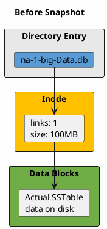
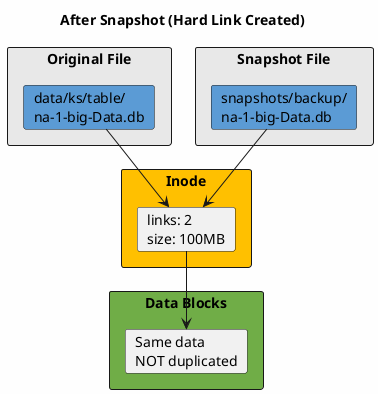
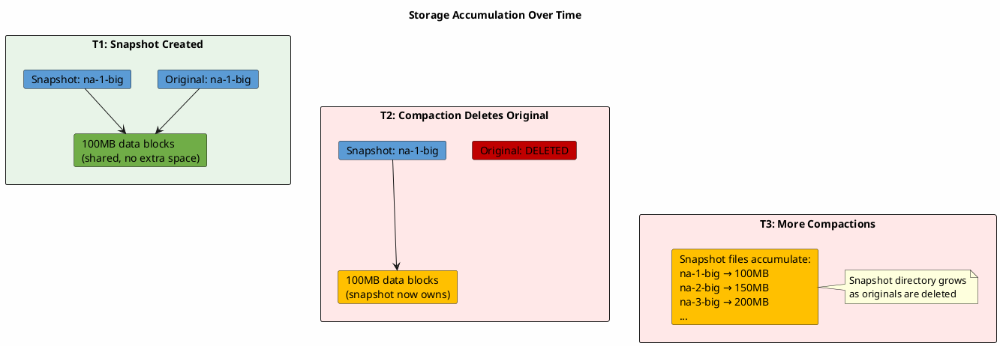
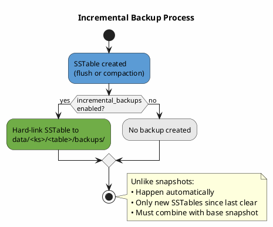

# Backup Procedures

This page covers the mechanics of Cassandra backups: how snapshots work, incremental backups, and commit log archiving.

---

## Snapshot Backups

### How Snapshots Work: POSIX Hard Links

The `nodetool snapshot` command creates snapshots using POSIX hard links, not file copies. Understanding hard links is essential for proper snapshot management.

**What is a hard link?**

In UNIX filesystems, files consist of two parts:

1. **Inode**: Metadata structure containing file attributes (size, permissions, timestamps) and pointers to data blocks on disk
2. **Directory entry**: A name pointing to an inode

A hard link is an additional directory entry pointing to the same inode. Multiple filenames can reference the same underlying data:





**Why hard links are efficient:**

| Aspect | Hard Link | File Copy |
|--------|-----------|-----------|
| Disk space used | 0 bytes (just directory entry) | Full file size |
| Creation time | Instantaneous | Proportional to file size |
| I/O impact | None | Heavy disk read/write |

A 1TB database can be snapshotted in milliseconds with zero additional disk space—initially.

### The Storage Accumulation Problem

Hard links share data blocks only while both links exist. When compaction deletes the original SSTable file, the snapshot's hard link becomes the sole owner of those data blocks:



**Consequence:** Snapshots that initially consumed zero space can grow to consume significant storage as compaction removes original files. A week-old snapshot may consume more disk space than the current live data.

**Best practice:** Clear snapshots promptly after copying to remote storage. AxonOps automatically clears local snapshots after successful transfer to remote storage, preventing disk space accumulation.

---

### Snapshot Commands

| Command | Description |
|---------|-------------|
| `nodetool flush` | Flush memtables to disk before snapshot |
| `nodetool snapshot` | Snapshot all keyspaces |
| `nodetool snapshot <keyspace>` | Snapshot specific keyspace |
| `nodetool snapshot -t <name> <keyspace>` | Named snapshot (recommended) |
| `nodetool snapshot -t <name> -kt <ks>.<table>` | Snapshot specific table |
| `nodetool listsnapshots` | List all snapshots |
| `nodetool clearsnapshot -t <name>` | Clear specific snapshot |
| `nodetool clearsnapshot` | Clear all snapshots |

### Snapshot Location

Snapshots are stored at:

```
/var/lib/cassandra/data/<keyspace>/<table-uuid>/snapshots/<snapshot_name>/
```

Each snapshot directory contains all SSTable components:

| File | Description |
|------|-------------|
| `*-Data.db` | Actual row data |
| `*-Index.db` | Partition index |
| `*-Filter.db` | Bloom filter |
| `*-Statistics.db` | SSTable metadata |
| `*-CompressionInfo.db` | Compression metadata |
| `*-TOC.txt` | Table of contents |
| `manifest.json` | Snapshot manifest |

---

## Automatic Snapshot Configuration

Cassandra provides automatic snapshot options in `cassandra.yaml`:

| Parameter | Default | Versions | Description |
|-----------|---------|----------|-------------|
| `auto_snapshot` | `true` | All | Create snapshot before `DROP TABLE`, `DROP KEYSPACE`, and `TRUNCATE` |
| `auto_snapshot_ttl` | (none) | 4.1+ | TTL for auto-snapshots; after expiry, snapshots are automatically cleared |
| `snapshot_before_compaction` | `false` | All | Create snapshot before each compaction |

### auto_snapshot

When `auto_snapshot` is enabled (the default), Cassandra automatically creates a snapshot of the table's data **before** executing destructive schema or data operations. This acts as a safety net, preserving a point-in-time copy of the data on disk.

Auto-snapshots are triggered by the following operations:

| Operation | Snapshot Label | Description |
|-----------|---------------|-------------|
| `DROP TABLE` | `dropped` | Snapshot taken before the table and its data are removed |
| `DROP KEYSPACE` | `dropped` | Snapshot taken for **every table** in the keyspace before removal |
| `TRUNCATE` | `truncated` | Snapshot taken before all data in the table is deleted |

The `auto_snapshot` setting is configured in `cassandra.yaml`:

```yaml
# cassandra.yaml
# STRONGLY RECOMMENDED to keep this enabled (default: true)
auto_snapshot: true
```

!!! warning "Data Safety"
    Setting `auto_snapshot: false` means `DROP TABLE`, `DROP KEYSPACE`, and `TRUNCATE` operations will **permanently destroy data** with no automatic recovery path. You SHOULD keep this enabled unless you have a robust external backup strategy in place.

#### Snapshot Directory Naming

When an auto-snapshot is created, Cassandra writes the snapshot into a directory named with the operation label, an epoch millisecond timestamp, and the table name:

```
<label>-<epoch_millis>-<table_name>
```

| Operation | Example Snapshot Directory Name |
|-----------|---------------------------------|
| `DROP TABLE users` | `dropped-1719849600000-users` |
| `TRUNCATE users` | `truncated-1719849600000-users` |

The epoch millisecond timestamp records exactly when the snapshot was taken. You can convert it to a human-readable date for identification (e.g., `1719849600000` → `2024-07-01T16:00:00Z`).

#### Where Auto-Snapshots Are Stored

Auto-snapshot files are stored within the table's existing data directory, inside a `snapshots/` subdirectory. The full path is:

```
<data_directory>/<keyspace>/<table_name>-<table_uuid>/snapshots/<snapshot_name>/
```

For a default Cassandra installation:

```
/var/lib/cassandra/data/<keyspace>/<table_name>-<table_uuid>/snapshots/<snapshot_name>/
```

#### Understanding the Table UUID

Each table's data directory includes a UUID suffix that uniquely identifies the table:

```
/var/lib/cassandra/data/my_keyspace/users-a1b2c3d4e5f6a7b8c9d0e1f2/
```

This UUID is assigned when the table is created and is recorded in `system_schema.tables`. The UUID ensures that if a table is dropped and recreated with the same name, the old and new table data directories do not collide.

#### DROP TABLE: Snapshot Location and Directory Behavior

When a table is dropped with `auto_snapshot` enabled, the following happens:

1. Cassandra flushes any in-memory data (memtables) to disk
2. Cassandra creates a snapshot of all SSTables in the table's data directory
3. The table's live SSTable files are removed
4. The table directory **remains on disk** because it still contains the snapshot subdirectory

```
/var/lib/cassandra/data/my_keyspace/
├── users-a1b2c3d4e5f6a7b8c9d0e1f2/           ← OLD table directory (retained)
│   ├── snapshots/
│   │   └── dropped-1719849600000-users/        ← Auto-snapshot of dropped table
│   │       ├── nb-1-big-Data.db
│   │       ├── nb-1-big-Index.db
│   │       ├── nb-1-big-Filter.db
│   │       ├── nb-1-big-Statistics.db
│   │       ├── nb-1-big-CompressionInfo.db
│   │       ├── nb-1-big-TOC.txt
│   │       └── manifest.json
│   └── (no live SSTable files remain)
```

If you subsequently recreate the table with `CREATE TABLE my_keyspace.users (...)`, Cassandra creates a **new** data directory with a **new** UUID:

```
/var/lib/cassandra/data/my_keyspace/
├── users-a1b2c3d4e5f6a7b8c9d0e1f2/           ← OLD directory (contains snapshot)
│   └── snapshots/
│       └── dropped-1719849600000-users/
│           └── ... (snapshot files)
├── users-f1e2d3c4b5a6f7e8d9c0b1a2/           ← NEW directory (new table)
│   └── (empty, or new data as writes arrive)
```

!!! tip "Key Point"
    After dropping and recreating a table, the auto-snapshot of the dropped table is in the **old** table directory (with the old UUID), **not** in the new table directory. If you need to find snapshots of a dropped table, look for directories that contain a `snapshots/` subdirectory with a `dropped-*` snapshot name.

#### DROP KEYSPACE: Snapshot Location

When a keyspace is dropped, Cassandra creates a `dropped-*` auto-snapshot for **every table** in the keyspace. Each table's snapshot is stored in that table's own data directory under `snapshots/`, following the same pattern as `DROP TABLE`. The keyspace directory and all table directories are retained on disk as long as snapshot files exist within them.

#### TRUNCATE: Snapshot Location and Directory Behavior

When a table is truncated, the behavior differs from `DROP TABLE`:

- The table schema remains intact
- The table's data directory retains the **same UUID**
- The auto-snapshot is created in the existing table directory
- All live SSTable files are removed after the snapshot is taken

```
/var/lib/cassandra/data/my_keyspace/
├── users-a1b2c3d4e5f6a7b8c9d0e1f2/           ← Same directory (table still exists)
│   ├── snapshots/
│   │   └── truncated-1719849600000-users/      ← Auto-snapshot of truncated data
│   │       ├── nb-1-big-Data.db
│   │       └── ...
│   └── (no live SSTable files until new writes arrive)
```

Unlike `DROP TABLE`, no new UUID is created because the table schema is not removed—only the data is deleted.

#### Listing Auto-Snapshots

Use `nodetool listsnapshots` to view all snapshots on a node, including auto-snapshots:

```bash
nodetool listsnapshots
```

Auto-snapshots are identifiable by their naming pattern (`dropped-*` or `truncated-*`). You can also list snapshots for a specific keyspace:

```bash
nodetool listsnapshots -kt my_keyspace
```

### auto_snapshot_ttl

*Available in Cassandra 4.1+*

By default, auto-snapshots remain on disk indefinitely until manually cleared with `nodetool clearsnapshot`. The `auto_snapshot_ttl` parameter adds a time-to-live to auto-snapshots, after which they are automatically removed by Cassandra's snapshot cleanup process.

```yaml
# cassandra.yaml
auto_snapshot_ttl: 30d   # Auto-snapshots expire after 30 days
```

Accepted time units: `d` (days), `h` (hours), `m` (minutes).

!!! note "Default Behavior"
    When `auto_snapshot_ttl` is not set or is commented out, auto-snapshots have **no TTL** and persist indefinitely. This can lead to significant disk usage accumulation over time, especially in environments where tables are frequently truncated.

| Scenario | Without `auto_snapshot_ttl` | With `auto_snapshot_ttl: 30d` |
|----------|---------------------------|-------------------------------|
| `DROP TABLE` | Snapshot persists until manually cleared | Snapshot automatically cleared after 30 days |
| `TRUNCATE` (daily) | Snapshots accumulate indefinitely | Each snapshot cleared 30 days after creation |
| Disk usage | Grows unbounded | Self-managing |

### snapshot_before_compaction

!!! warning "Debugging Only"
    This setting is intended for debugging only and MUST NOT be left enabled in production.

When enabled, creates a snapshot of SSTables before each compaction. Since compactions run frequently (potentially hundreds per day), this causes unbounded disk usage growth. Only enable temporarily when diagnosing compaction-related data issues.

### Snapshot Types Reference

Cassandra defines the following [snapshot types](https://github.com/apache/cassandra/blob/trunk/src/java/org/apache/cassandra/service/snapshot/SnapshotType.java), each created under different circumstances:

| Type | Label | Trigger |
|------|-------|---------|
| USER | `user` | Manual snapshots via `nodetool snapshot` |
| TRUNCATE | `truncated` | Automatic snapshot before `TRUNCATE` (when `auto_snapshot: true`) |
| DROP | `dropped` | Automatic snapshot before `DROP TABLE`/`DROP KEYSPACE` (when `auto_snapshot: true`) |
| PRE_SCRUB | `pre-scrub` | Automatic snapshot before `nodetool scrub` (unless `--no-snapshot`) |
| COMPACT | `compact` | Snapshot before compaction (when `snapshot_before_compaction: true`) |
| UPGRADE | `upgrade` | Snapshot during `nodetool upgradesstables` |
| REPAIR | `repair` | Snapshot created during repair operations |
| DIAGNOSTICS | `diagnostics` | Diagnostic data collection snapshots |
| MISC | `misc` | Other/unclassified snapshots |

---

## Incremental Backups

Incremental backups automatically hard-link each new SSTable to a `backups/` directory.

### Configuration

| Parameter | Default | Description |
|-----------|---------|-------------|
| `incremental_backups` | false | Hard-link new SSTables to backups directory |

Runtime commands:

| Command | Description |
|---------|-------------|
| `nodetool enablebackup` | Enable incremental backups |
| `nodetool disablebackup` | Disable incremental backups |
| `nodetool statusbackup` | Check incremental backup status |

### How Incremental Backups Work



### Incremental Backup Location

```
/var/lib/cassandra/data/<keyspace>/<table-uuid>/backups/
```

### Incremental Backup Strategy

| Day | Action |
|-----|--------|
| 0 | Full snapshot → copy to remote → clear backups directory |
| 1 | Incremental accumulates → copy to remote → clear directory |
| 2 | Incremental accumulates → copy to remote → clear directory |
| ... | ... |
| 7 | New full snapshot → copy to remote → clear backups |

Restore requires: Base snapshot + all incrementals since that snapshot.

AxonOps backup to remote storage is incremental by design—only SSTables not already present in remote storage are transferred, significantly reducing backup time and bandwidth after the initial full backup.

---

## Commit Log Archiving

Commit log archiving enables point-in-time recovery (PITR) by preserving all writes.

### Configuration

The `commitlog_archiving` section in `cassandra.yaml`:

| Parameter | Description |
|-----------|-------------|
| `enabled` | Enable commit log archiving |
| `archive_command` | Command to archive completed commit log segments |
| `restore_command` | Command to restore commit logs during PITR |
| `restore_directories` | Directory containing archived commit logs |
| `restore_point_in_time` | Target time for PITR restore |

Placeholders for commands:
- `%path` - Full path to commit log file
- `%name` - Commit log filename only

### Storage Considerations

Commit logs are generated continuously. Storage requirements depend on write throughput:

| Write Rate | Commit Log Generation | Daily Storage |
|------------|----------------------|---------------|
| 1,000 writes/sec | ~50 MB/hour | ~1.2 GB |
| 10,000 writes/sec | ~500 MB/hour | ~12 GB |
| 100,000 writes/sec | ~5 GB/hour | ~120 GB |

Plan retention based on RPO requirements and storage capacity.

AxonOps enables commit log archiving without requiring a cluster restart. Configuration changes take effect immediately, allowing PITR capability to be added to running production clusters.

---

## Multi-DC Backup Considerations

| Consideration | Recommendation |
|---------------|----------------|
| Which DC to backup | Choose one DC only—data is replicated |
| DC selection | DC closest to backup storage location |
| Timing | Stagger backups across nodes |
| Consistency | Ensure RF covers the backup DC |

### Why Stagger Backups

Taking snapshots on all nodes simultaneously causes:

- I/O spikes across all nodes
- Network congestion during transfer to remote storage
- Resource contention affecting production workloads

Stagger snapshots across nodes (e.g., 10-minute intervals) to distribute load. AxonOps automatically staggers backup operations across nodes to minimize cluster impact.

---

## Backup Monitoring

### Key Metrics

| Metric | Alert Threshold |
|--------|-----------------|
| Last successful backup age | > 36 hours |
| Backup size deviation | > 50% from baseline |
| Backup storage free space | < 20% |
| Local snapshot disk usage | Growing unexpectedly |
| Incremental backup count | Accumulating (not being cleared) |

### Verification Requirements

A backup that has never been tested is not a backup.

| Check | Description |
|-------|-------------|
| SSTable completeness | Each Data.db has matching Index.db, Filter.db, Statistics.db |
| Schema included | Schema export present with backup |
| File integrity | No truncated or corrupted files |
| Restore success | Actually restore to staging environment |

AxonOps provides comprehensive backup monitoring with automatic alerting for failed backups, storage capacity warnings, and backup age threshold violations.

---

## AxonOps Backup Set up

AxonOps backup configuration takes minutes to complete:

1. **Select storage backend**: S3, Google Cloud Storage, Azure Blob Storage, or S3-compatible storage
2. **Configure retention policy**: Define how long to retain backups
3. **Enable scheduling**: Set backup frequency per cluster requirements
4. **Optional: Enable PITR**: Turn on commit log archiving for point-in-time recovery

No cluster restart is required. The axon-agent begins backup operations immediately after configuration.

See **[AxonOps Backup Configuration](../../../../operations/cassandra/backup/overview.md)** for detailed setup instructions.

---

## Related Documentation

- **[Backup and Restore Overview](index.md)** - Why backups are necessary, disaster scenarios, RPO/RTO
- **[Restore Guide](restore.md)** - Failure scenarios and recovery approaches