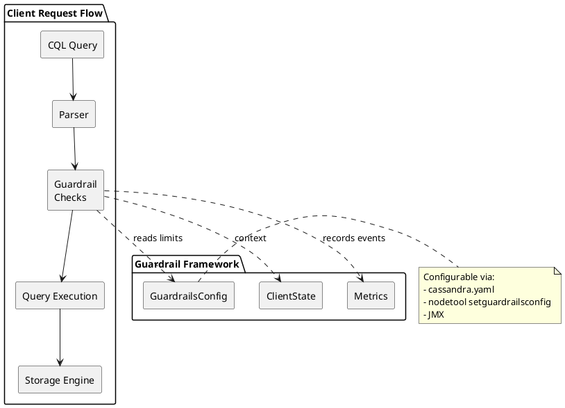

# Guardrails

Guardrails are a set of configurable limits and controls introduced in Apache Cassandra to protect clusters from operations that could cause instability, performance degradation, or outages. They enforce best practices at the database level, preventing misuse before it impacts production systems.

---

## History and Background

### The Problem: Cluster Instability from Misuse

Before guardrails existed, Cassandra operators had no database-level protection against common misuse patterns that led to outages:

| Problem | Example | Impact |
|---------|---------|--------|
| **Schema explosion** | Application creating thousands of tables | Cluster-wide gossip instability, OOM |
| **Unbounded queries** | `SELECT *` without `LIMIT` on large partitions | Node timeouts, heap exhaustion |
| **Oversized partitions** | Single partition growing to 100GB | Read failures, compaction issues |
| **Large collections** | Maps with millions of entries | Serialization failures, OOM |
| **Dangerous query patterns** | `ALLOW FILTERING` on large datasets | Full table scans, CPU saturation |

These problems share a common characteristic: they are easy to create accidentally but difficult to detect until they cause production incidents. Operators relied on application-level controls or manual reviews, which proved insufficient at scale.

### Community Initiative: CEP-3

The guardrails feature originated from **CEP-3** (Cassandra Enhancement Proposal 3), titled "Guardrails":

- **CEP Number**: CEP-3
- **Author**: Andrés de la Peña (DataStax)
- **Status**: Accepted and implemented
- **Discussion**: [dev@cassandra.apache.org mailing list](https://lists.apache.org/list.html?dev@cassandra.apache.org)

The CEP proposed a framework for configurable guardrails that would:

1. Provide soft limits (warnings) and hard limits (rejections)
2. Allow runtime configuration changes without restart
3. Be extensible for future guardrail types
4. Have minimal performance overhead on normal operations

### Implementation Timeline

| Version | Enhancement | JIRA |
|---------|-------------|------|
| **4.0** | Initial guardrails framework | [CASSANDRA-14740](https://issues.apache.org/jira/browse/CASSANDRA-14740) |
| **4.0** | Table and column limits | [CASSANDRA-15530](https://issues.apache.org/jira/browse/CASSANDRA-15530) |
| **4.0** | Collection size guardrails | [CASSANDRA-16302](https://issues.apache.org/jira/browse/CASSANDRA-16302) |
| **4.0** | Query guardrails (page size, IN clause) | [CASSANDRA-16375](https://issues.apache.org/jira/browse/CASSANDRA-16375) |
| **4.1** | Secondary index guardrails | [CASSANDRA-17188](https://issues.apache.org/jira/browse/CASSANDRA-17188) |
| **4.1** | Partition size guardrails | [CASSANDRA-17066](https://issues.apache.org/jira/browse/CASSANDRA-17066) |
| **4.1** | ALLOW FILTERING guardrail | [CASSANDRA-17240](https://issues.apache.org/jira/browse/CASSANDRA-17240) |
| **4.1** | TTL guardrails | [CASSANDRA-17235](https://issues.apache.org/jira/browse/CASSANDRA-17235) |
| **5.0** | Additional query guardrails | Multiple JIRAs |
| **5.0** | Read consistency guardrails | [CASSANDRA-18449](https://issues.apache.org/jira/browse/CASSANDRA-18449) |
| **5.0** | Data disk usage guardrails | [CASSANDRA-17989](https://issues.apache.org/jira/browse/CASSANDRA-17989) |

!!! note "Version Availability"
    Guardrails are available in Cassandra 4.0 and later. Clusters running Cassandra 3.x do not have this feature. A subset of guardrails may also be available in DataStax Enterprise (DSE) 6.8+.

---

## How Guardrails Work

### Architecture Overview



### Warn vs Fail Thresholds

Each guardrail has two threshold levels:

| Level | Behavior | Use Case |
|-------|----------|----------|
| **Warn threshold** | Logs a warning, allows operation to proceed | Early detection, monitoring alerts |
| **Fail threshold** | Rejects operation with error to client | Hard enforcement, prevent damage |

This two-tier approach allows:

1. **Gradual enforcement** - Enable warnings first, then add hard limits
2. **Operational visibility** - Track how close operations are to limits
3. **Graceful degradation** - Warn before failing

### Configuration Precedence

Guardrail values can be set in multiple places:

1. **cassandra.yaml** (static, requires restart to change)
2. **nodetool setguardrailsconfig** (runtime, does not persist)
3. **JMX MBeans** (runtime, does not persist)

Runtime changes override `cassandra.yaml` values but are lost on node restart.

### Threshold Values

| Value | Meaning |
|-------|---------|
| Positive number | Threshold is enabled at that value |
| `0` | Behavior varies by guardrail (often means "not allowed") |
| `-1` | Guardrail is disabled (no limit enforced) |

---

## Complete Guardrail Reference

### Schema Guardrails

These guardrails protect against schema explosion and overly complex data models.

#### Tables per Keyspace

| Setting | Description | Default |
|---------|-------------|---------|
| `tables_warn_threshold` | Warn when creating a table that exceeds this count | -1 (disabled) |
| `tables_fail_threshold` | Reject table creation above this count | -1 (disabled) |

**Problem it prevents:**
Schema explosion where applications dynamically create tables (e.g., one table per tenant) leads to:
- Gossip protocol overhead (all nodes must track all tables)
- Memory pressure from schema metadata
- Slower startup times
- Repair and compaction complications

**Example configuration:**
```yaml
guardrails:
    tables_warn_threshold: 100
    tables_fail_threshold: 150
```

**Error when triggered:**
```
Cannot add table my_table to keyspace my_keyspace. It violates guardrail tables,
current number of tables 150 equals or exceeds threshold 150.
```

---

#### Columns per Table

| Setting | Description | Default |
|---------|-------------|---------|
| `columns_per_table_warn_threshold` | Warn when table exceeds this column count | -1 (disabled) |
| `columns_per_table_fail_threshold` | Reject table modification above this count | -1 (disabled) |

**Problem it prevents:**
Tables with hundreds or thousands of columns cause:
- Large schema metadata per table
- Inefficient storage (sparse rows)
- Query planning overhead
- Often indicates a data modeling anti-pattern (using Cassandra as a document store)

**Example configuration:**
```yaml
guardrails:
    columns_per_table_warn_threshold: 50
    columns_per_table_fail_threshold: 100
```

---

#### Keyspaces

| Setting | Description | Default |
|---------|-------------|---------|
| `keyspaces_warn_threshold` | Warn when creating a keyspace exceeds this count | -1 (disabled) |
| `keyspaces_fail_threshold` | Reject keyspace creation above this count | -1 (disabled) |

**Problem it prevents:**
Like table explosion, keyspace explosion adds gossip overhead and complicates operations.

**Example configuration:**
```yaml
guardrails:
    keyspaces_warn_threshold: 15
    keyspaces_fail_threshold: 25
```

---

#### Secondary Indexes per Table

| Setting | Description | Default |
|---------|-------------|---------|
| `secondary_indexes_per_table_warn_threshold` | Warn when adding index exceeds this count | -1 (disabled) |
| `secondary_indexes_per_table_fail_threshold` | Reject index creation above this count | -1 (disabled) |

**Problem it prevents:**
Excessive secondary indexes cause:
- Write amplification (each write updates all indexes)
- Increased storage requirements
- Slower writes
- Complex query planning

**Example configuration:**
```yaml
guardrails:
    secondary_indexes_per_table_warn_threshold: 5
    secondary_indexes_per_table_fail_threshold: 10
```

---

#### Materialized Views per Table

| Setting | Description | Default |
|---------|-------------|---------|
| `materialized_views_per_table_warn_threshold` | Warn when adding MV exceeds this count | -1 (disabled) |
| `materialized_views_per_table_fail_threshold` | Reject MV creation above this count | -1 (disabled) |

**Problem it prevents:**
Materialized views add significant overhead:
- Each base table write triggers view updates
- Views can become inconsistent
- Large views take a long time to build
- Increased storage and compaction load

**Example configuration:**
```yaml
guardrails:
    materialized_views_per_table_warn_threshold: 2
    materialized_views_per_table_fail_threshold: 3
```

---

#### Fields per UDT (User-Defined Type)

| Setting | Description | Default |
|---------|-------------|---------|
| `fields_per_udt_warn_threshold` | Warn when UDT exceeds this field count | -1 (disabled) |
| `fields_per_udt_fail_threshold` | Reject UDT modification above this count | -1 (disabled) |

**Problem it prevents:**
Overly complex UDTs are difficult to evolve and indicate data modeling issues.

**Example configuration:**
```yaml
guardrails:
    fields_per_udt_warn_threshold: 20
    fields_per_udt_fail_threshold: 30
```

---

### Data Size Guardrails

These guardrails protect against oversized data that can cause memory issues, compaction problems, and read failures.

#### Collection Size

| Setting | Description | Default |
|---------|-------------|---------|
| `collection_size_warn_threshold` | Warn when collection exceeds this size | null (disabled) |
| `collection_size_fail_threshold` | Reject write when collection exceeds this | null (disabled) |

Values are specified with units: `64KiB`, `1MiB`, etc.

**Problem it prevents:**
Large collections (lists, sets, maps) cause:
- Entire collection must be read into memory for any access
- Serialization/deserialization overhead
- Potential OOM during compaction
- Query timeouts

**Example configuration:**
```yaml
guardrails:
    collection_size_warn_threshold: 64KiB
    collection_size_fail_threshold: 1MiB
```

---

#### Items per Collection

| Setting | Description | Default |
|---------|-------------|---------|
| `items_per_collection_warn_threshold` | Warn when collection item count exceeds this | -1 (disabled) |
| `items_per_collection_fail_threshold` | Reject write when items exceed this | -1 (disabled) |

**Problem it prevents:**
Collections with many items (even if individually small) cause serialization overhead and memory pressure.

**Example configuration:**
```yaml
guardrails:
    items_per_collection_warn_threshold: 100
    items_per_collection_fail_threshold: 1000
```

---

#### Partition Size (Cassandra 4.1+)

| Setting | Description | Default |
|---------|-------------|---------|
| `partition_size_warn_threshold` | Warn when partition exceeds this size | null (disabled) |
| `partition_size_fail_threshold` | Reject write when partition exceeds this | null (disabled) |

**Problem it prevents:**
Oversized partitions are one of the most common causes of Cassandra issues:
- Must be read entirely into memory for range queries within partition
- Compaction becomes problematic
- Repair takes longer
- Hot spots on specific nodes

**Recommended values:**
```yaml
guardrails:
    partition_size_warn_threshold: 100MiB
    partition_size_fail_threshold: 1GiB
```

!!! warning "Detection Timing"
    Partition size is evaluated during compaction, not at write time. Large partitions may exist before the guardrail triggers.

---

#### Column Value Size

| Setting | Description | Default |
|---------|-------------|---------|
| `column_value_size_warn_threshold` | Warn when column value exceeds this | null (disabled) |
| `column_value_size_fail_threshold` | Reject write when value exceeds this | null (disabled) |

**Problem it prevents:**
Very large column values (multi-MB blobs) cause memory pressure and slow operations.

**Example configuration:**
```yaml
guardrails:
    column_value_size_warn_threshold: 256KiB
    column_value_size_fail_threshold: 1MiB
```

---

#### Partition Tombstones (Cassandra 4.1+)

| Setting | Description | Default |
|---------|-------------|---------|
| `partition_tombstones_warn_threshold` | Warn when partition tombstone count exceeds this | -1 (disabled) |
| `partition_tombstones_fail_threshold` | Fail read when tombstones exceed this | -1 (disabled) |

**Problem it prevents:**
Tombstone accumulation causes:
- Read performance degradation (must scan through tombstones)
- Memory pressure during reads
- "Tombstone hell" scenarios

**Example configuration:**
```yaml
guardrails:
    partition_tombstones_warn_threshold: 1000
    partition_tombstones_fail_threshold: 100000
```

---

### Query Guardrails

These guardrails protect against query patterns that can cause performance problems.

#### Page Size

| Setting | Description | Default |
|---------|-------------|---------|
| `page_size_warn_threshold` | Warn when page size exceeds this | -1 (disabled) |
| `page_size_fail_threshold` | Reject query with page size above this | -1 (disabled) |

**Problem it prevents:**
Large page sizes cause:
- Memory pressure on coordinator node
- Increased network traffic
- Longer query execution times
- Potential timeouts

**Example configuration:**
```yaml
guardrails:
    page_size_warn_threshold: 5000
    page_size_fail_threshold: 10000
```

---

#### IN Clause (Partition Keys in SELECT)

| Setting | Description | Default |
|---------|-------------|---------|
| `partition_keys_in_select_warn_threshold` | Warn when IN clause exceeds this count | -1 (disabled) |
| `partition_keys_in_select_fail_threshold` | Reject query with IN clause above this | -1 (disabled) |

**Problem it prevents:**
Large IN clauses cause:
- Multiple partition reads (potentially from different nodes)
- Coordinator must aggregate results
- Latency variance (slowest partition determines response time)
- Query planning overhead

**Example configuration:**
```yaml
guardrails:
    partition_keys_in_select_warn_threshold: 20
    partition_keys_in_select_fail_threshold: 100
```

---

#### IN Clause Cartesian Product

| Setting | Description | Default |
|---------|-------------|---------|
| `in_select_cartesian_product_warn_threshold` | Warn when cartesian product exceeds this | -1 (disabled) |
| `in_select_cartesian_product_fail_threshold` | Reject query above this cartesian product | -1 (disabled) |

**Problem it prevents:**
Multiple IN clauses multiply together:
```cql
SELECT * FROM table WHERE pk1 IN (1,2,3) AND pk2 IN ('a','b','c','d','e');
-- Cartesian product = 3 × 5 = 15 combinations
```

**Example configuration:**
```yaml
guardrails:
    in_select_cartesian_product_warn_threshold: 25
    in_select_cartesian_product_fail_threshold: 100
```

---

#### ALLOW FILTERING (Cassandra 4.1+)

| Setting | Description | Default |
|---------|-------------|---------|
| `allow_filtering_enabled` | Whether ALLOW FILTERING queries are permitted | true |

**Problem it prevents:**
`ALLOW FILTERING` enables full table scans which:
- Scan all data in the table
- Cause CPU and I/O saturation
- Lead to timeouts
- Impact other queries on the same nodes

**Example configuration:**
```yaml
guardrails:
    allow_filtering_enabled: false
```

When disabled, queries with `ALLOW FILTERING` will be rejected:
```
Cannot execute this query as it might involve data filtering and thus may have
unpredictable performance. If you want to execute this query despite the
performance unpredictability, use ALLOW FILTERING - but this cluster has
disabled ALLOW FILTERING via guardrails.
```

---

#### Read Consistency Level (Cassandra 5.0+)

| Setting | Description | Default |
|---------|-------------|---------|
| `read_consistency_levels_warned` | CL values that trigger warning | empty |
| `read_consistency_levels_disallowed` | CL values that are rejected | empty |

**Problem it prevents:**
Dangerous consistency levels like `ALL` can:
- Block on unavailable nodes
- Reduce availability
- Often indicate application misconfiguration

**Example configuration:**
```yaml
guardrails:
    read_consistency_levels_warned:
        - ALL
    read_consistency_levels_disallowed:
        - ALL
```

---

#### Write Consistency Level (Cassandra 5.0+)

| Setting | Description | Default |
|---------|-------------|---------|
| `write_consistency_levels_warned` | CL values that trigger warning | empty |
| `write_consistency_levels_disallowed` | CL values that are rejected | empty |

**Example configuration:**
```yaml
guardrails:
    write_consistency_levels_warned:
        - ANY
        - ALL
    write_consistency_levels_disallowed:
        - ALL
```

---

### TTL Guardrails (Cassandra 4.1+)

| Setting | Description | Default |
|---------|-------------|---------|
| `minimum_timestamp_warn_threshold` | Warn when TTL is below this | null (disabled) |
| `minimum_timestamp_fail_threshold` | Reject when TTL is below this | null (disabled) |
| `maximum_timestamp_warn_threshold` | Warn when TTL exceeds this | null (disabled) |
| `maximum_timestamp_fail_threshold` | Reject when TTL exceeds this | null (disabled) |

**Problem it prevents:**
- Very short TTLs create tombstone churn
- Very long TTLs (approaching year 2038) can cause overflow issues
- Missing TTLs on time-series data leads to unbounded growth

**Example configuration:**
```yaml
guardrails:
    maximum_timestamp_warn_threshold: 315360000s  # 10 years
    maximum_timestamp_fail_threshold: 630720000s  # 20 years
```

---

### Disk Usage Guardrails (Cassandra 5.0+)

| Setting | Description | Default |
|---------|-------------|---------|
| `data_disk_usage_percentage_warn_threshold` | Warn when disk usage exceeds this % | -1 (disabled) |
| `data_disk_usage_percentage_fail_threshold` | Reject writes when disk exceeds this % | -1 (disabled) |
| `data_disk_usage_max_disk_size` | Override detected disk size | null (auto-detect) |

**Problem it prevents:**
- Disk exhaustion leading to node failure
- Compaction unable to complete due to lack of space
- Loss of ability to repair or stream data

**Example configuration:**
```yaml
guardrails:
    data_disk_usage_percentage_warn_threshold: 70
    data_disk_usage_percentage_fail_threshold: 90
```

---

### Feature Guardrails

These guardrails disable specific features entirely.

| Setting | Description | Default |
|---------|-------------|---------|
| `user_timestamps_enabled` | Allow client-provided timestamps | true |
| `group_by_enabled` | Allow GROUP BY queries | true |
| `drop_truncate_table_enabled` | Allow DROP/TRUNCATE operations | true |
| `secondary_indexes_enabled` | Allow secondary index creation | true |
| `uncompressed_tables_enabled` | Allow tables without compression | true |
| `compact_tables_enabled` | Allow COMPACT STORAGE tables | true |
| `read_before_write_list_operations_enabled` | Allow list append/prepend | true |

**Example - Restrict dangerous operations:**
```yaml
guardrails:
    user_timestamps_enabled: false
    drop_truncate_table_enabled: false
    uncompressed_tables_enabled: false
```

---

### Disallowed Operations (String Lists)

| Setting | Description |
|---------|-------------|
| `table_properties_warned` | Table properties that trigger warning |
| `table_properties_disallowed` | Table properties that are rejected |
| `table_properties_ignored` | Table properties that are silently ignored |

**Example - Discourage deprecated compaction strategies:**
```yaml
guardrails:
    table_properties_warned:
        - compaction.class=org.apache.cassandra.db.compaction.DateTieredCompactionStrategy
    table_properties_disallowed:
        - default_time_to_live=0  # Require TTL on all tables
```

---

## Configuration

### cassandra.yaml Configuration

The guardrails section in `cassandra.yaml` contains all settings:

```yaml
# Guardrails configuration (Cassandra 4.0+)
guardrails:
    #
    # Schema guardrails
    #
    keyspaces_warn_threshold: 15
    keyspaces_fail_threshold: 25
    tables_warn_threshold: 100
    tables_fail_threshold: 150
    columns_per_table_warn_threshold: 50
    columns_per_table_fail_threshold: 100
    secondary_indexes_per_table_warn_threshold: 5
    secondary_indexes_per_table_fail_threshold: 10
    materialized_views_per_table_warn_threshold: 2
    materialized_views_per_table_fail_threshold: 3
    fields_per_udt_warn_threshold: 20
    fields_per_udt_fail_threshold: 30

    #
    # Data size guardrails
    #
    collection_size_warn_threshold: 64KiB
    collection_size_fail_threshold: 1MiB
    items_per_collection_warn_threshold: 100
    items_per_collection_fail_threshold: 1000
    partition_size_warn_threshold: 100MiB
    partition_size_fail_threshold: 1GiB
    column_value_size_warn_threshold: 256KiB
    column_value_size_fail_threshold: 1MiB
    partition_tombstones_warn_threshold: 1000
    partition_tombstones_fail_threshold: 100000

    #
    # Query guardrails
    #
    page_size_warn_threshold: 5000
    page_size_fail_threshold: 10000
    partition_keys_in_select_warn_threshold: 20
    partition_keys_in_select_fail_threshold: 100
    in_select_cartesian_product_warn_threshold: 25
    in_select_cartesian_product_fail_threshold: 100
    allow_filtering_enabled: false

    #
    # TTL guardrails
    #
    maximum_timestamp_warn_threshold: 315360000s
    maximum_timestamp_fail_threshold: 630720000s

    #
    # Disk usage guardrails
    #
    data_disk_usage_percentage_warn_threshold: 70
    data_disk_usage_percentage_fail_threshold: 90

    #
    # Feature guardrails
    #
    user_timestamps_enabled: false
    drop_truncate_table_enabled: true
    uncompressed_tables_enabled: false
    compact_tables_enabled: false
    read_before_write_list_operations_enabled: false

    #
    # Consistency level guardrails
    #
    read_consistency_levels_warned:
        - ALL
    read_consistency_levels_disallowed: []
    write_consistency_levels_warned:
        - ANY
        - ALL
    write_consistency_levels_disallowed: []
```

---

### Runtime Configuration with nodetool

#### View Current Settings

```bash
nodetool getguardrailsconfig
```

#### Modify Settings at Runtime

```bash
# Set table limits
nodetool setguardrailsconfig \
    --tables-warn-threshold 100 \
    --tables-fail-threshold 150

# Set query limits
nodetool setguardrailsconfig \
    --page-size-warn-threshold 5000 \
    --page-size-fail-threshold 10000

# Disable a guardrail
nodetool setguardrailsconfig --tables-fail-threshold -1
```

!!! warning "Non-Persistent"
    Runtime changes via `nodetool` or JMX do not persist across node restarts. Update `cassandra.yaml` to make changes permanent.

---

### JMX Configuration

Guardrails are exposed via JMX under:

```
org.apache.cassandra.db:type=Guardrails
```

This allows:
- Integration with monitoring systems
- Programmatic configuration
- Read/write access to all guardrail values

---

## Real-World Implementation Examples

### Scenario 1: Multi-Tenant SaaS Platform

A SaaS platform hosts multiple customers in shared keyspaces. Guardrails prevent one tenant from impacting others.

**Requirements:**
- Limit schema sprawl (tables per tenant)
- Prevent query abuse (large scans)
- Enforce data hygiene (TTL, collection sizes)

**Configuration:**
```yaml
guardrails:
    # Strict schema limits
    tables_warn_threshold: 50
    tables_fail_threshold: 75
    columns_per_table_warn_threshold: 30
    columns_per_table_fail_threshold: 50
    secondary_indexes_per_table_warn_threshold: 3
    secondary_indexes_per_table_fail_threshold: 5

    # Query protection
    page_size_warn_threshold: 2000
    page_size_fail_threshold: 5000
    partition_keys_in_select_warn_threshold: 10
    partition_keys_in_select_fail_threshold: 25
    allow_filtering_enabled: false

    # Data size protection
    collection_size_warn_threshold: 32KiB
    collection_size_fail_threshold: 64KiB
    items_per_collection_warn_threshold: 50
    items_per_collection_fail_threshold: 100
    partition_size_warn_threshold: 50MiB
    partition_size_fail_threshold: 100MiB

    # Feature restrictions
    user_timestamps_enabled: false
    drop_truncate_table_enabled: false
```

---

### Scenario 2: Time-Series IoT Platform

An IoT platform ingests high-volume sensor data with strict retention policies.

**Requirements:**
- Enforce TTL on all data
- Prevent partition hot spots
- Optimize for write throughput

**Configuration:**
```yaml
guardrails:
    # Moderate schema limits (IoT often has many device tables)
    tables_warn_threshold: 200
    tables_fail_threshold: 300

    # Strict partition limits (time-series prone to hot partitions)
    partition_size_warn_threshold: 100MiB
    partition_size_fail_threshold: 500MiB
    partition_tombstones_warn_threshold: 10000
    partition_tombstones_fail_threshold: 100000

    # TTL enforcement
    maximum_timestamp_warn_threshold: 94608000s   # 3 years
    maximum_timestamp_fail_threshold: 157680000s  # 5 years

    # Query limits
    allow_filtering_enabled: false
    page_size_warn_threshold: 10000
    page_size_fail_threshold: 50000

    # Disk protection (IoT data grows fast)
    data_disk_usage_percentage_warn_threshold: 60
    data_disk_usage_percentage_fail_threshold: 80
```

---

### Scenario 3: Financial Services (Strict Compliance)

A financial services company requires strict controls for compliance and audit.

**Requirements:**
- No accidental data deletion
- No dangerous query patterns
- Strict schema governance

**Configuration:**
```yaml
guardrails:
    # Very strict schema limits
    tables_warn_threshold: 25
    tables_fail_threshold: 50
    columns_per_table_warn_threshold: 30
    columns_per_table_fail_threshold: 50
    secondary_indexes_per_table_warn_threshold: 2
    secondary_indexes_per_table_fail_threshold: 3
    materialized_views_per_table_warn_threshold: 1
    materialized_views_per_table_fail_threshold: 2

    # Strict query limits
    page_size_warn_threshold: 1000
    page_size_fail_threshold: 5000
    partition_keys_in_select_warn_threshold: 5
    partition_keys_in_select_fail_threshold: 20
    allow_filtering_enabled: false

    # Data protection
    partition_size_warn_threshold: 50MiB
    partition_size_fail_threshold: 200MiB

    # Feature restrictions
    drop_truncate_table_enabled: false
    user_timestamps_enabled: false
    compact_tables_enabled: false

    # Consistency requirements
    read_consistency_levels_disallowed:
        - ANY
    write_consistency_levels_disallowed:
        - ANY
        - ONE
```

---

### Scenario 4: Development/Testing Environment

A development cluster should catch problems before they reach production.

**Requirements:**
- Warn about production anti-patterns
- Don't block development
- Catch data modeling issues early

**Configuration:**
```yaml
guardrails:
    # Warn but don't block (development flexibility)
    tables_warn_threshold: 100
    tables_fail_threshold: -1  # Disabled
    columns_per_table_warn_threshold: 50
    columns_per_table_fail_threshold: -1

    # Strict query warnings
    page_size_warn_threshold: 1000
    page_size_fail_threshold: -1
    allow_filtering_enabled: true  # Allow but...

    # Warn about data size issues
    partition_size_warn_threshold: 10MiB
    partition_size_fail_threshold: -1
    collection_size_warn_threshold: 16KiB
    collection_size_fail_threshold: -1

    # Warn about dangerous patterns
    partition_keys_in_select_warn_threshold: 5
    partition_keys_in_select_fail_threshold: -1
```

This configuration generates warnings that can be used to train developers on best practices without blocking their work.

---

## Monitoring and Alerting

### Guardrail Metrics

Guardrails expose JMX metrics for monitoring:

| Metric | Description |
|--------|-------------|
| `WarnCount` | Number of times warn threshold was hit |
| `FailCount` | Number of times fail threshold was hit |

**JMX path:**
```
org.apache.cassandra.metrics:type=Guardrails,name=<guardrail_name>
```

### Log Messages

Guardrail warnings and failures appear in system logs:

**Warning example:**
```
WARN  [Native-Transport-Requests-1] GuardrailViolationHandler -
Guardrail tables_warn_threshold violated. Current count 100 exceeds threshold 100.
```

**Failure example:**
```
ERROR [Native-Transport-Requests-1] GuardrailViolationHandler -
Guardrail tables_fail_threshold violated. Current count 150 exceeds threshold 150.
Operation rejected.
```

### Alerting Recommendations

| Condition | Alert Level | Response |
|-----------|-------------|----------|
| Any warn threshold hit | Warning | Review query/schema patterns |
| Repeated warn threshold hits | Warning | Investigate root cause |
| Any fail threshold hit | Critical | Immediate investigation |
| Fail threshold causes application impact | Critical | Review guardrail settings |

**Example Prometheus alert (using JMX exporter):**
```yaml
- alert: CassandraGuardrailFail
  expr: cassandra_guardrails_fail_count > 0
  for: 1m
  labels:
    severity: critical
  annotations:
    summary: "Cassandra guardrail failure on {{ $labels.instance }}"
    description: "Guardrail {{ $labels.name }} is rejecting operations"
```

---

## Operational Considerations

### Rolling Out Guardrails

When enabling guardrails on an existing cluster:

1. **Audit current state**
   ```bash
   # Check table counts
   cqlsh -e "SELECT keyspace_name, count(*) FROM system_schema.tables GROUP BY keyspace_name;"

   # Check column counts
   nodetool tablestats | grep -E "Table:|Number of columns"

   # Check for large partitions
   nodetool tablestats | grep -E "Partition|Maximum partition size"
   ```

2. **Enable warnings only first**
   ```yaml
   guardrails:
       tables_warn_threshold: 100
       tables_fail_threshold: -1  # Disabled initially
   ```

3. **Monitor for warnings in production**
   - Collect metrics for 1-2 weeks
   - Identify affected queries/operations
   - Work with application teams to remediate

4. **Enable fail thresholds**
   - Set fail thresholds above current usage
   - Gradually tighten over time

### Handling Guardrail Failures

When applications hit guardrail failures:

1. **Identify the failure**
   ```bash
   grep -i "guardrail.*violated" /var/log/cassandra/system.log
   ```

2. **Understand the context**
   - Which application/query?
   - Is the guardrail appropriate?
   - Can the application be modified?

3. **Decision tree:**

   ```
   Is the guardrail appropriate?
   ├── Yes → Fix the application
   │   ├── Reduce table count
   │   ├── Paginate queries
   │   └── Improve data model
   └── No → Adjust the guardrail
       ├── Temporary relaxation (nodetool)
       └── Permanent change (cassandra.yaml)
   ```

4. **Temporary relaxation for emergencies**
   ```bash
   # Temporarily increase limit
   nodetool setguardrailsconfig --tables-fail-threshold 200

   # ... perform operation ...

   # Restore limit
   nodetool setguardrailsconfig --tables-fail-threshold 150
   ```

### Cluster-Wide Application

Guardrails are node-level settings. Apply consistently across all nodes:

```bash
#!/bin/bash
# apply_guardrails.sh - Apply guardrail settings cluster-wide

SETTINGS="--tables-warn-threshold 100 --tables-fail-threshold 150"

# Get list of node IPs from local nodetool status
nodes=$(nodetool status | grep "^UN" | awk '{print $2}')

for node in $nodes; do
    echo "Applying guardrails to $node..."
    ssh "$node" "nodetool setguardrailsconfig $SETTINGS"
done

echo ""
echo "Verification:"
for node in $nodes; do
    echo "=== $node ==="
    ssh "$node" "nodetool getguardrailsconfig" | grep -E "tables"
done
```

---

## Best Practices

!!! tip "Guardrail Strategy"

    1. **Start with warnings** - Enable warn thresholds before fail thresholds
    2. **Monitor metrics** - Track guardrail violations over time
    3. **Document decisions** - Record why specific limits were chosen
    4. **Apply consistently** - Same guardrails on all nodes
    5. **Review periodically** - Adjust based on operational experience
    6. **Communicate to developers** - Ensure application teams understand limits

!!! warning "Common Mistakes"

    - **Setting limits too low** - Causes application failures
    - **Setting limits too high** - Defeats the purpose
    - **Inconsistent across nodes** - Creates unpredictable behavior
    - **Forgetting to persist** - Runtime changes lost on restart
    - **No monitoring** - Missing visibility into guardrail violations

!!! danger "Guardrails Are Not Validation"

    Guardrails are a safety net, not a substitute for:

    - Proper data modeling
    - Application-level validation
    - Code reviews
    - Load testing

    Design applications to stay well under guardrail limits, not to hit them routinely.

---

## Troubleshooting

### Query Rejected by Guardrail

**Symptom:** Application receives error like:
```
Guardrail page_size_fail_threshold violated: Query page size 15000 exceeds
threshold 10000.
```

**Resolution:**
1. Check if the query can be modified to use smaller page size
2. If legitimate, temporarily relax guardrail
3. Consider if guardrail setting is appropriate for workload

### Warnings Not Appearing

**Symptom:** Expected warnings not in logs despite exceeding thresholds.

**Check:**
1. Verify guardrail is enabled (not -1)
   ```bash
   nodetool getguardrailsconfig
   ```
2. Confirm logging level includes WARN
   ```bash
   nodetool getlogginglevels | grep -i guardrail
   ```
3. Check correct log file location

### Guardrail Changes Not Taking Effect

**Symptom:** Runtime changes don't seem to work.

**Check:**
1. Verify change was applied
   ```bash
   nodetool getguardrailsconfig
   ```
2. Confirm applied to correct node
3. Some guardrails apply to new operations only, not existing data

### Performance Impact Concerns

**Question:** Do guardrails slow down queries?

**Answer:** Minimal impact. Guardrails perform lightweight checks:
- Schema guardrails: Checked during DDL operations only
- Query guardrails: Simple numeric comparisons
- Data guardrails: Checked during write path

The overhead is negligible compared to actual I/O operations.

---

## Related Documentation

| Topic | Description |
|-------|-------------|
| [getguardrailsconfig](../nodetool/getguardrailsconfig.md) | View current guardrail settings |
| [setguardrailsconfig](../nodetool/setguardrailsconfig.md) | Modify guardrails at runtime |
| [cassandra.yaml](cassandra-yaml/index.md) | Full configuration reference |
| [Data Modeling Anti-Patterns](../../data-modeling/anti-patterns/index.md) | Common mistakes guardrails prevent |
| [Performance Tuning](../performance/index.md) | Optimization guide |

---

## External References

- [CEP-3: Guardrails](https://cwiki.apache.org/confluence/display/CASSANDRA/CEP-3%3A+Guardrails) - Original Cassandra Enhancement Proposal
- [CASSANDRA-14740](https://issues.apache.org/jira/browse/CASSANDRA-14740) - Initial guardrails framework implementation
- [Apache Cassandra Documentation](https://cassandra.apache.org/doc/latest/cassandra/configuration/cass_yaml_file.html#guardrails) - Official guardrails documentation
