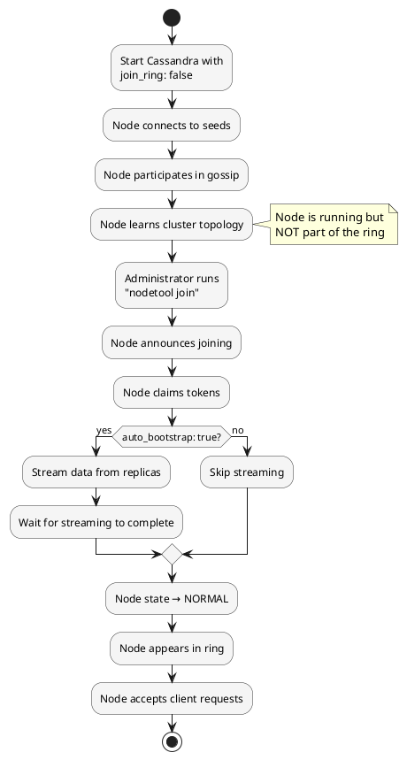

# nodetool join

Causes a node that was started with `join_ring: false` to join the cluster ring.

---

## Synopsis

```bash
nodetool [connection_options] join
```

## Description

`nodetool join` instructs a Cassandra node to join the cluster token ring. This command is only relevant when a node was started with `join_ring: false` in `cassandra.yaml`, which prevents automatic ring participation at startup.

### Understanding `join_ring` vs `auto_bootstrap`

These two settings are often confused but serve different purposes:

| Setting | Purpose | Default |
|---------|---------|---------|
| `join_ring` | Controls whether the node joins the token ring at startup | `true` |
| `auto_bootstrap` | Controls whether the node streams data when joining | `true` |

**Key distinction:**

- **`auto_bootstrap: false`** - The node still joins the cluster automatically at startup, but skips streaming data. The join completes, the node appears in `nodetool status`, and it starts accepting requests immediately (without having the data for its token ranges).

- **`join_ring: false`** - The node starts but does NOT join the cluster ring. It connects to seed nodes, participates in gossip to learn cluster topology, but does not appear as a ring member in `nodetool status`. The node waits for an explicit `nodetool join` command before joining.

```
┌─────────────────────────────────────────────────────────────────────────┐
│                        Node Startup Behavior                            │
├─────────────────────────────────────────────────────────────────────────┤
│                                                                         │
│  join_ring: true (default)                                              │
│  └─> Node joins ring automatically at startup                           │
│      └─> auto_bootstrap: true  → Streams data, then serves requests     │
│      └─> auto_bootstrap: false → Joins immediately, no streaming        │
│                                                                         │
│  join_ring: false                                                       │
│  └─> Node starts but does NOT join ring                                 │
│      └─> Waits for "nodetool join" command                              │
│          └─> Then auto_bootstrap setting determines if streaming occurs │
│                                                                         │
└─────────────────────────────────────────────────────────────────────────┘
```

---

## When to Use

### Scenario 1: Pre-Flight Verification Before Joining

Start a node without joining to verify everything is correctly configured before committing to the cluster:

```yaml
# cassandra.yaml on new node
join_ring: false
auto_bootstrap: true
```

```bash
# 1. Start Cassandra - node runs but doesn't join ring
systemctl start cassandra

# 2. Verify node health and configuration
nodetool info
nodetool describecluster

# 3. Check connectivity to existing nodes
nodetool gossipinfo

# 4. Verify disk space, memory, network
df -h /var/lib/cassandra
free -m

# 5. Once satisfied, join the ring
nodetool join

# 6. Monitor bootstrap progress
nodetool netstats
```

### Scenario 2: Bulk Loading Data Before Joining

Load data into a node before it joins the ring, avoiding the bootstrap streaming overhead:

```yaml
# cassandra.yaml
join_ring: false
auto_bootstrap: false
```

```bash
# 1. Start node (doesn't join ring)
systemctl start cassandra

# 2. Load data directly using sstableloader from another node's snapshot
sstableloader -d localhost /path/to/snapshot/keyspace/table/

# 3. Once data is loaded, join the ring
nodetool join

# 4. Run repair to ensure consistency
nodetool repair
```

### Scenario 3: Replacing a Dead Node with Pre-Staged Data

When replacing a failed node, stage data restoration before joining:

```yaml
# cassandra.yaml
join_ring: false
auto_bootstrap: false
# Set the replace address
# JVM option: -Dcassandra.replace_address_first_boot=<dead_node_ip>
```

```bash
# 1. Start node
systemctl start cassandra

# 2. Restore data from backup
# ... restore process ...

# 3. Join the ring to replace the dead node
nodetool join

# 4. Verify node has replaced the dead one
nodetool status
```

### Scenario 4: Coordinated Multi-Node Expansion

When adding multiple nodes, start them all first, then join them in a controlled sequence:

```yaml
# On all new nodes
join_ring: false
auto_bootstrap: true
```

```bash
# 1. Start all new nodes (none join yet)
# On node-new-1, node-new-2, node-new-3:
systemctl start cassandra

# 2. Verify all nodes are healthy
for node in node-new-1 node-new-2 node-new-3; do
    ssh $node 'nodetool info'
done

# 3. Join nodes one at a time, waiting for each to complete
ssh node-new-1 'nodetool join'
# Wait for bootstrap to complete...
ssh node-new-1 'nodetool status'  # Verify UN status

ssh node-new-2 'nodetool join'
# Wait for bootstrap to complete...

ssh node-new-3 'nodetool join'
# Wait for bootstrap to complete...
```

### Scenario 5: Testing Cluster Connectivity Without Commitment

Verify a new node can communicate with the cluster without actually joining:

```yaml
# cassandra.yaml
join_ring: false
```

```bash
# 1. Start node
systemctl start cassandra

# 2. Test connectivity and gossip
nodetool gossipinfo
nodetool describecluster

# 3. If tests pass, join
nodetool join

# 4. If tests fail, fix issues and restart without affecting the cluster
systemctl stop cassandra
# Fix configuration...
systemctl start cassandra
```

---

## Prerequisites

For `nodetool join` to work:

1. **Node must be started with `join_ring: false`**
   ```yaml
   # cassandra.yaml
   join_ring: false
   ```

2. **Node must not have already joined**
   - If the node previously joined, the command will fail

3. **Node must be able to communicate with the cluster**
   - Seed nodes must be reachable
   - Gossip must be functioning

---

## What Happens When You Run `nodetool join`

1. **Node announces itself to the cluster** via gossip
2. **Token ownership is claimed** based on `num_tokens` or `initial_token`
3. **Node state changes** from not-in-ring to JOINING
4. **Bootstrap begins** (if `auto_bootstrap: true`)
   - Data is streamed from existing replicas
   - This can take hours for large datasets
5. **Node state changes to NORMAL** when complete
6. **Node appears in `nodetool status`** as UN (Up/Normal)
7. **Node begins accepting client requests**

---

## Process Flow



---

## Verifying Node State

### Before Join

```bash
# Node should be running but not in ring
nodetool info
# Look for: "Gossip active: true" but node not in nodetool status

nodetool status
# Node should NOT appear in the output yet
```

### After Join

```bash
# Node should now appear in status
nodetool status
# Look for the new node with UJ (joining) or UN (normal) status

# Monitor bootstrap progress if auto_bootstrap: true
nodetool netstats
```

---

## Common Errors

### "Node is already in the ring"

```
Error: Node is already in the ring
```

The node has already joined, either:
- Automatically at startup (because `join_ring` was `true` or defaulted)
- Via a previous `nodetool join` command

**Resolution:** This is not an error condition if the node is already functioning normally.

### "Cannot join ring without local data"

The node is trying to join but has issues with its data directories.

**Resolution:**
```bash
# Check data directory permissions and content
ls -la /var/lib/cassandra/data/
chown -R cassandra:cassandra /var/lib/cassandra/
```

### Node Joins But Bootstrap Fails

If bootstrap fails midway:

```bash
# Check bootstrap status
nodetool bootstrap status

# If incomplete, may need to resume
nodetool bootstrap resume

# Or check logs for specific errors
tail -500 /var/log/cassandra/system.log | grep -i "bootstrap\|stream"
```

---

## Troubleshooting

### Check Current State

```bash
# Is the node running?
nodetool info

# Can it see the cluster?
nodetool gossipinfo

# Is it in the ring?
nodetool status
```

### Check Configuration

```bash
# Verify join_ring setting
grep join_ring /etc/cassandra/cassandra.yaml

# Verify auto_bootstrap setting
grep auto_bootstrap /etc/cassandra/cassandra.yaml
```

### Check Logs

```bash
# Look for join-related messages
grep -i "join\|ring\|bootstrap" /var/log/cassandra/system.log | tail -50
```

---

## Best Practices

!!! tip "Join Guidelines"

    1. **Verify before joining** - Check node health, connectivity, and resources
    2. **Join one node at a time** - Never join multiple nodes simultaneously
    3. **Monitor bootstrap** - Watch `nodetool netstats` for streaming progress
    4. **Plan for duration** - Bootstrap can take hours for large datasets
    5. **Have rollback plan** - Know how to decommission if something goes wrong
    6. **Check disk space** - Ensure adequate space for streamed data

!!! warning "Important Considerations"

    - Once joined, the node is part of the cluster—rolling back requires decommission
    - If `auto_bootstrap: false`, the node will serve requests without having data—run repair immediately
    - Don't confuse `join_ring: false` with `auto_bootstrap: false`—they serve different purposes
    - The join command has no confirmation prompt—it executes immediately

---

## Comparison: join_ring vs auto_bootstrap

| Configuration | At Startup | After `nodetool join` | Data Status | Use Case |
|---------------|------------|----------------------|-------------|----------|
| `join_ring: true`, `auto_bootstrap: true` | Joins and bootstraps | N/A (already joined) | Has data | Normal new node |
| `join_ring: true`, `auto_bootstrap: false` | Joins immediately | N/A (already joined) | Empty | Seed nodes, restore from backup |
| `join_ring: false`, `auto_bootstrap: true` | Waits | Joins and bootstraps | Has data after bootstrap | Pre-flight checks |
| `join_ring: false`, `auto_bootstrap: false` | Waits | Joins immediately | Empty | Bulk load before join |

---

## Related Commands

| Command | Relationship |
|---------|--------------|
| [bootstrap](bootstrap.md) | Resume interrupted bootstrap |
| [status](status.md) | Check cluster state and ring membership |
| [decommission](decommission.md) | Remove node from ring |
| [netstats](netstats.md) | Monitor streaming during bootstrap |
| [gossipinfo](gossipinfo.md) | Check gossip state |
| [describecluster](describecluster.md) | View cluster information |
