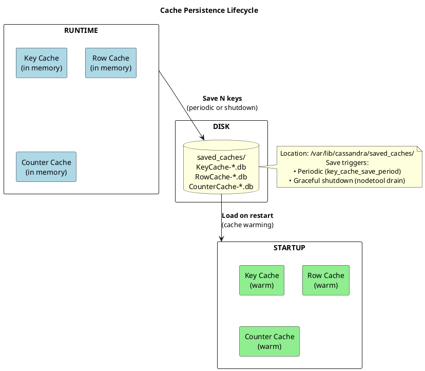

# nodetool setcachekeystosave

Sets the number of cache keys to save to disk for faster restart warmup.

---

## Synopsis

```bash
nodetool [connection_options] setcachekeystosave <key_cache_keys> <row_cache_keys> <counter_cache_keys>
```

## Description

`nodetool setcachekeystosave` controls how many keys from each cache type are persisted to disk. These saved cache entries are loaded on node startup, allowing Cassandra to "warm" its caches without waiting for production traffic to populate them.

### Cache Persistence Benefits

When a Cassandra node restarts, all in-memory caches are empty. Without saved caches, the node experiences a "cold start" period where:

- Every read requires disk I/O to locate partition keys (no key cache)
- Every read requires full SSTable scans (no row cache)
- Counter operations require read-before-write from disk (no counter cache)

By saving cache entries to disk, Cassandra can restore hot cache entries on startup, significantly reducing the performance impact of restarts.

### How Cache Saving Works



Caches are saved:
- Periodically (controlled by `*_cache_save_period` in cassandra.yaml)
- During graceful shutdown (`nodetool drain`)

Saved cache files are stored in `/var/lib/cassandra/saved_caches/` (configurable via `saved_caches_directory`).

---

## Arguments

| Argument | Description | Default Behavior |
|----------|-------------|------------------|
| `key_cache_keys` | Maximum keys to save from key cache | 0 = save all keys |
| `row_cache_keys` | Maximum keys to save from row cache | 0 = save all keys |
| `counter_cache_keys` | Maximum keys to save from counter cache | 0 = save all keys |

!!! info "Value of 0"
    Setting a value to `0` means "save all keys" (no limit), not "save nothing". To disable saving entirely, set the corresponding `*_cache_save_period` to 0 in cassandra.yaml.

---

## When to Use

### Reduce Startup Time for Large Caches

For nodes with very large caches (multiple GB), saving all keys can slow down both the save operation and startup loading. Limiting the number of saved keys focuses on the most valuable entries:

```bash
# Save top 100,000 key cache entries, skip row cache, save 50,000 counter entries
nodetool setcachekeystosave 100000 0 50000
```

### Control Disk Usage in saved_caches Directory

Saved cache files can grow large. Limiting keys reduces disk space:

```bash
# Check current saved cache sizes
du -sh /var/lib/cassandra/saved_caches/*

# Limit to reduce disk usage
nodetool setcachekeystosave 50000 0 10000
```

### Disable Row Cache Saving (High I/O Cost)

Row cache entries are large (full partition data). Saving them is expensive:

```bash
# Save key cache and counter cache, skip row cache entirely
nodetool setcachekeystosave 100000 0 50000
```

!!! warning "Row Cache Saving"
    Row cache saving is "much more expensive and has limited use" according to Cassandra documentation. The default save period for row cache is 0 (disabled). Only enable if specific use case requires it.

---

## Impact Analysis

### Startup Time Impact

| Keys Saved | Startup Behavior |
|------------|------------------|
| 0 (all keys) | Longer startup, but fully warm cache |
| Limited (e.g., 100K) | Faster startup, partially warm cache |
| Very low | Fast startup, mostly cold cache |

### Save Operation Impact

| Keys to Save | Save Duration | Disk I/O | File Size |
|--------------|---------------|----------|-----------|
| All keys (large cache) | Minutes | High | Large (GB) |
| Limited keys | Seconds | Low | Small (MB) |

### Setting Values Too High

If the value exceeds the actual cache size, Cassandra simply saves all available keys—no harm done. The setting is a maximum, not a requirement.

### Setting Values Too Low

| Cache Type | Impact of Low Value |
|------------|---------------------|
| Key Cache | More partition index disk reads on startup |
| Row Cache | More full disk reads for uncached partitions |
| Counter Cache | More read-before-write operations for counters |

The cache will warm up over time from production traffic, but the initial post-restart period will have degraded performance.

---

## Examples

### Save All Keys (Default Behavior)

```bash
nodetool setcachekeystosave 0 0 0
```

### Production-Recommended Settings

```bash
# Balance between startup speed and cache warmth
nodetool setcachekeystosave 100000 0 50000
```

### Minimal Startup Time (Cold Start Acceptable)

```bash
# Skip all cache loading for fastest restart
nodetool setcachekeystosave 1 0 1
```

### Verify Current Settings

There is no direct command to view current keys-to-save settings. Check cassandra.yaml for persistent configuration:

```bash
grep -E "cache_keys_to_save" /etc/cassandra/cassandra.yaml
```

---

## Persistence

| Aspect | Behavior |
|--------|----------|
| Runtime change | Takes effect immediately for next save operation |
| Across restarts | **Not persisted** - reverts to cassandra.yaml values |
| Cluster scope | Per-node setting - must run on each node |

### Making Changes Permanent

Edit `cassandra.yaml`:

```yaml
# Number of keys to save (0 = all, default is disabled meaning all)
key_cache_keys_to_save: 100000
row_cache_keys_to_save: 0
counter_cache_keys_to_save: 50000

# How often to save (seconds)
key_cache_save_period: 14400      # 4 hours (default)
row_cache_save_period: 0          # disabled (default)
counter_cache_save_period: 7200   # 2 hours (default)
```

---

## Relationship to Other Cache Settings

| Setting | Controls | Command |
|---------|----------|---------|
| Cache capacity (size in MB) | How much data can be cached in memory | `nodetool setcachecapacity` |
| Keys to save | How many entries are persisted to disk | `nodetool setcachekeystosave` |
| Save period | How often caches are saved (cassandra.yaml only) | N/A |
| Invalidate cache | Clear cache contents immediately | `nodetool invalidate*cache` |

---

## Best Practices

!!! tip "Recommendations"

    1. **Key cache**: Save a reasonable subset (100K-500K) rather than millions of entries
    2. **Row cache**: Keep at 0 unless explicitly using row caching (disabled by default)
    3. **Counter cache**: Save proportional to counter usage in workload
    4. **Test startup time**: Measure restart duration with different settings
    5. **Monitor cache hit rates**: Use `nodetool info` after restart to verify warmth

!!! info "Key Cache Efficiency"
    Key cache is small relative to its benefit—each hit saves at least one disk seek. Saving 100,000 key cache entries typically takes only a few MB of disk space but can save thousands of disk seeks on startup.

---

## Related Commands

| Command | Relationship |
|---------|--------------|
| [setcachecapacity](setcachecapacity.md) | Set maximum cache sizes in memory |
| [invalidatekeycache](invalidatekeycache.md) | Clear key cache |
| [invalidaterowcache](invalidaterowcache.md) | Clear row cache |
| [invalidatecountercache](invalidatecountercache.md) | Clear counter cache |
| [info](info.md) | View cache statistics and hit rates |
| [drain](drain.md) | Graceful shutdown (triggers cache save) |

## Related Configuration

```yaml
# cassandra.yaml cache persistence settings
saved_caches_directory: /var/lib/cassandra/saved_caches

key_cache_save_period: 14400        # seconds between saves
key_cache_keys_to_save: 100000      # max keys to save

row_cache_save_period: 0            # disabled by default
row_cache_keys_to_save: 0           # all keys if enabled

counter_cache_save_period: 7200     # seconds between saves
counter_cache_keys_to_save: 50000   # max keys to save
```
