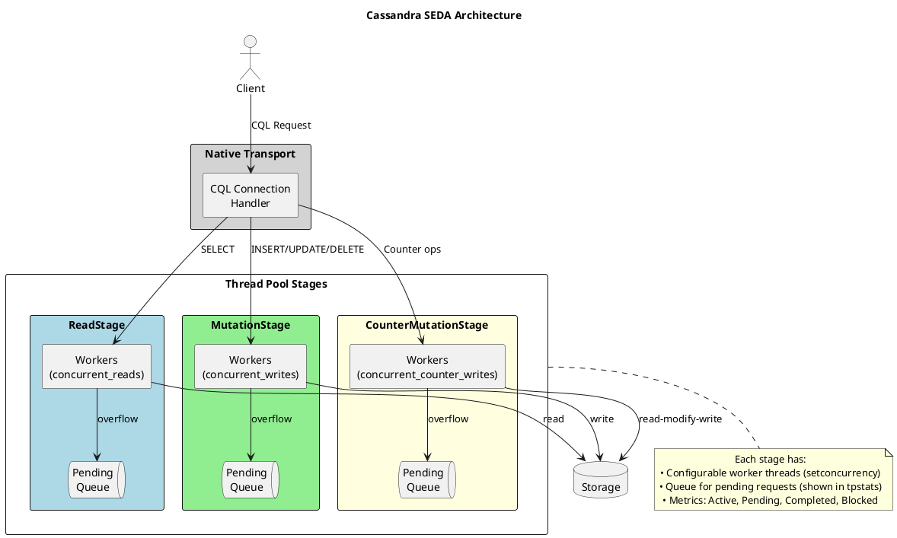

# nodetool setconcurrency

Sets the concurrency level (thread pool size) for a specific stage in Cassandra's SEDA architecture.

---

## Synopsis

```bash
nodetool [connection_options] setconcurrency <stage> <max>
nodetool [connection_options] setconcurrency <stage> <core> <max>
```
See [connection options](index.md#connection-options) for connection options.

## Description

`nodetool setconcurrency` modifies the thread pool configuration for a specific stage. This controls how Cassandra's thread pools handle incoming requests and directly impacts throughput, latency, and resource utilization.

The command accepts either one or two numeric arguments:
- **One argument (`<max>`)**: Sets the maximum pool size
- **Two arguments (`<core> <max>`)**: Sets both core and maximum pool sizes

### Understanding Cassandra's Threading Model (SEDA)

Cassandra uses a **Staged Event-Driven Architecture (SEDA)**, where different types of operations are handled by dedicated thread pools (stages). Each stage has:

- **A thread pool** with a configurable number of worker threads
- **A queue** for requests waiting to be processed
- **Metrics** for monitoring active, pending, and completed tasks



### Stage Names

The command accepts any valid stage name. Common stages include:

| Stage Name | Thread Pool | Default | Purpose |
|------------|-------------|---------|---------|
| `ReadStage` | ReadStage | 32 | Local read operations (single-partition and range queries) |
| `MutationStage` | MutationStage | 32 | Local write operations (inserts, updates, deletes) |
| `CounterMutationStage` | CounterMutationStage | 32 | Counter increment/decrement operations |
| `GossipStage` | GossipStage | 1 | Gossip protocol handling |
| `RequestResponseStage` | RequestResponseStage | varies | Inter-node request/response handling |
| `ViewMutationStage` | ViewMutationStage | 32 | Materialized view updates |
| `AntiEntropyStage` | AntiEntropyStage | 1 | Repair Merkle tree operations |

Use `nodetool tpstats` to see all available stages and their current statistics.

!!! warning "Non-Persistent Setting"
    This setting is applied at runtime only and does not persist across node restarts. After a restart, concurrency reverts to the settings in `cassandra.yaml`.

    To make changes permanent, update `cassandra.yaml`:

    ```yaml
    concurrent_reads: 32
    concurrent_writes: 32
    concurrent_counter_writes: 32
    ```

---

## Arguments

| Argument | Description |
|----------|-------------|
| `stage` | Stage name (e.g., `ReadStage`, `MutationStage`, `CounterMutationStage`) |
| `max` | Maximum pool size (number of threads) |
| `core` | (Optional) Core pool size. If omitted, only max is set. |

---

## Examples

### View Current Concurrency

```bash
nodetool tpstats
```

### Set Read Stage Maximum

```bash
nodetool setconcurrency ReadStage 64
```

### Set Write Stage Maximum

```bash
nodetool setconcurrency MutationStage 64
```

### Set Core and Maximum

```bash
# Set core=16, max=64 for ReadStage
nodetool setconcurrency ReadStage 16 64
```

### Set Counter Write Concurrency

```bash
nodetool setconcurrency CounterMutationStage 32
```

---

## When to Adjust Concurrency

### Scenario 1: Read Latency High with Pending Reads

**Symptoms:**
- `nodetool tpstats` shows pending tasks in ReadStage
- Read latencies increasing
- CPU not fully utilized

**Diagnosis:**
```bash
# Check for pending reads
nodetool tpstats | grep -E "Pool Name|ReadStage"
```

Example output showing a problem:
```
Pool Name                    Active   Pending      Completed   Blocked
ReadStage                        32       245        1523456         0
```

**Action:** Increase read concurrency:
```bash
nodetool setconcurrency ReadStage 64

# Verify
nodetool tpstats | grep ReadStage
```

### Scenario 2: Write Throughput Limited

**Symptoms:**
- Write operations queuing (pending in MutationStage)
- Disk I/O not saturated
- Application seeing write timeouts

**Diagnosis:**
```bash
nodetool tpstats | grep -E "Pool Name|MutationStage"
```

**Action:** Increase write concurrency:
```bash
nodetool setconcurrency MutationStage 64
```

### Scenario 3: CPU Saturation

**Symptoms:**
- CPU at 100% utilization
- High context switching
- Latencies spiking under load

**Diagnosis:**
```bash
# Check CPU
top -H -p $(pgrep -f CassandraDaemon)

# Check thread activity
nodetool tpstats
```

**Action:** Consider reducing concurrency if over-threaded:
```bash
# Too many threads can cause contention
nodetool setconcurrency ReadStage 24
nodetool setconcurrency MutationStage 24
```

### Scenario 4: High-Core-Count Servers

**Symptoms:**
- Server has 64+ CPU cores
- Default concurrency (32) underutilizes hardware
- Throughput plateaus despite available resources

**Action:** Scale concurrency with core count:
```bash
# For a 64-core server
nodetool setconcurrency ReadStage 64
nodetool setconcurrency MutationStage 64
```

### Scenario 5: Heavy Counter Workload

**Symptoms:**
- Counter operations are slow
- CounterMutationStage has pending tasks

**Diagnosis:**
```bash
nodetool tpstats | grep -E "Pool Name|CounterMutationStage"
```

**Action:**
```bash
nodetool setconcurrency CounterMutationStage 48
```

---

## Metrics to Monitor

### Thread Pool Statistics

The primary tool for monitoring concurrency is `nodetool tpstats`:

```bash
nodetool tpstats
```

**Key columns to watch:**

| Column | Meaning | Healthy Value |
|--------|---------|---------------|
| **Active** | Threads currently processing requests | < max concurrency |
| **Pending** | Requests waiting in queue | Should be 0 or very low |
| **Completed** | Total completed operations | Increasing over time |
| **Blocked** | Requests rejected due to full queue | Must be 0 |

### Interpreting tpstats Output

```
Pool Name                    Active   Pending      Completed   Blocked
ReadStage                        32       245        1523456         0
MutationStage                    28         0        2845123         0
CounterMutationStage              2         0          45123         0
```

**Analysis:**
- **ReadStage**: Active=32 (at max), Pending=245 (queuing) → Consider increasing read concurrency
- **MutationStage**: Active=28, Pending=0 → Healthy, no changes needed
- **CounterMutationStage**: Active=2, Pending=0 → Healthy, low counter activity

### Warning Signs

| Observation | Problem | Recommendation |
|-------------|---------|----------------|
| Pending > 0 consistently | Thread pool undersized | Increase concurrency |
| Blocked > 0 | Queue overflow, requests dropped | Increase concurrency urgently |
| Active = max, high latency | May need more threads or disk is bottleneck | Check disk I/O first |
| Active low, CPU high | Too many context switches | May need to decrease concurrency |

### Monitoring Script

```bash
#!/bin/bash
# monitor_concurrency.sh - Watch thread pool health

while true; do
    clear
    echo "=== $(date) ==="
    echo ""
    echo "--- Thread Pool Stats ---"
    nodetool tpstats | head -10
    echo ""
    echo "--- Thread Pool Stats ---"
    nodetool tpstats | head -20
    echo ""
    echo "--- CPU Usage ---"
    top -bn1 | head -5
    echo ""
    echo "--- Latencies ---"
    nodetool proxyhistograms | head -15
    sleep 10
done
```

### JMX Metrics

For detailed monitoring, key JMX metrics:

| Metric Path | Description |
|-------------|-------------|
| `org.apache.cassandra.metrics:type=ThreadPools,path=request,scope=ReadStage,name=ActiveTasks` | Active read threads |
| `org.apache.cassandra.metrics:type=ThreadPools,path=request,scope=ReadStage,name=PendingTasks` | Queued reads |
| `org.apache.cassandra.metrics:type=ThreadPools,path=request,scope=MutationStage,name=ActiveTasks` | Active write threads |
| `org.apache.cassandra.metrics:type=ThreadPools,path=request,scope=MutationStage,name=PendingTasks` | Queued writes |

---

## Impact on Cluster and Clients

### Increasing Concurrency

**Positive effects:**
- Higher throughput (more requests processed in parallel)
- Lower latencies (less time waiting in queue)
- Better utilization of multi-core CPUs

**Potential negative effects:**
- Increased memory usage (more threads = more stack space)
- Higher CPU contention if over-subscribed
- More pressure on disk I/O
- Potential for increased GC pressure

### Decreasing Concurrency

**Positive effects:**
- Lower memory footprint
- Reduced CPU contention
- More predictable latencies under overload

**Potential negative effects:**
- Lower throughput
- Requests queue up faster
- Risk of blocked requests if queue fills

### Client Impact

| Concurrency Change | Client Experience |
|--------------------|-------------------|
| Too low | Timeouts, slow responses, connection pool exhaustion |
| Optimal | Consistent low latencies, high throughput |
| Too high | May see latency spikes if resources over-subscribed |

---

## Recommended Values

### General Guidelines

| Server Type | CPU Cores | Recommended Read | Recommended Write |
|-------------|-----------|------------------|-------------------|
| Small (4-8 cores) | 4-8 | 16-32 | 16-32 |
| Medium (16-32 cores) | 16-32 | 32-64 | 32-64 |
| Large (64+ cores) | 64+ | 64-128 | 64-128 |

### Storage-Based Considerations

| Storage Type | Read Concurrency | Write Concurrency | Notes |
|--------------|------------------|-------------------|-------|
| HDD | 16-32 | 32-64 | Reads limited by seek time |
| SATA SSD | 32-64 | 32-64 | Balanced I/O |
| NVMe SSD | 64-128 | 64-128 | Can handle high parallelism |

### Formula Approach

A common starting point:

```
concurrent_reads = 16 × number_of_drives
concurrent_writes = 8 × number_of_cpu_cores
```

For example, with 8 cores and 4 SSDs:
- Read concurrency: 16 × 4 = 64
- Write concurrency: 8 × 8 = 64

!!! tip "Tuning Process"
    1. Start with defaults (32/32/32)
    2. Monitor `tpstats` for pending tasks
    3. If pending consistently > 0, increase by 50%
    4. Monitor CPU and memory impact
    5. Repeat until balanced

---

## Relationship to Other Settings

### Native Transport Requests

```yaml
# cassandra.yaml
native_transport_max_threads: 128  # Threads handling client connections
```

The native transport threads hand off work to the stage pools. If `native_transport_max_threads` is high but concurrency is low, requests will queue.

### Concurrent Compactors

```yaml
concurrent_compactors: 4  # Separate from read/write concurrency
```

Compaction has its own thread pool and doesn't compete with read/write concurrency settings.

### Memory Implications

Each thread requires stack space:

```
Memory per thread ≈ 256KB (default stack size)
64 threads ≈ 16MB stack space
128 threads ≈ 32MB stack space
```

High concurrency values increase overall heap pressure indirectly.

---

## Cluster-Wide Configuration

### Apply to All Nodes

```bash
#!/bin/bash
# set_concurrency_cluster.sh

READ_CONCURRENCY="${1:-32}"
WRITE_CONCURRENCY="${2:-32}"

# Get list of node IPs from local nodetool status
nodes=$(nodetool status | grep "^UN" | awk '{print $2}')

echo "Setting concurrency across cluster..."
echo "ReadStage: $READ_CONCURRENCY, MutationStage: $WRITE_CONCURRENCY"
echo ""

for node in $nodes; do
    echo "=== $node ==="
    ssh "$node" "nodetool setconcurrency ReadStage $READ_CONCURRENCY"
    ssh "$node" "nodetool setconcurrency MutationStage $WRITE_CONCURRENCY"
    ssh "$node" "nodetool tpstats | grep -E 'ReadStage|MutationStage'"
    echo ""
done
```

### Making Changes Permanent

```yaml
# cassandra.yaml
concurrent_reads: 64
concurrent_writes: 64
concurrent_counter_writes: 32
```

---

## Troubleshooting

### Pending Tasks Not Decreasing After Increase

```bash
# Check if disk is the bottleneck
iostat -x 1 5

# If disk is at 100% util, concurrency won't help
# Consider:
# - Faster storage
# - Better data model (fewer reads/writes)
# - More nodes
```

### High CPU After Increasing Concurrency

```bash
# Check for excessive context switching
vmstat 1 5

# If 'cs' (context switches) is very high, reduce concurrency
nodetool setconcurrency read 32
```

### Blocked Tasks Appearing

```bash
# Blocked means queue overflow - serious issue
nodetool tpstats | grep -E "Pool Name|Blocked"

# Immediate actions:
# 1. Increase concurrency
nodetool setconcurrency ReadStage 128

# 2. Check for resource bottlenecks
iostat -x 1 3
top -H

# 3. Consider if cluster is undersized
```

### Changes Not Taking Effect

```bash
# Verify change applied
nodetool tpstats | grep -E "ReadStage|MutationStage"

# Check logs for errors
tail -100 /var/log/cassandra/system.log | grep -i concurrency

# Try again
nodetool setconcurrency ReadStage 64
```

---

## Best Practices

!!! tip "Concurrency Guidelines"

    1. **Start conservative** - Begin with defaults, increase based on metrics
    2. **Monitor continuously** - Watch `tpstats` before and after changes
    3. **Balance resources** - Don't set concurrency higher than available CPU cores
    4. **Consider storage** - HDDs need lower concurrency than SSDs
    5. **Test under load** - Validate changes during realistic traffic
    6. **Make permanent** - Update `cassandra.yaml` after validating
    7. **Apply cluster-wide** - Keep settings consistent across nodes

!!! warning "Common Mistakes"

    - Setting concurrency very high without monitoring impact
    - Ignoring disk I/O when tuning (disk is often the bottleneck)
    - Different settings on different nodes (causes imbalanced load)
    - Forgetting to persist changes (lost on restart)
    - Not monitoring blocked tasks (indicates dropped requests)

---

## Related Commands

| Command | Relationship |
|---------|--------------|
| [tpstats](tpstats.md) | Monitor thread pool statistics and view current concurrency |
| [proxyhistograms](proxyhistograms.md) | View read/write latency distributions |
| [info](info.md) | General node information |