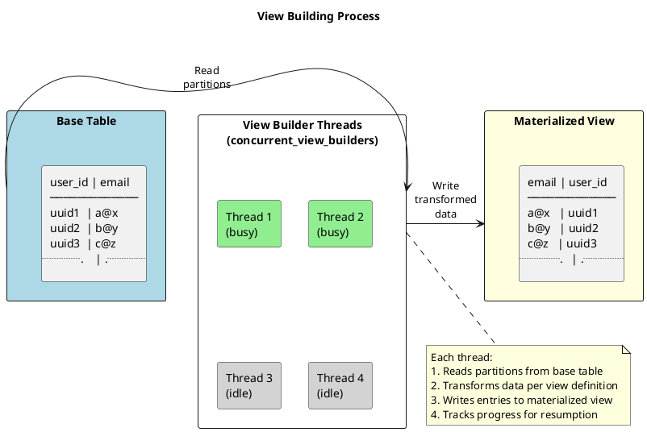

# nodetool setconcurrentviewbuilders

Sets the number of concurrent threads used for building materialized views.

---

## Synopsis

```bash
nodetool [connection_options] setconcurrentviewbuilders <value>
```
See [connection options](index.md#connection-options) for connection options.

## Description

`nodetool setconcurrentviewbuilders` controls how many threads are dedicated to building materialized views. When a materialized view is created or needs to be rebuilt, Cassandra populates it by reading data from the base table and writing corresponding entries to the view. This setting determines how many of these build operations can run in parallel.

### What Are Materialized Views?

Materialized views are automatically maintained copies of base table data, organized by a different primary key to support different query patterns. When data is written to the base table, Cassandra automatically updates all associated materialized views.

```cql
-- Base table
CREATE TABLE users (
    user_id uuid PRIMARY KEY,
    email text,
    country text,
    created_at timestamp
);

-- Materialized view to query users by email
CREATE MATERIALIZED VIEW users_by_email AS
    SELECT * FROM users
    WHERE email IS NOT NULL AND user_id IS NOT NULL
    PRIMARY KEY (email, user_id);

-- Materialized view to query users by country
CREATE MATERIALIZED VIEW users_by_country AS
    SELECT * FROM users
    WHERE country IS NOT NULL AND user_id IS NOT NULL
    PRIMARY KEY (country, user_id);
```

### When View Building Occurs

View building happens in these scenarios:

| Scenario | Description |
|----------|-------------|
| **New view creation** | When `CREATE MATERIALIZED VIEW` is executed, existing base table data must be copied to the view |
| **Node bootstrap** | When a new node joins, it builds local view data from streamed base table data |
| **View rebuild** | After corruption or manual truncation of view data |
| **Repair** | View data may be rebuilt during certain repair operations |

### How View Building Works



Each view builder thread:

1. Reads partitions from the base table
2. Transforms the data according to the view definition
3. Writes entries to the materialized view
4. Tracks progress for resumption if interrupted

!!! warning "Non-Persistent Setting"
    This setting is applied at runtime only and does not persist across node restarts. After a restart, the value reverts to the `concurrent_materialized_view_builders` setting in `cassandra.yaml` (default: 1).

    To make the change permanent, update `cassandra.yaml`:

    ```yaml
    concurrent_materialized_view_builders: 2
    ```

---

## Arguments

| Argument | Description |
|----------|-------------|
| `value` | Number of concurrent view builder threads (default: 1) |

---

## Examples

### View Current Setting

```bash
nodetool getconcurrentviewbuilders
```

### Set to 2 Concurrent Builders

```bash
nodetool setconcurrentviewbuilders 2
```

### Set to 4 for Faster Building

```bash
nodetool setconcurrentviewbuilders 4
```

---

## When to Adjust View Builders

### Scenario 1: Creating a New Materialized View on Large Table

**Situation:** Creating a view on a table with billions of rows—initial build will take a long time.

**Diagnosis:**
```bash
# Check current view build status
nodetool viewbuildstatus

# Check current setting
nodetool getconcurrentviewbuilders
```

**Action:** Increase builders to speed up initial population:
```bash
# Increase during view creation
nodetool setconcurrentviewbuilders 4

# Monitor progress
watch -n 30 'nodetool viewbuildstatus'

# After completion, restore default to conserve resources
nodetool setconcurrentviewbuilders 1
```

### Scenario 2: Multiple Views Being Built Simultaneously

**Situation:** Several materialized views are being created or rebuilt at the same time.

**Diagnosis:**
```bash
# Check how many views are building
nodetool viewbuildstatus
```

Example output:
```
Keyspace     View                  Status
myks         users_by_email        BUILDING (45%)
myks         users_by_country      BUILDING (23%)
myks         users_by_created      STARTED
```

**Action:** With multiple views building, more threads can help:
```bash
nodetool setconcurrentviewbuilders 4
```

### Scenario 3: View Build Impacting Production Traffic

**Situation:** View building is consuming too many resources, causing latency spikes.

**Diagnosis:**
```bash
# Check disk I/O
iostat -x 1 5

# Check latencies
nodetool proxyhistograms

# Check if view building is active
nodetool viewbuildstatus
```

**Action:** Reduce builders to minimize impact:
```bash
# Slow down view building
nodetool setconcurrentviewbuilders 1

# Or pause entirely during peak hours by setting to 0 (if supported)
```

### Scenario 4: Node Bootstrap Taking Too Long

**Situation:** New node is joining and building views is a bottleneck.

**Diagnosis:**
```bash
# On the new node
nodetool viewbuildstatus
nodetool netstats
```

**Action:** Increase builders to speed up bootstrap:
```bash
nodetool setconcurrentviewbuilders 4
```

### Scenario 5: Off-Peak Maintenance Window

**Situation:** Want to complete view builds quickly during a maintenance window.

**Action:**
```bash
# During maintenance window - maximize throughput
nodetool setconcurrentviewbuilders 8

# Monitor progress
nodetool viewbuildstatus

# After completion or before peak hours
nodetool setconcurrentviewbuilders 1
```

---

## Impact on Cluster Performance

### Resource Consumption

| Resource | Impact of More Builders |
|----------|------------------------|
| **CPU** | Higher utilization during builds |
| **Disk I/O** | More concurrent reads (base table) and writes (view) |
| **Memory** | More data buffered in memory |
| **Network** | Minimal (view building is local) |

### Trade-offs

| Setting | Build Speed | Production Impact | Use Case |
|---------|-------------|-------------------|----------|
| 1 (default) | Slow | Minimal | Normal operations |
| 2-4 | Moderate | Noticeable | Off-peak view creation |
| 4-8 | Fast | Significant | Maintenance windows |
| 8+ | Very fast | High | Emergency rebuilds |

### Monitoring During View Building

```bash
#!/bin/bash
# monitor_view_build.sh - Watch view build progress and impact

while true; do
    clear
    echo "=== $(date) ==="
    echo ""

    echo "--- View Build Status ---"
    nodetool viewbuildstatus
    echo ""

    echo "--- Current View Builders ---"
    nodetool getconcurrentviewbuilders
    echo ""

    echo "--- Disk I/O ---"
    iostat -x 1 1 | grep -E "Device|sd|nvme" | tail -2
    echo ""

    echo "--- Latencies ---"
    nodetool proxyhistograms | head -10

    sleep 30
done
```

---

## Metrics to Monitor

### View Build Progress

```bash
# Check status of all view builds
nodetool viewbuildstatus
```

Example output:
```
Keyspace     View                  Status
myks         users_by_email        BUILDING (78%)
myks         users_by_country      SUCCESS
myks         users_by_created      BUILDING (12%)
```

### Thread Pool Statistics

```bash
# View builder tasks appear in tpstats
nodetool tpstats | grep -i view
```

### Key Metrics

| Metric | How to Check | Concern Threshold |
|--------|--------------|-------------------|
| Build progress | `nodetool viewbuildstatus` | Stuck at same percentage |
| Disk I/O util | `iostat -x 1` | Sustained 100% |
| Read latency | `nodetool proxyhistograms` | P99 significantly elevated |
| Write latency | `nodetool proxyhistograms` | P99 significantly elevated |

---

## Recommended Values

### General Guidelines

| Scenario | Recommended Value | Notes |
|----------|-------------------|-------|
| Normal operations | 1 | Minimize impact on production |
| Small table view creation | 1-2 | Quick enough, low impact |
| Large table view creation | 2-4 | Balance speed and impact |
| Maintenance window | 4-8 | Maximize throughput |
| Multiple simultaneous views | 2-4 | Parallel progress |
| HDD storage | 1-2 | Limited by disk I/O |
| SSD/NVMe storage | 2-8 | Can handle more parallelism |

### Hardware Considerations

| Storage Type | CPU Cores | Suggested Max |
|--------------|-----------|---------------|
| HDD | Any | 2 |
| SATA SSD | 4-8 | 2-4 |
| SATA SSD | 16+ | 4-6 |
| NVMe SSD | 16+ | 4-8 |

---

## Materialized View Build Process Details

### Build Phases

1. **Initialization** - View metadata created, build job scheduled
2. **Scanning** - Base table partitions read sequentially
3. **Transformation** - Data transformed to view schema
4. **Writing** - View entries written to local SSTables
5. **Completion** - Build marked complete, view becomes queryable

### Progress Tracking

Build progress is tracked in `system.view_builds_in_progress`:

```cql
SELECT * FROM system.view_builds_in_progress;
```

### Resumption After Failure

If a node crashes during view building:

- Progress is checkpointed periodically
- On restart, build resumes from last checkpoint
- No need to restart from scratch

---

## Interaction with Other Settings

### Compaction

View building creates new SSTables, which may trigger compaction:

```yaml
# If view builds cause compaction storms, consider
compaction_throughput: 64MiB/s
```

### Concurrent Reads/Writes

View building uses the same read/write paths:

```yaml
concurrent_reads: 32   # View building reads from base table
concurrent_writes: 32  # View building writes to view
```

High view builder count can compete with production traffic for these thread pools.

### Memory

More builders mean more data in memory:

```yaml
# Ensure adequate heap for concurrent builds
-Xmx8G
```

---

## Cluster-Wide Configuration

### Apply to All Nodes

```bash
#!/bin/bash
# set_view_builders_cluster.sh

VALUE="${1:-1}"# Get list of node IPs from local nodetool status


nodes=$(nodetool status | grep "^UN" | awk '{print $2}')

echo "Setting concurrent view builders to $VALUE on all nodes..."

for node in $nodes; do
    echo -n "$node: "
    ssh "$node" "nodetool setconcurrentviewbuilders $VALUE \"
        && echo "set to $VALUE" \
        || echo "FAILED"
done

echo ""
echo "Verification:"
for node in $nodes; do
    echo -n "$node: "
    ssh "$node" "nodetool getconcurrentviewbuilders"
done
```

### Making Changes Permanent

```yaml
# cassandra.yaml
concurrent_materialized_view_builders: 2
```

---

## Troubleshooting

### View Build Stuck at Same Percentage

```bash
# Check if build is actually progressing
nodetool viewbuildstatus

# Check for errors in logs
grep -i "view\|materialized" /var/log/cassandra/system.log | tail -50

# Check for resource bottlenecks
iostat -x 1 3
nodetool tpstats
```

### View Build Very Slow

```bash
# Check current setting
nodetool getconcurrentviewbuilders

# Increase if resources available
nodetool setconcurrentviewbuilders 4

# Check disk is not bottleneck
iostat -x 1 5
```

### View Build Impacting Production

```bash
# Reduce builders immediately
nodetool setconcurrentviewbuilders 1

# Check latencies improving
nodetool proxyhistograms

# Consider scheduling builds during off-peak
```

### Build Failed or View Inconsistent

```bash
# Check view status
nodetool viewbuildstatus

# If needed, rebuild the view
# Warning: This is disruptive
ALTER MATERIALIZED VIEW myks.my_view WITH rebuild = true;
```

---

## Best Practices

!!! tip "View Builder Guidelines"

    1. **Start with default (1)** - Minimize production impact
    2. **Increase during off-peak** - Use maintenance windows for faster builds
    3. **Monitor progress** - Watch `viewbuildstatus` and disk I/O
    4. **Restore after completion** - Return to default when builds finish
    5. **Consider storage type** - SSDs can handle more parallelism than HDDs
    6. **Plan large view creations** - Schedule during low-traffic periods
    7. **Make permanent if needed** - Update `cassandra.yaml` for consistent behavior

!!! warning "Materialized View Caveats"

    Materialized views have significant operational overhead:

    - Every base table write triggers view updates
    - Views can become inconsistent and require repair
    - Large views take a long time to build
    - Views add latency to write operations

    Consider alternatives like secondary indexes or application-side denormalization for simpler use cases.

---

## Related Commands

| Command | Relationship |
|---------|--------------|
| [getconcurrentviewbuilders](getconcurrentviewbuilders.md) | View current setting |
| [viewbuildstatus](viewbuildstatus.md) | Check view build progress |
| [tpstats](tpstats.md) | Thread pool statistics |
| [compactionstats](compactionstats.md) | Monitor compaction from view builds |