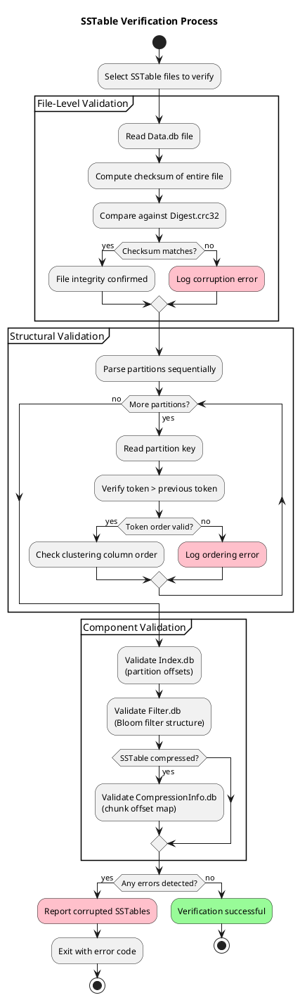

# nodetool verify

Verifies SSTable integrity without modifying data.

---

## Synopsis

```bash
nodetool [connection_options] verify [options] [--] [keyspace [table ...]]
```

## Description

`nodetool verify` performs a non-destructive check of SSTable integrity. Unlike `scrub`, verify only reads and validates—it never modifies data. Use verify to detect corruption before deciding whether to run scrub.

### How Verification Works

The verify command performs integrity checks by reading SSTable files and validating their internal consistency:

1. **Checksum Validation** - Each SSTable has an associated digest file (`*-Digest.crc32`) containing a checksum of the entire Data.db file. Verify reads the data file, computes a fresh checksum, and compares it against the stored digest. A mismatch indicates data corruption from disk errors, incomplete writes, or bit rot.

2. **Partition Key Ordering** - SSTables store partitions in sorted token order. Verify confirms that partition keys appear in strictly ascending token order. Out-of-order keys indicate structural corruption.

3. **Clustering Column Ordering** - Within each partition, rows must be sorted by clustering columns. Verify validates this ordering to detect intra-partition corruption.

4. **Index Consistency** - The SSTable index (`*-Index.db`) contains offsets to partition locations in the data file. Verify confirms that index entries point to valid partition boundaries and that all partitions are indexed.

5. **Bloom Filter Validation** - Checks that the Bloom filter file (`*-Filter.db`) is readable and structurally valid.

6. **Compression Metadata** - For compressed SSTables, validates the compression offset map (`*-CompressionInfo.db`) which maps logical offsets to compressed chunk locations.



### Checksum Architecture

Cassandra uses different checksum mechanisms depending on whether SSTables are compressed:

| SSTable Type | Checksum File | Checksum Scope | Read-Time Verification |
|--------------|---------------|----------------|------------------------|
| Uncompressed | `*-Digest.crc32` | Entire Data.db file | Per-file during verify |
| Compressed | `*-Digest.crc32` + `*-CompressionInfo.db` | Entire file + per-chunk metadata | Per-chunk during reads |

!!! info "Compression and Data Integrity"
    Compressed SSTables (the default) provide per-chunk verification during normal reads, controlled by the `crc_check_chance` table option (default 1.0 = 100%). This is Cassandra's primary defense against bit rot. The `nodetool verify` command performs a complete scan regardless of this setting.

---

## Arguments

| Argument | Description |
|----------|-------------|
| `keyspace` | Keyspace to verify. If omitted, verifies all keyspaces |
| `table` | Specific table(s) to verify |

---

## Options

| Option | Description |
|--------|-------------|
| `-e, --extended` | Extended verification (checks all components) |
| `-c, --check-version` | Check SSTable version compatibility |
| `-d, --dfp` | Invoke disk failure policy on failure |
| `-r, --rfrpfc` | Mutate repairedAt and pendingRepair |
| `-t, --check-tokens` | Verify tokens are within node's ranges |
| `-q, --quick` | Quick check (fewer validations) |

---

## What Verify Checks

### Standard Verification

- Partition key ordering
- Clustering column ordering
- SSTable file checksums
- Index consistency
- Bloom filter validity

### Extended Verification (`-e`)

- All data component files
- Compression metadata
- Statistics file integrity
- Summary file consistency
- TOC file completeness

---

## Examples

### Verify Specific Table

```bash
nodetool verify my_keyspace my_table
```

### Verify All Tables in Keyspace

```bash
nodetool verify my_keyspace
```

### Extended Verification

```bash
nodetool verify -e my_keyspace my_table
```

### Quick Verification

```bash
nodetool verify -q my_keyspace
```

### Verify with Token Range Check

```bash
nodetool verify -t my_keyspace my_table
```

---

## Output

### No Corruption Found

```
Completed verification of my_keyspace.my_table
```

### Corruption Detected

```
ERROR: Corrupted SSTable: /var/lib/cassandra/data/my_keyspace/my_table-abc123/nb-1-big-Data.db
  - Invalid partition key at position 12345
  - Checksum mismatch in Data.db
```

---

## When to Use

### Proactive Health Checks

```bash
# Regular integrity check (e.g., weekly)
nodetool verify my_keyspace
```

### After Disk Errors

```bash
# After seeing I/O errors in logs
nodetool verify
```

### Before Maintenance

```bash
# Verify before backup
nodetool verify my_keyspace
nodetool snapshot -t pre_backup my_keyspace
```

### After Unexpected Shutdown

```bash
# After crash or power loss
nodetool verify
```

---

## Verify vs. Scrub Decision Flow

| Verify Result | Action |
|---------------|--------|
| No errors | No action needed |
| Errors found | Run `nodetool scrub` to fix |
| Scrub fails | Run `nodetool scrub -s` (skips corrupted) |
| After scrub -s | Run `nodetool repair` to recover data |

---

## Performance Impact

!!! info "Read-Only Operation"
    Verify is read-only but still I/O intensive:

    - Reads all SSTable data files
    - Computes checksums
    - No writes or modifications
    - Lower impact than scrub

### Estimated Duration

| Table Size | Approximate Time |
|------------|------------------|
| 10 GB | 5-15 minutes |
| 100 GB | 30-90 minutes |
| 1 TB | 5-10 hours |

---

## Automation

### Scheduled Verification Script

```bash
#!/bin/bash
# verify_all.sh - Weekly verification

LOG="/var/log/cassandra/verify_$(date +%Y%m%d).log"

echo "Starting verification at $(date)" >> $LOG

for ks in $(nodetool tablestats | grep "Keyspace:" | awk '{print $2}'); do
    echo "Verifying $ks..." >> $LOG
    nodetool verify $ks >> $LOG 2>&1
done

echo "Completed at $(date)" >> $LOG

# Alert on errors
if grep -q "ERROR" $LOG; then
    echo "Verification errors found - check $LOG"
fi
```

---

## Common Issues

### "Not enough space"

Verify needs memory for checksums:

```bash
# Run on one table at a time
nodetool verify my_keyspace table1
nodetool verify my_keyspace table2
```

### Verification Takes Too Long

```bash
# Use quick mode for faster check
nodetool verify -q my_keyspace

# Or verify specific tables only
nodetool verify my_keyspace critical_table
```

---

## Best Practices

!!! tip "Verification Guidelines"
    1. **Run regularly** - Weekly or after incidents
    2. **Check before backup** - Ensure clean backups
    3. **Use extended mode periodically** - Thorough check
    4. **Monitor duration** - Baseline normal verification time
    5. **Act on findings** - Follow up with scrub if needed

---

## Related Commands

| Command | Relationship |
|---------|--------------|
| [scrub](scrub.md) | Fix corruption found by verify |
| [repair](repair.md) | Recover data after scrub with skip |
| [tablestats](tablestats.md) | Check table health metrics |
| [snapshot](snapshot.md) | Backup after successful verify |
