# Filesystem Selection for Cassandra

Filesystem choice significantly impacts Cassandra performance, particularly for commit log operations. This guide covers filesystem architectures, their interaction with Cassandra's I/O patterns, and recommendations based on workload characteristics.

---

## Filesystem Architecture Comparison

### ext4 Architecture

ext4 (fourth extended filesystem) is the default Linux filesystem, evolved from ext3 with significant architectural improvements for modern storage.

#### On-Disk Structure

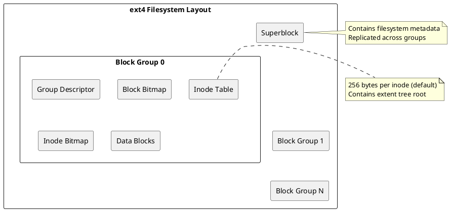

**Block groups**: ext4 divides the filesystem into fixed-size block groups (typically 128MB with 4K blocks). Each group contains:

- **Group descriptor**: Metadata about the group (free blocks, free inodes, checksums)
- **Block bitmap**: Tracks allocated/free blocks within the group
- **Inode bitmap**: Tracks allocated/free inodes within the group
- **Inode table**: Fixed-size array of inodes for files in this group
- **Data blocks**: Actual file content

#### Extent-Based Allocation

ext4 replaced ext3's indirect block mapping with extents, dramatically improving large file performance.

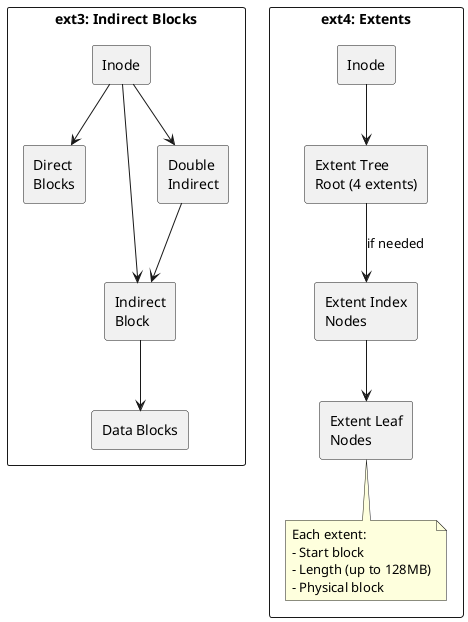

| Aspect | ext3 (Indirect Blocks) | ext4 (Extents) |
|--------|----------------------|----------------|
| **1GB file mapping** | ~256K block pointers | ~8 extents typical |
| **Sequential read** | Multiple metadata lookups | Single extent lookup |
| **Metadata overhead** | O(n) with file size | O(log n) with extent tree |
| **Maximum file size** | 2TB | 16TB (theoretical 1EB) |

**Extent structure** (12 bytes each):
```
struct ext4_extent {
    __le32 ee_block;      // First logical block
    __le16 ee_len;        // Number of blocks (max 32768 = 128MB)
    __le16 ee_start_hi;   // High 16 bits of physical block
    __le32 ee_start_lo;   // Low 32 bits of physical block
};
```

#### Journaling Subsystem

ext4's journal (jbd2) provides crash consistency through write-ahead logging.

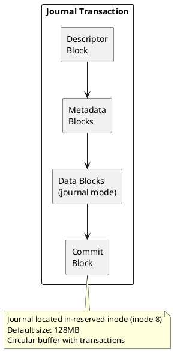

**Journal modes and write ordering:**

| Mode | Write Sequence | Crash Behavior |
|------|----------------|----------------|
| `journal` | Data → Journal, Metadata → Journal, Commit → Checkpoint | Data and metadata always consistent |
| `ordered` | Data → Disk, Metadata → Journal, Commit → Checkpoint | Data written before metadata; no stale data exposure |
| `writeback` | Metadata → Journal, Data → Disk (unordered) | Possible stale data exposure after crash |

```bash
# Check current journal mode
tune2fs -l /dev/sda1 | grep "Default mount options"

# Mount with writeback mode (higher performance, reduced consistency)
mount -o data=writeback /dev/sda1 /var/lib/cassandra/data

# Check journal size and location
dumpe2fs /dev/sda1 | grep -i journal
```

#### Delayed Allocation

ext4 delays block allocation until writeback, enabling smarter placement decisions.

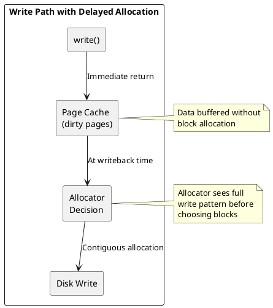

**Benefits for Cassandra:**

- SSTable flushes benefit from contiguous allocation
- Reduces fragmentation for sequential write workloads
- Improves extent coalescing for large files

### XFS Architecture

XFS is a high-performance 64-bit journaling filesystem designed for parallel I/O and extreme scalability.

#### Allocation Groups

XFS's defining feature is its division into independent allocation groups (AGs), enabling true parallel operations.

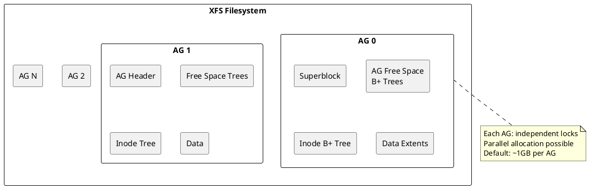

**Allocation group structure:**

| Component | Purpose | Structure |
|-----------|---------|-----------|
| **AG Superblock** | AG metadata, free space summary | Fixed location in each AG |
| **AG Free List** | Free block tracking | Two B+ trees (by block number, by size) |
| **Inode B+ Tree** | Inode allocation tracking | B+ tree indexed by inode number |
| **Free Inode B+ Tree** | Available inodes | B+ tree for fast inode allocation |

**Parallelism implications:**

```bash
# Check AG count and size
xfs_info /var/lib/cassandra/data

# Example output:
# meta-data=... agcount=16, agsize=65536000 blks
# Each AG can handle independent I/O operations
```

For Cassandra with multiple concurrent compactions and flushes, different operations can target different AGs simultaneously without lock contention.

#### B+ Tree Structures

XFS uses B+ trees extensively for metadata management, providing O(log n) operations even at massive scale.

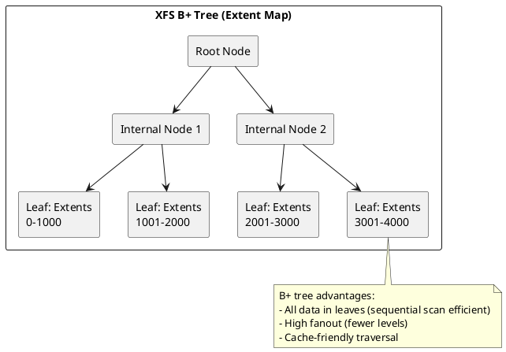

**B+ trees in XFS:**

| Tree | Purpose | Location |
|------|---------|----------|
| **Inode B+ tree** | Maps inode numbers to disk locations | Per-AG |
| **Free space by block** | Finds free space at specific location | Per-AG |
| **Free space by size** | Finds free space of specific size | Per-AG |
| **Extent map** | Maps file logical blocks to physical | Per-inode (data fork) |
| **Directory entries** | Maps names to inodes | Per-directory |

#### Delayed Allocation and Speculative Preallocation

XFS implements aggressive delayed allocation with speculative preallocation for streaming writes.

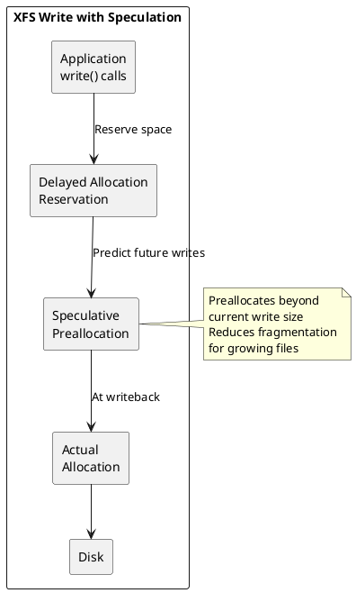

**Speculative preallocation behavior:**

| File Size | Preallocation | Rationale |
|-----------|---------------|-----------|
| < 64KB | 64KB | Small file optimization |
| 64KB - 1MB | 2x current size | Growing file pattern |
| > 1MB | Fixed increment | Prevent excessive preallocation |

For Cassandra SSTables that grow to hundreds of MB or GB, this results in large contiguous extents.

#### Log (Journal) Structure

XFS uses a metadata-only log with unique features for high performance.

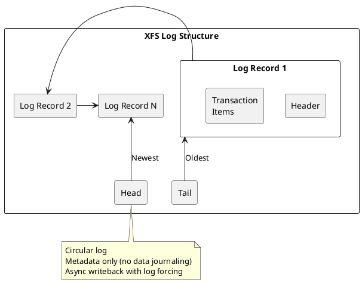

**Log configuration impact:**

```bash
# Standard formatting (recommended - uses optimal defaults)
mkfs.xfs -f /dev/sdb1

# Verify filesystem parameters
xfs_info /dev/sdb1
```

XFS automatically calculates optimal log size based on filesystem size. Manual tuning is rarely necessary for modern storage.

### ZFS Architecture

ZFS is a combined filesystem and volume manager with advanced features like checksumming, snapshots, and built-in RAID. While popular for general-purpose storage, it presents specific challenges for Cassandra workloads.

#### Core Architecture

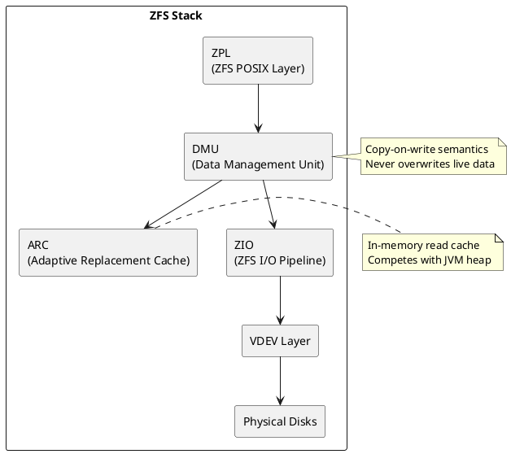

**Key architectural components:**

| Component | Function | Cassandra Impact |
|-----------|----------|------------------|
| **ZPL** | POSIX filesystem interface | Standard file operations |
| **DMU** | Object-based data management with CoW | Write amplification |
| **ARC** | Adaptive Replacement Cache (RAM) | Memory competition with JVM |
| **L2ARC** | SSD-based secondary cache | Additional I/O overhead |
| **ZIL** | ZFS Intent Log (write log) | Commit log latency |
| **SLOG** | Separate ZIL device | Can improve sync writes |

#### Copy-on-Write (CoW) and Write Amplification

ZFS never overwrites data in place. Every write creates new blocks, then updates metadata pointers.

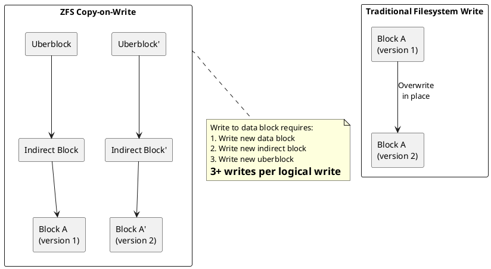

**Write amplification analysis:**

| Operation | Traditional FS | ZFS CoW |
|-----------|---------------|---------|
| **4KB write** | 1 write + journal | 3+ writes (data + metadata chain) |
| **SSTable write** | Sequential + metadata | CoW tree updates |
| **Compaction** | Read + write | Read + CoW writes + old block retention |

For Cassandra's write-heavy workloads, this CoW overhead compounds with Cassandra's own write amplification from compaction.

#### ZFS Intent Log (ZIL) and Sync Writes

The ZIL provides durability for synchronous writes, critical for Cassandra's commit log.

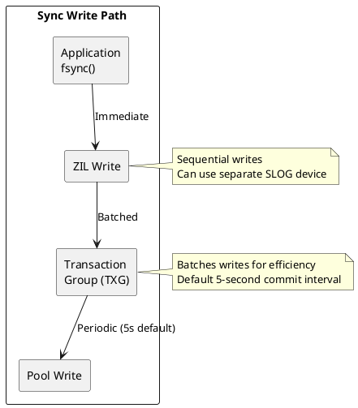

**ZIL considerations for Cassandra:**

| Configuration | Behavior | Recommendation |
|---------------|----------|----------------|
| **Default ZIL** | On pool disks | Adequate for most workloads |
| **SLOG (separate log device)** | Dedicated fast device for ZIL | Recommended if using ZFS for commit logs |
| **sync=disabled** | No synchronous writes | **Never use** - violates durability |

```bash
# Check ZIL configuration
zpool status -v

# Add SLOG device (mirror recommended)
zpool add tank log mirror /dev/nvme0n1 /dev/nvme1n1

# Check ZIL statistics
zpool iostat -v tank 1
```

#### ARC Memory Competition

ZFS's ARC (Adaptive Replacement Cache) uses RAM for caching, competing directly with Cassandra's JVM heap and OS page cache.

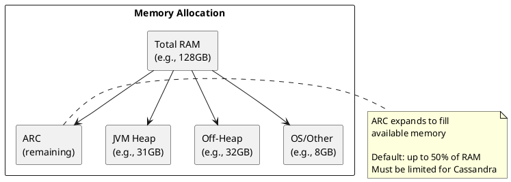

**Memory configuration:**

```bash
# Limit ARC size in /etc/modprobe.d/zfs.conf
options zfs zfs_arc_max=8589934592  # 8GB max

# Or dynamically
echo 8589934592 > /sys/module/zfs/parameters/zfs_arc_max

# Verify ARC usage
arc_summary  # or arcstat
```

**Memory planning for Cassandra on ZFS:**

| Component | Typical Allocation | Notes |
|-----------|-------------------|-------|
| **JVM Heap** | 8-31GB | Standard Cassandra sizing |
| **Off-Heap** | 50-100% of heap | Memtables, bloom filters, compression |
| **ARC** | 8-16GB max | Must limit explicitly |
| **OS/kernel** | 4-8GB | Page cache, kernel structures |

#### Checksumming and Data Integrity

ZFS provides end-to-end checksumming, detecting silent data corruption (bit rot).

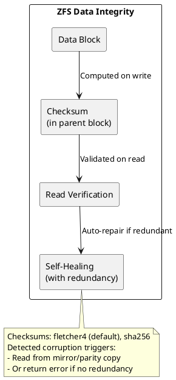

**Cassandra already provides checksums** at the SSTable level, making ZFS checksumming redundant for data files. However, ZFS checksums protect:

- Commit logs (Cassandra checksums optional)
- System files
- Any corruption in storage layer

#### ZFS for Cassandra: Challenges Summary

| Challenge | Impact | Mitigation |
|-----------|--------|------------|
| **Write amplification** | 2-3x more disk writes | Use SSDs, accept overhead |
| **CoW fragmentation** | Random read patterns over time | Regular scrub, accept degradation |
| **ARC memory** | Reduces memory for Cassandra | Limit ARC explicitly |
| **Sync write latency** | Commit log performance | Add SLOG device |
| **Snapshots retain blocks** | Disk space after compaction | Manage snapshot lifecycle |
| **Complexity** | Tuning required | Expertise needed |

#### When ZFS Might Make Sense

Despite the challenges, ZFS can be appropriate in specific scenarios:

**Potentially suitable:**

- **Development/test environments**: Snapshots enable rapid environment cloning
- **Operational simplicity priority**: Single storage stack with built-in features
- **Data integrity requirements**: Regulatory or compliance needs for checksumming
- **Existing ZFS infrastructure**: Team expertise and tooling already in place

**Not recommended:**

- **Performance-critical production**: Write amplification impacts throughput
- **Cost-sensitive deployments**: Requires more disk I/O capacity
- **Memory-constrained systems**: ARC competition with JVM

#### ZFS Tuning for Cassandra

If using ZFS, apply these optimizations:

```bash
# Create pool with appropriate settings
zpool create -o ashift=12 cassandra_pool mirror /dev/sda /dev/sdb

# Create dataset with Cassandra-optimized settings
zfs create -o recordsize=64K \
           -o compression=lz4 \
           -o atime=off \
           -o xattr=sa \
           -o primarycache=metadata \
           cassandra_pool/data

# For commit logs (if separate dataset)
zfs create -o recordsize=8K \
           -o compression=off \
           -o sync=standard \
           -o primarycache=metadata \
           cassandra_pool/commitlog
```

**Key tuning parameters:**

| Parameter | Data Directory | Commit Log | Rationale |
|-----------|---------------|------------|-----------|
| `recordsize` | 64K-128K | 8K | Match Cassandra I/O patterns |
| `compression` | lz4 | off | Data already compressed in SSTables |
| `atime` | off | off | Eliminate access time updates |
| `primarycache` | metadata | metadata | Let Cassandra manage data caching |
| `sync` | standard | standard | Maintain durability |
| `logbias` | throughput | latency | Optimize for workload type |

```bash
# Limit ARC (critical for Cassandra)
echo "options zfs zfs_arc_max=8589934592" >> /etc/modprobe.d/zfs.conf

# Tune transaction group timing
echo "options zfs zfs_txg_timeout=5" >> /etc/modprobe.d/zfs.conf

# Apply changes (requires reboot or module reload)
```

### ext3 (Legacy) - Why to Avoid

ext3 lacks architectural features critical for Cassandra performance.

**Fundamental limitations:**

| Aspect | ext3 Behavior | Impact on Cassandra |
|--------|---------------|---------------------|
| **Block mapping** | Indirect blocks (up to triple) | O(n) metadata overhead for large SSTables |
| **Allocation** | Immediate allocation | No optimization for write patterns |
| **Maximum extent** | N/A (block-based) | Every block tracked individually |
| **Directory scaling** | Linear search (without htree) | Slow with many SSTables |
| **Journal** | Full data journaling common | 2x write amplification |

**Migration path:**

```bash
# Check if filesystem is ext3
tune2fs -l /dev/sda1 | grep "Filesystem features"
# ext3: has_journal (no extents)
# ext4: has_journal extents

# Convert ext3 to ext4 (offline)
tune2fs -O extents,uninit_bg,dir_index /dev/sda1
e2fsck -fD /dev/sda1
```

### Architecture Comparison Summary

| Feature | ext4 | XFS | ZFS |
|---------|------|-----|-----|
| **Block groups / AGs** | Fixed 128MB groups | Configurable AGs (~1GB) | Variable record size |
| **Parallel allocation** | Limited | Excellent (per-AG) | Good (per-vdev) |
| **Extent size** | Max 128MB | Max 8EB | Variable blocks |
| **Write behavior** | In-place | In-place | Copy-on-write |
| **Journal** | Data + metadata modes | Metadata only | Intent log (ZIL) |
| **Delayed allocation** | Yes | Yes (aggressive) | Yes (TXG batching) |
| **Built-in checksums** | Metadata only | Metadata only | All data + metadata |
| **Snapshots** | No | No | Yes (instant, CoW) |
| **Online shrink** | Yes | No | No |
| **Maximum file size** | 16TB | 8EB | 16EB |
| **Maximum filesystem** | 1EB | 8EB | 256 ZB |
| **Memory overhead** | Minimal | Minimal | ARC cache (significant) |
| **Write amplification** | Low | Low | High (2-3x) |
| **Cassandra suitability** | Excellent | Excellent | Limited |

---

## Cassandra I/O Patterns

Understanding Cassandra's I/O behavior is essential for filesystem selection.

### Commit Log I/O

The commit log provides durability by persisting writes before acknowledgment.

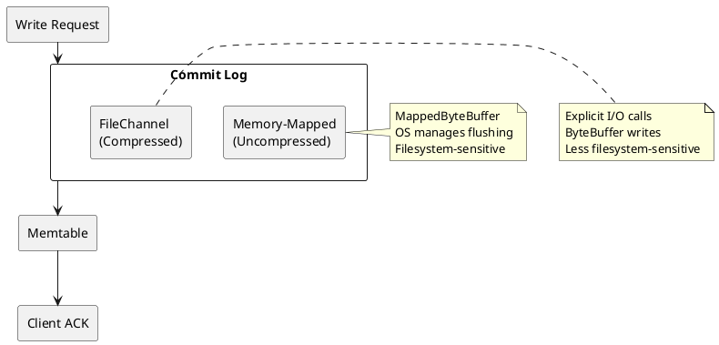

**I/O characteristics:**

| Mode | Implementation | Filesystem Interaction |
|------|----------------|----------------------|
| **Uncompressed** | `MappedByteBuffer` | Memory-mapped files; OS kernel manages page flushing; highly sensitive to filesystem I/O handling |
| **Compressed** | `FileChannel` + `ByteBuffer` | Explicit write calls; more predictable I/O pattern; less filesystem-dependent |

The difference in implementation explains why filesystem choice significantly impacts uncompressed commit log performance but has minimal effect on compressed workloads.

### Data Directory I/O

SSTable operations have different characteristics:

| Operation | I/O Pattern | Filesystem Impact |
|-----------|-------------|-------------------|
| **Memtable flush** | Large sequential writes | Extent allocation efficiency |
| **Compaction** | Sequential read + sequential write | Sustained throughput |
| **Read path** | Random reads (with caching) | Block allocation locality |

Data directory workloads benefit from XFS's large file handling and parallel I/O capabilities.

---

## Performance Characteristics

### Commit Log: ext4 vs XFS

Benchmark studies reveal significant performance differences for uncompressed commit logs, particularly on certain Linux distributions.

**Observed behavior (CentOS/RHEL):**

| Filesystem | Throughput | Mean Latency | Notes |
|------------|------------|--------------|-------|
| **ext4** | ~21k ops/sec | ~2ms | Superior MappedByteBuffer handling |
| **XFS** | ~14k ops/sec | ~4ms | Higher latency with memory-mapped I/O |

This represents approximately 50% throughput reduction and 2x latency increase for XFS with uncompressed commit logs on CentOS systems.

**Root cause analysis:**

The performance difference stems from how each filesystem handles memory-mapped file synchronization:

1. **ext4**: More efficient write coalescing and page cache management for mmap operations
2. **XFS**: Allocation group locking and extent management add overhead for frequent small mmap flushes

**Distribution variance:**

| Distribution | ext4 vs XFS Gap |
|--------------|-----------------|
| **CentOS/RHEL** | Significant (50%+ throughput difference) |
| **Ubuntu** | Minimal (kernel I/O path differences) |

The kernel version and distribution-specific patches affect filesystem behavior. Ubuntu's kernel includes different I/O scheduling and writeback tuning that reduces the performance gap.

### Commit Log Compression as Equalizer

Enabling commit log compression eliminates the filesystem performance gap:

| Configuration | ext4 | XFS |
|---------------|------|-----|
| **Uncompressed** | ~21k ops/sec | ~14k ops/sec |
| **Compressed** | ~24k ops/sec | ~24k ops/sec |

Compression switches from `MappedByteBuffer` to `FileChannel` I/O, which both filesystems handle similarly.

```yaml
# cassandra.yaml
commitlog_compression:
  - class_name: LZ4Compressor
```

### Data Directory Performance

For data directories, XFS generally provides advantages:

| Aspect | ext4 | XFS |
|--------|------|-----|
| **Large SSTable writes** | Good | Better (optimized extent allocation) |
| **Parallel compaction** | Good | Better (allocation groups) |
| **Many small files** | Better | Good |
| **File deletion** | Faster | Slower (extent cleanup) |

---

## Recommendations

### Decision Matrix

| Use Case | Recommended | Alternative | Avoid |
|----------|-------------|-------------|-------|
| **Data directories** | XFS | ext4 | ZFS (write amplification) |
| **Commit logs (uncompressed)** | ext4 | XFS (with commitlog compression enabled) | ZFS |
| **Commit logs (compressed)** | XFS or ext4 | - | ZFS |
| **Mixed (single mount)** | XFS (with commitlog compression) | ext4 | ZFS |
| **Dev/test with snapshots** | ZFS | XFS/ext4 + LVM | - |

!!! note "Commitlog Compression"
    "Commitlog compression" refers to Cassandra's built-in compression configured in `cassandra.yaml`, not filesystem-level compression. XFS does not support filesystem compression. Enabling commitlog compression switches Cassandra from `MappedByteBuffer` to `FileChannel` I/O, which performs equally well on both ext4 and XFS.

### Production Recommendations

**Preferred configuration (separate mounts):**

```
/dev/nvme0n1p1  /var/lib/cassandra/data         xfs   defaults,noatime  0 2
/dev/nvme1n1p1  /var/lib/cassandra/commitlog    ext4  defaults,noatime  0 2
```

With commit log compression enabled in `cassandra.yaml`.

!!! warning "ZFS in Production"
    ZFS is not recommended for production Cassandra deployments due to:

    - **Write amplification**: CoW semantics cause 2-3x write overhead
    - **Memory contention**: ARC competes with JVM heap
    - **Compaction interaction**: CoW + Cassandra compaction compounds write amplification

    If organizational requirements mandate ZFS, see the [ZFS Tuning](#zfs-tuning-for-cassandra) section for optimization guidance.

**Alternative (single filesystem):**

If using a single filesystem for both data and commit logs:

1. Use XFS for overall performance
2. Enable commit log compression to avoid MappedByteBuffer performance penalty

```yaml
# cassandra.yaml - required when using XFS for commit logs
commitlog_compression:
  - class_name: LZ4Compressor
```

### Filesystem by Distribution

| Distribution | Data Directory | Commit Log |
|--------------|----------------|------------|
| **RHEL/CentOS/Rocky** | XFS | ext4, or XFS with commitlog compression |
| **Ubuntu/Debian** | XFS | Either (minimal difference) |
| **Amazon Linux** | XFS | ext4, or XFS with commitlog compression |

---

## Mount Options

### XFS Mount Options

```bash
# /etc/fstab
/dev/sdb1 /var/lib/cassandra/data xfs defaults,noatime,nodiratime,allocsize=512m 0 2
```

| Option | Purpose |
|--------|---------|
| `noatime` | Disable access time updates; reduces write overhead |
| `nodiratime` | Disable directory access time updates |
| `allocsize=512m` | Larger allocation size for streaming writes (optional) |

### ext4 Mount Options

```bash
# /etc/fstab - balanced configuration
/dev/sdc1 /var/lib/cassandra/commitlog ext4 defaults,noatime,nodiratime 0 2

# /etc/fstab - maximum performance (reduced durability)
/dev/sdc1 /var/lib/cassandra/commitlog ext4 defaults,noatime,nodiratime,data=writeback,barrier=0 0 2
```

| Option | Purpose | Trade-off |
|--------|---------|-----------|
| `noatime` | Disable access time updates | None |
| `nodiratime` | Disable directory access time updates | None |
| `data=writeback` | Journal metadata only | Reduced durability on crash |
| `barrier=0` | Disable write barriers | Reduced durability; requires battery-backed cache |

!!! warning "Write Barriers"
    Disabling write barriers (`barrier=0`) should only be used with battery-backed RAID controllers or when commit log durability is handled at another layer. Data corruption is possible on power failure without hardware write caching protection.

### Verification

```bash
# Check mounted filesystem options
mount | grep cassandra

# Check XFS allocation groups
xfs_info /var/lib/cassandra/data

# Check ext4 features
tune2fs -l /dev/sdc1 | grep -E "features|Default mount"
```

---

## Formatting Recommendations

### XFS Formatting

```bash
# Standard formatting (recommended - uses optimal defaults)
mkfs.xfs -f /dev/sdb1

# Verify filesystem parameters
xfs_info /dev/sdb1
```

XFS automatically calculates optimal allocation group count and log size based on device characteristics. Manual tuning is rarely necessary for modern NVMe/SSD storage.

### ext4 Formatting

```bash
# Standard formatting
mkfs.ext4 /dev/sdc1

# Optimized (larger inode size, disable journaling for commit log if using replication)
mkfs.ext4 -I 512 /dev/sdc1
```

---

## Monitoring Filesystem Performance

### I/O Statistics

```bash
# Real-time I/O monitoring
iostat -xz 1

# Key metrics to watch
# - await: Average I/O wait time (ms)
# - %util: Device utilization
# - avgqu-sz: Average queue depth
```

### Filesystem-Specific Monitoring

```bash
# XFS fragmentation
xfs_db -c frag -r /dev/sdb1

# ext4 fragmentation
e4defrag -c /var/lib/cassandra/commitlog

# Check for extent fragmentation in large files
filefrag /var/lib/cassandra/data/keyspace/table-*/nb-*-big-Data.db
```

---

## Summary

| Recommendation | Rationale |
|----------------|-----------|
| Use XFS for data directories | Optimized for large files, parallel I/O, delayed allocation |
| Use ext4 for commit logs OR enable compression | ext4 has better MappedByteBuffer handling |
| Avoid ZFS for production | Write amplification and memory contention impact performance |
| Always use `noatime` | Eliminates unnecessary write overhead |
| Enable Cassandra commitlog compression if using XFS | Neutralizes MappedByteBuffer performance difference |
| Match filesystem choice to distribution | RHEL-based systems show larger ext4/XFS gaps |
| If ZFS required, limit ARC and tune recordsize | Minimize performance impact with proper configuration |

---

## Related Documentation

- [OS Tuning Overview](index.md) - Complete OS tuning guide
- [Commit Log Architecture](../../../architecture/storage-engine/commitlog.md) - Commit log internals
- [Hardware Recommendations](../hardware/index.md) - Storage hardware selection
- [SSTable Architecture](../../../architecture/storage-engine/sstables.md) - Data file structure
