# Repair Concepts

This page explains the fundamental concepts behind Cassandra repair operations, including how the repair process works internally, what triggers the need for repair, and the mechanisms Cassandra uses to detect and resolve data inconsistencies.

## What is Repair?

Repair is Cassandra's anti-entropy mechanism for synchronizing data across replica nodes. In a distributed system where writes may not reach all replicas (due to node failures, network partitions, or hint expiration), repair ensures that all replicas eventually contain identical data.

| | Node A | Node B | Node C |
|---|--------|--------|--------|
| **Before Repair** | Row 1: v1 | Row 1: v1 | Row 1: v1 |
| | Row 2: v2 | Row 2: v1 ⚠️ stale | Row 2: v2 |
| | Row 3: v3 | Row 3: v3 | Row 3: ❌ missing |
| **After Repair** | Row 1: v1 | Row 1: v1 | Row 1: v1 |
| | Row 2: v2 | Row 2: v2 ✓ | Row 2: v2 |
| | Row 3: v3 | Row 3: v3 | Row 3: v3 ✓ |

## Why Repair is Necessary

### Sources of Data Inconsistency

Data inconsistencies arise from several scenarios in distributed systems:

**Write Path Failures**

| Scenario | Description | Recovery Mechanism |
|----------|-------------|-------------------|
| Node unavailable during write | Write succeeds on available replicas only | Hinted handoff, read repair, anti-entropy repair |
| Network partition | Replicas in different partitions receive different writes | Anti-entropy repair |
| Coordinator timeout | Write acknowledged but some replicas slow | Read repair, anti-entropy repair |

**Recovery Limitations**

| Scenario | Description | Recovery Mechanism |
|----------|-------------|-------------------|
| Hints expired | Node was down longer than hint window (default 3 hours) | Anti-entropy repair only |

**Hint window configuration by version:**

| Version | Parameter | Default | Syntax |
|---------|-----------|---------|--------|
| 4.0 | `max_hint_window_in_ms` | `10800000` | Integer (milliseconds) |
| 4.1+ | `max_hint_window` | `3h` | Duration literal (`3h`, `180m`) |
| Hinted handoff disabled | Hints not stored for unavailable replicas | Anti-entropy repair only |

**Operational Events**

| Scenario | Description | Recovery Mechanism |
|----------|-------------|-------------------|
| New node bootstrap | Node joins but may not have all data | Streaming + repair |
| Node replacement | Replacement node needs data from replicas | Streaming + repair |

### The gc_grace_seconds Constraint

The most critical aspect of repair scheduling is the relationship with `gc_grace_seconds`. This parameter defines how long tombstones (deletion markers) are retained before garbage collection.

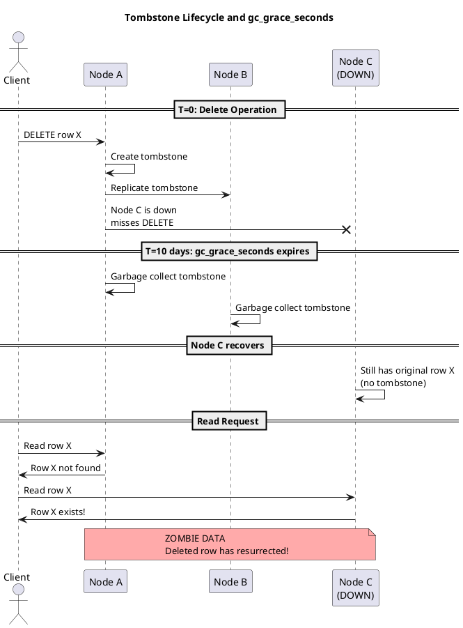

**Zombie data resurrection scenario:**

1. Data is deleted on Node A, creating a tombstone
2. Tombstone replicates to Node B
3. Node C is down and misses the delete
4. After `gc_grace_seconds`, the tombstone is garbage collected from A and B
5. Node C comes back online with the original (pre-delete) data
6. Without the tombstone, the deleted data "resurrects" during read repair

**Prevention:** Run repair on all nodes within `gc_grace_seconds` to ensure tombstones propagate before deletion.

## How Repair Works

### The Merkle Tree Process

Cassandra uses Merkle trees (hash trees) to efficiently detect differences between replicas without comparing every row.

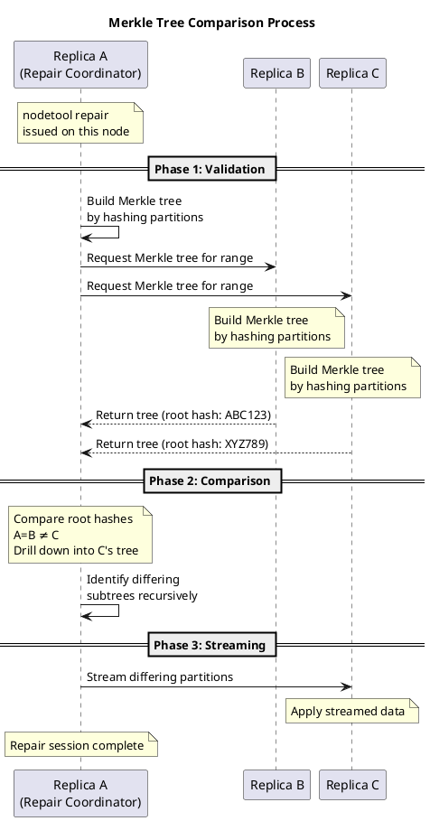

**Merkle tree segments:**

The token range being repaired is divided into segments, with each segment represented as a leaf node in the Merkle tree. By default, Cassandra creates approximately 32,768 (2^15) segments per repair session.

**Merkle tree configuration by version:**

| Version | Parameter | Default | Description |
|---------|-----------|---------|-------------|
| 4.0 | `repair_session_max_tree_depth` | `20` | Maximum depth of Merkle tree |
| 4.1+ | `repair_session_space` | `16MiB` | Memory limit for Merkle trees (replaces depth) |

**Streaming granularity:**

When a mismatch is detected, the entire segment is streamed—not individual rows. This means a single differing row causes the entire segment to be transferred:

| Table Size / Node | Segments | Min Stream Unit (1 segment) |
|-------------------|----------|----------------------------|
| 100 GB | 32,768 | ~3 MB |
| 500 GB | 32,768 | ~15 MB |
| 1 TB | 32,768 | ~30 MB |

For example, with a 500 GB table, if one row is inconsistent, the entire ~15 MB segment containing that row must be streamed. If inconsistencies are spread across many segments, streaming volumes increase proportionally.

**Merkle tree comparison and streaming:**

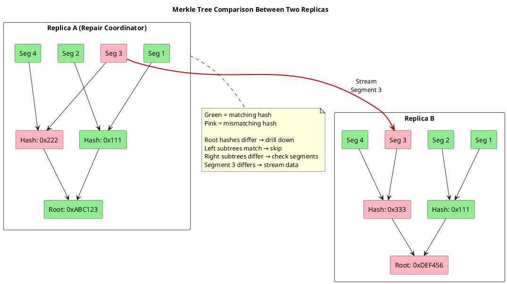

The comparison process:

1. Compare root hashes—if they match, replicas are identical (no streaming needed)
2. If root hashes differ, compare child hashes recursively
3. Drill down only into subtrees with mismatching hashes
4. At the leaf level, stream the entire segment for any mismatching hash

### Repair Session Lifecycle

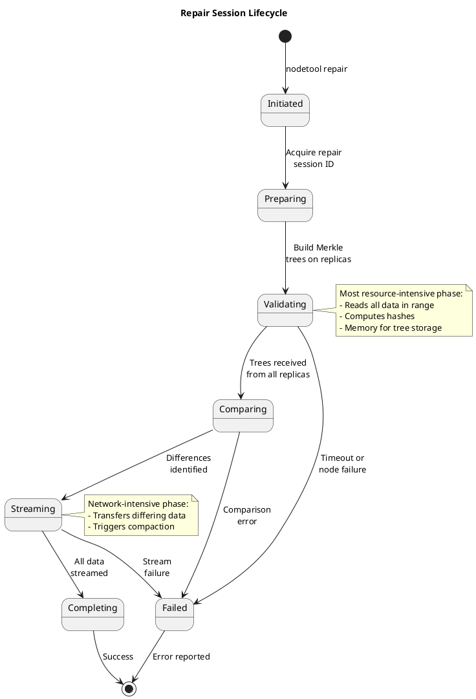

## Repair Types

### Full Repair

Full repair is the original repair mechanism in Cassandra. It compares all data in the specified token ranges across all replicas, regardless of whether the data has been previously repaired.

**How it works:**

1. The repair coordinator builds a Merkle tree from all SSTables in the repair range
2. Each replica builds its own Merkle tree from all its SSTables
3. Trees are compared to identify differences
4. Differing data is streamed between replicas to synchronize

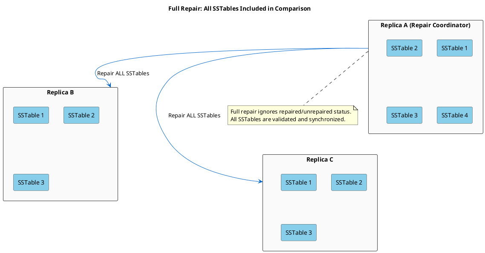

**Advantages:**

- Simple and reliable - no complex state tracking
- Guarantees complete consistency check across all data
- No risk of repaired/unrepaired state corruption
- Works correctly regardless of previous repair history
- Required after certain failure scenarios

**Disadvantages:**

- Re-validates already-consistent data unnecessarily
- Longer duration as data volume grows
- Higher resource consumption (CPU, memory, network, disk I/O)

**When to use full repair:**

- After node replacement or rebuild
- After recovering from data corruption
- When incremental repair state is suspect or corrupted
- Before major version upgrades
- As periodic validation (e.g., monthly) alongside incremental repairs

---

### Incremental Repair

Incremental repair was introduced in Cassandra 2.1 via [CASSANDRA-5351](https://issues.apache.org/jira/browse/CASSANDRA-5351) to address the scalability limitations of full repair. It tracks which SSTables have been previously repaired and only validates new (unrepaired) data.

**History and evolution:**

Incremental repair had a troubled history in early versions. While the concept was sound, the implementation suffered from numerous bugs that could lead to data inconsistency, silent corruption of the repaired/unrepaired state, and operational challenges. Many operators avoided incremental repair entirely in versions prior to 4.0, preferring the slower but more reliable full repair.

| Version | Status | Notes |
|---------|--------|-------|
| 2.1 | Introduced | Initial implementation; significant bugs and edge cases |
| 2.2 - 3.x | Problematic | Ongoing fixes but still unreliable for production use; many operators avoided it |
| 4.0+ | Production ready | Major rework; became default behavior; full repair requires `-full` flag |

**Recommendation:** For clusters running Cassandra 4.0 or later, incremental repair is the recommended approach for routine maintenance. For earlier versions, evaluate carefully and consider using full repair if stability is a concern.

**How it works:**

1. Each SSTable has a `repairedAt` metadata field (0 = unrepaired, timestamp = repaired)
2. During incremental repair, only SSTables with `repairedAt = 0` are included in Merkle tree generation
3. After successful repair, participating SSTables are marked with a `repairedAt` timestamp
4. Subsequent repairs skip already-repaired SSTables
5. Anti-compaction separates repaired and unrepaired data when SSTables contain both

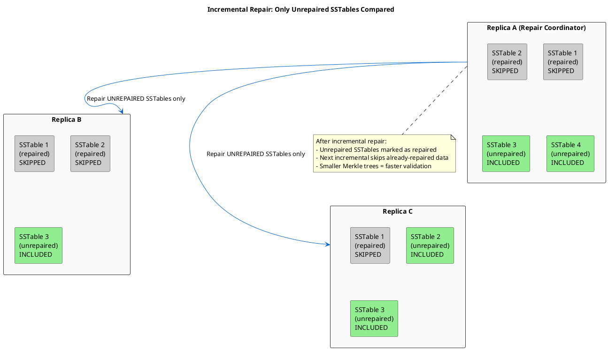

**Advantages:**

- Faster execution - only validates new data since last repair
- Lower resource consumption for routine maintenance
- Scales better with large datasets
- Enables more frequent repair cycles
- Reduces repair window, making it easier to complete within `gc_grace_seconds`

**Disadvantages:**

- Anti-compaction overhead after repair completion (see below)
- More complex operational model to understand and troubleshoot

**Anti-compaction considerations:**

After incremental repair completes, Cassandra runs anti-compaction to split SSTables that contain both repaired and unrepaired data. This process:

- Reads the SSTable and writes two new SSTables (one repaired, one unrepaired)
- Consumes disk I/O and temporary disk space (up to 2x the SSTable size during the split)
- Adds to compaction pending tasks
- Can delay the start of normal compaction work

Operational guidance:

- Monitor `CompactionManager` pending tasks during and after repair
- Ensure sufficient disk headroom (anti-compaction temporarily increases disk usage)
- On I/O-constrained systems, consider scheduling repairs during low-traffic periods
- The `nodetool compactionstats` command shows anti-compaction progress

**When to use incremental repair:**

- Routine scheduled maintenance (default choice for Cassandra 4.0+)
- Clusters with large data volumes where full repair is impractical
- When repair must complete within tight time windows

---

### Comparison Summary

| Aspect | Full Repair | Incremental Repair |
|--------|-------------|-------------------|
| Scope | All data in range | Only unrepaired SSTables |
| SSTable marking | Does not modify SSTable metadata | Marks SSTables with `repairedAt` timestamp |
| Duration | Longer (proportional to total data) | Shorter (proportional to new data) |
| Resource usage | Higher | Lower for routine runs |
| Complexity | Simple | Requires state tracking |
| Use case | Recovery, validation, periodic full check | Regular maintenance |
| Default (4.0+) | Must specify `-full` flag | Default behavior |

---

### Repaired vs Unrepaired SSTables

Incremental repair tracks repair state at the SSTable level:

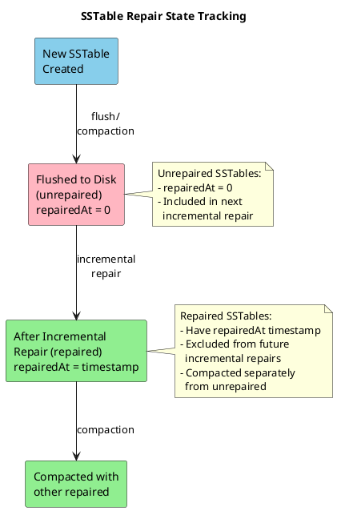

## Token Ranges and Repair Scope

### Understanding Token Ranges

Cassandra partitions data across nodes using a token ring. Each node is responsible for specific token ranges.

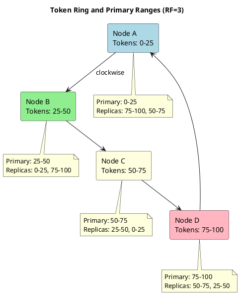

### Primary Range Repair (-pr)

The `-pr` flag limits repair to only the primary token ranges owned by the node:

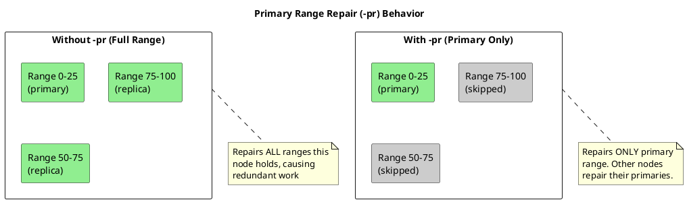

**Recommendation:** Always use `-pr` for routine maintenance. Running `-pr` on each node in sequence ensures every range is repaired exactly once.

## Repair Coordination

### Behavior Without Keyspace or Table Specification

When running repair without specifying tables, Cassandra iterates through all tables in the keyspace:

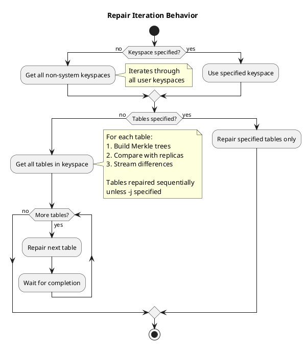

**Important considerations:**

- Tables are repaired sequentially by default
- Use `-j <threads>` to repair multiple tables in parallel
- Large tables dominate repair duration
- Consider repairing critical tables separately

## Anti-Compaction

After incremental repair, Cassandra performs anti-compaction to separate repaired and unrepaired data:

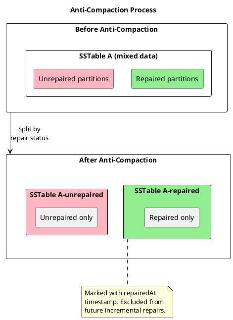

Anti-compaction ensures clean separation between repaired and unrepaired data, enabling efficient future incremental repairs.

## Paxos Repairs

While standard repairs reconcile user table data across replicas, **Paxos repairs** specifically reconcile the **Paxos state** used by **[lightweight transactions (LWTs)](../../cql/dml/lightweight-transactions.md)**. LWTs are statements that include `IF` conditions (such as `INSERT ... IF NOT EXISTS` or `UPDATE ... IF column = value`), which provide linearizable consistency guarantees.

Paxos repairs maintain LWT **linearizability** and correctness, especially across **topology changes** such as bootstrap, decommission, replace, and move operations.

### When Paxos Repairs Are Required

Paxos repairs are only relevant for **keyspaces that use LWTs**. For keyspaces that never use LWTs, Paxos state does not affect correctness, and operators **MAY** safely skip Paxos repairs for those keyspaces.

In Cassandra 4.1+, Paxos repairs run automatically every 5 minutes by default. Operators **SHOULD** ensure Paxos repairs run regularly on clusters where LWTs are in use. See [Paxos Repairs](strategies.md#paxos-repairs) in the Repair Strategies guide for operational details.

### Paxos Repairs and Topology Changes

In Cassandra 4.1 and later, a **Paxos repair gate** runs before certain topology changes complete (for example, node bootstrap). This gate ensures that Paxos state is consistent across all replicas for the affected token ranges before the topology change finalizes.

If Paxos repair cannot complete for the affected ranges and keyspaces—for example, because nodes are overloaded, have very large partitions, or some replicas are unavailable—the topology change **MUST** fail to avoid violating LWT correctness guarantees.

Operators **MAY** encounter errors such as `PaxosCleanupException` with message `CANCELLED` when overloaded replicas cannot finish Paxos cleanup within the allowed time. This typically indicates that the cluster is under too much load or that specific partitions are too large for Paxos cleanup to complete successfully.

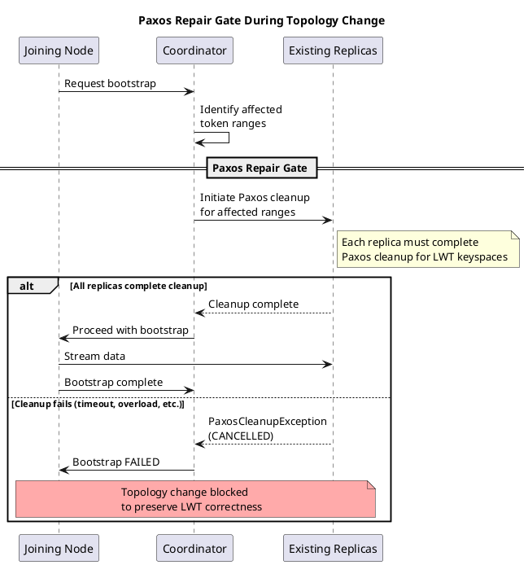

### Paxos v2

Cassandra 4.1+ introduces **Paxos v2**, an updated Paxos implementation for lightweight transactions. Paxos v2 provides several improvements:

- **Reduced network round-trips** for LWT reads and writes
- **Improved behavior under contention** when multiple clients compete for the same partition
- **Works in conjunction with regular Paxos repairs** and Paxos state purging

Paxos v2 is selected via the `paxos_variant` setting in `cassandra.yaml` (values: `v1` or `v2`).

To safely take full advantage of Paxos v2, operators **MUST** ensure:

1. **Regular Paxos repairs** are running on all nodes
2. **Paxos state purging** is configured appropriately (see [Paxos-related cassandra.yaml configuration](strategies.md#paxos-related-cassandrayaml-configuration) in the Repair Strategies guide)

Detailed configuration options and upgrade guidance are covered in the [Repair Strategies](strategies.md) documentation.

## Next Steps

- **[Options Reference](options-reference.md)** - Detailed explanation of all repair options
- **[Repair Strategies](strategies.md)** - Real-world implementation scenarios
- **[Scheduling Guide](scheduling.md)** - Planning repair schedules within gc_grace_seconds