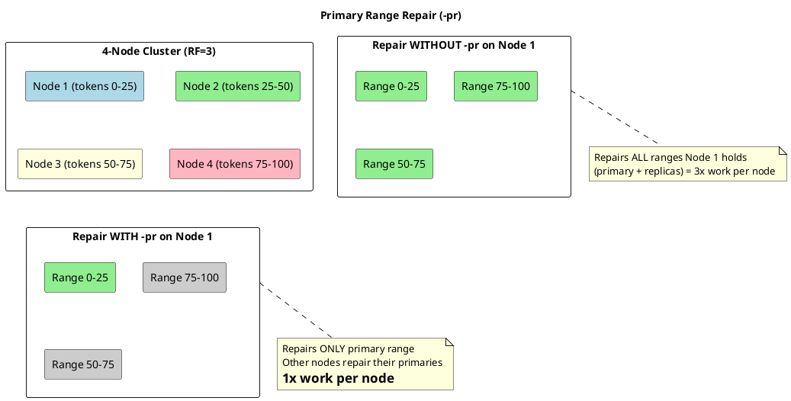
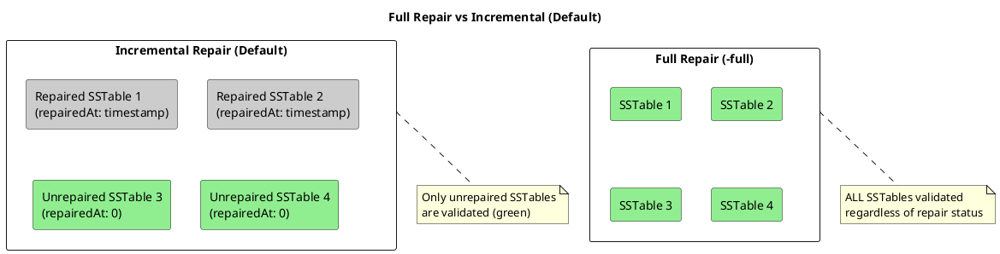
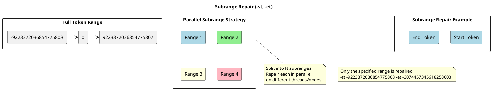
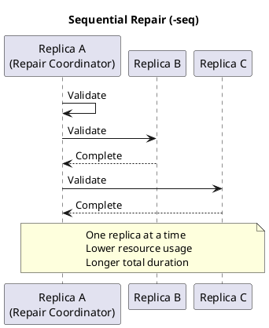
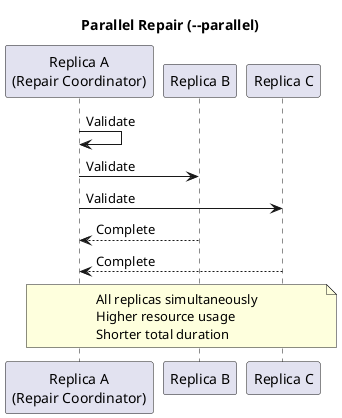
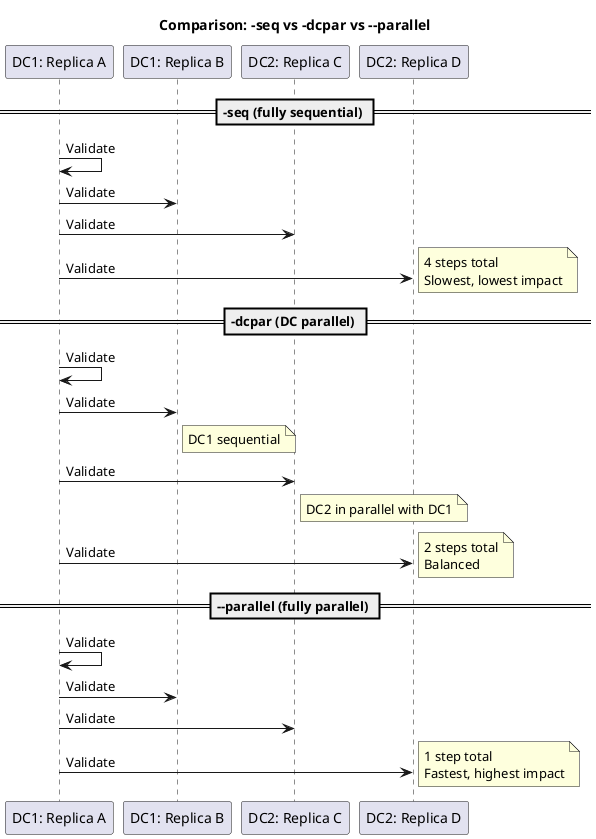
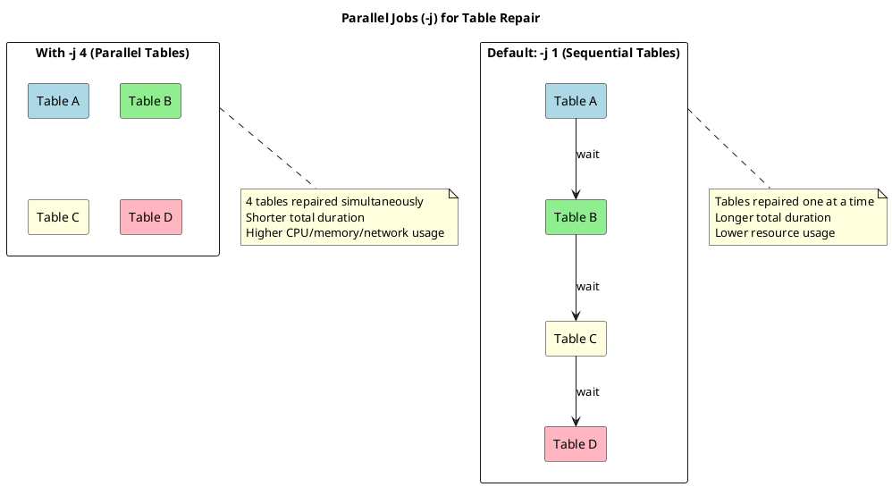
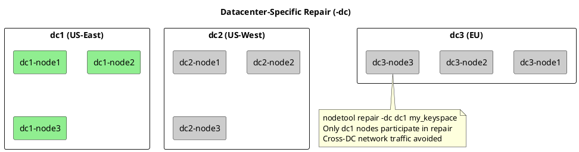
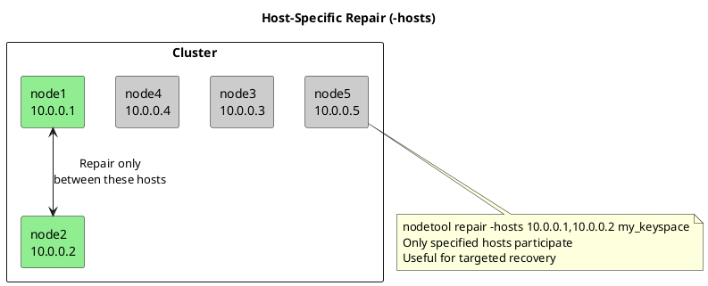
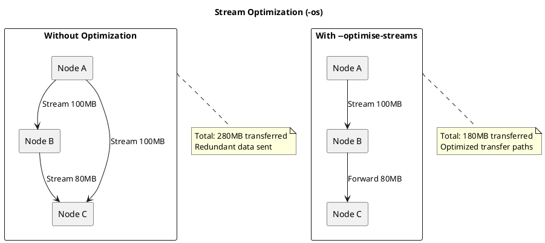

# Repair Options Reference

This page provides detailed explanations of all repair command options, including visual diagrams showing how each option affects repair behavior.

## Command Syntax

```bash
nodetool repair [options] [keyspace [table ...]]
```

## Scope Options

### -pr, --partitioner-range (Primary Range)

Repairs only the token ranges for which this node is the primary owner.



**Usage:**
```bash
# Recommended for routine maintenance
nodetool repair -pr my_keyspace
```

**When to use:**
- Regular scheduled repairs
- Running repair on every node in sequence
- Minimizing redundant work

**When NOT to use:**
- Single-node recovery scenarios
- Verifying specific replica consistency

### -full (Full Repair)

Forces full repair instead of incremental repair, validating all data regardless of repair status.



**Usage:**
```bash
# Full repair of all data
nodetool repair -full my_keyspace

# Combine with -pr for full primary-range repair
nodetool repair -full -pr my_keyspace
```

**When to use:**
- After node replacement or rebuild
- After data corruption recovery
- When incremental repair state is suspect
- Before major version upgrades

### -st, -et (Subrange Repair)

Repairs only a specific token range, enabling parallel repair operations or targeted recovery.



**Usage:**
```bash
# Repair specific token range
nodetool repair -st -9223372036854775808 -et -3074457345618258603 my_keyspace

# Get token ranges for a node
nodetool describering my_keyspace
```

**Use cases:**
- Parallel repair across multiple sessions
- Targeted repair of specific token ranges
- Recovery of specific data segments

---

## Parallelism Options

### --parallel vs -seq, --sequential

Controls whether replicas validate data simultaneously or one at a time. Parallel is the default in Cassandra 4.0+.





**Usage:**
```bash
# Sequential (lower impact, slower)
nodetool repair -pr -seq my_keyspace

# Parallel (faster, higher resource usage)
nodetool repair -pr --parallel my_keyspace
```

| Aspect | Sequential (`-seq`) | Parallel (`--parallel`) |
|--------|------------|----------|
| Default (4.0+) | No | Yes |
| Duration | Longer | Shorter |
| Resource usage | Lower | Higher |
| Network impact | Distributed over time | Concentrated |
| Production safety | Higher | Lower |
| Recommended for | Production hours | Off-peak maintenance |

### -dcpar, --dc-parallel

A middle ground between fully sequential and fully parallel repair.

**The problem `-dcpar` solves:**

- `-seq` (sequential): Safe but slow—only one replica builds its Merkle tree at a time across the entire cluster
- `--parallel`: Fast but resource-intensive—all replicas build Merkle trees simultaneously, which can overwhelm nodes if many ranges are repairing at once
- `-dcpar`: Balances both—allows parallelism across datacenters while limiting load within each datacenter

**How it works:**

During Merkle tree validation, each replica must read its data to build the tree. This is I/O and CPU intensive. With `-dcpar`:

1. Within each datacenter, only one replica validates at a time (sequential)
2. Across datacenters, validation happens in parallel

This means if a token range has replicas in DC1 and DC2, both datacenters can validate simultaneously, but each DC only has one replica active at a time.

**Example: 2 DCs, RF=2 per DC (4 replicas total for each range)**



| Option | Replicas validating simultaneously | Use case |
|--------|-----------------------------------|----------|
| `-seq` | 1 | Minimize impact during peak hours |
| `-dcpar` | 1 per DC | Balance speed and safety in multi-DC clusters |
| `--parallel` | All | Fastest repair during maintenance windows |

**Usage:**
```bash
nodetool repair -pr -dcpar my_keyspace
```

### -j, --jobs (Parallel Table Repair)

Controls how many tables are repaired simultaneously on the node.



**Usage:**
```bash
# Repair 2 tables in parallel
nodetool repair -pr -j 2 my_keyspace

# Repair 4 tables in parallel
nodetool repair -pr -j 4 my_keyspace
```

**Guidelines for -j value:**

| Factor | Lower -j (1-2) | Higher -j (4+) |
|--------|----------------|----------------|
| CPU cores | < 8 cores | 16+ cores |
| Memory | < 16 GB heap | 32+ GB heap |
| Disk I/O | HDD or saturated | Fast SSD with headroom |
| Network | Limited bandwidth | High bandwidth |
| Table count | Few large tables | Many small tables |

**Memory impact:**
```
Memory per repair session ≈ repair_session_space_in_mb × number of concurrent tables
With -j 4 and 256 MB per session = ~1 GB additional memory
```

---

## Scope Limiting Options

### -dc, --in-dc (Single Datacenter)

Restricts repair to nodes within a specific datacenter.



**Usage:**
```bash
# Repair only within dc1
nodetool repair -pr -dc dc1 my_keyspace
```

**Use cases:**
- Minimize cross-datacenter network traffic
- Repair after DC-specific outage
- Staged rollout of repairs

### -local, --in-local-dc

Repairs only with replicas in the same datacenter as the coordinator node.

```bash
# Repair within local DC only (run from node in target DC)
nodetool repair -pr -local my_keyspace
```

### -hosts, --in-hosts

Limits repair to specific hosts, useful for targeted recovery.



**Usage:**
```bash
# Repair only between specific nodes
nodetool repair -pr -hosts 10.0.0.1,10.0.0.2,10.0.0.3 my_keyspace
```

---

## Operational Options

### --preview

Estimates repair work without executing, useful for planning.

```bash
nodetool repair -pr --preview my_keyspace
```

**Output example:**
```
Previewing repair for keyspace my_keyspace
  Ranges to repair: 256
  Estimated data to stream: 12.5 GiB
  Mismatched ranges: 12 (4.7%)
  Estimated duration: 45 minutes
```

### --trace

Enables detailed tracing for repair sessions, useful for debugging.

```bash
nodetool repair -pr --trace my_keyspace
```

Trace output appears in `system_traces` keyspace and system logs.

### -os, --optimise-streams (Cassandra 4.0+)

Optimizes streaming by calculating minimal data transfer paths.



**Usage:**
```bash
nodetool repair -pr -os my_keyspace
```

### --force

Proceeds with repair even if some replicas are unavailable. **Use with caution.**

```bash
# Force repair with unavailable replicas
nodetool repair -pr --force my_keyspace
```

**Warning:** This can lead to inconsistent repair state. Only use when:
- A replica is permanently gone and being replaced
- Repair must proceed despite temporary unavailability
- Understanding that full consistency is not guaranteed

### --ignore-unreplicated-keyspaces

Skips keyspaces with replication factor of 1.

```bash
nodetool repair --ignore-unreplicated-keyspaces
```

---

## Option Combinations

### Recommended Combinations

| Scenario | Command | Description |
|----------|---------|-------------|
| Daily maintenance | `nodetool repair -pr my_keyspace` | Incremental, primary range only |
| Weekly full check | `nodetool repair -pr -full my_keyspace` | Full repair, primary range |
| Fast maintenance | `nodetool repair -pr --parallel -j 2 my_keyspace` | Parallel with 2 table threads |
| Conservative repair | `nodetool repair -pr -seq my_keyspace` | Sequential, minimal impact |
| Multi-DC cluster | `nodetool repair -pr -dcpar my_keyspace` | DC-parallel mode |
| Single DC repair | `nodetool repair -pr -dc dc1 my_keyspace` | Limit to specific DC |
| After node recovery | `nodetool repair -full my_keyspace` | Full repair, all ranges |

### Options Compatibility Matrix

| Option | -pr | -full | -seq | --parallel | -j | -dc | --paxos-only | --skip-paxos |
|--------|-----|-------|------|------------|-----|-----|--------------|--------------|
| -pr | - | ✓ | ✓ | ✓ | ✓ | ✓ | ✗ | ✓ |
| -full | ✓ | - | ✓ | ✓ | ✓ | ✓ | ✗ | ✓ |
| -seq | ✓ | ✓ | - | ✗ | ✓ | ✓ | ✗ | ✓ |
| --parallel | ✓ | ✓ | ✗ | - | ✓ | ✓ | ✗ | ✓ |
| -j | ✓ | ✓ | ✓ | ✓ | - | ✓ | ✗ | ✓ |
| -dc | ✓ | ✓ | ✓ | ✓ | ✓ | - | ✗ | ✓ |
| --paxos-only | ✗ | ✗ | ✗ | ✗ | ✗ | ✗ | - | ✗ |
| --skip-paxos | ✓ | ✓ | ✓ | ✓ | ✓ | ✓ | ✗ | - |

---

## Paxos Repair Options

### --paxos-only

Repairs only the Paxos state used by [lightweight transactions (LWTs)](../../cql/dml/lightweight-transactions.md), without repairing user table data.

```bash
# Repair Paxos state for all keyspaces
nodetool repair --paxos-only

# Repair Paxos state for a specific keyspace
nodetool repair --paxos-only my_keyspace
```

**How it works:**

Paxos repairs synchronize the Paxos commit log entries stored in `system.paxos` across replicas. This ensures that all nodes agree on the outcome of previous LWT operations, which is essential for maintaining linearizability guarantees.

**When to use:**

- **Pre-4.1 clusters**: Operators **MUST** schedule `--paxos-only` repairs manually (typically hourly) since automatic Paxos repairs are not available
- **Before topology changes**: Run on all nodes before bootstrap, decommission, replace, or move operations to reduce the risk of Paxos cleanup timeouts
- **After disabling automatic Paxos repairs**: If `paxos_repair_enabled` is set to `false`, manual Paxos repairs **MUST** be scheduled regularly for clusters using LWTs
- **Troubleshooting LWT issues**: When LWTs are timing out or behaving unexpectedly

**Automatic Paxos repairs (Cassandra 4.1+):**

In Cassandra 4.1 and later, Paxos repairs run automatically every 5 minutes by default when `paxos_repair_enabled` is `true`. Manual `--paxos-only` repairs are typically only needed for:

- Pre-4.1 clusters
- Clusters where automatic Paxos repairs have been disabled
- Proactive cleanup before topology changes

**Operational guidance:**

- Running without a keyspace argument repairs Paxos state for **all keyspaces**. This is often **RECOMMENDED** because operators frequently do not know which keyspaces developers are using for LWTs.
- Paxos repairs are lightweight compared to full data repairs and complete quickly

For more details on Paxos repair strategy and configuration, see [Paxos Repairs](strategies.md#paxos-repairs) in the Repair Strategies guide.

### --skip-paxos

Skips the Paxos repair step during regular repairs, allowing data repair to proceed without checking Paxos state consistency.

```bash
# Skip Paxos repair, repair table data only
nodetool repair --skip-paxos my_keyspace
```

**How it relates to `--paxos-only`:**

| Option | Table Data | Paxos State |
|--------|------------|-------------|
| (no flag) | ✓ Repaired | ✓ Repaired |
| `--paxos-only` | ✗ Skipped | ✓ Repaired |
| `--skip-paxos` | ✓ Repaired | ✗ Skipped |

**When to use:**

- **Emergency topology changes**: When Paxos cleanup is failing (timing out, `CANCELLED`) during bootstrap/decommission, you **MAY** skip Paxos repair temporarily to allow the topology change to proceed
- **Pre-4.1 clusters with manual Paxos repair**: If running separate `--paxos-only` repairs on a schedule, you **MAY** skip Paxos during regular data repairs to avoid redundant work
- **Troubleshooting**: To isolate whether issues are data-related or Paxos-related

**Important caveat:**

If you use `--skip-paxos`, Paxos state **MUST** be reconciled separately via `--paxos-only` repairs. Skipping Paxos repair without a replacement schedule **WILL** lead to LWT inconsistencies.

```bash
# Data repair only, skip Paxos (use when Paxos repairs are failing)
nodetool repair --skip-paxos my_keyspace

# Then run Paxos repairs separately once cluster is healthy
nodetool repair --paxos-only my_keyspace
```

## Next Steps

- **[Repair Concepts](concepts.md)** - Understanding how repair works
- **[Repair Strategies](strategies.md)** - Real-world implementation scenarios
- **[Scheduling Guide](scheduling.md)** - Planning repair schedules
