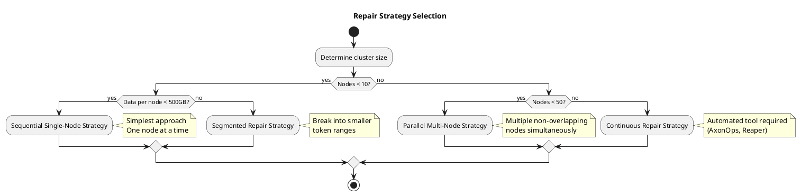
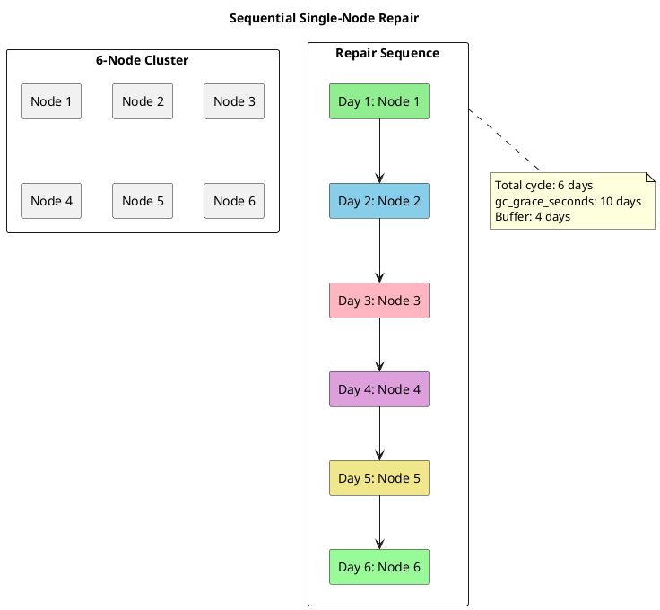
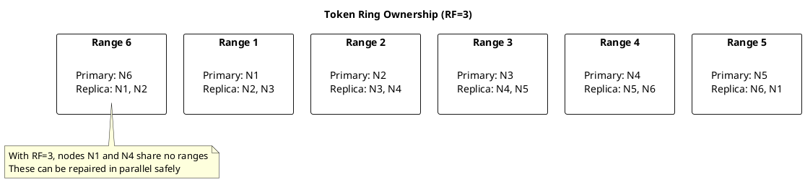
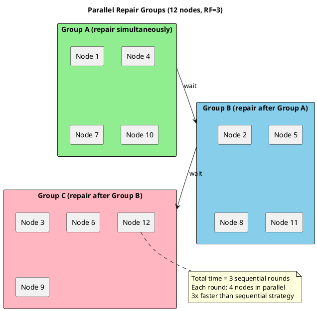
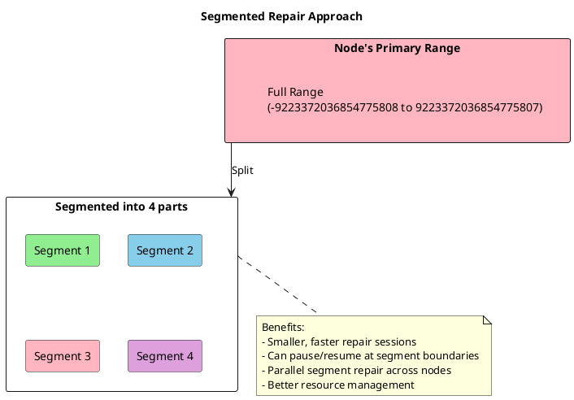
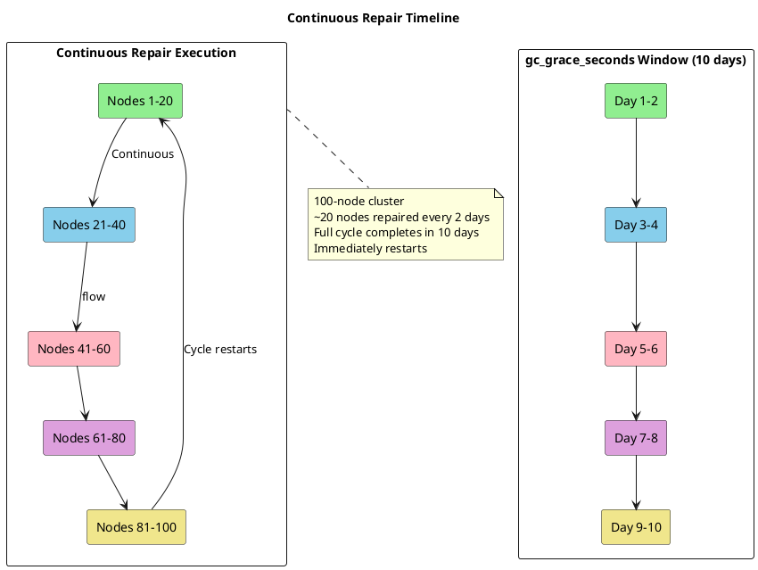
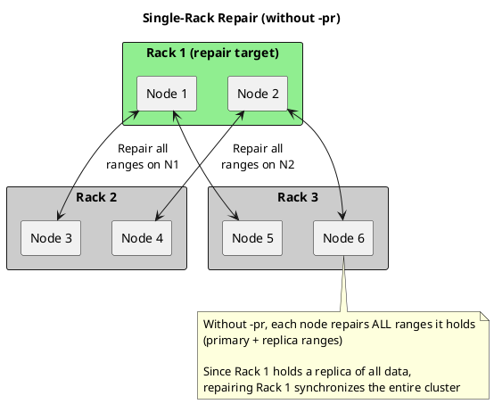
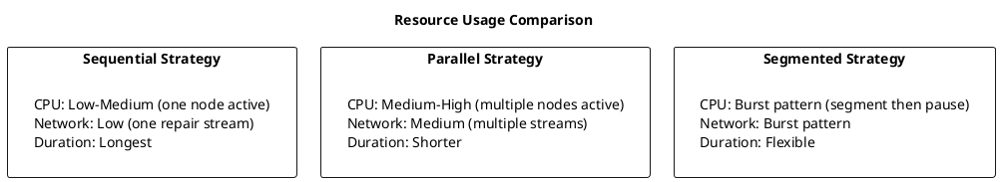

# Repair Strategies

This page presents real-world repair implementation strategies for different cluster sizes, workloads, and operational requirements. Each strategy includes detailed procedures, timing calculations, and automation examples.

## Strategy Overview



| Strategy | Cluster Size | Data Volume | Complexity | Use Case |
|----------|--------------|-------------|------------|----------|
| Sequential Single-Node | 3-10 nodes | < 500 GB/node | Low | Routine maintenance |
| Parallel Multi-Node | 10-50 nodes | Any | Medium | Routine maintenance |
| Segmented Repair | Any | > 500 GB/node | Medium | Large tables, fine control |
| Continuous Repair | 50+ nodes | Any | High | Routine maintenance |
| Single-Rack Repair | Any (with rack-aware setup) | Any | Low | Routine maintenance, recovery |

---

## Strategy 1: Sequential Single-Node Repair

The simplest approach where repair runs on one node at a time, completing before moving to the next.

### Concept



### Timeline Calculation

```
Repair cycle time = Number of nodes × Time per node
Buffer = gc_grace_seconds - Repair cycle time

Example:
- 6 nodes
- 4 hours per node (including buffer)
- Repair cycle = 24 hours
- gc_grace_seconds = 10 days
- Buffer = 9+ days (excellent)
```

### Commands

Run on each node sequentially:

```bash
nodetool repair -pr my_keyspace
```

Verify repair status after completion:

```bash
nodetool tablestats my_keyspace | grep -i "percent repaired"
```

### Scheduling

Schedule repairs on each node using cron with staggered days to avoid overlap:

| Node | Day | Time |
|------|-----|------|
| Node 1 | Sunday | 02:00 |
| Node 2 | Monday | 02:00 |
| Node 3 | Tuesday | 02:00 |
| Node 4 | Wednesday | 02:00 |
| Node 5 | Thursday | 02:00 |
| Node 6 | Friday | 02:00 |

### Advantages

- Simple to understand and implement
- Minimal cluster-wide performance impact (only one node under repair load)
- Easy to monitor and troubleshoot
- No coordination required between nodes
- Predictable resource usage

### Disadvantages

- Slowest repair velocity
- May not complete within `gc_grace_seconds` for larger clusters
- Single node bears full repair load during its window
- No parallelism benefits

---

## Strategy 2: Parallel Multi-Node Repair

Repairs multiple nodes simultaneously by selecting non-overlapping token ranges.

### Concept



### Identifying Non-Overlapping Nodes

For RF=3, nodes that are `RF` positions apart in the ring can repair simultaneously:



### Parallel Groups

For a 12-node cluster with RF=3:

| Group | Nodes | Repair Simultaneously |
|-------|-------|----------------------|
| A | 1, 4, 7, 10 | Yes |
| B | 2, 5, 8, 11 | Yes (after Group A) |
| C | 3, 6, 9, 12 | Yes (after Group B) |

Run on all nodes in a group simultaneously:

```bash
nodetool repair -pr my_keyspace
```

### Timeline Calculation

```
Sequential time = N nodes × T hours/node
Parallel time = (N/RF) × T hours/node = N×T/RF

Example (12 nodes, RF=3, 2 hours/node):
- Sequential: 12 × 2 = 24 hours
- Parallel: 3 groups × 2 = 6 hours
- Speedup: 4x
```

### Advantages

- Significantly faster repair velocity (up to RF× speedup)
- Better utilization of cluster resources
- Enables completion within `gc_grace_seconds` for medium-sized clusters
- Repair load distributed across multiple nodes simultaneously

### Disadvantages

- Higher cluster-wide resource usage during repair windows
- Requires careful planning to identify non-overlapping nodes
- More complex coordination and monitoring
- Network bandwidth consumed by multiple concurrent repair streams
- If one node in a group fails, may need to restart the group

---

## Strategy 3: Segmented (Subrange) Repair

Breaks each node's token range into smaller segments for finer control and parallelism.

### Concept



### Benefits

| Aspect | Full Repair | Segmented Repair |
|--------|-------------|------------------|
| Session duration | Hours | Minutes |
| Failure recovery | Restart from beginning | Resume from failed segment |
| Resource usage | Sustained high | Burst then idle |
| Parallelism | Limited | High |
| Progress tracking | Coarse | Fine-grained |

### Commands

Repair a specific token range using `-st` (start token) and `-et` (end token):

```bash
nodetool repair -pr -st <start_token> -et <end_token> my_keyspace
```

Example with 4 segments across the full token range:

| Segment | Start Token | End Token |
|---------|-------------|-----------|
| 1 | -9223372036854775808 | -4611686018427387904 |
| 2 | -4611686018427387904 | 0 |
| 3 | 0 | 4611686018427387903 |
| 4 | 4611686018427387903 | 9223372036854775807 |

Get token ranges for a node:

```bash
nodetool describering my_keyspace
```

### Advantages

- Fine-grained control over repair sessions
- Shorter individual repair sessions reduce risk of timeout or failure
- Can pause and resume at segment boundaries
- Failed segments can be retried without restarting entire repair
- Better resource management with burst-then-idle pattern
- Enables parallel repair of different segments

### Disadvantages

- More complex to orchestrate manually
- Requires tracking which segments have been completed
- More repair sessions means more anti-compaction events (for incremental repair)
- Overhead of starting/stopping many small repair sessions

---

## Strategy 4: Continuous Repair

For large clusters, repair runs continuously to ensure completion within `gc_grace_seconds`.

### Concept



### Using AxonOps for Continuous Repair

AxonOps provides automated repair scheduling with:

- Cluster-wide coordination
- Automatic throttling based on cluster load
- Progress tracking and alerting
- Repair history and reporting

### Timeline Requirements

```
Required repair rate = Number of nodes / gc_grace_seconds
Time budget per node = gc_grace_seconds / Number of nodes

Example (100 nodes, gc_grace_seconds = 10 days):
- Must complete 10 nodes per day
- Maximum 2.4 hours per node (with no parallelism)
- With parallel groups (RF=3): ~7 hours per node budget
```

### Advantages

- Only viable option for very large clusters
- Automated tools handle coordination and failure recovery
- Load-aware throttling minimizes production impact
- Comprehensive tracking and compliance reporting
- No manual intervention required once configured

### Disadvantages

- Requires additional tooling (AxonOps, Reaper, or custom automation)
- Constant background repair load on the cluster
- More complex initial setup and configuration
- Tooling has its own operational overhead

---

## Strategy 5: Single-Rack Repair

Repairs all data by running repair without `-pr` on nodes in a single rack. With NetworkTopologyStrategy and rack-aware replica placement, each rack holds a complete copy of all data, so repairing one rack synchronizes all replicas cluster-wide.

### Concept

With RF=3 and 3 racks, each rack contains one replica of every partition. By running `nodetool repair` (without `-pr`) on all nodes in a single rack, every range in the cluster gets repaired—because each node repairs all ranges it holds (primary + replica).



### When to Use

**Routine maintenance:**

- Alternative to `-pr` repair across all nodes
- Simpler coordination—only one rack needs scheduling
- Other racks remain unaffected by repair load

**Recovery scenarios:**

- After rack-level failure or outage
- After replacing multiple nodes in a rack
- After network partition affecting an entire rack

### Commands

Repair all ranges on a specific node (without `-pr`):

```bash
nodetool repair my_keyspace
```

Run sequentially on each node in the target rack to repair all cluster data.

### Comparison: With vs Without -pr

| Aspect | With `-pr` on all nodes | Without `-pr` on one rack |
|--------|------------------------|---------------------------|
| Nodes involved | All nodes in cluster | Only nodes in one rack |
| Ranges per node | Primary only | All ranges (primary + replica) |
| Total work | Each range repaired once | Each range repaired once |
| Coordination | All nodes | One rack |
| Impact on other racks | All racks under repair load | Only target rack under load |

### Advantages

- Repairs all cluster data by targeting only one rack
- Simpler coordination—no need to schedule across all racks
- Other racks remain unaffected by repair load
- Useful for both routine maintenance and recovery

### Disadvantages

- Each node does more work (repairs all its ranges, not just primary)
- Longer per-node repair time
- Requires rack-aware replica placement (NetworkTopologyStrategy with proper rack configuration)

---

## Strategy Comparison

### Resource Impact



### Selection Guidelines

| Factor | Sequential | Parallel | Segmented | Continuous | Single-Rack |
|--------|------------|----------|-----------|------------|-------------|
| Cluster size | Small (< 10) | Medium (10-50) | Any | Large (50+) | Any (rack-aware) |
| Data volume | Any | Any | Large (> 500GB) | Any | Any |
| Ops complexity | Low | Medium | Medium | High | Low |
| Time pressure | Low | Medium | Medium | High | Low-High |
| Coordination scope | All nodes | All nodes | All nodes | All nodes | One rack |
| Primary use | Routine | Routine | Large data | Routine | Routine, recovery |

---

## Monitoring Repair Progress

### During Repair

| Command | Purpose |
|---------|---------|
| `nodetool repair_admin list` | Check active repair sessions |
| `nodetool netstats` | Monitor streaming progress |
| `nodetool tpstats` | Watch thread pool activity (AntiEntropy, Repair) |
| `nodetool compactionstats` | Check compaction triggered by repair |

### Post-Repair Verification

| Command | Purpose |
|---------|---------|
| `nodetool tablestats my_keyspace` | Check percent repaired per table |
| `nodetool repair_admin list` | Verify no stuck repair sessions |

---

## Paxos Repairs

Paxos repairs reconcile the Paxos state used by [lightweight transactions (LWTs)](../../cql/dml/lightweight-transactions.md). For clusters that use LWTs, Paxos repairs are essential to maintain linearizability guarantees, especially during topology changes.

For conceptual background on Paxos repairs, see [Paxos Repairs](concepts.md#paxos-repairs) in the Repair Concepts guide.

### Regular Paxos-Only Repairs

For clusters using LWTs, operators **SHOULD** run **Paxos-only repairs** regularly. This can be accomplished via:

- **Automatically every 5 minutes** (Cassandra 4.1+) when Paxos repairs are not disabled
- **Scheduled `nodetool repair --paxos-only`** runs

In Cassandra 4.1 and later, Paxos repairs run automatically every **5 minutes by default** as part of the cluster's background maintenance (similar to compaction). This requires no manual configuration when `paxos_repair_enabled` is `true` (the default).

> **Important:** The `paxos_repair_enabled` setting only controls automatic Paxos repairs. It does **NOT** affect manual `nodetool repair --paxos-only` operations. If you disable automatic Paxos repairs and are using LWTs, you **MUST** implement a manual schedule.

For Cassandra versions prior to 4.1, operators **MUST** schedule `nodetool repair --paxos-only` manually via cron or external scheduling tools, typically running at least hourly:

```bash
# Run Paxos-only repair on all keyspaces (recommended when unsure which keyspaces use LWTs)
nodetool repair --paxos-only

# Run Paxos-only repair on a specific keyspace
nodetool repair --paxos-only my_lwt_keyspace
```

Running without a keyspace argument repairs Paxos state for all keyspaces. This is often **RECOMMENDED** because operators frequently do not know which keyspaces developers are using for LWTs.

Paxos repairs are relatively lightweight compared to full data repairs. On clusters running Cassandra 4.1+, the automatic 5-minute interval keeps Paxos state compact and consistent without operator intervention.

Disabling Paxos repairs for extended periods **MAY** lead to stale or inconsistent LWT state, especially around topology changes. If Paxos state grows large, topology operations such as bootstrap **MAY** fail due to Paxos cleanup timeouts.

### Topology Change Scenarios

During topology changes (bootstrap, decommission, replace, move), Cassandra 4.1 and later runs a **Paxos repair gate** that **MUST** complete before the topology change finalizes. This gate ensures LWT correctness is preserved.

In clusters with very large partitions (tens of gigabytes) or overloaded replicas, Paxos cleanup **MAY** fail during topology changes, causing errors such as:

```
PaxosCleanupException: CANCELLED
```

When this occurs, operators have two options:

#### Option A: Fix the Underlying Load Problem

This approach preserves LWT guarantees and **SHOULD** be preferred whenever time allows:

1. **Throttle or stop traffic** to affected keyspaces to reduce load on replicas
2. **Run `nodetool repair --paxos-only`** on all nodes to clean up Paxos state:
   ```bash
   # Run on each node
   nodetool repair --paxos-only <keyspace>
   ```
3. **Identify and address large partitions** that may be causing cleanup timeouts
4. **Retry the topology change** once the cluster is healthy and Paxos state is compact

#### Option B: Temporarily Skip Paxos Repair for Topology Change

Cassandra provides configuration and JMX flags to skip Paxos repair during topology changes. This option **MUST** be treated as a **last-resort workaround**:

> **Warning:** Skipping the Paxos repair gate **CAN** violate LWT correctness guarantees. Data consistency for lightweight transactions **MAY** be compromised.

If used:

1. Enable the skip flag (see [skip_paxos_repair_on_topology_change](#skip_paxos_repair_on_topology_change) below)
2. Complete the topology change
3. **Immediately** run `nodetool repair --paxos-only` on **all nodes** for all LWT keyspaces
4. **Revert** the skip setting to its default (`false`)

This option **MAY** be acceptable only when:

- The topology change is urgent and cannot wait for cluster health to improve
- The operator fully understands the risk to LWT consistency
- A full Paxos repair is scheduled immediately after the topology change

### Clusters or Keyspaces Not Using LWTs

For clusters or specific keyspaces that **never** use LWTs:

- Operators **MAY** reduce or omit Paxos repairs for those non-LWT keyspaces to save resources
- Operators **MAY** configure those keyspaces to be skipped during topology-change Paxos cleanup (see [skip_paxos_repair_on_topology_change_keyspaces](#skip_paxos_repair_on_topology_change_keyspaces))

Before disabling Paxos repairs for any keyspace, operators **MUST** confirm with application teams that no applications are using LWTs on those keyspaces. Disabling Paxos repairs on keyspaces where LWTs are in use **CAN** lead to data consistency violations.

### Paxos-Related cassandra.yaml Configuration

This section documents the main Paxos and Paxos-repair-related settings in `cassandra.yaml`. These settings control LWT behavior, Paxos state management, and repair integration.

#### paxos_variant

Controls which Paxos implementation is used for lightweight transactions.

| Value | Description |
|-------|-------------|
| `v1` | Original Paxos implementation (default in Cassandra < 4.1) |
| `v2` | Improved implementation with fewer round-trips and better contention handling (available from Cassandra 4.1+) |

**Operational guidance:**

- On clusters that heavily use LWTs, enabling Paxos v2 **SHOULD** be considered for improved performance
- To enable Paxos v2 cluster-wide, operators **MUST**:
  - Set `paxos_variant: v2` consistently across **all nodes**
  - Ensure Paxos repairs are running regularly before and after the change
- Changes to `paxos_variant` **SHOULD** be done during a controlled maintenance window
- Mixed `v1`/`v2` configurations within a cluster are **NOT RECOMMENDED** and **MAY** cause undefined behavior

```yaml
# cassandra.yaml
paxos_variant: v2
```

#### paxos_state_purging

Controls how old Paxos state is purged from the system tables.

| Value | Description |
|-------|-------------|
| `legacy` | Original behavior; Paxos state retained until explicit cleanup |
| `gc_grace` | Purge Paxos state based on `gc_grace_seconds` of the table |
| `repaired` | Purge Paxos state only after it has been repaired (requires regular Paxos repairs) |

**Operational guidance:**

- For Paxos v2, `paxos_state_purging: repaired` is typically **RECOMMENDED**, but **only** when Paxos repairs run regularly or automatically
- Once `repaired` is enabled, operators generally **MUST NOT** switch back to `legacy` without careful consideration
- If purging needs to be relaxed, switching to `gc_grace` **MAY** be appropriate but requires more conservative consistency levels
- This setting **SHOULD** be changed consistently across all nodes in the cluster

```yaml
# cassandra.yaml - recommended for Paxos v2 with regular repairs
paxos_state_purging: repaired
```

#### paxos_repair_enabled

Global enable/disable switch for automatic Paxos repairs.

| Value | Description |
|-------|-------------|
| `true` | Automatic Paxos repairs are enabled (default) |
| `false` | Automatic Paxos repairs are disabled |

**Operational guidance:**

- When enabled (default), Paxos repairs run automatically on a **5-minute interval** in Cassandra 4.1+, and also run automatically before topology changes (bootstrap, decommission, replace, move).
- When `false`, automatic Paxos repairs are disabled. However, **manual** Paxos repairs via `nodetool repair --paxos-only` continue to work and **MUST** be scheduled regularly if the cluster uses LWTs.
- For clusters using LWTs, this setting **SHOULD** remain `true` under normal circumstances.
- If automatic Paxos repairs are disabled (`false`), operators **MUST** schedule `nodetool repair --paxos-only` via cron or external automation (typically hourly) to maintain LWT correctness.
- Disabling automatic Paxos repairs without a manual replacement schedule **MAY** lead to stale or inconsistent LWT state.
- Only consider setting this to `false` if you have completely removed LWT usage from your application and have validated that no keyspaces rely on LWTs.

```yaml
# cassandra.yaml - default, keep enabled for LWT clusters
paxos_repair_enabled: true
```

#### skip_paxos_repair_on_topology_change

Controls whether the Paxos repair gate is enforced during topology changes.

| Value | Description |
|-------|-------------|
| `false` | Paxos repair gate is enforced; topology changes fail if Paxos cleanup cannot complete (default) |
| `true` | Paxos repair gate is skipped; topology changes proceed without Paxos cleanup |

**Operational guidance:**

- This setting **SHOULD** remain `false` (default) for clusters using LWTs
- Setting to `true` **MAY** allow topology changes to proceed when they would otherwise fail due to Paxos cleanup timeouts
- **Warning:** When `true`, LWT correctness guarantees **MAY** be violated during and after the topology change
- If set to `true` to complete an urgent topology change, operators **MUST**:
  - Run `nodetool repair --paxos-only` on all nodes immediately after the topology change
  - Revert this setting to `false` as soon as possible

This setting can also be changed at runtime via JMX:

```bash
# Check current value
nodetool getconfig skip_paxos_repair_on_topology_change

# Change at runtime (use with extreme caution)
nodetool setconfig skip_paxos_repair_on_topology_change true
```

```yaml
# cassandra.yaml - default, do not change unless absolutely necessary
skip_paxos_repair_on_topology_change: false
```

#### skip_paxos_repair_on_topology_change_keyspaces

Specifies keyspaces to exclude from Paxos repair during topology changes.

| Value | Description |
|-------|-------------|
| (empty) | All keyspaces are included in Paxos repair during topology changes (default) |
| List of keyspaces | Listed keyspaces are excluded from Paxos repair during topology changes |

**Accepted formats:**

1. **YAML list**:
   ```yaml
   skip_paxos_repair_on_topology_change_keyspaces:
     - analytics_ks
     - batch_ks
     - timeseries_ks
   ```

2. **Comma-separated string**:
   ```yaml
   skip_paxos_repair_on_topology_change_keyspaces: analytics_ks, batch_ks, timeseries_ks
   ```

Both formats are equivalent.

**Operational guidance:**

- This setting **MAY** be used to exclude keyspaces that do not use LWTs from the Paxos repair gate
- Operators **MUST NOT** add keyspaces that use LWTs to this list, as doing so **MAY** violate LWT correctness
- This setting is useful for mixed workloads where some keyspaces use LWTs and others do not
- When a keyspace is listed here, Paxos cleanup for that keyspace is skipped during topology changes, reducing the risk of cleanup timeout failures

#### Configuration Summary Table

| Setting | Default | LWT Clusters | Non-LWT Clusters |
|---------|---------|--------------|------------------|
| `paxos_variant` | `v1` (< 4.1), `v2` (4.1+) | `v2` **RECOMMENDED** | Either |
| `paxos_state_purging` | `legacy` | `repaired` **RECOMMENDED** | `legacy` or `gc_grace` |
| `paxos_repair_enabled` | `true` | **MUST** be `true` | **MAY** be `false` |
| `skip_paxos_repair_on_topology_change` | `false` | **SHOULD** be `false` | **MAY** be `true` |
| `skip_paxos_repair_on_topology_change_keyspaces` | (empty) | Non-LWT keyspaces only | Any |

---

## Next Steps

- **[Repair Concepts](concepts.md)** - Understanding repair fundamentals
- **[Options Reference](options-reference.md)** - Detailed option explanations
- **[Scheduling Guide](scheduling.md)** - Planning within gc_grace_seconds