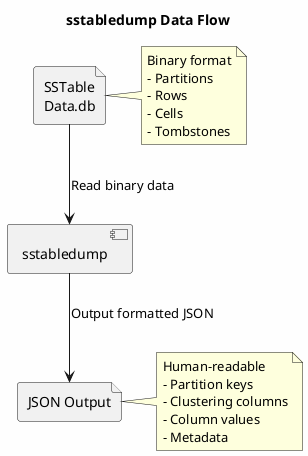

# sstabledump

Exports SSTable contents as JSON for inspection, debugging, and data analysis.

---

## Synopsis

```bash
sstabledump [options] <sstable_file>
```

---

## Description

`sstabledump` reads an SSTable file and outputs its contents in JSON format. This tool is essential for:

- **Debugging data issues** - Inspect actual stored values
- **Analyzing tombstones** - Find deletion markers causing issues
- **Examining partition structure** - Understand data layout
- **Data recovery** - Extract data from corrupted or orphaned SSTables
- **Schema change analysis** - See how data was stored before schema changes

The output includes all rows, cells, tombstones, and TTL information stored in the SSTable.

!!! danger "Cassandra Must Be Stopped"
    For consistent results, **Cassandra should be stopped** before running `sstabledump`. The tool can run while Cassandra is active, but results may be inconsistent if compaction occurs.

---

## How It Works



---

## Arguments

| Argument | Description |
|----------|-------------|
| `sstable_file` | Path to the SSTable Data.db file |

---

## Options

| Option | Description |
|--------|-------------|
| `-d` | Output each row as a separate JSON object (JSONL format) |
| `-e` | Only output keys (no values) |
| `-k <key>` | Only output data for the specified partition key |
| `-x <key>` | Exclude the specified partition key |
| `-t` | Include only tombstones in output |
| `-l` | Limit output to first N partitions |

---

## Output Format

### Standard JSON Output

```json
[
  {
    "partition" : {
      "key" : [ "user123" ],
      "position" : 0
    },
    "rows" : [
      {
        "type" : "row",
        "position" : 48,
        "clustering" : [ "2024-01-15" ],
        "liveness_info" : { "tstamp" : "2024-01-15T10:30:00.000Z" },
        "cells" : [
          { "name" : "email", "value" : "user@example.com" },
          { "name" : "name", "value" : "John Doe" },
          { "name" : "status", "value" : "active" }
        ]
      }
    ]
  }
]
```

### Row-per-Line Format (`-d`)

```json
{"partition":{"key":["user123"],"position":0},"rows":[...]}
{"partition":{"key":["user456"],"position":512},"rows":[...]}
{"partition":{"key":["user789"],"position":1024},"rows":[...]}
```

### Keys Only Format (`-e`)

```json
[
  {
    "partition" : {
      "key" : [ "user123" ],
      "position" : 0
    }
  },
  {
    "partition" : {
      "key" : [ "user456" ],
      "position" : 512
    }
  }
]
```

---

## Examples

### Dump Entire SSTable

```bash
# Dump to stdout
sstabledump /var/lib/cassandra/data/my_keyspace/my_table-abc123/nb-1-big-Data.db

# Save to file
sstabledump /var/lib/cassandra/data/my_keyspace/my_table-abc123/nb-1-big-Data.db > dump.json
```

### Dump Specific Partition

```bash
# Dump only data for partition key "user123"
sstabledump -k "user123" /path/to/sstable-Data.db

# For composite partition keys
sstabledump -k "region:us-east:tenant:acme" /path/to/sstable-Data.db
```

### Dump Keys Only

```bash
# List all partition keys in SSTable
sstabledump -e /path/to/sstable-Data.db

# Count partitions
sstabledump -e /path/to/sstable-Data.db | grep -c '"partition"'
```

### Dump Tombstones Only

```bash
# Find all tombstones (deletions) in SSTable
sstabledump -t /path/to/sstable-Data.db
```

### Row-per-Line for Processing

```bash
# Output suitable for jq processing
sstabledump -d /path/to/sstable-Data.db | jq '.partition.key'

# Count rows per partition
sstabledump -d /path/to/sstable-Data.db | jq '.rows | length'
```

### Limit Output Size

```bash
# Dump only first 10 partitions
sstabledump -l 10 /path/to/sstable-Data.db
```

### Exclude Specific Partition

```bash
# Dump all except partition "problem_key"
sstabledump -x "problem_key" /path/to/sstable-Data.db
```

---

## Common Use Cases

### Finding Tombstones

```bash
#!/bin/bash
# find_tombstones.sh - Identify tables with tombstone issues

DATA_DIR="/var/lib/cassandra/data"
KEYSPACE="$1"
TABLE="$2"

for sstable in ${DATA_DIR}/${KEYSPACE}/${TABLE}-*/*-Data.db; do
    tombstone_count=$(sstabledump -t "$sstable" 2>/dev/null | grep -c '"type" : "range_tombstone"')
    if [ "$tombstone_count" -gt 0 ]; then
        echo "$sstable: $tombstone_count tombstones"
    fi
done
```

### Analyzing Partition Sizes

```bash
#!/bin/bash
# partition_sizes.sh - Find large partitions

SSTABLE="$1"

sstabledump -d "$SSTABLE" | while read line; do
    key=$(echo "$line" | jq -r '.partition.key[0]')
    row_count=$(echo "$line" | jq '.rows | length')
    echo "$key: $row_count rows"
done | sort -t: -k2 -n -r | head -20
```

### Data Recovery Script

```bash
#!/bin/bash
# recover_partition.sh - Extract specific partition data

SSTABLE="$1"
PARTITION_KEY="$2"
OUTPUT_FILE="$3"

echo "Extracting partition '$PARTITION_KEY' from $SSTABLE"
sstabledump -k "$PARTITION_KEY" "$SSTABLE" > "$OUTPUT_FILE"

if [ -s "$OUTPUT_FILE" ]; then
    echo "Data saved to $OUTPUT_FILE"
    rows=$(jq '.[0].rows | length' "$OUTPUT_FILE")
    echo "Found $rows rows"
else
    echo "No data found for partition key '$PARTITION_KEY'"
fi
```

### Comparing SSTables

```bash
#!/bin/bash
# compare_sstables.sh - Compare partition keys between SSTables

SSTABLE1="$1"
SSTABLE2="$2"

# Extract keys from both
sstabledump -e "$SSTABLE1" | jq -r '.[].partition.key[0]' | sort > /tmp/keys1.txt
sstabledump -e "$SSTABLE2" | jq -r '.[].partition.key[0]' | sort > /tmp/keys2.txt

echo "Keys only in first SSTable:"
comm -23 /tmp/keys1.txt /tmp/keys2.txt

echo "Keys only in second SSTable:"
comm -13 /tmp/keys1.txt /tmp/keys2.txt

echo "Keys in both:"
comm -12 /tmp/keys1.txt /tmp/keys2.txt | wc -l
```

---

## Understanding Output Fields

### Partition Object

```json
{
  "partition" : {
    "key" : [ "partition_key_value" ],
    "position" : 0,
    "deletion_info" : {              // Present if partition deleted
      "marked_deleted" : "timestamp",
      "local_delete_time" : "timestamp"
    }
  }
}
```

### Row Object

```json
{
  "type" : "row",
  "position" : 48,
  "clustering" : [ "clustering_value1", "clustering_value2" ],
  "liveness_info" : {
    "tstamp" : "2024-01-15T10:30:00.000Z",
    "ttl" : 86400,                   // TTL in seconds
    "expires_at" : "2024-01-16T10:30:00.000Z",
    "expired" : false
  },
  "deletion_info" : { ... },         // Present if row deleted
  "cells" : [ ... ]
}
```

### Cell Object

```json
{
  "name" : "column_name",
  "value" : "cell_value",
  "tstamp" : "2024-01-15T10:30:00.000Z",
  "ttl" : 86400,                     // If TTL set
  "expires_at" : "2024-01-16T10:30:00.000Z",
  "deletion_info" : { ... }          // If cell deleted
}
```

### Tombstone Types

```json
// Cell tombstone
{
  "name" : "column_name",
  "deletion_info" : {
    "marked_deleted" : "2024-01-15T10:30:00.000Z",
    "local_delete_time" : "2024-01-15T10:30:00.000Z"
  }
}

// Range tombstone
{
  "type" : "range_tombstone_bound",
  "start" : {
    "type" : "inclusive",
    "clustering" : [ "start_value" ]
  },
  "end" : {
    "type" : "inclusive",
    "clustering" : [ "end_value" ]
  },
  "deletion_info" : { ... }
}

// Partition tombstone
{
  "partition" : {
    "key" : [ "partition_key" ],
    "deletion_info" : {
      "marked_deleted" : "timestamp",
      "local_delete_time" : "timestamp"
    }
  }
}
```

---

## Output Processing with jq

### Extract All Partition Keys

```bash
sstabledump /path/to/sstable-Data.db | jq -r '.[].partition.key[0]'
```

### Count Rows Per Partition

```bash
sstabledump /path/to/sstable-Data.db | jq '.[] | {key: .partition.key[0], rows: (.rows | length)}'
```

### Find Expired TTL Data

```bash
sstabledump /path/to/sstable-Data.db | jq '.[].rows[].cells[] | select(.expired == true)'
```

### Extract Specific Column Values

```bash
sstabledump /path/to/sstable-Data.db | jq '.[].rows[].cells[] | select(.name == "email") | .value'
```

### Find Large Partitions

```bash
sstabledump /path/to/sstable-Data.db | jq '[.[] | {key: .partition.key[0], rows: (.rows | length)}] | sort_by(.rows) | reverse | .[0:10]'
```

---

## Troubleshooting

### Out of Memory

```bash
# Large SSTables can exhaust memory

# Option 1: Increase heap
export JVM_OPTS="-Xmx8G"
sstabledump /path/to/sstable-Data.db

# Option 2: Use streaming output
sstabledump -d /path/to/sstable-Data.db | head -100

# Option 3: Dump specific partition only
sstabledump -k "specific_key" /path/to/sstable-Data.db
```

### Permission Denied

```bash
# Run as cassandra user
sudo -u cassandra sstabledump /var/lib/cassandra/data/.../nb-1-big-Data.db
```

### "Unable to read SSTable" Error

```bash
# SSTable may be corrupted - verify first
sstableverify keyspace table

# If corrupted, cannot dump - scrub first
sstablescrub keyspace table
```

### Composite Key Formatting

```bash
# For composite partition keys, use colon separator
# Schema: PRIMARY KEY ((region, tenant), date)
sstabledump -k "us-east:acme" /path/to/sstable-Data.db

# Check key format in output first
sstabledump -e -l 1 /path/to/sstable-Data.db
```

---

## Performance Considerations

| SSTable Size | Approximate Time | Memory Usage |
|--------------|------------------|--------------|
| 100 MB | ~5 seconds | ~500 MB |
| 1 GB | ~30 seconds | ~2 GB |
| 10 GB | ~5 minutes | ~8 GB+ |
| 100 GB | Not recommended | Excessive |

For large SSTables, use:
- `-k` to dump specific partitions
- `-l` to limit output
- `-d` for streaming output
- `-e` for keys only

---

## Best Practices

!!! tip "sstabledump Guidelines"

    1. **Use `-d` for large files** - Enables streaming processing
    2. **Target specific partitions** - Use `-k` when possible
    3. **Pipe to jq** - Process JSON efficiently
    4. **Redirect to file** - Avoid terminal buffer issues
    5. **Stop Cassandra** - For consistent results
    6. **Check memory** - Large SSTables need significant heap
    7. **Use for diagnostics** - Not for bulk data export

!!! warning "Cautions"

    - Output can be very large (gigabytes)
    - Memory usage scales with SSTable size
    - Sensitive data will be exposed in output
    - Not suitable for production data export

---

## Related Commands

| Command | Relationship |
|---------|--------------|
| [sstablemetadata](sstablemetadata.md) | View SSTable statistics |
| [sstablepartitions](sstablepartitions.md) | Find large partitions |
| [sstableexpiredblockers](sstableexpiredblockers.md) | Find tombstone blockers |
| [sstableutil](sstableutil.md) | List SSTable files |
| [sstableverify](sstableverify.md) | Verify SSTable before dump |
