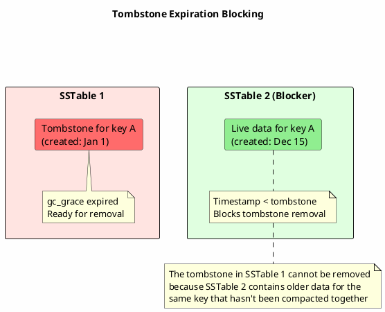
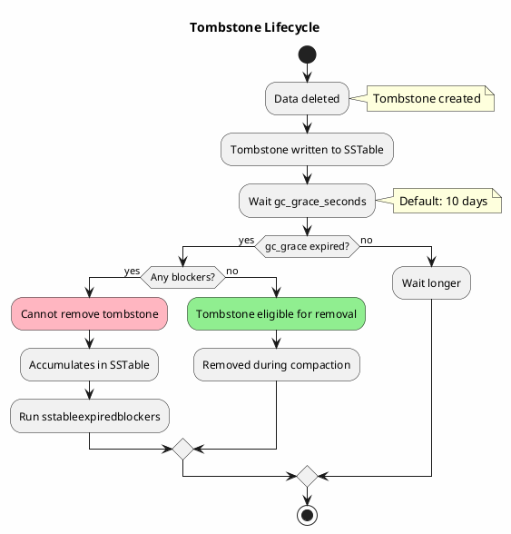

# sstableexpiredblockers

Identifies SSTables that prevent tombstone removal, causing tombstone accumulation issues.

---

## Synopsis

```bash
sstableexpiredblockers <keyspace> <table>
```

---

## Description

`sstableexpiredblockers` analyzes SSTables to find those containing data that prevents expired tombstones from being garbage collected. When tombstones cannot be removed, they accumulate and cause:

- **Read amplification** - Queries must scan more tombstones
- **Increased disk usage** - Tombstones consume storage indefinitely
- **Performance degradation** - Compaction becomes slower
- **Read timeout issues** - Tombstone warnings and failures

This tool identifies "blocker" SSTables that contain live data overlapping with tombstones, preventing safe removal during compaction.

!!! danger "Cassandra Must Be Stopped"
    **Cassandra must be stopped** before running `sstableexpiredblockers` for accurate results.

---

## How It Works



### Why Tombstones Get Blocked

1. **Separate SSTables** - Tombstone and live data in different SSTables
2. **Different compaction timing** - SSTables not compacted together
3. **gc_grace_seconds passed** - Tombstone is eligible for removal
4. **Live data timestamp** - Live data is older than tombstone
5. **Safety requirement** - Cassandra cannot remove tombstone until live data is also compacted

---

## Arguments

| Argument | Description |
|----------|-------------|
| `keyspace` | Name of the keyspace containing the table |
| `table` | Name of the table to analyze |

---

## Examples

### Basic Usage

```bash
# Stop Cassandra first
sudo systemctl stop cassandra

# Find blocker SSTables
sstableexpiredblockers my_keyspace my_table

# Start Cassandra
sudo systemctl start cassandra
```

### Check All Tables in Keyspace

```bash
#!/bin/bash
# check_blockers.sh - Find blockers in all tables

KEYSPACE="$1"
DATA_DIR="/var/lib/cassandra/data"

for table_dir in ${DATA_DIR}/${KEYSPACE}/*/; do
    table_name=$(basename "$table_dir" | cut -d'-' -f1)
    echo "=== ${KEYSPACE}.${table_name} ==="
    sstableexpiredblockers "$KEYSPACE" "$table_name" 2>/dev/null
    echo ""
done
```

---

## Output Format

### When Blockers Exist

```
WARN - Listing sstables blocking compaction from dropping tombstones
WARN - /var/lib/cassandra/data/my_keyspace/my_table-abc123/nb-1-big-Data.db blocks 150 expired tombstones from dropping
WARN - /var/lib/cassandra/data/my_keyspace/my_table-abc123/nb-3-big-Data.db blocks 89 expired tombstones from dropping
```

### No Blockers

```
No sstables blocking tombstone expiration detected.
```

---

## Understanding the Problem

### Tombstone Lifecycle



### Common Blocking Scenarios

| Scenario | Cause | Solution |
|----------|-------|----------|
| STCS with old SSTables | Large SSTables rarely compacted | Major compaction or split |
| LCS level 0 buildup | SSTables stuck in L0 | Manual compaction to higher levels |
| Infrequent writes | No compaction triggers | Periodic forced compaction |
| Repair not run | Inconsistent data across replicas | Full repair |
| Large partitions | Partition spans multiple SSTables | Data model review |

---

## Resolving Blocker Issues

### Option 1: Force Major Compaction

```bash
# Force all SSTables to compact together
nodetool compact my_keyspace my_table

# Warning: Resource intensive!
# Consider running during maintenance window
```

### Option 2: Targeted Compaction

```bash
# Compact specific SSTables (Cassandra 4.0+)
nodetool compact --user-defined \
    /var/lib/cassandra/data/my_keyspace/my_table-abc123/nb-1-big-Data.db \
    /var/lib/cassandra/data/my_keyspace/my_table-abc123/nb-3-big-Data.db
```

### Option 3: SSTable Split and Recompact

```bash
# Stop Cassandra
sudo systemctl stop cassandra

# Split large blocker SSTables
sstablesplit --size 50 /path/to/blocker-Data.db

# Start Cassandra - smaller SSTables will compact more readily
sudo systemctl start cassandra
```

### Option 4: Adjust gc_grace_seconds

```sql
-- Temporarily (carefully!) reduce gc_grace for faster tombstone removal
-- Only if repair is up to date!
ALTER TABLE my_keyspace.my_table
WITH gc_grace_seconds = 86400;  -- 1 day instead of 10 days

-- Run repair to ensure consistency
-- nodetool repair my_keyspace my_table

-- Revert after cleanup
ALTER TABLE my_keyspace.my_table
WITH gc_grace_seconds = 864000;  -- Back to 10 days
```

---

## Analysis Script

```bash
#!/bin/bash
# tombstone_analysis.sh - Comprehensive tombstone analysis

KEYSPACE="$1"
TABLE="$2"

echo "=== Tombstone Analysis for ${KEYSPACE}.${TABLE} ==="
echo ""

# Check gc_grace_seconds
echo "1. Table gc_grace_seconds:"
cqlsh -e "SELECT gc_grace_seconds FROM system_schema.tables
          WHERE keyspace_name = '${KEYSPACE}' AND table_name = '${TABLE}';"

# Check last repair time
echo ""
echo "2. Last repair status:"
nodetool repairstatus | grep -A5 "${KEYSPACE}"

# Count SSTables
echo ""
echo "3. SSTable count:"
sstableutil "${KEYSPACE}" "${TABLE}" | grep -c "Data.db$"

# Find blockers (requires Cassandra stopped)
echo ""
echo "4. Blocker SSTables (requires Cassandra stopped):"
if pgrep -f CassandraDaemon > /dev/null; then
    echo "   Cassandra is running - stop it first to check blockers"
else
    sstableexpiredblockers "${KEYSPACE}" "${TABLE}"
fi

# Check SSTable metadata for tombstone estimates
echo ""
echo "5. SSTable tombstone estimates:"
for f in $(sstableutil "${KEYSPACE}" "${TABLE}" | grep "Data.db$" | head -5); do
    echo "   $(basename $f):"
    sstablemetadata "$f" 2>/dev/null | grep -A5 "Tombstone Drop Time"
done
```

---

## Prevention Strategies

### Proper Compaction Strategy

```sql
-- For write-heavy tables with deletes, consider TimeWindowCompactionStrategy
ALTER TABLE my_keyspace.my_table
WITH compaction = {
    'class': 'TimeWindowCompactionStrategy',
    'compaction_window_unit': 'DAYS',
    'compaction_window_size': 1
};

-- Or LeveledCompactionStrategy for consistent tombstone removal
ALTER TABLE my_keyspace.my_table
WITH compaction = {
    'class': 'LeveledCompactionStrategy'
};
```

### Regular Maintenance

```bash
#!/bin/bash
# weekly_maintenance.sh

KEYSPACE="my_keyspace"

# 1. Run repair to ensure consistency
nodetool repair "$KEYSPACE"

# 2. Check for blocker issues (with Cassandra stopped during maintenance)
sudo systemctl stop cassandra
for table_dir in /var/lib/cassandra/data/$KEYSPACE/*/; do
    table=$(basename "$table_dir" | cut -d'-' -f1)
    blockers=$(sstableexpiredblockers "$KEYSPACE" "$table" 2>&1 | grep -c "blocks")
    if [ "$blockers" -gt 0 ]; then
        echo "WARNING: $KEYSPACE.$table has $blockers blocker SSTables"
    fi
done
sudo systemctl start cassandra

# 3. Force compaction if needed
# nodetool compact "$KEYSPACE"
```

### Monitoring

```bash
#!/bin/bash
# monitor_tombstones.sh - Regular tombstone monitoring

THRESHOLD=10000

for ks in $(cqlsh -e "DESCRIBE KEYSPACES" | tr -d ' ' | tr ',' '\n'); do
    for table in $(cqlsh -e "DESCRIBE KEYSPACE $ks" 2>/dev/null | grep "CREATE TABLE" | awk '{print $3}' | cut -d'.' -f2); do
        # Get tombstone histogram from tablestats
        tombstones=$(nodetool tablestats $ks.$table 2>/dev/null | grep "tombstones" | awk '{print $NF}')

        if [ "$tombstones" -gt "$THRESHOLD" ]; then
            echo "ALERT: $ks.$table has high tombstone count: $tombstones"
        fi
    done
done
```

---

## Best Practices

!!! tip "Managing Tombstone Blockers"

    1. **Run repair regularly** - Consistent data allows safe tombstone removal
    2. **Monitor tombstone counts** - Use tablestats and tablehistograms
    3. **Choose appropriate compaction** - LCS and TWCS handle tombstones better
    4. **Avoid wide partitions** - They span SSTables and create blockers
    5. **Periodic forced compaction** - For tables with infrequent writes
    6. **Review data model** - Excessive deletes indicate design issues
    7. **Check blockers monthly** - Part of regular maintenance

!!! warning "Cautions"

    - Never reduce gc_grace_seconds without up-to-date repairs
    - Major compaction is resource intensive
    - Tombstone accumulation indicates underlying issues
    - Tool requires Cassandra to be stopped

---

## Related Commands

| Command | Relationship |
|---------|--------------|
| [sstablemetadata](sstablemetadata.md) | View tombstone estimates |
| [sstabledump](sstabledump.md) | Inspect actual tombstones |
| [sstablesplit](sstablesplit.md) | Split large blocker SSTables |
| [nodetool compact](../nodetool/compact.md) | Force compaction |
| [nodetool garbagecollect](../nodetool/garbagecollect.md) | Remove tombstones |
| [nodetool tablestats](../nodetool/tablestats.md) | Tombstone statistics |
