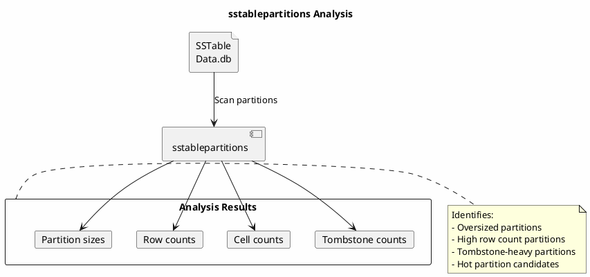
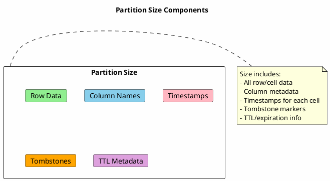

# sstablepartitions

Analyzes SSTable files to identify large partitions that may cause performance issues.

---

## Synopsis

```bash
sstablepartitions [options] <sstable_files>
```

---

## Description

`sstablepartitions` scans SSTable files and reports partition-level statistics including size, cell count, row count, and tombstone count. This tool is essential for identifying "wide partitions" or "hot partitions" that can cause:

- **Read performance degradation** - Large partitions require more memory and I/O
- **Heap pressure** - Wide partitions can cause GC pauses
- **Repair failures** - Overly large partitions may timeout during repair
- **Compaction issues** - Can slow down or fail compaction

!!! info "Safe to Run While Cassandra Is Active"
    Unlike most SSTable tools, `sstablepartitions` can safely run while Cassandra is active. It performs read-only operations on SSTable files.

---

## How It Works



---

## Arguments

| Argument | Description |
|----------|-------------|
| `sstable_files` | One or more paths to SSTable Data.db files or directories |

---

## Options

| Option | Description |
|--------|-------------|
| `-b, --backups` | Include backup directories in scan |
| `-c, --min-cells <n>` | Minimum cell count threshold |
| `-k, --key <key>` | Only show specific partition key |
| `-x, --exclude-key <key>` | Exclude specific partition key |
| `-m, --csv` | Output in CSV format |
| `-w, --min-rows <n>` | Minimum row count threshold |
| `-s, --snapshots` | Include snapshot directories in scan |
| `-o, --min-tombstones <n>` | Minimum tombstone count threshold |
| `-u, --current-timestamp <ts>` | Override current time for TTL calculations |
| `-t, --min-size <size>` | Minimum partition size threshold (e.g., 100MB, 1GB) |
| `-y, --partitions-only` | Output only partition key information |
| `-r, --recursive` | Recursively scan directories |

---

## Examples

### Scan Entire Table

```bash
# Analyze all SSTables for a table
sstablepartitions /var/lib/cassandra/data/my_keyspace/my_table-*/
```

### Find Large Partitions

```bash
# Find partitions larger than 100MB
sstablepartitions -t 100MB /var/lib/cassandra/data/my_keyspace/my_table-*/

# Find partitions larger than 1GB
sstablepartitions --min-size 1GB /var/lib/cassandra/data/my_keyspace/my_table-*/
```

### Find Wide Partitions (High Row Count)

```bash
# Find partitions with more than 100,000 rows
sstablepartitions -w 100000 /var/lib/cassandra/data/my_keyspace/my_table-*/
```

### Find Tombstone-Heavy Partitions

```bash
# Find partitions with excessive tombstones
sstablepartitions -o 10000 /var/lib/cassandra/data/my_keyspace/my_table-*/
```

### Find High Cell Count Partitions

```bash
# Find partitions with more than 1 million cells
sstablepartitions -c 1000000 /var/lib/cassandra/data/my_keyspace/my_table-*/
```

### CSV Output for Processing

```bash
# Generate CSV for spreadsheet analysis
sstablepartitions --csv /var/lib/cassandra/data/my_keyspace/my_table-*/ > partitions.csv
```

### Analyze Specific Partition

```bash
# Get details for specific partition key
sstablepartitions -k "user123" /var/lib/cassandra/data/my_keyspace/my_table-*/
```

### Include Snapshots

```bash
# Also scan snapshot directories
sstablepartitions --snapshots /var/lib/cassandra/data/my_keyspace/my_table-*/
```

---

## Output Format

### Standard Output

```
Processing /var/lib/cassandra/data/my_keyspace/users-abc123/nb-1-big-Data.db
  Partition: 'user123' (ae4f2b1c) live 156234, move 0, rows 5000, cells 250000, tombstones 100, size 52428800
  Partition: 'user456' (bf5a3c2d) live 234567, rows 12000, cells 600000, tombstones 50, size 104857600
Processing /var/lib/cassandra/data/my_keyspace/users-abc123/nb-2-big-Data.db
  Partition: 'user789' (c06b4d3e) live 345678, rows 8000, cells 400000, tombstones 200, size 78643200
```

### Output Fields

| Field | Description |
|-------|-------------|
| `Partition` | Partition key value |
| `(token)` | Token value for the partition |
| `live` | Timestamp of most recent live data |
| `rows` | Number of rows in partition |
| `cells` | Number of cells in partition |
| `tombstones` | Number of tombstones |
| `size` | Partition size in bytes |

### CSV Output

```csv
key,token,live,rows,cells,tombstones,size,sstable
user123,ae4f2b1c,156234,5000,250000,100,52428800,nb-1-big-Data.db
user456,bf5a3c2d,234567,12000,600000,50,104857600,nb-1-big-Data.db
user789,c06b4d3e,345678,8000,400000,200,78643200,nb-2-big-Data.db
```

---

## Common Use Cases

### Identifying Hot Partitions

```bash
#!/bin/bash
# find_hot_partitions.sh - Identify potential hot partitions

DATA_DIR="/var/lib/cassandra/data"
KEYSPACE="$1"
TABLE="$2"
SIZE_THRESHOLD="${3:-100MB}"

echo "Finding partitions larger than $SIZE_THRESHOLD in ${KEYSPACE}.${TABLE}"
echo "======================================================================="

sstablepartitions -t "$SIZE_THRESHOLD" \
    ${DATA_DIR}/${KEYSPACE}/${TABLE}-*/ 2>/dev/null | \
    grep "Partition:" | \
    sort -t',' -k6 -n -r | \
    head -20
```

### Monitoring Partition Growth

```bash
#!/bin/bash
# partition_growth_monitor.sh - Track partition sizes over time

DATA_DIR="/var/lib/cassandra/data"
KEYSPACE="$1"
TABLE="$2"
OUTPUT_DIR="/var/log/cassandra/partition_reports"

mkdir -p "$OUTPUT_DIR"
TIMESTAMP=$(date +%Y%m%d_%H%M%S)
OUTPUT_FILE="${OUTPUT_DIR}/${KEYSPACE}_${TABLE}_${TIMESTAMP}.csv"

sstablepartitions --csv -t 10MB \
    ${DATA_DIR}/${KEYSPACE}/${TABLE}-*/ > "$OUTPUT_FILE"

echo "Report saved to $OUTPUT_FILE"
echo "Top 10 largest partitions:"
tail -n +2 "$OUTPUT_FILE" | sort -t',' -k7 -n -r | head -10
```

### Tombstone Analysis

```bash
#!/bin/bash
# tombstone_heavy_partitions.sh - Find partitions with excessive tombstones

DATA_DIR="/var/lib/cassandra/data"
KEYSPACE="$1"
TABLE="$2"
TOMBSTONE_THRESHOLD="${3:-10000}"

echo "Partitions with more than $TOMBSTONE_THRESHOLD tombstones"
echo "========================================================="

sstablepartitions -o "$TOMBSTONE_THRESHOLD" \
    ${DATA_DIR}/${KEYSPACE}/${TABLE}-*/ 2>/dev/null | \
    grep "Partition:" | \
    while read line; do
        key=$(echo "$line" | grep -oP "Partition: '\K[^']+")
        tombstones=$(echo "$line" | grep -oP "tombstones \K\d+")
        echo "Partition '$key': $tombstones tombstones"
    done
```

### Pre-Repair Check

```bash
#!/bin/bash
# pre_repair_check.sh - Identify partitions that may cause repair issues

DATA_DIR="/var/lib/cassandra/data"
KEYSPACE="$1"
TABLE="$2"

echo "Pre-repair partition analysis for ${KEYSPACE}.${TABLE}"
echo "======================================================="

# Partitions that may cause repair timeout
echo ""
echo "Large partitions (may cause repair timeout):"
sstablepartitions -t 500MB ${DATA_DIR}/${KEYSPACE}/${TABLE}-*/ 2>/dev/null | grep "Partition:"

# High tombstone partitions
echo ""
echo "High tombstone partitions (may cause streaming issues):"
sstablepartitions -o 50000 ${DATA_DIR}/${KEYSPACE}/${TABLE}-*/ 2>/dev/null | grep "Partition:"

# Wide partitions
echo ""
echo "Wide partitions (may cause memory pressure):"
sstablepartitions -w 500000 ${DATA_DIR}/${KEYSPACE}/${TABLE}-*/ 2>/dev/null | grep "Partition:"
```

### Cluster-Wide Analysis

```bash
#!/bin/bash
# cluster_partition_report.sh - Generate partition report across cluster

NODES="node1 node2 node3"
KEYSPACE="$1"
TABLE="$2"
OUTPUT_DIR="/tmp/partition_reports"

mkdir -p "$OUTPUT_DIR"

for node in $NODES; do
    echo "Collecting from $node..."
    ssh "$node" "sstablepartitions --csv -t 50MB \
        /var/lib/cassandra/data/${KEYSPACE}/${TABLE}-*/" \
        > "${OUTPUT_DIR}/${node}.csv" 2>/dev/null
done

echo ""
echo "Largest partitions across cluster:"
cat ${OUTPUT_DIR}/*.csv | sort -t',' -k7 -n -r | head -20
```

---

## Threshold Guidelines

### Size Thresholds

| Partition Size | Risk Level | Action |
|----------------|------------|--------|
| < 10 MB | Normal | No action needed |
| 10-100 MB | Moderate | Monitor for growth |
| 100 MB - 1 GB | High | Consider data model changes |
| > 1 GB | Critical | Immediate action required |

### Row Count Thresholds

| Row Count | Risk Level | Notes |
|-----------|------------|-------|
| < 10,000 | Normal | Typical for most use cases |
| 10,000-100,000 | Moderate | Monitor query patterns |
| 100,000-1,000,000 | High | May impact read performance |
| > 1,000,000 | Critical | Queries will be slow |

### Tombstone Thresholds

| Tombstone Count | Risk Level | Notes |
|-----------------|------------|-------|
| < 1,000 | Normal | Expected for delete-heavy tables |
| 1,000-10,000 | Moderate | May impact compaction |
| 10,000-100,000 | High | Will trigger tombstone warnings |
| > 100,000 | Critical | Severe performance impact |

---

## Understanding Results

### Partition Size Composition



### Why Partitions Grow

| Cause | Indicator | Solution |
|-------|-----------|----------|
| Unbounded time series | High row count | Add time-based partitioning |
| Many columns per row | High cell count | Reduce column width |
| Frequent updates | Multiple cell versions | More frequent compaction |
| Frequent deletes | High tombstone count | Adjust gc_grace_seconds |
| Large blobs | High size, low row count | External blob storage |

---

## Troubleshooting

### Permission Denied

```bash
# Run as cassandra user
sudo -u cassandra sstablepartitions /var/lib/cassandra/data/...
```

### Out of Memory

```bash
# Increase heap for large SSTables
export JVM_OPTS="-Xmx4G"
sstablepartitions /path/to/sstables/
```

### Slow Scanning

```bash
# Large tables take time - run in background
nohup sstablepartitions --min-size 100MB \
    /var/lib/cassandra/data/my_keyspace/my_table-*/ \
    > /tmp/partition_report.txt 2>&1 &
```

---

## Best Practices

!!! tip "sstablepartitions Guidelines"

    1. **Regular monitoring** - Run weekly on production tables
    2. **Set appropriate thresholds** - Start with 100MB for size alerts
    3. **CSV for trending** - Export CSV and track growth over time
    4. **Pre-repair checks** - Run before major repairs
    5. **Automate alerts** - Script to notify on threshold breaches
    6. **Data model review** - Large partitions indicate design issues
    7. **Safe during operations** - Can run while Cassandra is active

!!! warning "Limitations"

    - Scanning large tables is I/O intensive
    - Results are point-in-time (compaction changes data)
    - Does not account for data on other replicas

---

## Related Commands

| Command | Relationship |
|---------|--------------|
| [sstablemetadata](sstablemetadata.md) | High-level SSTable statistics |
| [sstabledump](sstabledump.md) | View actual partition data |
| [sstableexpiredblockers](sstableexpiredblockers.md) | Tombstone analysis |
| [nodetool tablestats](../nodetool/tablestats.md) | Live table statistics |
| [nodetool tablehistograms](../nodetool/tablehistograms.md) | Partition size distribution |