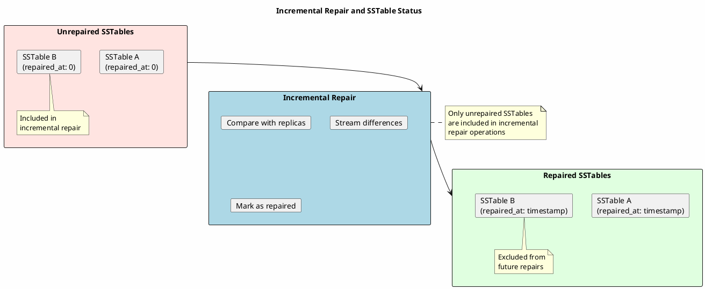
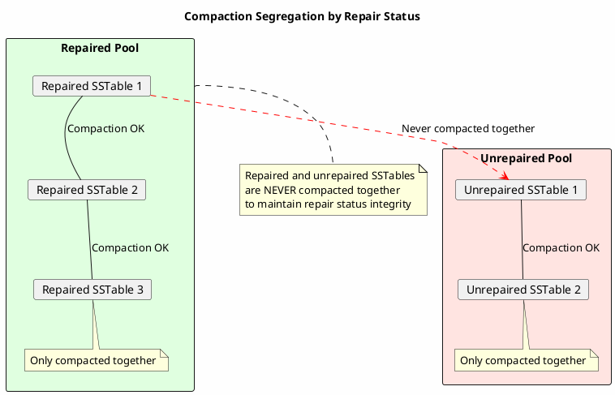

# sstablerepairedset

Marks SSTables as repaired or unrepaired, controlling their participation in incremental repair.

---

## Synopsis

```bash
sstablerepairedset --really-set [--is-repaired | --is-unrepaired] <sstable_files>
```

---

## Description

`sstablerepairedset` modifies the repair status metadata of SSTable files. This status determines how SSTables participate in Cassandra's **incremental repair** mechanism:

- **Repaired** - SSTable has been verified consistent across replicas
- **Unrepaired** - SSTable needs to be included in future repair operations

This tool is essential for:

- **Migrating to incremental repair** - Mark existing SSTables appropriately
- **Fixing repair metadata** - Correct incorrect repair status
- **Recovery scenarios** - Reset repair state after data issues
- **Anti-entropy management** - Control what gets repaired

!!! danger "Cassandra Must Be Stopped"
    **Cassandra must be completely stopped** before running `sstablerepairedset`. Modifying repair status while Cassandra is active can cause data inconsistency.

---

## How Repair Status Works



### Repair Status Values

| Status | repaired_at Value | Meaning |
|--------|-------------------|---------|
| Unrepaired | 0 | Needs repair verification |
| Repaired | Timestamp | Verified at that time |
| Pending | UUID | Part of ongoing repair |

---

## Arguments

| Argument | Description |
|----------|-------------|
| `sstable_files` | One or more paths to SSTable Data.db files |

---

## Options

| Option | Description |
|--------|-------------|
| `--really-set` | Required safety flag to confirm modification |
| `--is-repaired` | Mark SSTables as repaired |
| `--is-unrepaired` | Mark SSTables as unrepaired |

The `--really-set` flag is mandatory to prevent accidental modification.

---

## Examples

### Mark as Repaired

```bash
# Stop Cassandra first
sudo systemctl stop cassandra

# Mark specific SSTable as repaired
sstablerepairedset --really-set --is-repaired \
    /var/lib/cassandra/data/my_keyspace/my_table-abc123/nb-1-big-Data.db

# Start Cassandra
sudo systemctl start cassandra
```

### Mark as Unrepaired

```bash
# Mark SSTable as unrepaired
sstablerepairedset --really-set --is-unrepaired \
    /var/lib/cassandra/data/my_keyspace/my_table-abc123/nb-1-big-Data.db
```

### Mark Multiple SSTables

```bash
# Mark all SSTables for a table as unrepaired
sstablerepairedset --really-set --is-unrepaired \
    /var/lib/cassandra/data/my_keyspace/my_table-*/*-Data.db
```

### Using with find

```bash
# Mark all SSTables in keyspace as unrepaired
find /var/lib/cassandra/data/my_keyspace/ -name "*-Data.db" -print0 | \
    xargs -0 sstablerepairedset --really-set --is-unrepaired
```

### Mark All SSTables on Node

```bash
#!/bin/bash
# mark_all_unrepaired.sh - Reset all repair status

DATA_DIR="/var/lib/cassandra/data"

# Find all user keyspaces (exclude system keyspaces)
for ks_dir in ${DATA_DIR}/*/; do
    ks_name=$(basename "$ks_dir")

    # Skip system keyspaces
    if [[ "$ks_name" == system* ]]; then
        continue
    fi

    echo "Processing keyspace: $ks_name"

    find "$ks_dir" -name "*-Data.db" -print0 | \
        xargs -0 -r sstablerepairedset --really-set --is-unrepaired
done

echo "All user SSTables marked as unrepaired"
```

---

## When to Use sstablerepairedset

### Scenario 1: Migrating to Incremental Repair

```bash
#!/bin/bash
# migrate_to_incremental.sh

KEYSPACE="$1"

# 1. Stop Cassandra
sudo systemctl stop cassandra

# 2. Mark all existing SSTables as unrepaired
# This ensures they will be included in the first incremental repair
find /var/lib/cassandra/data/${KEYSPACE}/ -name "*-Data.db" -print0 | \
    xargs -0 sstablerepairedset --really-set --is-unrepaired

# 3. Start Cassandra
sudo systemctl start cassandra

# 4. Run incremental repair
nodetool repair -pr "$KEYSPACE"
```

### Scenario 2: Fixing Incorrect Repair Status

```bash
# If SSTables were incorrectly marked as repaired

sudo systemctl stop cassandra

# Reset to unrepaired
sstablerepairedset --really-set --is-unrepaired \
    /var/lib/cassandra/data/my_keyspace/my_table-*/*-Data.db

sudo systemctl start cassandra

# Re-run repair
nodetool repair my_keyspace my_table
```

### Scenario 3: After sstablescrub

```bash
# Scrub marks SSTables as unrepaired, verify status

# Check current status
sstablemetadata /var/lib/cassandra/data/my_keyspace/my_table-*/*-Data.db | \
    grep "Repaired"

# If needed, ensure consistent state
sudo systemctl stop cassandra
sstablerepairedset --really-set --is-unrepaired \
    /var/lib/cassandra/data/my_keyspace/my_table-*/*-Data.db
sudo systemctl start cassandra

# Repair to restore consistency
nodetool repair my_keyspace my_table
```

### Scenario 4: After Data Recovery

```bash
# After restoring from backup, data needs repair verification

sudo systemctl stop cassandra

# Mark restored SSTables as unrepaired
sstablerepairedset --really-set --is-unrepaired \
    /var/lib/cassandra/data/restored_keyspace/*/*.db

sudo systemctl start cassandra

# Full repair to sync with cluster
nodetool repair restored_keyspace
```

### Scenario 5: Switching from Full to Incremental Repair

```bash
#!/bin/bash
# setup_incremental_repair.sh

# 1. Ensure all repairs are complete
nodetool repair -full

# 2. Stop Cassandra
sudo systemctl stop cassandra

# 3. Mark all as repaired (since full repair just completed)
find /var/lib/cassandra/data/ -name "*-Data.db" \
    ! -path "*/system*" -print0 | \
    xargs -0 sstablerepairedset --really-set --is-repaired

# 4. Start Cassandra
sudo systemctl start cassandra

# 5. Future repairs will be incremental
# Only new unrepaired SSTables will be included
```

---

## Verification

### Check Current Repair Status

```bash
# View repair status for all SSTables
sstablemetadata /var/lib/cassandra/data/my_keyspace/my_table-*/*-Data.db | \
    grep -E "SSTable:|Repaired"
```

### Sample Output

```
SSTable: nb-1-big-Data.db
Repaired At: 1705401600000 (2024-01-16T12:00:00.000Z)

SSTable: nb-2-big-Data.db
Repaired At: 0 (unrepaired)

SSTable: nb-3-big-Data.db
Repaired At: 1705488000000 (2024-01-17T12:00:00.000Z)
```

### Audit Script

```bash
#!/bin/bash
# repair_status_audit.sh

KEYSPACE="$1"

echo "Repair Status Audit for ${KEYSPACE}"
echo "===================================="

repaired=0
unrepaired=0

for sstable in /var/lib/cassandra/data/${KEYSPACE}/*/*-Data.db; do
    status=$(sstablemetadata "$sstable" 2>/dev/null | grep "Repaired At:" | awk '{print $3}')

    if [ "$status" = "0" ]; then
        unrepaired=$((unrepaired + 1))
        echo "UNREPAIRED: $(basename $sstable)"
    else
        repaired=$((repaired + 1))
    fi
done

echo ""
echo "Summary:"
echo "  Repaired: $repaired"
echo "  Unrepaired: $unrepaired"
echo "  Total: $((repaired + unrepaired))"
```

---

## Impact of Repair Status

### Marking as Repaired

| Aspect | Effect |
|--------|--------|
| Incremental repair | Excluded from future repairs |
| Compaction | Compacted only with other repaired SSTables |
| Anti-entropy | Considered consistent |
| Risk | If data actually inconsistent, won't be fixed |

### Marking as Unrepaired

| Aspect | Effect |
|--------|--------|
| Incremental repair | Included in next repair |
| Compaction | Compacted only with other unrepaired SSTables |
| Anti-entropy | Will be verified against replicas |
| Risk | Increased repair work, but ensures consistency |

### Compaction Segregation



---

## Troubleshooting

### Permission Denied

```bash
# Run as cassandra user
sudo -u cassandra sstablerepairedset --really-set --is-unrepaired \
    /var/lib/cassandra/data/.../*-Data.db

# Or fix ownership after
sudo chown -R cassandra:cassandra /var/lib/cassandra/data/
```

### Cassandra Still Running

```bash
# Must stop Cassandra first!
nodetool drain
sudo systemctl stop cassandra

# Verify stopped
pgrep -f CassandraDaemon  # Should return nothing

# Now safe to run
sstablerepairedset --really-set --is-unrepaired /path/to/sstable-Data.db
```

### Missing --really-set Flag

```bash
# Error: Must provide --really-set flag

# The flag is required as a safety measure
sstablerepairedset --really-set --is-unrepaired /path/to/sstable-Data.db
```

### Forgot --is-repaired or --is-unrepaired

```bash
# Error: Must specify either --is-repaired or --is-unrepaired

# Choose one:
sstablerepairedset --really-set --is-repaired /path/to/sstable-Data.db
# or
sstablerepairedset --really-set --is-unrepaired /path/to/sstable-Data.db
```

---

## Best Practices

!!! tip "sstablerepairedset Guidelines"

    1. **Understand implications** - Wrong status causes data issues
    2. **Prefer unrepaired when uncertain** - Safer to re-repair
    3. **Verify after setting** - Check with sstablemetadata
    4. **Document changes** - Track what was modified and why
    5. **Run repair after** - Especially after marking unrepaired
    6. **Backup first** - Snapshot before bulk changes
    7. **Consistent approach** - Apply to all nodes in cluster

!!! danger "Critical Warnings"

    - **Never mark as repaired without actual repair** - Causes silent data loss
    - **Repair status affects compaction** - Wrong status causes issues
    - **Cluster-wide impact** - Inconsistent status causes problems
    - **Cannot undo easily** - Wrong status requires re-repair

---

## Related Commands

| Command | Relationship |
|---------|--------------|
| [sstablemetadata](sstablemetadata.md) | Verify repair status |
| [nodetool repair](../nodetool/repair.md) | Run repair operations |
| [nodetool repair_admin](../nodetool/repair_admin.md) | Check repair progress |
| [sstablescrub](sstablescrub.md) | Also affects repair status |
| [sstableupgrade](sstableupgrade.md) | Also affects repair status |
