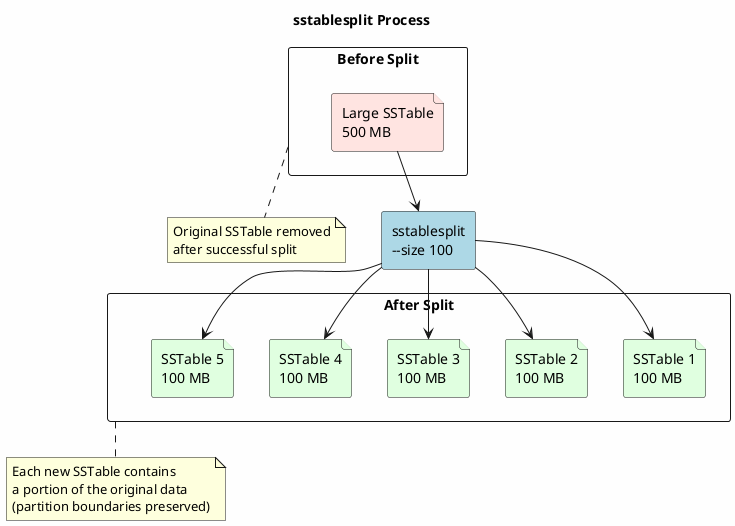
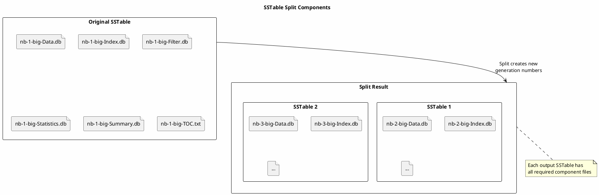

# sstablesplit

Splits large SSTables into smaller files of a specified size.

---

## Synopsis

```bash
sstablesplit [options] <sstable_files>
```

---

## Description

`sstablesplit` divides oversized SSTable files into multiple smaller SSTables. This is useful when:

- **Large SSTables cause compaction issues** - Compaction takes too long or fails
- **Memory pressure from large files** - Reading large SSTables causes heap problems
- **Level imbalance in LCS** - Large SSTables distort level distribution
- **Recovery operations** - Need to process data in smaller chunks
- **Backup and restore** - Smaller files are easier to manage

The tool preserves all data while creating multiple smaller output files.

!!! danger "Cassandra Must Be Stopped"
    **Cassandra must be completely stopped** before running `sstablesplit`. Running this tool while Cassandra is active will cause data corruption.

---

## How It Works



### Split Behavior

- **Partition preservation** - Partitions are never split across SSTables
- **Size is approximate** - Actual size depends on partition boundaries
- **Original deleted** - Source SSTable removed after successful split (unless `-n`)
- **All components** - All SSTable component files are regenerated

---

## Arguments

| Argument | Description |
|----------|-------------|
| `sstable_files` | One or more paths to SSTable Data.db files to split |

---

## Options

| Option | Description |
|--------|-------------|
| `-s, --size <MB>` | Target size for output SSTables in MB (default: 50) |
| `-n, --no-snapshot` | Skip creating a pre-split snapshot (original SSTable is still removed after split) |
| `-h, --help` | Display help information |
| `--debug` | Enable debug output |

---

## Examples

### Basic Split

```bash
# Stop Cassandra first
sudo systemctl stop cassandra

# Split SSTable into 50 MB chunks (default)
sstablesplit /var/lib/cassandra/data/my_keyspace/my_table-abc123/nb-1-big-Data.db

# Start Cassandra
sudo systemctl start cassandra
```

### Specify Target Size

```bash
# Split into 100 MB chunks
sstablesplit --size 100 /path/to/sstable-Data.db

# Split into 200 MB chunks
sstablesplit -s 200 /path/to/sstable-Data.db
```

### Skip Pre-Split Snapshot

```bash
# Split without creating a snapshot first
# Note: The original SSTable is still removed after successful split
sstablesplit --no-snapshot /path/to/sstable-Data.db
```

### Split Multiple SSTables

```bash
# Split all SSTables larger than 1GB
for sstable in /var/lib/cassandra/data/my_keyspace/my_table-*/*-Data.db; do
    size=$(stat -c%s "$sstable")
    if [ "$size" -gt 1073741824 ]; then
        echo "Splitting $sstable ($size bytes)"
        sstablesplit --size 100 "$sstable"
    fi
done
```

### Split All Large SSTables in Keyspace

```bash
#!/bin/bash
# split_large_sstables.sh

KEYSPACE="$1"
MAX_SIZE_MB="${2:-500}"  # Default: split SSTables larger than 500MB
TARGET_SIZE="${3:-100}"   # Default: 100MB target

MAX_SIZE_BYTES=$((MAX_SIZE_MB * 1024 * 1024))

echo "Splitting SSTables larger than ${MAX_SIZE_MB}MB into ${TARGET_SIZE}MB chunks"

for sstable in /var/lib/cassandra/data/${KEYSPACE}/*/*-Data.db; do
    size=$(stat -c%s "$sstable" 2>/dev/null)
    if [ "$size" -gt "$MAX_SIZE_BYTES" ]; then
        size_mb=$((size / 1024 / 1024))
        echo "Splitting: $sstable (${size_mb}MB)"
        sstablesplit --size "$TARGET_SIZE" "$sstable"
    fi
done
```

---

## When to Use sstablesplit

### Scenario 1: Compaction Failures

```bash
# Symptoms:
# - Compaction times out or fails
# - "Compaction taking too long" warnings
# - OOM errors during compaction

# Find large SSTables
find /var/lib/cassandra/data/my_keyspace/my_table-*/ -name "*-Data.db" \
    -size +1G -exec ls -lh {} \;

# Stop Cassandra
sudo systemctl stop cassandra

# Split large SSTables
sstablesplit --size 100 /path/to/large-sstable-Data.db

# Start Cassandra
sudo systemctl start cassandra
```

### Scenario 2: LCS Level Issues

```bash
# Large SSTables can disrupt LCS level distribution
# Split to allow proper leveling

sudo systemctl stop cassandra

# Split the oversized SSTables
sstablesplit --size 160 /var/lib/cassandra/data/my_keyspace/my_table-*/*-Data.db

# Optionally relevel after splitting
sstableofflinerelevel my_keyspace my_table

sudo systemctl start cassandra
```

### Scenario 3: Memory Pressure

```bash
# Large SSTables cause GC pressure when read
# Split to reduce per-read memory footprint

sudo systemctl stop cassandra

# Split into smaller chunks
for large_sstable in $(find /var/lib/cassandra/data/ -name "*-Data.db" -size +500M); do
    echo "Splitting: $large_sstable"
    sstablesplit --size 100 "$large_sstable"
done

sudo systemctl start cassandra
```

### Scenario 4: Before Streaming/Repair

```bash
# Smaller SSTables stream faster and more reliably

sudo systemctl stop cassandra

# Split SSTables for problematic table
sstablesplit --size 100 /var/lib/cassandra/data/my_keyspace/my_table-*/*-Data.db

sudo systemctl start cassandra

# Now repair
nodetool repair my_keyspace my_table
```

### Scenario 5: Dealing with Tombstone Blockers

```bash
# Large SSTables may be blocking tombstone removal
# Split to allow more granular compaction

# Check for blockers first
sstableexpiredblockers my_keyspace my_table

# If large SSTables are blockers, split them
sudo systemctl stop cassandra
sstablesplit --size 100 /path/to/blocker-sstable-Data.db
sudo systemctl start cassandra

# Compaction should now be able to remove tombstones
```

---

## Size Guidelines

### Recommended Target Sizes

| Use Case | Target Size | Rationale |
|----------|-------------|-----------|
| General purpose | 100-200 MB | Good balance |
| LCS tables | 160 MB | Matches default LCS target |
| Memory-constrained | 50 MB | Reduces heap pressure |
| Fast streaming | 100 MB | Quick repair/rebuild |
| STCS tables | 200-500 MB | Reduces SSTable count |

### Factors to Consider

| Factor | Smaller Splits | Larger Splits |
|--------|----------------|---------------|
| SSTable count | More files | Fewer files |
| Compaction frequency | More frequent | Less frequent |
| Memory per read | Lower | Higher |
| Disk overhead | Higher | Lower |
| Streaming speed | Faster per file | Slower per file |

---

## Output Format

### Standard Output

```
Pre-split sstables snapshotted to snapshot 'pre-split-1705401600'
Splitting /var/lib/cassandra/data/my_keyspace/my_table-abc123/nb-1-big-Data.db
  Key count: 50000
  Total size: 524288000
Completed split of /var/lib/cassandra/data/my_keyspace/my_table-abc123/nb-1-big-Data.db
  Split into 6 sstables
```

### Verifying Results

```bash
# List new SSTables after split
ls -lh /var/lib/cassandra/data/my_keyspace/my_table-*/*-Data.db

# Check total data size (should be similar to original)
du -sh /var/lib/cassandra/data/my_keyspace/my_table-*/

# Verify with sstableutil
sstableutil my_keyspace my_table | grep "Data.db" | wc -l
```

---

## Technical Details

### What Gets Split



### Partition Handling

- Partitions are **never** split across SSTables
- Target size is approximate - actual depends on partition sizes
- Large partitions cannot be made smaller (they stay in one SSTable)

---

## Troubleshooting

### Permission Denied

```bash
# Run as cassandra user
sudo -u cassandra sstablesplit --size 100 /var/lib/cassandra/data/.../nb-1-big-Data.db

# Or fix ownership after
sudo chown -R cassandra:cassandra /var/lib/cassandra/data/
```

### Cassandra Still Running

```bash
# Must stop Cassandra first
nodetool drain
sudo systemctl stop cassandra

# Verify stopped
pgrep -f CassandraDaemon  # Should return nothing

# Now safe to split
sstablesplit --size 100 /path/to/sstable-Data.db
```

### Out of Disk Space

```bash
# Split creates new files before removing original
# Need approximately 2x the SSTable size

# Check available space
df -h /var/lib/cassandra/

# Options:
# 1. Free space first
# 2. Split with --no-snapshot and manually manage
sstablesplit --no-snapshot /path/to/sstable-Data.db
# Verify new files, then remove original
```

### Large Partition Warning

```
Warning: Partition 'user123' is larger than target size (500MB > 100MB)
This partition cannot be split further.
```

This is expected - partitions cannot be split. The partition will remain in one output SSTable.

### Split Produces Single File

If the SSTable is smaller than the target size, no split occurs:

```bash
# Check SSTable size first
ls -lh /path/to/sstable-Data.db

# If smaller than target, no split needed
```

---

## Best Practices

!!! tip "sstablesplit Guidelines"

    1. **Check size first** - Only split if SSTable exceeds target
    2. **Match target to strategy** - LCS: 160MB, STCS: varies
    3. **Disk space** - Ensure 2x SSTable size available
    4. **Backup first** - Snapshot before splitting critical data
    5. **Split one at a time** - Monitor disk space
    6. **Verify after** - Check data integrity post-split
    7. **Large partitions** - Cannot be split smaller

!!! warning "Cautions"

    - Original SSTable deleted by default
    - Large partitions cannot be split
    - Disk space needed for operation
    - May trigger compaction after restart

---

## Related Commands

| Command | Relationship |
|---------|--------------|
| [sstablemetadata](sstablemetadata.md) | Check SSTable sizes |
| [sstablepartitions](sstablepartitions.md) | Find large partitions |
| [sstableofflinerelevel](sstableofflinerelevel.md) | Reorganize after split |
| [sstableexpiredblockers](sstableexpiredblockers.md) | Check for blockers |
| [nodetool compact](../nodetool/compact.md) | May follow split |
