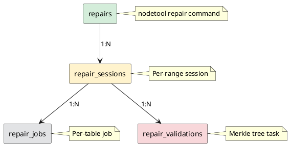

# Repair

The repair virtual tables provide comprehensive tracking of repair operations, from high-level summaries to individual validation tasks.

---

## Overview

Cassandra 5.0 introduces detailed repair tracking through virtual tables, enabling monitoring without external tools:

| Table | Scope | Description |
|-------|-------|-------------|
| `repairs` | Top-level | Overall repair command status |
| `repair_sessions` | Session | Individual repair sessions within a repair |
| `repair_jobs` | Job | Per-table repair jobs within a session |
| `repair_validations` | Validation | Merkle tree validation tasks |
| `repair_participates` | Participation | Repairs where this node participates (not initiates) |



---

## repairs

Top-level repair operation tracking.

### Schema

```sql
VIRTUAL TABLE system_views.repairs (
    id timeuuid PRIMARY KEY,
    command_id int,
    keyspace_name text,
    table_names frozen<list<text>>,
    status text,
    completed boolean,
    duration_millis bigint,
    failure_cause text,
    participants frozen<list<text>>,
    sessions frozen<set<timeuuid>>,
    -- Options used
    options_incremental boolean,
    options_parallelism text,
    options_primary_range boolean,
    options_data_centers frozen<set<text>>,
    options_hosts frozen<set<text>>,
    -- State timestamps
    state_init_timestamp timestamp,
    state_start_timestamp timestamp,
    state_success_timestamp timestamp,
    state_failure_timestamp timestamp,
    last_updated_at timestamp
)
```

| Column | Type | Description |
|--------|------|-------------|
| `id` | timeuuid | Unique repair identifier |
| `command_id` | int | nodetool command ID |
| `keyspace_name` | text | Keyspace being repaired |
| `table_names` | list | Tables included in repair |
| `status` | text | Current status |
| `completed` | boolean | Whether repair has finished |
| `duration_millis` | bigint | Total duration (milliseconds) |
| `failure_cause` | text | Error message if failed |
| `participants` | list | Nodes involved in repair |
| `options_*` | various | Repair options used |
| `state_*_timestamp` | timestamp | State transition times |

### Status Values

| Status | Description |
|--------|-------------|
| `INIT` | Repair initialized |
| `START` | Repair started |
| `RUNNING` | Actively repairing |
| `SUCCESS` | Completed successfully |
| `FAILURE` | Failed with error |
| `SKIPPED` | Skipped (e.g., no ranges) |

### Example Queries

```sql
-- Recent repairs
SELECT id, keyspace_name, status,
       duration_millis / 1000 AS duration_sec,
       state_init_timestamp
FROM system_views.repairs;

-- Active repairs
SELECT id, keyspace_name, table_names, status, participants
FROM system_views.repairs
WHERE completed = false;

-- Failed repairs
SELECT id, keyspace_name, failure_cause, duration_millis
FROM system_views.repairs
WHERE status = 'FAILURE';
```

---

## repair_sessions

Individual repair sessions within a repair operation.

### Schema

```sql
VIRTUAL TABLE system_views.repair_sessions (
    id timeuuid PRIMARY KEY,
    keyspace_name text,
    table_names frozen<list<text>>,
    repair_id timeuuid,
    status text,
    completed boolean,
    duration_millis bigint,
    failure_cause text,
    participants frozen<list<text>>,
    ranges frozen<list<text>>,
    jobs frozen<set<uuid>>,
    -- State timestamps
    state_init_timestamp timestamp,
    state_start_timestamp timestamp,
    state_success_timestamp timestamp,
    state_failure_timestamp timestamp,
    last_updated_at timestamp
)
```

### Example Queries

```sql
-- Sessions for a specific repair
SELECT id, status, duration_millis, ranges
FROM system_views.repair_sessions
WHERE repair_id = ?;

-- Active sessions
SELECT id, keyspace_name, status, participants
FROM system_views.repair_sessions
WHERE completed = false;

-- All sessions for duration analysis
SELECT status, duration_millis
FROM system_views.repair_sessions;
```

Group and average duration data by status in application.

---

## repair_jobs

Per-table repair jobs within a session.

### Schema

```sql
VIRTUAL TABLE system_views.repair_jobs (
    id uuid PRIMARY KEY,
    keyspace_name text,
    table_name text,
    repair_id timeuuid,
    session_id timeuuid,
    status text,
    completed boolean,
    duration_millis bigint,
    failure_cause text,
    participants frozen<list<text>>,
    ranges frozen<list<text>>,
    -- State timestamps
    state_init_timestamp timestamp,
    state_start_timestamp timestamp,
    state_snapshot_start_timestamp timestamp,
    state_snapshot_complete_timestamp timestamp,
    state_validation_start_timestamp timestamp,
    state_validation_complete_timestamp timestamp,
    state_stream_start_timestamp timestamp,
    state_success_timestamp timestamp,
    state_failure_timestamp timestamp,
    last_updated_at timestamp
)
```

### Job States

| State | Description |
|-------|-------------|
| `INIT` | Job created |
| `START` | Job started |
| `SNAPSHOT_START` | Taking snapshot |
| `SNAPSHOT_COMPLETE` | Snapshot done |
| `VALIDATION_START` | Building Merkle trees |
| `VALIDATION_COMPLETE` | Merkle trees built |
| `STREAM_START` | Streaming differences |
| `SUCCESS` | Job completed |
| `FAILURE` | Job failed |

### Example Queries

```sql
-- Jobs for a session
SELECT id, table_name, status, duration_millis
FROM system_views.repair_jobs
WHERE session_id = ?;

-- Completed jobs with validation timestamps
SELECT keyspace_name, table_name,
       state_validation_start_timestamp,
       state_validation_complete_timestamp
FROM system_views.repair_jobs
WHERE completed = true;

-- Jobs currently streaming
SELECT keyspace_name, table_name, status
FROM system_views.repair_jobs
WHERE status = 'STREAM_START';
```

Calculate validation duration by subtracting timestamps in application.

---

## repair_validations

Merkle tree validation tasks (the most granular level).

### Schema

```sql
VIRTUAL TABLE system_views.repair_validations (
    id uuid PRIMARY KEY,
    keyspace_name text,
    table_name text,
    repair_id timeuuid,
    session_id timeuuid,
    initiator text,
    status text,
    completed boolean,
    duration_millis bigint,
    failure_cause text,
    ranges frozen<list<text>>,
    -- Progress tracking
    estimated_partitions bigint,
    partitions_processed bigint,
    estimated_total_bytes bigint,
    bytes_read bigint,
    progress_percentage float,
    -- State timestamps
    state_init_timestamp timestamp,
    state_start_timestamp timestamp,
    state_accept_timestamp timestamp,
    state_sending_trees_timestamp timestamp,
    state_success_timestamp timestamp,
    state_failure_timestamp timestamp,
    last_updated_at timestamp
)
```

### Example Queries

```sql
-- Active validations with progress
SELECT keyspace_name, table_name, initiator,
       progress_percentage,
       partitions_processed, estimated_partitions
FROM system_views.repair_validations
WHERE completed = false;

-- Validation performance
SELECT keyspace_name, table_name,
       bytes_read / 1048576 AS mb_read,
       duration_millis / 1000 AS duration_sec
FROM system_views.repair_validations
WHERE completed = true
  AND duration_millis > 0;
```

Calculate MB/s as `mb_read / duration_sec`.

---

## repair_participates

Repairs where this node is a participant (not the initiator).

### Schema

```sql
VIRTUAL TABLE system_views.repair_participates (
    id timeuuid PRIMARY KEY,
    initiator text,
    tables frozen<set<text>>,
    status text,
    completed boolean,
    duration_millis bigint,
    failure_cause text,
    incremental boolean,
    global boolean,
    preview_kind text,
    ranges frozen<list<text>>,
    repaired_at timestamp,
    validations frozen<set<uuid>>,
    -- State timestamps
    state_init_timestamp timestamp,
    state_success_timestamp timestamp,
    state_failure_timestamp timestamp,
    last_updated_at timestamp
)
```

### Example Queries

```sql
-- Repairs initiated by other nodes
SELECT id, initiator, tables, status, duration_millis, state_init_timestamp
FROM system_views.repair_participates;

-- Active participations
SELECT initiator, tables, status
FROM system_views.repair_participates
WHERE completed = false;
```

Sort by `state_init_timestamp` in application to see recent repairs first.

---

## Monitoring Queries

### Repair Health Dashboard

```sql
-- All repairs with status and timestamps
SELECT status, state_init_timestamp
FROM system_views.repairs;

-- Active repairs
SELECT id FROM system_views.repairs WHERE completed = false;

-- Active sessions
SELECT id FROM system_views.repair_sessions WHERE completed = false;

-- Active jobs
SELECT id FROM system_views.repair_jobs WHERE completed = false;

-- Active validations
SELECT id FROM system_views.repair_validations WHERE completed = false;
```

Filter by timestamp and aggregate counts in application.

### Progress Monitoring

```sql
-- Active repairs
SELECT id, keyspace_name, status
FROM system_views.repairs
WHERE completed = false;

-- Sessions for a specific repair (use repair_id from above)
SELECT id, repair_id, status, ranges_count, ranges_complete
FROM system_views.repair_sessions
WHERE repair_id = <repair_id>;

-- Jobs for a specific session (use session_id from above)
SELECT table_name, status
FROM system_views.repair_jobs
WHERE session_id = <session_id>;
```

---

## Alerting Rules

### Long-Running Repair

```sql
-- Alert: Repairs running > 4 hours
SELECT id, keyspace_name, duration_millis / 3600000 AS hours
FROM system_views.repairs
WHERE completed = false
  AND duration_millis > 14400000;
```

### Failed Repairs

```sql
-- Alert: Recent repair failures
SELECT id, keyspace_name, failure_cause, state_failure_timestamp
FROM system_views.repairs
WHERE status = 'FAILURE';
```

Filter in application for failures within the last hour.

### Stuck Validations

```sql
-- Alert: Validations not progressing
SELECT id, keyspace_name, table_name, progress_percentage,
       duration_millis / 60000 AS duration_minutes
FROM system_views.repair_validations
WHERE completed = false
  AND duration_millis > 1800000
  AND progress_percentage < 0.5;
```

---

## Related Documentation

- **[Virtual Tables Overview](index.md)** - Introduction to virtual tables
- **[Repair Guide](../repair/index.md)** - Repair procedures and strategies
- **[nodetool repair](../nodetool/repair.md)** - Repair command reference
